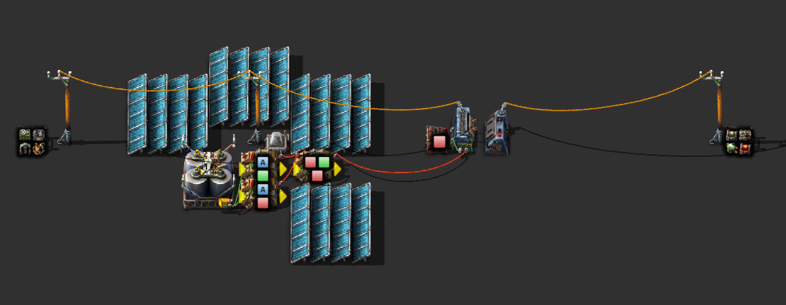

# Backup steam and nuclear power plants



::: details Blueprint
```blueprint
0eNrFV9tu2zAM/ZVATxtgF/E1FwwDiv7AHva2FYYiM4kAWTYkuW0Q5N9H2blbSeNsXV8MC5KORB7ykFqTmaihUlwaMl2THDRTvDK8lGRKfi5hUJWvoAaVKvOa4Q/Xg1IODE4ovliageY5DL5s/wsqxAAEMKM4w50Cvv6WBxBWSl0XJyAC5juM9tcBQTzC7VYy/bUmmi8kFfaqZlUB3pEbKHCFpIUdNQf5+pUbtiQb3ChzeCPTYPPsEZCGGw4tTjNYZbIuZqBwwR5Bl4Iqv6ISBMJWpeatM9YEceL0IfHIikz9NIoeks3G6yCFNyJFB6TQjRTdiDR5Fyl2+6cDlRyA0Hfoc6NKkc1gSV94qewixhWruclwLt/vnHOlTdZh5oUrU1NxIKdd4SvISQuvDbVhN7SDoqKKGnsK+U427bzEMOAN82sS2I/desQex1GA1O1uZcehpXqhAGRnJU4h7lM9PJ+ZeOSVK2j+h3b/Ux10dkenixCpdWOGVhg0b06FBofzk739O4t9tHbGZWNth4NofKAzQDo9kuOprF0RulmZc2FA3ZQgVGsoZoLLhV9QtuQS/Khlo7ZUBEcp470LtstTf14rSRk4gcI+QAWX9mq54kI40aIb0Epug2yOtqmVEyRG+hxMpYdItTLk729lZcjB1OScKQmog7OybqiYPDuOGB2IYKwuauEOgngPPLyQiGVtqrpH0j1ezCl3rgxPsyo4sqUZJ+fz6FGHveMzlwpaVA5zR6eedABN+nFzLNQOblIXN9bm7Rk5MKxJ6mqixqM9Rzem6Rb1IJ76DvV8PNXOtCueXu/gaEOgwa1WWZMu2VyVRcYl4uykrU/8jBqBDG/U7EvREwT9GJl8CiPbeqbBotzl9L+kb19Q+5PnImd4XlCvp/6VgtstzVeCIr4Z52K4hP1KbRL941L7LkGdGosmc53Z87btw+0pFl/yQtRPKtPoXfEN4n6OTeMP7WFmWODxWvd2LdoALXyQC2wQ7u5YZM0EYFOugDLrg3t7lSVQ48MbW1K5uGDThW4lSO4rV+HkE8tVciZ33/6v3H1krUp7P9fCsU03KwE2JKZHL3GPCDrD3VPyo3k57x9sL5giLWfjIB5NwlGaJuN0PN5s/gC6ZFC7
```
:::

## More details

The following video demonstrates all discussed ideas:

[](http://www.youtube.com/watch?v=FfmslzAyOsc)
