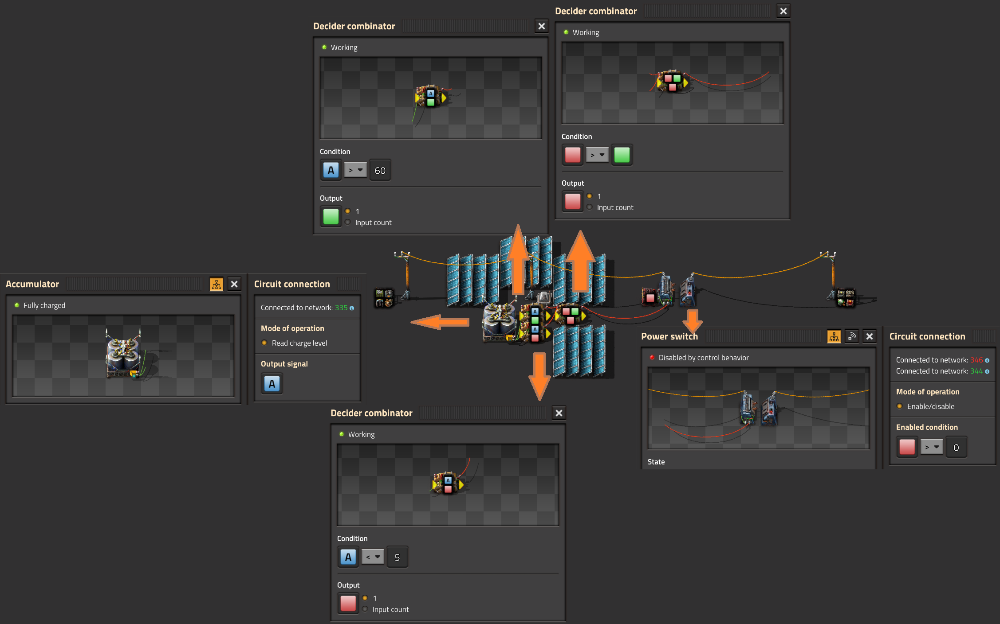

# Переводим паровые и атомные электростанции в резерв

## Предварительная теория

Как перевести паровые и атомные электростанции в резерв? Проще простого, но вначале нудная теория. Нужно рассмотреть одну вундершнягу, которая называется то ли триггер, то ли ячейка памяти, то ли ещё как-то, суть явления не в названии. Нам потребуется сравнивающий комбинатор (`Decider combinator`), и если у него замкнуть выход на вход, то это уже вундершняга. Что это даёт? А даёт это то, что любой сигнал, при определенном правильном условии на комбинаторе, можно повторить и запомнить. Причем такой комбинатор может запоминать и повторять множество сигналов, а не только один. Соответственно, такой комбинатор, можно использовать для включения и отключения разного рода электростанций, паровых и атомных, при помощи выключателя питания (`Power switch`).

## С теорией всё

Предлагаю собственно чертёж вундершняги, которая совместно с другими комбинаторами управляет работой выключателя питания.



Справа у нас находится некая воображаемая электростанция, показанная иконками на постоянном комбинаторе. Соответственно, слева, вместе с воображаемыми солнечными панелями и аккумуляторными блоками находятся воображаемые потребители электроэнергии (тоже иконки), которые нещадно разряжают аккумуляторные блоки (один в центре). Когда заряд аккумуляторного блока становиться меньше 5 процентов включается выключатель питания, а когда заряд аккумуляторного блока становиться больше 60 процентов, выключается. За это отвечают два сравнивающих комбинатора, к которым подключен аккумуляторный блок. Постоянный комбинатор рядом с выключателем питания нужен для того, чтобы выключатель питания работал постоянно, без учёта чего там вундершняга по напридумывает. Его можно убрать без ущерба для всех.

::: details Blueprint
```blueprint
0eNrFV9tu2zAM/ZVATxtgF/E1FwwDiv7AHva2FYYiM4kAWTYkuW0Q5N9H2blbSeNsXV8MC5KORB7ykFqTmaihUlwaMl2THDRTvDK8lGRKfi5hUJWvoAaVKvOa4Q/Xg1IODE4ovliageY5DL5s/wsqxAAEMKM4w50Cvv6WBxBWSl0XJyAC5juM9tcBQTzC7VYy/bUmmi8kFfaqZlUB3pEbKHCFpIUdNQf5+pUbtiQb3ChzeCPTYPPsEZCGGw4tTjNYZbIuZqBwwR5Bl4Iqv6ISBMJWpeatM9YEceL0IfHIikz9NIoeks3G6yCFNyJFB6TQjRTdiDR5Fyl2+6cDlRyA0Hfoc6NKkc1gSV94qewixhWruclwLt/vnHOlTdZh5oUrU1NxIKdd4SvISQuvDbVhN7SDoqKKGnsK+U427bzEMOAN82sS2I/desQex1GA1O1uZcehpXqhAGRnJU4h7lM9PJ+ZeOSVK2j+h3b/Ux10dkenixCpdWOGVhg0b06FBofzk739O4t9tHbGZWNth4NofKAzQDo9kuOprF0RulmZc2FA3ZQgVGsoZoLLhV9QtuQS/Khlo7ZUBEcp470LtstTf14rSRk4gcI+QAWX9mq54kI40aIb0Epug2yOtqmVEyRG+hxMpYdItTLk729lZcjB1OScKQmog7OybqiYPDuOGB2IYKwuauEOgngPPLyQiGVtqrpH0j1ezCl3rgxPsyo4sqUZJ+fz6FGHveMzlwpaVA5zR6eedABN+nFzLNQOblIXN9bm7Rk5MKxJ6mqixqM9Rzem6Rb1IJ76DvV8PNXOtCueXu/gaEOgwa1WWZMu2VyVRcYl4uykrU/8jBqBDG/U7EvREwT9GJl8CiPbeqbBotzl9L+kb19Q+5PnImd4XlCvp/6VgtstzVeCIr4Z52K4hP1KbRL941L7LkGdGosmc53Z87btw+0pFl/yQtRPKtPoXfEN4n6OTeMP7WFmWODxWvd2LdoALXyQC2wQ7u5YZM0EYFOugDLrg3t7lSVQ48MbW1K5uGDThW4lSO4rV+HkE8tVciZ33/6v3H1krUp7P9fCsU03KwE2JKZHL3GPCDrD3VPyo3k57x9sL5giLWfjIB5NwlGaJuN0PN5s/gC6ZFC7
```
:::

## Больше подробностей

Детальный разбор смотрите на YouTube канале.

[](http://www.youtube.com/watch?v=FfmslzAyOsc)

### Ссылка на первоисточник

[Factorio tutorial](https://wiki.factorio.com/Tutorial:Circuit_network_cookbook#Backup_steam_example)
