# Солнечная энергия

## Предварительная теория

Производство солнечных панелей (`Solar panel`) открывается исследованием `Solar energy`, которое обязательно для запуска спутника (`Satellite`), но спешить с этим исследованием не стоит. Производство солнечных панелей занятие очень недешевое, особенно в начале игры, когда ресурсов крайне мало. Оптимальным временем для проведения исследования является время так называемого "первого выхода с базы", цель которого заключается в освоении близлежащего к базе месторождения нефти и усмирение соседних кусако-плевак из-за растущего загрязнения. Для того чтобы покинуть базу, нужно закончить следующие исследования: `Logistics 2`, `Engine`, `Automobolism`, построить автомобиль (`Car`), без автомобиля покидать базу не рационально в начале игры, далее `Electric energy distribution 1` и `Oil processing`, произвести достаточное количество труб (`Pipe` и `Pipe to ground`), больших опор ЛЭП (`Big electric pole`), нефтяных вышек (`Pumpjack`) и разумеется достаточного количества патронов, иногда и пару турелей (`Gun turret`) не помешает захватить. К этому времени уже более менее будет налажена добыча ресурсов, их переплавка и автоматизировано производство первых двух научных пакетов (`Automation science pack` и `Logistic science pack`). Покинув базу вы сможете в автоматическом режиме закончить ряд исследований которым не требуются химические научные пакеты (`Chemical science pack`), что включает нужные нам `Solar energy` и `Electric energy accumulators`. В момент первого выхода с базы, обязательно завершить исследование `Battery` которое потребуется для `Robotics`, так как робототехника это наше все после освоения нефтепереработки.

Производство только одной солнечной панели требует 40 единиц руды (`Iron ore`) и 27.5 меди (`Copper ore`), при этом солнечная панель вырабатывает всего лишь 60 киловатт энергии. Это совсем мало, например для удовлетворения потребления энергией на 150 мегаватт днём и ночью, потребуется примерно 3600 солнечных панелей и 3000 аккумуляторных блоков. Задаться вопросом производства такого количества предметов на начальной стадии игры бессмысленно, особенно с учетом гонки за спутником, который мы хотим запустить в течение 8 часов (ведь хотим ачивку постоянно, иначе это какой-то позор). Поэтому производим солнечные панели на начальном этапе игры только по мере наличия свободных ресурсов, тогда как основной источник производства энергии будет сжигание угля в бойлерах, а с открытием переработки нефти и сжигание твердого топлива.

Производство аккумуляторных блоков (`Accumulator`) заметно дешевле, и в основном требует нефтепродуктов, конкретно 7 единиц руды (`Iron ore`), 5 меди (`Copper ore`) и 100 единиц серной кислоты (`Sulfuric acid`). Наладить массовое производство аккумуляторных блоков проще чем производство солнечных панелей, но опять-таки спешить тоже не стоит. Начинать производство аккумуляторных блоков стоит ближе к запуску спутника, раньше они вряд ли понадобятся, если вы только не играете игру с усиленными кусака-плеваками, например Мир смерти (`Death world`), тут аккумуляторные блоки помогут лазерным турелями (`Laser turret`) отстреливаться от толп, или правильнее сказать орд, разного рода инопланетян.

То есть, я смею утверждать, что потребность в массовом производстве и использовании аккумуляторных блоков до запуска первого спутника отсутствует от слова совсем. Причина проста: вам не удастся в короткий срок заменить производство энергии путем сжигания угля и твердого топлива в бойлерах на полностью солнечную энергию, а без этого отдельные аккумуляторные блоки бесполезны. То есть, либо мы полностью производим энергию солнечными панелями днем и заряжаем аккумуляторные блоки для обеспечения энергией ночью, либо бойлеры как основной источник энергии, а солнечные панели только в подспорье к ним. Солнечные панели стоит начать производить сразу после их открытия, без энтузиазма, производство требует много ресурсов, поставьте сборочный автомат, желательно первого уровня (`Assembling machine 1`), где-то в конце вашего первого завода по производству всего нужного (`Mall`).

*`Резюмируем`: исследуйте солнечные панели и аккумуляторные блоки при первом выходе с базы, начинайте производство солнечных панелей по возвращении из остатков доступных ресурсов после всех нужных производств, начинайте производство аккумуляторных блоков ближе к запуску первого спутника, наращивайте производство солнечных панелей и аккумуляторных блоков после запуска первого спутника с целью полностью перейти на солнечную энергию.*

А далее всё по плану, увеличиваем количество произведенных и установленных солнечных панелей и аккумуляторных блоков по мере разрастания потребностей в энергии, после открытия процесса обогащения Коварекса (`Kovarex enrichment process`) переходим на мирный атом (`Nuclear reactor`).

### Очень важные вопросы

Теперь к вопросу, о том сколько энергии произведенной солнечными панелями будет тратиться на зарядку аккумуляторных блоков для поддержки питания в ночное время? Ответ: 30%. Проведём расчёты: как я уже говорил выше, 3600 солнечных панелей и 3000 аккумуляторных блоков обеспечат бесперебойное питание базы днем и ночью примерно в 150 мегаватт энергии, при этом примерные 3600 солнечных панелей вырабатывают примерно 216 мегаватт энергии. Разница примерно в 66 мегаватт и составляет 30%.

Теперь главный вопрос: какое соотношение солнечных панелей к аккумуляторным блокам самое оптимальное? Ответ: 25 солнечных панелей на 21 аккумуляторный блок или также 100/84 или 120/100, кому как больше нравиться запомнить.

Ещё один главный вопрос: как контролировать ~~нервозность жены от переизбытка игрой Factorio~~ количество установленных солнечных панелей и аккумуляторных блоков? Ответ: через окно `Electric network info`, открывается щелчком мыши на любом столбе ЛЭП. Стройте солнечные панели или аккумуляторные блоки в зависимости от того, чего не хватает согласно правильному соотношению.

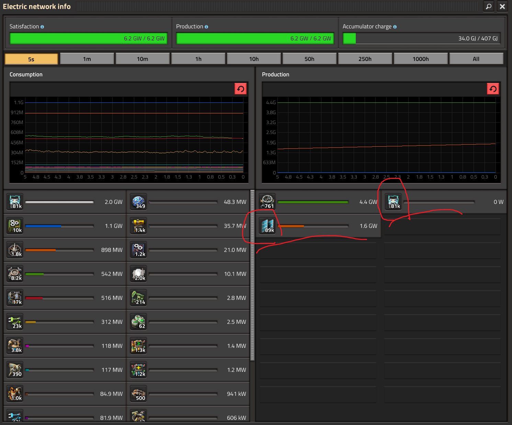

Например, в этой ситуации явно не хватает ещё тыщъ 7 солнечных панелей.

## Теперь вкусняшки

Далее предлагаются к рассмотрению, изучению, углублению, ещё раз осмотрению и наконец-то использованию везде где только можно разного рода чертежей, они же `Blueprints`.

### Самый простой чертеж

Собственно, первый чертеж состоит только из солнечных панелей и деревянных опор ЛЭП и не предусматривает размещение аккумуляторных блоков, как говорилось выше, в начале игры они нафиг не нужны. Чертеж хорошо стыкуется по всем направлениям, вверх, вниз, вправо и влево, и его легко построить в ручную без роботов.

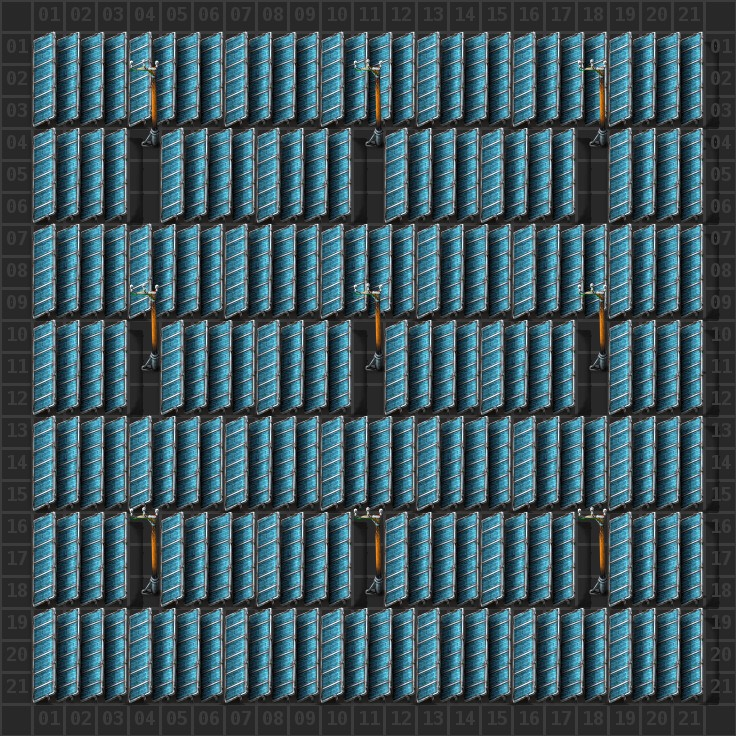

::: details Blueprint
```blueprint
0eNqdmN+unCAQxl9lwzU2gvzT+z5Fs2ncPWRrwqJRt6k58d0LnrY56TIu4xUhgZ8fw/DNxHdycQ87jJ2fSfNOJt8OxdwXt7F7i/NfpOGMkiUOKyXdtfcTab6Fhd3Nty4umZfBkoZ0s70TSnx7j7Opd+1YDK23jsR9/s0GVEC83nlvnSuss9d57K7F0Dv7icDXMyXWz93c2Q8h22T57h/3ix3DJ5ISKBn6Kezp/Z9DsS9yO1UY1yjqPwrPo4h9SpVH0fsUkXmich8jMzHVPkZlYtQ+Rmdi6n2Mwd22SFPqPIrcp7ByN4efcH8DHcaQ3952tx+X/jHGrGaccnVOfSMzvc0LqRwn9V9upbSWlCnKTVJu5gtg/IXe3Dfw6ookMu0gjkLGT+/edcWTwdO45NaAVoPzMghT48wMwPAS6WYQhyHtDOJwpJ9BnAqZWRBHIOtXCXAkztNAjjpmahvv2Sm4oUKnkp1rnLGBes1BZ0sKjjYcXieVZVJzjXQ3SHRVIu0NBDFsWYVA/KDBJcMYywOVIhXDqkLmewUIFsiODeJIZM8GcRS2a4NAGtu3QSCD7dwgUI1NMgAkSuTdK4DDkF4HcTjSgyAOtusBQdi2BwRh+x4QpJBXVgMcfbCs6Gd7CRad9meB7HxAscjWB+LI8mhtSp06VlLAVCXDmg+kmGPNBwJVWPOBQOJoYUrEEKzsEv1eNrln+vEvo/n0T4US117C3oZ8bUe3nDbeaeNNp967Jaz4acdpg3LDhK65VkoaZcy6/gbgU6bv
```
:::

### Самый правильный и простой чертеж, теперь с аккумуляторными блоками

Данный чертёж соблюдает оптимальное соотношение солнечных панелей к аккумуляторным блокам (стырено с этих ваших интернетов). Он также стыкуется во всех направлениях, построить его в ручную несколько сложнее чем предыдущий, да и пользоваться им вы вряд ли будете. Причина в том, что аккумуляторные блоки на начальном этапе игры не нужны в таком количестве, как на чертеже, а когда станут нужны, вы уже будете использовать другие чертежи, о которых ниже.

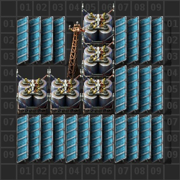

::: details Blueprint
```blueprint
0eNqV1NtqhDAQBuBXkbmOpfGsr1JKiTosgZiEGIuy+O6NqRfSTXf1RglkPv4ZE+/Qigm14dJCc4dRMh1bFd8M77f1DE1NYHHPlQDvlByh+XDb+E0ysW2wi0ZogFscgIBkw7YalWAm1kyigK1O9uggupKXlQP2fBpiFNhZw7tYK4EHIjlBsK6bhkkwq8yhMl0/CaC03HL87cEvli85DS0aly6YnoBWo6tRcp8Gfcv9PNx73cL8UZJgjAdlN0JCei5H+TxH9nyiD1y6c2mYy6+0lYaE4lpbWThHeS4H9UZQqM4J6f9CfWUWQYG+XztrZXgY9OSRzV4wybVP4xl3mfytaw6/DwKCta6ygWLOZxqNlsmeGRt5NtKCScs8SOAbzejppKJZWSdlUeRVUVXr+gNuMIE0
```
:::

### Самые лучшие чертежи с аккумуляторными блоками до запуска первого спутника

Предлагаю также рассмотреть ещё два альтернативных чертежа на основе предыдущего. Первый весьма актуален до запуска спутника, его можно строить в ручную без роботов и его стоит начать использовать после начала производства аккумуляторных блоков.

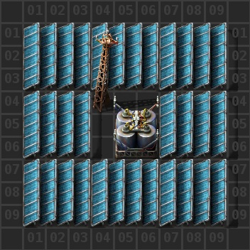

::: details Blueprint
```blueprint
0eNqV081qhDAQAOBXkTnHUv+j9z5FKSXqsARiEmIsyuK7N2b3sHSzVi+GgczH/MQrtGJCbbi00FxhlEzHVsUXw/stnqGpCSzuuxLgnZIjNJ/uGr9IJrYLdtEIDXCLAxCQbNiiUQlmYs0kCtjyZI8OSlbyb+aAPZ+GGAV21vAu1krgA5EeIFjXTcMkmFXmITNbvwigtNxyvPXgg+VbTkOLxlUXrJ6AVqPLUfI+jeSt8PNw57oV80dJjyn5vpIdU6p9JT/XUR5Wiv3dPHHZncvCXHmutRdFVcFtPyk3IyjQc8OpwnXU59b9Qknezw3FM+45+3ffPPzABARrXWYDH8yIJfJaROdkTiItmLTMawR+0IzeTWmSV3ValWVBS0rX9ReGcFQz
```
:::

Второй можно начинать использовать уже ближе к запуску спутника, когда нужно увеличить количество аккумуляторных блоков по сравнению с солнечными панелями из-за перекоса строительства солнечных панелей в начале игры. Этот чертёж также лучше использует свободное пространство, имеет всего 3 пустых клетки, тогда как предыдущие из рассмотренных с аккумуляторными блоками имеют 4 и 6 пустых клеток соответственно.

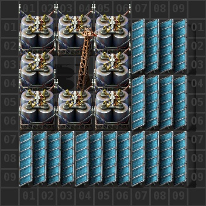

::: details Blueprint
```blueprint
0eNqV1M1qxCAQB/BXWeZslprvzb1PUUox2WERjIoxJWHJu9fYHELX7cZLYMD54fzV3KEVI2rDpYXmDoNkOrEquRl+XesJmguB2X0XArxTcoDmwy3jN8nEusDOGqEBbrEHApL1azUowUyimUQBa5+8ooPoQl529njlY5+gwM4a3iVaCdwR6QGCdd3Yj4JZZXad2fJJAKXlluPvDL6Yv+TYt2jc7oIAAa0G16Pklgb1adBl3cgfIT0mZM+F7JhQPBfy4Bk8CNV5M85FSClisshCQhkzSVCo/r8Tj7FuI2Xhkeq4YPKwcokJJijQt5hbEiZoTLhhIj0WB93iqMJx0OwYk79gIm+tZ9xz9u++2f3ACAjWus4G3pkR88lrp2KqJ3rSgknLvEbgG83g3bSmeXVJq7Is6rKul+UH3Pmr6w==
```
:::

### Самые редкие в использовании чертежи с аккумуляторными блоками

Чертежи которые можно использовать на больших опорах ЛЭП, когда вы протягиваете линию электропередачи куда-то за пределы базы. Можно разместить либо 4 солнечные панели и 4 аккумуляторных блоков либо 8 аккумуляторных блоков.

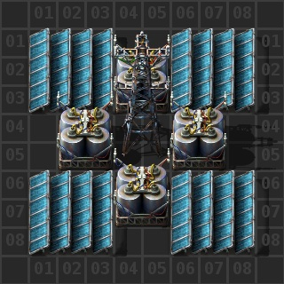

::: details Blueprint
```blueprint
0eNqVk1FqhDAQhq8i8xyXmtUYc4keoJQS7bAEYpQYS0Vy90ZrQdp0Vx8n8H/5MjOZodYj9lYZB2IG1XRmAPEyw6BuRurlzE09ggDlsAUCRrZLNXRa2rSXBjV4Asq84yeIzJOHyVrdUtTYOKuatO807vL0QF42zdiOWrrO7pJX/0oAjVNO4fcD1mJ6M2Nbow1qUXUCfTeETGeW+wKHVZeCwBSAPLsUfvH5BaJRkz+gkm4YGoNcj9mU+SOb/KDN04bJY5DiznD+f1gUxQ765Pcg5elZsXh3+MlZsRikOj2r1Sbs47q4YvfDCGhZh7CAZ5OEXic/vU62Xn+gHVYk5VleVrRkrOCMc++/AEAUMmQ=
```
:::

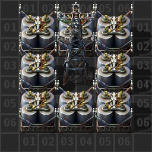

::: details Blueprint
```blueprint
0eNqVk1FqxCAQhq8S5tl9WJMY10v0AKUUY4dFMBqMKQ3Bu9ekLSzFpvFxBv9v5p8ZV+jNjKPXNoBYQStnJxDPK0z6bqXZcmEZEQTogAMQsHLYIqnUPMxGBuchEtD2DT9AXCP5V9nr+wUNquC1uozO4IOentDnK9fxhQDaoIPGLwN7sLzaeejRp9ayAAKjm5LG2a1e4rD0bkk4TuPWyy8IPQmpjyD1SUh7BGkK7TQ5SHuwlL9NZVGs0FQW0hWaYjkIL9xRFnIrtJMg6f72QxUPP4qAkT2mW4YnW6UZVz8zrr5n/I5+2nGUX5vuRjvGWs44j/ETicswiA==
```
:::

### Самые-самые чертежи

Чертежи основаны на трансформаторах и которые используются после запуска спутника. Они также стыкуются во всех направлениях, их можно легко строить в ручную, и они полностью используют свободное пространство, такими чертежами можно заполнить огромные пространства и производить гигаватты энергии.

Солнечные панели

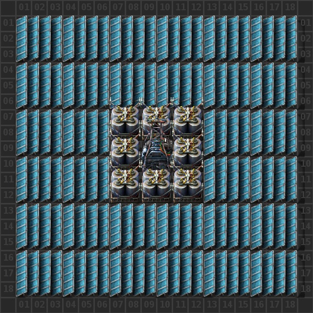

::: details Blueprint
```blueprint
0eNqV19FugyAUBuBXabi2jQgC+hq7XJYFLWnILBrFZU3ju0/sLpqN4zhXhoTzBc9Pwd5J081mGK3zpL6Tyenh6PvjZbTnMP4iNVUZuYXHkhHb9m4i9es60V6c7sIUfxsMqYn15koy4vQ1jKa+0+Nx0M50JNS5swnUkv1fOTeT19727qmwSCjUbTtf5077fnyqZMtbRozz1lvzWPk2uL27+dqYcV1TdM0ZGfrJbqv46cKpfLThVC5hMb+UIk3h+wpLU+S+whPfKN9nykSG7TMikRH7jMTFxOOKwsUEKBUuJkChOTInyKHIoCCnQCYFOQwXlQQYjssKYsroAfE3rAcSJUQaUe0QMo0IWYKGQuYMdaRC5gw4RY48OXPAocizE3IKTNJVlGCxawgIOi5wVNBxA33yQh1Bn70QJDGtpTRqKMyvCDAqVHfjCMPuWwZc1th9CzkF8taHHIa99yGIY/cfBJXY/QdBAhmZAByJjAxyFDIyyKmwkQEQz7GRQRDFRrZB6zf29jFeP/2byEinm7W2Ji9eu7Me/WEjDxs5HZqubz/WWZ9mnDa4UJTLqpBClEootSzfGuoU1Q==
```
:::

Аккумуляторные блоки

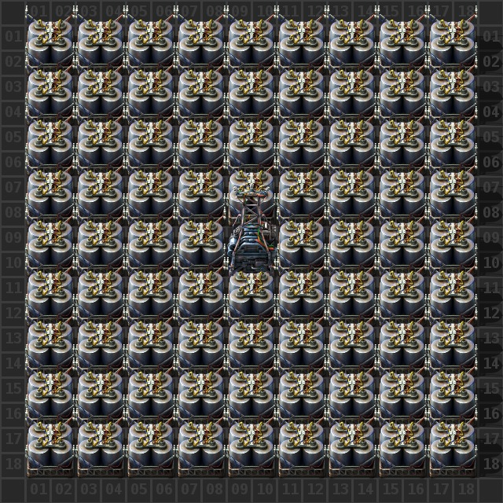

::: details Blueprint
```blueprint
0eNqV2N2Km0AAxfFXWebaBed7xtfoZVmKJrJIzRh0LA2L715NehHKMfVcLS76SzL8CYd8iaaf2+vYpSyqLzGl+vqeh/fPsTtv179FJUMhbtufpRDdaUiTqL6vN3afqe63W/Lt2opKdLm9iEKk+rJd1afTfJn7Og+j2J5L53ajluK/T05zM+U6d0N6elAtH4VoU+5y1z5e/35x+5HmS9OOqwxfuRDXYeru1t/P8vgoy/Y+/hHUMUHvC/qYYPcFc0zw+4I9JsR9wR08yRdH6Q8SL84yHCReHGY8SLw4TVkyWWlISKYrTCgmLExopixMGCYtTFiqLWw4Ki5seKoubAQqL2xEJi8Lv7VKJi9MSCYvTCgmL0xoJi9MGCovbFgqL2w4Ki9seCovbAQmLw+JyOQFCV0yeWFCMnlhQjF5YUJTeWHDUHlhw1J5YcNReWHDM3lFSAQmL0xEJi9ImJLJCxMS7dedurCgqLqwoam6sGGourBhqbqw4ahFj+e0pzY9NgK16rERqV2Ph31JLXtsSG7bY0Rx6x4jmtv3GDHcwseIpTqDO846qjNseKozbASqM2xEqjNouJLrDCOS6wwjiusMI5rrDCOG6gwOOmepzrDhqM6w4anOsBGozrARuc4g4kuuM4xIrjOMKK4zjGiqM7jsvKE6w4alOsOGozrDhqc6w0bgOsNI5DqDSCi5zjAiuc5W5KN4/EpbPf1aXIi+btp+/d+3XKdzPea3J256a/rh9HO961c7TndUBWl8VN45G1wIy/IHy6N2Sg==
```
:::

Теперь всё вместе в примерно правильном соотношении, примерно 1200 солнечных панелей к примерно 1000 аккумуляторным блокам

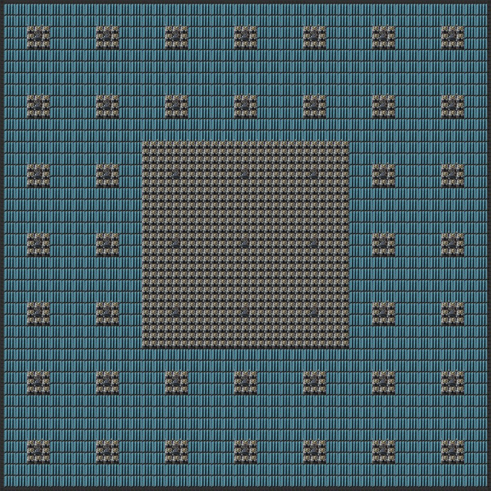

::: details Blueprint
```blueprint
0eNqVnduOXUdybX+lwedqY+VaedWjf8NoHEhtQiYsUYJEHZyGoX8/exeLEiGvERnjyWi3OLQZPat2zpgZGf/z7rsffnv/8y8fPn56983/vPv147c///3TT3///pcP//n8z//v3Tfl7C/v/vX6f39/effhnz99/PXdN//x+Ec/fP/x2x+e/9Cnf/38/t037z58ev/ju5d3H7/98fmffv3ph29/+fvP3358/8O755/7+J/vn7DfX7Z/8tt//vO3H3/74dtPP/3y1Z88E3/y19+++/XTt58+/PTxqz94/f6Pl3fvP3768OnD+8+f/PU//Ov/fPztx+/e//L4TLef+eXdzz/9+uGV9VaHf2uf6/Bv7ffnZ/kL5cxRaky5cpQRU2ryb3TEmJbEXDGmJzE9xowkZsWYmcOcZ4xZSUyLMeVIcuaGkxTxtVFxScr42ui4JIV8bZRcklKuGymXpJbrRsslKea6EXNJqrlu1FyScm4bOZeknttGz2dSz22j5zOp5777rZzUc9/o+UzquW/0fCb1PDZ6PpN6Hhs9n0k9j42ez6Sex0bPZ1LPc6PnM6nnudHzldTz3Oj5Sup5bfR8JfW8dueMpJ7XRs9X+qixEfSVPWwcG0Vf2ePGsZH0lT1wHBtNX0lNl7IR9bWyoI2q65EFbWRds2fnc6PremZBG2HXy53mK2CqO84TprnzPGG6PNATZ8gTPXGmPNITZ8kzPXDaIQ/1xCnyVE+cU57qiXPJUz1xqjzVE6fJUz1xujzVE2fIUz1xpjzVE2fJUz1w+iFP9cQp8lRPnFOe6olzyVM9cao81ROnyVM9cbo81RNnyFM9caY81RNnyVM9cMYhT/XEKfJUT5xTnuqJc8lTPXGqPNUTp8lTPXG6PdUTaNhTPYGmPdUTaNlTPYDmYU/1BCr2VE+g057qCXTZUz2Bqj3VE6i5U/0ATHenesKM26zif/9a/Ay5RcwcYgWIlUM8W8PEWIc0BFCRVaQhIM4pDQFxLmkIiFNzNT5bUOOWZARyWT3JCPSyhjQTVJMpzQRxljQTgyKUQ7oJBJVclZ89BqpyOc4kpEWQKwkZEaRKN4J1adKOIKhLP4KgIQ0JgpK/h3uJCp38Tdwj3XyVBMaQSDfZGLDvfqayOeDY/Uxlg8Bx7UBVehoEJX8fjxUVOvkLeUa6KclzxAx1M6UnwrosaYoIlM0AV9mBirRFCEr+Tl7Rr9Mz+Tt5Rbo5kweK1+8ipuiwBCuj0xIk6bgESTovQVL6iBz9Ur2OLCWSz1WylEg/12mtGdXmuqw3Q1KVF6gOAjV5hwpB3Ri0dc8Yd9fKwKCt3x//8PsP3//Xdz/99svzklmp9aWe9R+35KmMG3y8ZS9nUbHSYWDfkoq9ooWk097SQtKlHNx9sb9OAwMtnAPE8NBSaeWlXuVWELUpdwefsdsbYFiyYe+AIWnaW2BIWvYeGJHaoUzefbG/DgoDQdTGvx1Kmw9BzFtBtFPZP/iMl71ihiWr9pIZkpq9Zoakbi+aIWkoCwjFnilB9AsE8RBUeTi7Wtu9IJYyh/efMZsq9u1PYzZXHNufxmyyOLZfY9lscWy/xnpVBhGK3VKCmIUEMV/KOF9qO28F0buyjvAZh70khyWb9pockpa9KEekbOi4tl9joyj7eF/srzPH6DxJB8qHoMpDcbWtW0GMyxlL+JBV38LDojV9Dw9RXd/EQ9TQd/EQNZ25hIqvlCy+eMv/rYvnL4nebzUxD2c57z/h9Hf8qGTT3/JD1GUsXin3kGpSOII0ZeeI0pVPIcpQWRNRpvIjRFnqoA2Udag4hShFHaiJcqqTIlEulRYQpaoTIVFcL5worhlOFNcNJ8pU39VEWarXe085j8N9JxOmuC8awpyujUmYy32pEMY2DS8aOLJNQwR1OXuJoGHHL5E0bZMPScs2+YiUnVj8s8mHpGKbfEg67TQmki47j4mkavtxSGq2H4ekbvtxSBq2H4ekaSczkbTsbCaRsglm3Wo8G2G2rcazk4xtq/HsLGPbajw7zdi3Gs8mmn2r8Wyi2bcaT880bjWeTTTHVuPZucax1Xh2snFsNZ6dbZxbjWfTzbnVeDbdnFuNZ9PNtdV4Nt5cW41nZxzXVuP5IcetyNNjjsdW5elw89jKPJ1uHludp+PNshV6etyxbJWeHngsW6nXqjs9iGq604OoLp1CJ9CQTgFBUzoFBC3rFIjU7EVuJtmr3Eyyl7mZZK9zM6lap4CkZp0CknRyjySd3CNJJ/dI0sk9kbL5Zd1qPJtf1q3Gs/ll3Wo8m1+2rcaz05Ftq/HsfGTbajw7Idm3Gs+Gln2r8Wxo2bcaT89JbjWeDS3HVuPZWcmx1Xh2WnJsNZ6dl5xbjWeDyrnVeDannFuNZ2PKtdV4NqVcW41n5ybXVuP5wcmtyNOjk8dW5elw8tjKPB1OHludpwcoy1bo6RHKslV6eoiybKWeHaT8yikgamingKgpncIi0JJOgUDZ+cqxBRXrFJB0WqeApMs6BSRV6xSQ1KxTQFK3TgFJwzoFJE3rFJC0rFNY9EDaYZ0Ckop1Ckg6rVNA0mWdApLsNCaT7Dgmk+w8JpPsQCaTpnUKSFrWKRCp6JuzSNI3Z5Gkb84iSd+cRVK1TgFJzToFJHXrFJA0rFNA0rROAUnLOgUipac2txo/i3YKiDq1U0DUpZ0Coqp2Cohq2ikgqmungKihnQKipnYKiFraKRAqG35++UzP4+I9qDinwKDTOQUGXdIpMKlKp8CkJp0Ck7p0Ckwa0ikwaUqnwKQlnQKSsrHntVV4NvW8thLPhp7XVuPZzLNuNZ5+53Wr8WziWbcazwaedavxbOLZthrPRp5tq/Fs5tm2Gs9mnn2r8Wzm2bcaz2aefavxbOY5thrPZp5jq/Fs5jm2Gs9mnmOr8WzmObcab/YlFSbZp1SQ1O1bKkyyj6kw6ZROgUmXdQqM0pNrjNKTa4zSk2uM0pNrjJrWKTBqWaeAqGz0+adTYFSxToFRp3QKjUCXdAoIqmby7QRIM5NvBOlq8o0o9lF6rox9lp5J9mF6JE37ND2TipoQhGrPU00IEuVSE4JEsSMSXBs7IsEkOyLBJDsiwaSpJimp2ktNUgIlPY8Z6icbZ9btz1c2zmzbn69snPmnxUFStRYHSU1NnFK1u5o4JcpQE6dEsZeuuDb20hWR6mEvXTHJXrpi0qkmc0+gXGoylyhVTeYSpVl7hbXp1l4haVh7haRp7RWSlppghmpnn5NdoX5KcRPMhNExDlan6BiHUTrGYZSOcRjV3bQ3lXy4aW/CTDftTZilvR3V5zy0t0OU3Pz7bLvfg+TyXwapV03OcQ+p4uXKB+PmtcJ6lZfRb5+eqqd774Q+ZLeuD2s2rOtD0rSuD0nLuj4iZR+f/eL67qt9FfOA5Y0mPj9n+nyw8KGL2xeo6nU6Twif1K4848rZpWdMsmvPmGQXnzFpOE8I1Z7mHcsbXXx+1fT5buHLGONeF8s5xvtPWu1IPlau2pF8JtmRfCbZkXwmVecYodrNPGd5p4vXx02fzxe+jHn7Olmt3flJ+KTD+kms3LR+EknL+kkiZSPOsf1ua8X5yftqt9O8anmji89vnD5fMXwZ6/at09ou5zbhk9oBIa6cHRBikh0QYpIdEGKSey+Lqr3M45Y3uvj81OnzJcOXeVy3uujyNS34qL1oL0q166f2ooi6tBdFVNVeFFFNelEoeVdvXN7J4/Xh05dZjntpDOlS4XPqu4pcOX1XEVHjUJ5w3UOKyvsAcjrnBxT3Ij9RqsuxgOJe3idKd2dxoAyXzwBlutM2UJY7Rd5Tsu/P9rAu2dyzh3WZsp8OFNlPB4rspwOluW9uoHTXJwbKkN/NgJFPKhNmyd7nPWbJ55MJI7uMz87GPUh2GRl0ubvmDKryrjmTmmwHMqnLdiCThmwHMmnKdiCTlrxrTqSWDT3/uGvOpCJbdkw6ZcuOSZds2TGpypYdk5q8a86kLu+aM2nIthqTpmyrMWnJthqSsnObbavx9GLNrcazWWjfajwbhfatxtNzm1uNZ4PQsdV4dm5zbDWendscW42nd21uNZ5etrnVeDYPnVuNp9dtbjWezUPXVuPZqc211Xh+aHMrcr9+k1F6/yaj9AJORukNnIxa9q45otJDm2Ur9UvvNGGU3mnCqEs6hUqgKp0Cgpp0Cgjq1ikgyV4XZ5K9Ls4ke10cSdVeF2dSsU4BSad1Ckiy4T6TbLjPJBvuM8mG+0wa1ikgaVqngKRlnQKRsqFm22o8O7fZthrPzm22rcazc5t9q/FshNm3Gs9GmH2r8fTc5lbj2QhzbDWendscW41n5zbHVuPZuc251Xg2r5xbjWfjyrnVeDatXFuNZ8PKtdV4dmpzbTWeH9rcijw9tHlsVZ4OJ4+tzNPh5LHVeXpos2yFnh7aLFulp4c2y1bq2bHNr5wCoqp2Cohq0ikMAnXpFBA0pFNA0LROAUnLOgUipR+s7VtSsU4BSad1Cki6rFNAUrVOAUnNOgUkdesUkJQMOa/xxrmnJDPOa4WU7KXaElHSw5xXSCnq4gJR3M57oiQD+hpWN7tcs8XVTQb0La5uMqBvcXWT2m1xdZPabXF13eWSe0o/3OUSorjLJUTJLoYdISW7GHaFlOzzEHF1s4th4+omtTvi6ia1O+LqTnUBiChLXQACSnY4c4bVzQ5nzrC6JandGVa3ZC9GhdUtdtcafVf3YnetMcnuWmOS3rXGKL1rjVF61xqiTr1rjVF61xqj9K41Rulda4zSu9YYpXetMUruWnu2su9Bctcag+SuNQbZXWtIuuyuNSbZXWtMsrvWmGR3rTHJ7lpjkt21xiS7a41Jdtcak6bzleuespyvvKfUw/lKoBTnK4FyOl8JlMv5SqBU5yuB0pyvBEp3vhIow/lKoEznK4GynK+8p7TD+UqgFOcrgXI6XwmUy/lKoFTnK4HSnK8ESne+EijD+UqgTOcrgbKcr7ynZIcbZ1jdXpyvBMrpfCVQLucrgVKdrwRKk74Sv6uz2eDafutno8G1Pdnmk8Ht0TafDG7Ptulk8NgebtPJ4LE93eaTwe3xNp0Mlu35Np0Mlu0BN50Mnlutj259JaNcdFLLPcVFJ0Rx0QlQpotOiOKiE6K46IQoLjohiotOiOKiE6K46IQoLjohiotOiOKiE6AsF50QxUUnRHHRCVFcdEIUF50QxUUnRHHRCVFcdEIUF50QxUUn95RxuOiEKC46IYqLTojiohOiVNm5ve6/qkd6SnEL6ubdinrdQ4Z5t4IgU71bQRR7nQgrU+x1IibZ60RMsteJmOTe94BqF/e+B1Hc+x5E0U1jrI1uGiPJNY3pb+aaxkA5XdOYKK5pTBTXNCaKaxoTxTWNieKaxkRxTWOiuKYxUVzTmCiuaQyUyzWNieKaxkRxTWOiuKYxUVzTmCiuaUwU1zQmimsaE8U1jYnimsZAqa5pTBTXNCaKaxoTxTWNieKaxkTRTWP6rq66aYykod58or/ZVG8+EWW5N58A0w7dcqbqtKJbzog6dcsZUZduOSOquvexqOTNvY9FmO7exyLM0B1rrM/UHWtELemnO4Cyk4B1CyrKTwPkFLsBHoy/PMT5fAN+PL7yS7l/BH5kU78vVhs+pd08zUWzm6eZZDdPM8lunmbSdFYbKMssB7gRxedlEc8H4B/CGLevfY/sK6bnij7qsE+NYemGfWqMSZdz4kCpzokDpTknDhT3nilRhtktcCer110Tz/fjH7Ka9V5W7rlT+qjLGfV7SjYSbGHxs5FgC4ufjQRb+JshGwm2sLrpSDCurluFR5RuFhvciPLzoovn4/UPUa7bl8rHdJvy6KNO5+OBspyPv6dkE8MRFj+bGI5Q2tnEcITVzSaGI6xuOjGMq9vMVoUbUX7esvF8Of+lnMft2qaRDRRnXPzhbD5QprP5QFnO5t9S5mE3rNNBYB52wzqTTmfzgXKZpQx3snpd0vF8df8hq/un92d23PCPLgB8Vv2kHhdPP6nHKP2kHqP0k3qMWrILcI/5OoVMbGW40Uf/8iun3G5+muntkSX8CU1vjzy3P6Lp7ZHn9me0qDXsddxD1Bp2grg17EQZzksCZbrYFijLmcV7SjaWvMLPko0lr/iznM6YAeVyxgwo1UWkQGnOeQGlO+cFlOGcF1Cmc15AWc553VOysWQLq5uNJVtY3XQsGVY3HUuG1U3HknF1m7NWQOnOWgFlOGsFlOmsFVCWs1b3lGwsOcLqVrewjiini0iB4lbSEaU67wSU5rwTULrzTkCRcSRQZBwJFBtH3mPaIQ/XgCkyYgPMKU/QgJEPSz/fcL0HyYelGSQflmaQfViaSfZhaSbZh6WZZB+WRlK3D0szyT4szST7sDST7MPSTLIPSzOpOfux7ind2Q+gDGc/gDKd/QDKcvbjnpLNE2tY3exaxBpWN7sXsYXVzeaILaxuNkdscXWbsx9A6c5+AGU4+wGU6ewHUJazH/eU9F7EsLrpvYhhddN7EcPqZoPCEVY3GxSOuLrN2Q+gdGc/gDKc/QDKdPYDKMvZj3tKNgmcYXWzSeAMq5tdiLi23/rZjYhr+62fXYm4tifb9ErEY3u0Te9EPLZn2/RSxGN7uF1TpyuIWjpdAdQ6Dj3Wj6iix/oR5TMQRPkMBFFy6PC50eMeJIcOGdSdr2TQkL6SSVP6SiYt6SuRlJ5AXFtSkb6SSaf0lUy6pK9kUpW+kklN+komdeUrW7mnDOUriTKVryTKUr4SKOkpxBZSivKVRDmVryTKpXwlUarylURpylcSpStfSZShfCVRpvKVRFnKVwIlPYUYVjc9hRhWNx33hdXNxn0jrG427htxdZvylUTpylcSZShfSZSpfCVRlvKVQElPIYbVTU8hhtVNx31hdatdb4Xf1dWut2KSXW/FJL3eilF6vRWj9HorRun1Vohqer0Vo/R6K0bp9VaM0uutGKXXWzHKRSftuqe46IQoLjohiotOiOKiE6B0F50QxUUnRHHRCVFcdEIUF50QxUUnRHHRCVFcdEIUF50QxUUnQBkuOiGKi06I4qITorjohCguOiGKi06I4qITorjohCguOiGKi06AMl10QhQXnRDllJ3bBl/V2eWBdQuqsnOLoGY7t0jqtnOLpGE7t0iatnOLpGU7t0Rah+3cIqnYzi2STtu5RdJlO7dIqu5YC5TmjrVA6e5YC5ThjrVAme5YC5TljrW3lIfpPdy5ljDFHWwJc7qTLWEud7QlTHVnW8I0d7glTHenW8IMd7wlzHTnW8Isd8AFTHbDYI9LnJ3gG3GJszsGR1zi7MuiIy5xenJvU+LmjrmE6e6cS5jhDrqEme6kS5jljrqAyUZ6My5xdpng2p0FHqjTNnQZddmOLqOqbukyS09iByw9ih2w9Cx2wNLD2AFr6b4ustKbBcvcs4ru7DLr1K1dZslZlDaRJIdRApKcRglIdhwlQNl5lABlB1IClJ1IYVS1IykBys6kBCg7lBKg7FRKgLJjKQFKhisDMDJdIYyMVwgj8xXCyIAFME0mLISREQthZMZCGBmyEEamLISRMQthZM5CGBm0EEYmLYSRUQtgusxaCCPDFsLItIUwMm4hjMxbCCMDF8LIxIUwMnIhjMxcCCNDF8AMmboQRsYuhLEjK/w9PuzMSoCyQysBSk+tBCw9thKw9NxKwNKDKwFLT64wa+rRlYClZ1cClh5eCVh6eiVgyTxmAUYGMoSRiQxhZCRDGJnJEEaGMoBZMpQhjAxlCCNDGcLIUIYwMpQhjAxlCCNDGcLIUIYwMpQhjAxl7jHlkKEMYWQoQxgZyhBGhjKEkaEMYWQoQxgZyhBGhjKEkaEMYWQoA5giQxnCFNcH7gW+xkt2cLDuSZd507MXoFTzqCdSmnrVEzH2DlNQHXuJKUDZW0wByl5jYlQ2bjxbWPLsCOEZyyg7Q3jGOjptEzqoj21CByjXhMa/nGtCI8Y1oRHjmtCIcU1owlyuCY0Y14RGjGtCI8Y1oRHjmtCIcU1oxLgmNGJcExoxrgmNGNeEJkx1TWjEuCY0YlwTGjGuCY0Y14RGjGtCI8Y1oRHjmtCIcU1oxLgmNGGaa0IjxjWhEWOb0Pw93mwTOkBV9Zgs/uWaek0WMd09J4scPSIbVEjPyAYsPSTLrK6nZANWce/vUt376R7gRc7lXuBFTrU98KBGzfbAA1aXNrwiaUgbzqSpbPgFlCVWXT4gf9lu8txo+Nxm+PL4Eb5dafj4Lw9n0eGDZpca/mnRsXLZePFPi86oy1p0RlVr0RnVnEWnknez8vJOHJ93oL4uJnwoZF6gkOE8PH3caT08F3BZD4+o6far0F9uugUriHEbVhDjVqwgpprllzcCe9ul+rpk8CGwVe4FNt0WFvy4bg0LYtweFsS4RSyIcZtYCLPcKhbEuF0siHHLWBBzmT2YN/p8W8r6um/w5XECPO71udy+Fvy4bmELYtzGFsS4lS2IcTtbEOOWtgDmPNzWFsS4tS2IOc1KzBt9vu1nfV1c+NTn7bryx7/HbXbBj+tWuyDG7XZBjFvugphh2wR0VDizb6Cuukct1yaAv1xy++Eie/Bl1+rr9sOHwO5XID7+yyL7CPR5T91HwBKmtyAefc+quo/ArKb7CMzqso9AdR9qS+aNUN62pz40clbQyJQ9BvqsS/cYsH7noXsMzCrKzxPlVLE6US7n2QlTnQ8lTHNRMWG6s5mEGc7QEWY6Q0eY5QwdYNIx6BVjigtlCXM6v0aYy/k1wlTn1wjTnF8jTHd+jTDD+TXCTOfXCLOcXwNMOgaNS5yOQeMSZ2PQHpc4G4P2uMTpGHRT4ubsGGG6s2OEGc6OEWY6O0aY5UJZwKRj0LjE6Rg0LnF2LnLGJc7ORc64xDb+JIyMPwlj40/iDHkMJ86UcR5xljxqAycdeX45HA86HGfXKdY96XSvGASkS75iEKCqDbcY1Wy4xahuwy1GDRtuMWrKVwwC1JKvGDBqHDZ8YlSx4ROjTudVBmAu51UIU51XIUxzXoUw3XkVwgznVQgznVchzHJeBTDZ0LLFJc6Gli0ucTa0bHGJs6Fli0ucnYfsmxI351UI051XIcxwXoUw03kVwiznVQCTzSRHXOJsJjniEmczyRGXODsPOeISZyPHuSlxc16FMN15FcIM51UIM51XIcyyyRB9j1/ZdYur7lFFvmIQoE77ikHAunRyw6yqkxtmNZ3cMKvr5IZZw75iELCmfcUgYPl0BVnFpyvMkoOU40CSHKQMSJezogGpSisaoJq0ogGqSysaoIa0ogFqSisaoJa0oozKJol/WNEAVaQVDVCntKIB6nJWdAGmOitKmOasKGG6s6KEGc6KEmY6K0qY5awoYLKRYotLnI0UW1zi9GRlXOL0ZGVc4nSkuClxc1aUMN1ZUcIMZ0UJM50VJcxyVhQw2UhxxCXORoojLnF6sjIucXqyMi5xOlLclLg5K0qY7qwoYYazooSZzooSZjkrCpjshsa1PxJkNzSu/ZEgPWG5PwCnNzQe+xNwekXjsT8Ct2ataMDq1ooGrGGtaMCa1ooGrGWtKLPS6eO5V30v1ooGLBfKjAIYF8ogxoUyiHGhDGJcKIMYF8ogxoUyiHGhDGGGC2UQ40IZxLhQBjEulEGMC2UQ40IZxLhQBjEulEGMC2UQ40IZwkwXyiDGhTKIcaEMYlwogxgXyiDGhTKIcaEMYlwogxgXyiBmyT7wRV/j2X2OdU8qsg/MpNP2gRl12T4wo6rtAzOq2T4wo7rtAzNq2D4wo6btAzNq2T4woWo2f7zqHlXc6fcCzOlOv4S53OmXMNWdfgnT3OmXMN2dfgkz3OmXMNOdfgmz3OkXMNl3WVtc4uzAYotLnF352OISZ19k7XGJs0+y9k2Jmzv9Eqa70y9hhjv9Ema60y9hljv9Aib7BuuIS5weOYxLnJ05HHGJswnhjEucTQjnpsTNnX4J093plzDDnX4JM20fGL/Hsxsd1/5IkF3ouMYeVXQfmFl6mDxg6WHygKWHyQOWHiYPWF33gZk1dB+YWVP3gZm1dB8YWVVOx4yOJDkdE5DkdExAstMxAcpOxwQoOx0ToOx0TICy0zEByk7HBCg7HcOoZqdjApSdjglQMoghjAxiCCODGMLIIIYwMoghjAxiCCODGMLIIAYwXQYxhJFBDGFkEEMYGcQQRgYxhJFBDGFkEEMYGcQQRgYxhJFBDGCGDGIII4MYwsgghjAyiCGMDGIII4MYwsgghjAyiCGMDGIIY6dj+Ht82umYAGWnYwKUno4JWHo6JmDp6ZiApadjApaejglYejomYOnpmIClp2OYtfR0TMCSocwAjAxlCCNDGcLIUIYwMpQhjAxlCCNDGcLIUIYwMpS5x7RDhjKEkaEMYWQoQxgZyhBGhjKEkaEMYWQoQxgZyhBGhjKEkaEMYIoMZQgjQxnCyFCGMDKUIYwMZQgjQxnCyFCGMDKUIcyUfeAFX+MtO49Yt6R0wPjGAUoxj5Ei5VSPkSJGX2ji6ugLTYzSF5oYpS80MWqoh1ux5FM93IqYpR5uJcylm9BYn0s3oRklm9D0l5NNaMLIJjRhZBOaMLIJTRjZhCaMbEITRjahAVNlE5owsglNGNmEJoxsQhNGNqEJI5vQhJFNaMLIJjRhZBOaMLIJDZgmm9CEkU1owsgmNGFkE5owsglNGNmEJoxsQhNGNqEJI5vQhNFNaPwe77oJzaiiHrmlv1w2GFxxjdK7HY9Yh92P1XKF/Fgts/xYLbP8WC2zpnsUGOu+3KPAxMnvcYz1lF7keO5/6NKbHM/9T116leMbaZ5Iqs6GB6RmbPgsQOlix+cD8pfdLJ9XOLbH90NZ1/mP+3/FUB4dP+mUHj0o3ZIenVHZfPEPjx6givToAepUHp1KPi+z5PNOHW/bX1/3Lz4lcr9ErGWHG88Vf94mXXxQwS5dfIByS2HwL+eWwiDGLYUhzHJLYRBTzJbPO4W9bY993aD4UFi93zTcllsbg5/XrY1BjFsbgxi3NgYxbm0MYtzaGMS4tTGIcWtjANOPw6z5vBPo2/bZ1xWKD4G2+0XH/XCLZfDzusUyiHGLZRDjFssgxi2WQYxbLIMYt1gGMW6xDGKW2fN5I9Av62dfVzA+BNrvF9H24lbP0OctbvUMYtzqGcS41TOIqbJXgKeFnn1jddU9qqteAf7lhln0eaewtwWyrwscnwoboLDpugn4gZftJnAN01scj75nFdtNCFin7SYErMt1E6juZ1WbPm+VMr78Ghr3qz57dvbyS6sBP2y3rYaggMO2GgLWVLb+Asoy6TpRrsM5d8IU50YJc6rEGDGX85qEqc7VEaY5V0eY7lwdYYZzdYSZKptFzHKeDTDZNLTGJU6noXGJ02loXOJ0GhqXOJuGtk2Jm/NshOnOsxFmqGwWMdM5MsIs58gAk01De1zidBoalzidhsYlTqehcYmzaejYlLg5R0aYrrJZxAzntwgznd8izHJ+CzDZ8cgZl1imoIhxKShiZAqKnCrP4cRpLtVDTpdHbeIMmZ41Ohxn9zvWPWm5xwyYNA75mEGAKjbiYtRpIy5GXTbiYlS1ERejmnzMIEB1+ZhBgBo2gWLUtAkUo5bzKoDJPs/6xasQpjivQpjTeRXCXM6rEKY6r0KY5rwKYbrzKoQZzqsQZjqvQpjlvApgsslli0ucHYvscYmzuWSPS5zNJXtc4mwu2Tclbs6rEKY7r0KY4bwKYabzKoRZzqvcY0Z2LHKsGFOcVyHM6bwKYS7nVQhTnVchTHNehTDdZkP0PT6yix1X3aOmfMwgQC37mAGz0msdj2vPKjq6YdapoxtmXTq6YVa1jxkErGYfMwhYPl1hlk9XmCXnKedEkpynZFI2Yhx7UrFWlFGntaKMuqwVZVS1VpRRzVpRRnVrRRk1rBVl1LRWlFHLWlFEZSPFL1Z0AKY4K0qY01lRwlzOihKmOitKmOasKGG6s6KEGc6KEmY6K0qY5awoYNIDlnGJ05FiXOJspNjjEmcjxR6XOD1guSlxc1aUMN1ZUcIMZ0UJM50VJcxyVhQw6QHLuMTpSDEucTZSnHGJs5HijEucHrDclLg5K0qY7qwoYYa1ovg9nl3suPZHgvSg5f4AnF7reOxPwOm1jsf+CNxPbUWZdWkryqyqrSizmraizOraijJraCvKrKmtKLNkKHM/MjmGDGUII0MZwshQhjAylCGMDGUII0MZwshQhjAylCGMDGUII0MZwEwZyhBGhjKEkaEMYWQoQxgZyhBGhjKEkaEMYWQoQxgZyhBGhjKAWTKUIYwMZQgjQxnCyFCGMDKUIYwMZQjTXR/4eSIG0nB94IA0XR84IC3ZB0bUzG53/KMPHKCK7AMHqFP2gQPUJfvAAarKPnCAarIPHKC67AMHqCH7wAEq250ee1Q2idmrPRs/1r3as+lj3as9Gz7Wvdqz2WPbqz0bPba92rPJY9urPRs89r3as7lj36s9Gzv2vdqzuePYqz0dPO7Vnk0ex17t2eRx7NWeTR7nXu3Z5HHu1Z5NHude7ae9WxKg7N2SAGXvlgQofbeEWZe+WxKw9N2SgKXvlgQsfbckYOm7JQFL3y0JWPpuScDSd0sClrxb8vxJApK8W8KkKu+WBCR7tyRA2bslAcreLQlQ9m5JgLJ3SwKUvVsSoOzdkgBl75YEKHu3hFHpTZJ7tWc3Sda92ttpPQWjLuspGFWtp2BUs56CUd16CkYN6ykYNa2nYNSyngJR2ayz79WejTrHXu3ZpHPs1Z4NOsde7dmcc+zVno05517t2ZRz7tWeDTnnXu3d7oEPUHYPPKOG3QMfoPQe+ICl98AHLL0HPmDpPfABS++BD1h6D3zA0nvgA5beAx+w9B54Zk25B/4pfyDJPfAB6TQvFK0BlMu8UISUql4oQkyzjoSr060jYdSwjoRR0zoSRi31mhOVPJuVnrGMslnpGetondbQYH3WZQ0No6o1NIxq1tAwqqs7Pljyoe74IGaqOz6IWdYPUX1WNjJt5x5VrB9i1Gn9EKPc9koo+ZLbKxHjtlcipls7xfUZ1k4xalo7xahl7RSiirvnQiUv7p4LYtw9F8Rc1o1xfap1Y4xq1o0xqls3xqih3l/Ckk/1/hJilnt/iTinD4iwQqcPiJjlAyJm+YCIWfK9Kqy7fK8KOfK9KuToG+NBjfSN8YC1nBl8bWDco7JZaE2girKDCyin2EPzgPz15eDXJSPrWi/nWe6XjKzrcl6RPmmVXjGqXZNmMWJ16RYj1pB2MWJN5xep7MvsorlTyNuSotclIQ+ZnPebQlZ2tvNc4efN5qVX4qc1G5heiR/XbGL6h6eMWFWayojl1sJi2btZKHMnk7dFRa+rOh4yuS6QiVsci593St8ZlXBJ4xmwslnqH84zYhVpPSOWm3WmsrfLrHW5kcmXbUOvCzMeMqn3WzNWc9PQ+HmbdKdRCbu0pxFrSH8asaY0qBFrOYcKZe+HWa5yK5O3XyTPrRdPmdyvvljZB21n/Nsvm77OxE9tNn6diZ/abvejRCy7ICViuQ0pWHa1IeVOJm+bd173Xjxk0irIRG5IwQ+sN6QERRx6RUoE0ztSIphekhLB5JYUqv1wW1Lu1PK2RechlF7uhTLklhT8sPquZVRBfdkygqk9KY8fCMCoRSmImW5TCnPcqhTmuF0pzHHLUphT1emeOU2FRszp6vTOnKGOo8yZKgthzlLHTeTISVbmuBY/c1yPnzmX+sJnTlWda+Y094XOoO6+nRg0XDOWQdN9BTFItz2v+y+N8zh025NRxd2sj1CnvFofsS7dnWRW1d1JZjXdnWRW191JZg15vz5iTXnBPmIt3T5EVnaq9UrIPjvWeiV0n55rTeg+m97WhO6z8W1N6D6b39aE7rMBbkvoPjvc2hK6z063toTus+OtPaH7bJ7bE7rP5rk9ofv0hGtC99k8dyR0n51xHQndZ4dcR0L32SnXmdB9NtudCd1ns92Z0H02210J3WfD3ZXQfXbQdSV0nx90TQg/Pel6JJSfznSPhPTToe6R0H461S0J8aenXUtC/elx15KQ/7V8nwlh2aHXr/tMDCvWfXREndZ9MOqy7oNRVbsPZjXtPpjVtftg1tDug1lTuw9mLe0+kJVNbL9yH8zylxeY5S8vMMtfXmCWv7zArKbdB7O6dh/MGtp9MGtq98Gspd0HsrJzsC2h++wgbE/oPpvF9oTus1lsT+g+PQub0H02ix0J3WenYUdC99lx2JHQfXYediZ0n81dZ0L32dh1JnSfTV1XQvfZ0HUldJ8diV0J3edHYhPCT8/EHgnlp0PWIyH9dMh6JLSfHostCfGn52JLQv3pwdiSkH92NvZr98Gw07sPhl3WfSxEVes+GNWs+2BU1+6DWUO7D2ZN7T6YtbT7QNY6tPtgVtHug1mndh/MurT7YFbV7oNZTbsPZnXtPpg1tPtg1tTug1lLuw9iFT1UG7GKdh/MOrX7YNal3QezqnYfzPKXj5nlLx8zy18+Zpa/fMyspd0HsrLZ7UzoPpvdzoTus9ntTOg+m92uhO6z2e1K6D49e5vQfXoh6pEQfnoj6pFQfnol6pGQflnefSAsPY9bEuJPD+SWhPrTE7klIf/0SO6Z0H96Q+qZ+AHIhrh/fK7n/xCA6tJ9BKgh3UeAmtZ9BKxl3Qez0k8V9wSrWPcRsE7rPgLWZd1HwKrWfQSsZt1HwOrWfQSsYd1HwJrWfQSsZd0Hs7LJbU3oPhvc1oTus8ltS+g+G922hO6z2W1L6D6b3faE7rPZbU/oPpvd9oTus9ntSOg+m92OhO6z2e1I6D6b3Y6E7rPZ7Uzovtn3dSKWfWAnYtkXdiKWfWInYg3rPgLW1O4jgPnhQYZ1PzwYwPzwYADzw4MB7NLuI4BV7T4CWNPuI4B17T4C2LDuoyFqWvfBqKXmDgtgsmtb1wZT3Nwhck5tXrBC49LmhVlVmxdmNW1emNXdnCbWfbg5TeRMN6eJHD12wjWaeuwkYOmxk4Clx04C1uXmWqnu6fnYjZ7S87EbPWVj2Zr4ucvGsi3xc5eNZb8yT8xa2jwhKzsv2ze/h7Pzsn2jp+y8bN/oaemLZ0GN9MWzgKUvngUsffEsYA03N411n25uGjnLzU0D58zGr3P/c3dm49c5E6xTmzdmXdq8Mau6OXOse3Nz5sjpcs4cQT56Cqrko6cA5qMnhhUfPQWwImfzqfjZl47/mM1H0CVn8xFUvXvkOjXvHhnWrXuciBrWPTLKvVpTBmCWeC31SfnrE0LPdzDpCczH/1++ZkMfM525XvvKpSPXnmBd2lUyq2pXyawmXSXVvZu3Uu/18fklXXwA8/EvGdJy0oed2nJyAZe2nMi6Dm05mVW05WTWKS0n1P26zEuptyJ5e0cXn798/Euq9KP0YfUzCkEB9TMKAUs/oxCw9DMKAWtJPwp1r4d5J/VWJG+v6OLjl4//f5FmlT7sqc0qFjA9YJv4ic2mtCPxNZhNaUfia7B2aVap7sO8knorkrc3dPHpy8d/OaWTpQ+rR7C4gE2PYAUsPYIVsPQIVsCSL6ZR3Vs1b6Tei+TzC7r47OXjX2KfU8NP273N5RIOb3MZNr3NZdjyNhdh/bA2F4r/dYybeCH1VivBM7qPf8Fp7S99Un91M6ifv7oZwJozmgsw3cWUhBnSUBJnSoNEnCVjN+CMQ3og4hR5pifOKWMk4lzy2E6cKo+hxGkyFiFOlydN4tg2P3Fsm584ts0PnOwzxmvzv3v2GeO1qU/2GeM/v88JdNnvJgJV24IlULPfQQSyjc7ndxGgbKMzQE15ST9ALXtJn1nZ8dk/O5IBq9iOZMA6bUcyYF22Ixmwqr2kH7CavaQfsLptGgasYZuGAWvapmHAWrZpiKwr/fDxlWAVe0k/YJ22rxewLtvXC1jV9vUCVrN9vYDV7SX9gDXsJf2ANW3rLWAt23pjVjbHHQndZ8dnR0L32fHZkdB9enFtQvfpzbUJ3Wfj3JnQfXp3bUL32Th3JXSfHZ5dCd3nZ2cTwve7bCOYXmYbwfQ22wim19lGsKov6Qewpi/pBzC/hieA+TU8AWxa91ERtaz7QFQ2ux0JVNHug1n6ln3A0rfsA5a+ZR+w9C37gNW1+2DW0O6DWfrKQsDSVxaYVfWVhYClrywErFO7D2Zd2n0wq2r3waym3QezunYfzBrafTBravfBrKXdB7KyOWxP6D49PpvQfTaHHQndZ8dnR0L32fHZkdB9dnx2JnSfTV1nQvfZ0HUmdJ/NXFdC99nIdSV0nx2eXQnd52dnE8JPz84eCeWnQ9YjIf10yHoktJ+enS0J8adnZ0tC/enZ2ZKQf3Z69mv3wbDl3ccr7B8v7z58ev/j489998Nv73/+5cPHT48/9cO33z3+9Dfv/v3D93975f3t/cf3v3z/r79998NP//zvxz/wf9//8usr9ZyljnWO3tvsc/7++/8HuxFitQ==
```
:::

### Опа, опять теория

И тут возникает ещё один важный вопрос: как всё это строить на огромной площади. Ответ зависит от того в какую игру вы играете. Если с модами, то можно воспользоваться модом [`JetPack`](https://mods.factorio.com/mod/jetpack) который позволяет летать яки `Peter Pan` над Кенсингтонскими садами. Также подойдёт мод [`Squeak Through`](https://mods.factorio.com/mod/Squeak%20Through), который позволить ходить между солнечными панелями, но не рекомендую его к использованию, по причине того, что данный мод меняет области строительства и некоторые чертежи созданные в игре с данным модном могут не работать в играх без этого мода.

Если же играете без модов, то Паукотрон (`Spidertron`) в помощь, снаряжайте его персональной дронстанцией (`Personal roboport`), достаточным количеством строительных дронов (`Construction robot`), солнечных панелей и аккумуляторных блоков, не забываем про трансформаторы, они же подстанции (`Substation`) и сей умелец построит все нужное, даже снесёт скалы, если есть взрывчатка (`Cliff explosives`) и уберет камни и деревья. Можно даже сесть самому в паучёк и гулять по чертежам, роботы построят все.

### Самый роботизированный чертёж

Как вариант решения проблемы построения больших плантаций солнечных панелей и аккумуляторных блоков могу предложить ещё один чертеж (соответственно подтыренный мной в интернете), он включает станции дронов (`Roboport`) и строит себя сам, стыкуется во всех направлениях и имеет правильное соотношение солнечных панелей к аккумуляторам.

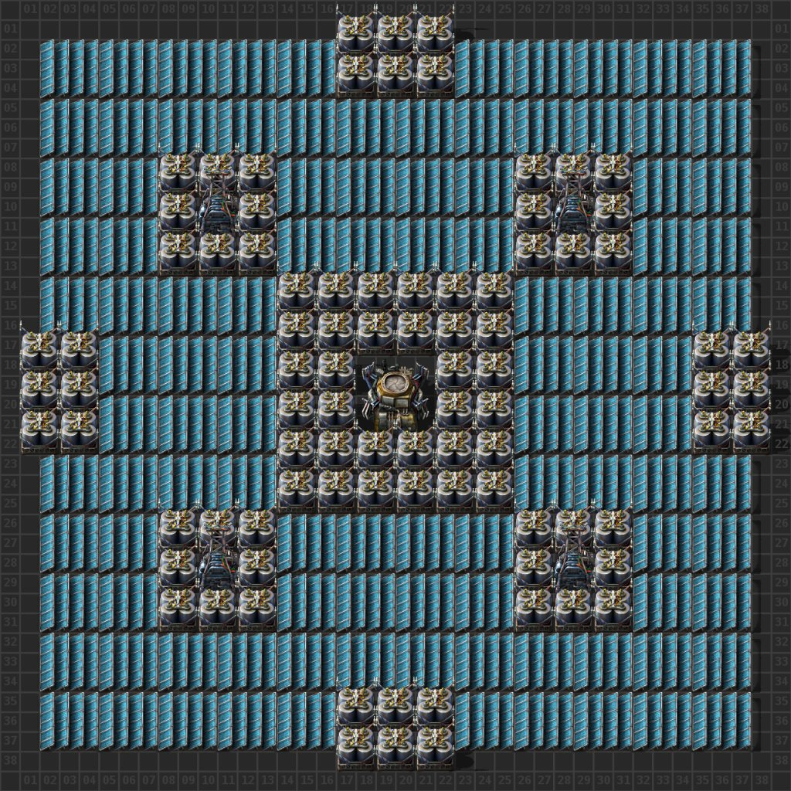

::: details Blueprint
```blueprint
0eNqVm9uK40YURX9l0LM7qO5V/oy8hibYPabH0G0bX5I0g/89vnSgyZwt13oyAmuhOtp7S1Wn9HNYvp1Wu/16cxzmP4fDZrF7Om6fXvfr79fjf4Z5yLPh4/pzng3rl+3mMMz/uPxx/bpZvF3/cvzYrYb5sD6u3ofZsFm8X48O27fF/mm32Kzehut5m++rC8qdZw/PXLy8nN5Pb4vjdv/lTN9x5uG0PBwXx/V28+XE0HHifrvc7rb745fT4vl5Nqw2x/VxvboP+Hbw8efm9L5c7S9DMYc6G3bbw/p2Cffiud/SrXqX3/P1Sv5H8X2UOE0JfZQyTYmdIxqnMakTE6Yx2RTEr5i7OEcLUToRVSNqH8KPGtH66uH9dD3c2MlJDzidwvX1AadTuuGBA1yneMMDD7iIBONNRkKKsRkZScZmFBYuUZSksnRRmMbiRWD8CPNFcRwMGMXpFLDLDzidAnbtASfCoFCcBINCcTIMCsUpMCgUp8KgUJzGzFXEM3dk5lIY1xcX5Q4xEb4P0SYQoTP43AQjQl+qiiToS8XJ0JeKU6AvFaf3XSJN1Lh1MibkEsdOxoReooOeFjWJHnpacQJxUTMR0ZpHCBO1y0Rhs1q//lhuT/vr9CCWmUvu2eImZC372jKSjs0oXePzRQwwXgYYzQFWpCf74mAmX98RzLkHDGXJQansnMlAsSwYLJcFhAazrApNZgmi0SxBNJsliIWzKDRLZxuSWTwLCM1nVZdMA1qCAnR4EJwIHa44Ca6ZKE6mqyYK1LtaET4xJqRTxi5NQTpl7MoEpHTK2LUpSGcMezcF6cxhP1XYEujqi7jNJdLlFwVK1OIKlKnFFQgq2IZABdsQqGATUqGCbQhUsA2BCrYhna8S92Upl01G5xqbn2IkGODZVlvNMMAVp9AAV6DK5G9OrGpj8jchbfy1s6HWMF01CVC29mVA2doQHLzi9jQcvAqEg1eBOmd114UVaafWGbqfTTwBqSgbbMk0lA3V7nHQ+VtTzRIH00GCPI0HSQosH5pNiSwgBCUxfwtKZgYXlEIdLitcqcUlqVGPK5IbmcltXzjHXC4ontjcjzYkEJ8rSERe8M6mJOQFRcnoZVFRCnpbVJSKfKkoDflSUDxTrrjTnilXUTxbPbiu99igwB4wGhTZA0aDEnzAaFJmpgo2pTBTCUplphKUxkxlU8LITCUojplKUDx82Mm7HQJ82GlShA87TUpwKUGTMjR8UqACDS9BlbQEvIA00hMQkN4G3mdTQFHoNgpZmUg3UmgS3UqhSXQzhSYl1BlQ1c6oNaAoBfUGFKVSv8vaNOp3RUojclexIQ60cC+M7han6+3l/Wc5cX2BSUlQImnkGsOUrWqXEtOXuECa3VWJgma3BLHstuepiWW3DckwuwUFZ7eqTMbZLUk4uyUJZ7ckwewW1YbZLSgwuwUFZ7esDc5uRSoj83tQO3iLY37XIM8mZxoU4ORMk+gmDE2iuzA0iW7D0CS6D0OTKpwgaVKDEyRJqiM0nSY5aDpNgisiQe4RhysiGgRXRDSIrohoUqamk6SCvi4I0aZU9H2BojT0hYGgtJFaVn4e4KhlJclTy0pSoJaVpEgtK0mJaSjblMw0JCiFaehCeZ7dv5qbf/lgcDa8LZaXasyH3z8bzd/+Xh9/fLtV6tutUofLn/5a7Q83pq+XOWzzJedUc63n87+IrUlA
```
:::

С этим чертежом нужно быть осторожным. Огромное количество станций дронов могут уменьшить производительность игры и к тому же попросту тратят энергию после строительства ничего полезного не делая. Желательно после завершения строительства отправить пучка и заменить станции дронов на аккумуляторные блоки.

## Больше подробностей

Детальный разбор производства подсолнечной и надсолнечной энергии смотрите на YouTube канале.

[](http://www.youtube.com/watch?v=ePYnkkVVNZ4)
