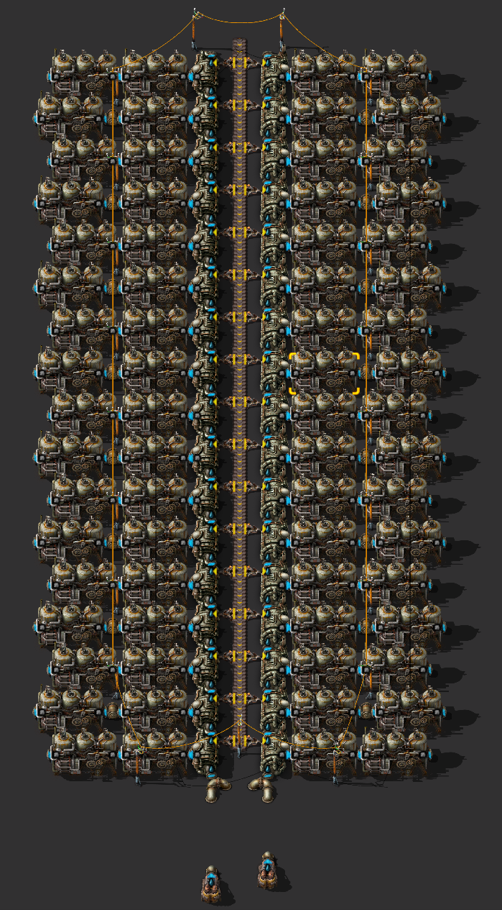

# Паровая энергия

Действует простая формула: 1 насос способен залить водой 20 бойлеров, каждый бойлер производит пар ровно на 2 паровых двигателя, каждый паровой двигатель производит 900 киловатт энаргии. То есть, на одном насосе можно разместить до 40 паровых двигателей и всё это выдаёт 36MW максимум. Такую конструкцию, из одного насоса, 20 бойлеров и 40 паровых двигателей удобно размещать с одной стороны конвейера, на котором подаётся уголь. Но нужно помнить, что полностью загруженный конвейер угля способен питать только 34 бойлера, то есть разместить 40 бойлеров по обеим сторонам конвейера не получиться, если только не использовать быстрый конвейер (`Fast transport belt`) или экспресс-конвейер (`Express transport belt`), но в начале игры это расточительно да и смысла в этом нет. Используйте твёрдотопливные манипуляторы для загрузки топлива в бойлеры, другие манипуляторы дороже в производстве и содержании.



::: details Blueprint
```blueprint
0eNqdXMtu40YQ/BWBZ2kxPZxHj4855BYkQA45BItAtrleAhIl6JFdw/C/h5KDtdcaWtUF7B5sWMXuaVazeqbEp+Z2dey2u344NDdPzX23v9v120O/GZqbJsknP/vtr/msDbNfNv2q2+3ns6SzPw/dcj3rhod+6Mbf+NnvX77sv2523Wx7XG/H36yX3/v1cT3bDOO/bvbYrVabb7PbbnVo5k1/txn2zc3fT82+fxiWq9N1D4/bbrxgf+jW418My/Xpp9vzJZvn8SPDffe9uZHn+dUP7U+xLV5ie/NRD3z09rgbut2iH/bd7vDThVvg04fdcthvN7vD4pzn64fD8+d50w2H/tB3L3mff3j8Zziub8fL3Mhr8OvlarXoVt3dYdffLbabVTdeYLvZ9y8VeWpGvBjdpzhvHkfk0H6K44WGrn/4ers57k7w7Vzi51O8767ipyKtXKB9d4H7fjeGdP6LUIFurQmkjxKQuQ+1BEK9xpfwwf+Aj+/D9xXgCANnG3B6fytXlkKmAFMFMFM1jEgNdZIGFezXBQ7IOhQq7ICELQ5Y42QpmohlJcJ0uLUCikfvtVhs95q0KHIKRmScePIDWSHkaGwc4TX0XGscQWqNQxJBcCyBbGC4QjcIycMMhcsRMSNE9I7CThC2GEgOFc57juQZqaFvCZJjYQcjYZL/iDDtPLqqVICfiCkaE3il4rbfXqH4CbGGwT0FC3SnKYWtEHa5lvubak3k3jq7CIqCVKYVe5MEkT3eJC8RawRrW6ZKl9hVLRuoBnzS5MBSRCpwBwWe8CYJFi5TTfIy3GoN1d4kwbCLXQlhyMHZlVCEFHIQWgnF2ggV5ylXZyhPsBzLoDWwHNLKIVBkgSbWEDmWt9BSJCpwDwWeDSzHCqccy1uohoVgORR2dLQUqjFmVFY51RgTxa6FwAw8roXOiDUM7kkI7QhEjn/Q2B4jroUmc0+EFoLmpJiJLokhq6FLQsNGpGa6CM10yXFdMkGbY0IFDg2MyRu6JFS41HJdMiE1TIHokljYkdBCGHKya6EEieSUeS1ULjv7KK1KW+vsSe0sBzMoOMsTpJYzycSChJs5JkIDdaaOHSI0UOcWZzlWuBw4lheohtHOcjDsxGuhCmNGaSXO1yiTs10MgSkoLobOiDUM6lGYoOlaqe3NBG05qOBiaCp39XYxlKBpRluiTWLIwdAmoXFDubEueShcaqxL0Fin1J5mgmZdVUObxApXqDZ5uRS1GhZHtEko7CJ2MQQie0IMQSq5tLQYSvGytY/aSqTUWnsJBM2xFKKB5pBeLomjOXTcWTgqQmNvoY4XEjSul2KgOVQ4cY7jOeRlECcE0cHAPS2IaqwZ9ZV4rR4tu5ZQRGASwSCJUl0WiKNOHFLGvBfcEzFh4NmgiibTV0IWFaw8hWiYGDRkapEpyCrZhJrxEjTjiXiuH2MeC6H2OJNioXMTX8LMHBINPRm8NxLRNUHoTOgjEFrtAil7DLrQCinLZa8fBZeEqoFSvLMzHkwCcrjIFGTdacaRMgsWMEXKDM3D4qmTh+wwcAMn0eolqolkwQqZ7YxHA1daJ9W4c9JdEkOdPMUulMAs3phirgqlM2QVhHpAZmgCl5baBc0eA29xoTSdPuGuzqAxlfBXo9AGh3XGppKWGv9yxErFuTtzwFaD2v/MmM86cLNgxmzRweDwBO+NQFitUWjCa41CE2brjOnowLutc81tPQovyXXDdSAc12gWBst1xlR6IFmJea4Dx0psAo/UsUTGJvDIfRMiQ74FiYYzevDeiITxGoXmnddV8ozKS7RqvpZIuK/RLAz26zxhQZbIPSGxrYRI7ZBmbNiPBgf2ZPqJsGArNlQlwoONQhtM2IrNJYkaARUbARNnw1aHrQa1K6rYgJm4aVAdtuoGAyh6bxBWbBSa8GKD0JkwYysmpDPvxtaaG3tUXlKqfmzJhCEbzcLgyFZMpmeSlS0WMMdKbATP1FmFYiN45r4poS226oYDfPTeIHzZILTyxuwqeUbl5V3Vmi1KeLPRLAzmbJ0wKItyT0hsL0GpTVLFpn01+LOn0ycM2ooNVUo4tFFog0VbsVFHqRFQsRGwcNZQxQ6hC7UtqtiAWbhv4SpkEpFisIeC90YhjNooNOHURqEJq3bBhHThvdpacZ6elJf3VeupFMKujWZh8GsXSKZ7R23MKPZFYseREvsGtOPODRU6CPbOQEqset5xR/hasEISrm00cN62XSXPqLy8r44Z3hHGbTQLg3O7TLiXvaOekEWwt0dQXCwOAzeYtyfTF8K9XaChygth30ahDf7tAo06XjgDd/FYwFbCvbkbat8Z9X6ScEJtkhaP3XOGgRCtJWfpLpAXxXvC0w0G7glTNwptdZGGH+81KxUX6en2m9gG8v7qGX6Un7CrID8bRheHzeJhtzkO9x9zJ2IljAbwMA1eX+mr5xIxXk/fqkWTu1auiY0H79WwGK+FS1ORFwNcvAr3zg+DRRcd9jB945PZ/P/Wx8XprY8fhQpje2IdosMe1G9sMlcDf12USkP+PH958+PNm1dnzpvVcuzu4+9mvx7H++7+/3dk/rH5du6g/3a7/cvtrxJy8TnF8b/k5+f/AKJJp4U=
```
:::

## Больше подробностей

Детальный разбор добычи паровой энергии смотрите на YouTube канале.

[](http://www.youtube.com/watch?v=rzjGF7IRPB4)
