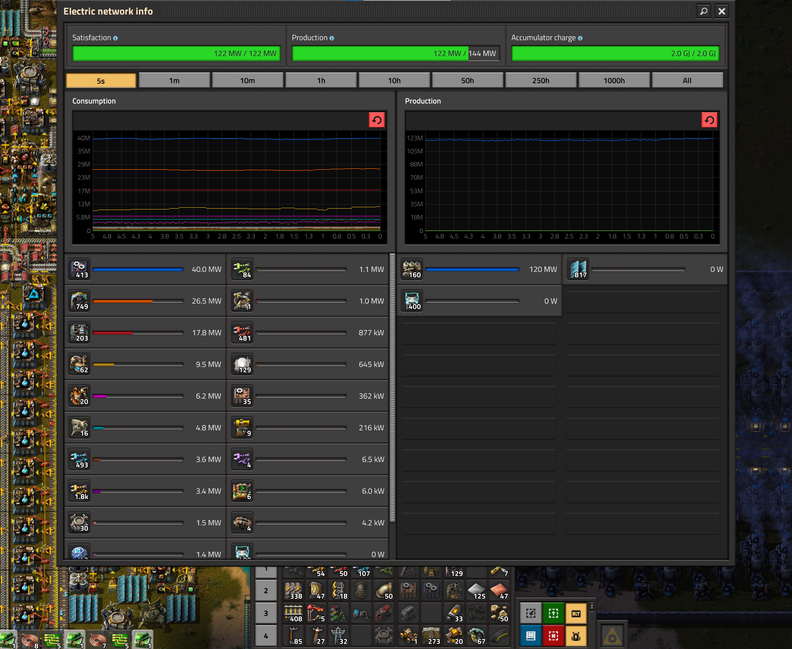
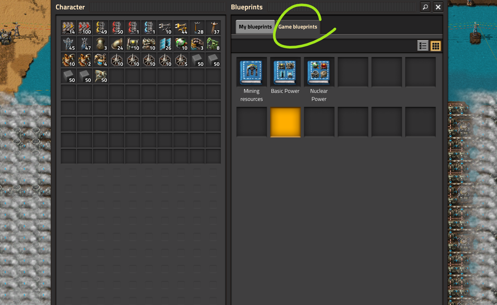

# Производство электроэнергии

Игра в Factorio делится на два этапа. Первый - *космический спутник для маленьких своими руками из палок и чего-то там за 8 часов*, второй - *мы верим, друзья, в корованы ракет* (тут не опечатка, именно *корованы*, а не то что вы там себе понапридумывали).

## Космический спутник своими руками

Производство энергии на начальном этапе игры заключаются в строительстве достаточного количества бойлеров (`Boiler`), паровых двигателей (`Steam engine`) и снабжение их углём не забывая про насосы (`Offshore pump`) подающие воду в бойлеры из ближайших луж. По мере возможностей и без особого спеха производим солнечные панели и устанавливаем их в пустых участках разрастающейся базы. Одним конвейером (`Transport belt`) угля можно питать 34 паровых двигателя, что даёт (аж?) 61.2 мегаватт энергии. Этого достаточно, чтобы пережить продвинутую переработку нефти (`Advanced oil processing`) и даже до начала строительства дронстанций (`Roboport`).

Начинайте производить твердое топливо (`Solid fuel`) как можно скорее, сразу после продвинутой переработки нефти добавляйте бойлеры на твердом топливе и паровые двигатели в процесс производства энергии. Это желательно сделать до запуска дронов, иначе можно попасть в блэкаут по части электроснабжения, когда дроны начнут возводить оставшуюся часть базы (надеюсь вы играете по заготовленным чертежам, или нет?). Можно хапнуть проблем с электроснабжением и раньше, в зависимости от того как вы строите.

По мере возможностей производите аккумуляторные блоки и устанавливайте их так же как и солнечные панели, в пустых участках. Начинать их производство нужно примерно вместе с фиолетовой наукой (`Production science pack`), после желтой науки (`Utility science pack`). Да, жёлтая наука должна быть открыта перед фиолетовой и производство дронов мы запускаем как можно раньше.

Если имеются проблемы с производством твёрдого топлива из нефти, то после открытия фиолетовой науки (`Production science pack`) можно открыть сжижение угля (`Coal liquefaction`), но одной электростанции из 40 бойлеров на твердом топливе в дополнение к угольной, обычно хватает для снабжения базы из 45 научных пакетов в минуту и запуска первого спутника, нефти для производства нужного твёрдого топлива обычно тоже. Также, можно выделить какое-то пространство рядом с базой и размещать солнечные панели и аккумуляторные блоки уже большими группами.

[Расчёты по базе на 45 научных пакетов в минуту](https://kirkmcdonald.github.io/calc.html#zip=bVDbagQxCP2bPCVld7vTpQP5GOs4ray5YMzD/n0TaAudFkU8F1HcwCCew4hXpzVeHc6SOMeL27tmQIrNiCR8IfdGYnGHZsEUcqtFLUzOsVFqEbqVBMYlh4ZMGSlUwPu6r4uX8s7NGI/Ki8cPSowgR+V88d1Y2B5H5ebT5EH/KIuvWraO/91w82109JvW9bp4BZZhOD0tHhB76gJWdJ7gWxHQYc0k35i38Y8B5+jJpbFOqEUteCcbTrW1Pv/kJw==). Расчётные данные потребления электроэнергии сходятся с экспериментом:

## Корованы ракет

На этом этапе нужно постепенно переходить на солнечную энергию, переводя паровые электростанции в резерв. Также стоит освоить добычу урановой руды (`Uranium ore`) и готовиться производить урановые топливные элементы (`Uranium fuel cell`) для ядерных реакторов (`Nuclear reactor`) через очень долгий процесс обогащения Коварекса (`Kovarex enrichment process`). Ядерные электростанции стоит рассматривать как резервные, в помощь к большим солнечно-аккумуляторным полям.

Можно вообще отказаться от ядерных электростанций, многие так и поступают. Солнечные панели и аккумуляторные блоки в количествах от милльёна и больше хватит всем и на всё. Некоторым хватает и ста тыщъ.

Альтернативно, можно пойти путём полного перехода на ядерную энергию, но в таком случае затруднительно контролировать грамотный расход урановых топливных элементов.

::: tip Это интересно:
[Таблицы расчётов - Basic Power](https://factoriocheatsheet.com/#basic-power)

[Таблицы расчётов - Nuclear Power](https://factoriocheatsheet.com/#nuclear-power)

[Кое-что ещё, но не очень много](https://wiki.factorio.com/Power_production)
:::

И вот вам [сохранёнка со всеми няшками](../../saves/AwesomeFactorio%20-%20Power%20Production.zip), чертежи в книге игры, разбор полётов [в этом вашем тубе](https://www.youtube.com/watch?v=RQ80eZAnZ1Q&list=PLvB0qwWjZb4ILjgq3RQfSdaBsdfC877kL).

