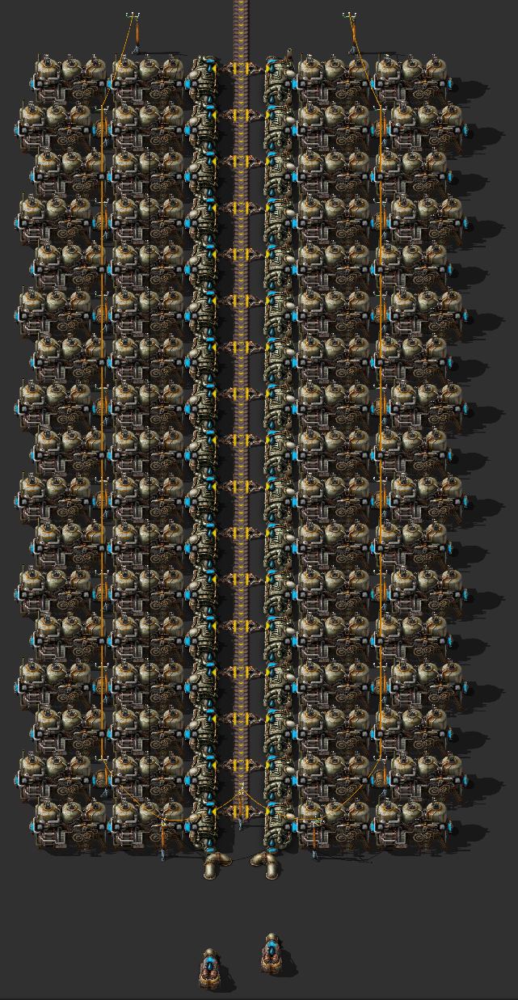

# Основы производства энергии

Производство энергии на начальном этапе игры заключаются в строительстве достаточного количества насосов (`Offshore pump`), бойлеров (`Boiler`), паровых двигателей (`Steam engine`) и снабжение их углём. По мере возможностей производим солнечные панели и устанавливаем их в пустых участках разрастающейся базы. Одним конвейером угля можно питать 34 паровых двигателя, что даёт максимум 61.2MW энергии. Этого достаточно, чтобы дожить до переработки нефти (`Advanced oil processing (research)`) и даже до начала строительства дронстанций (`Roboport`). Начинайте производить твердое топливо (`Solid fuel`) как можно скорее и добавляйте паровые двигатели на твердом топливе в процесс производства энергии. По мере возможностей производите аккумуляторные блоки и устанавливайте их так же как и солнечные панели. Если имеются проблемы с производством твёрдого топлива из нефти, то после открытия фиолетовой науки (`Production science pack`) можно открыть сжижение угля (`Coal liquefaction`). В это же время можно выделить какое-то пространство рядом с базой и размещать солнечные панели и аккумуляторные блоки там. После запуска спутника нужно освоить добычу урановой руды (`Uranium ore`) и готовиться производить урановые топливные элементы (`Uranium fuel cell`) для ядерных реакторов (`Nuclear reactor`) через очень долгий процесс обогащения Коварекса (`Kovarex enrichment process`). [Больше данных](https://wiki.factorio.com/Power_production){:target="_blank"}.

## Паровая энергия

Действует простая формула: 1 насос способен залить водой 20 бойлеров, каждый бойлер производит пар ровно на 2 паровых двигателя, каждый паровой двигатель производит 900kW. То есть, на одном насосе можно разместить до 40 паровых двигателей и всё это выдаёт 36MW максимум. Такую конструкцию, из одного насоса, 20 бойлеров и 40 паровых двигателей удобно размещать с одной стороны конвейера, на котором подаётся уголь. Но нужно помнить, что полностью загруженный конвейер угля способен питать только 34 бойлера, то есть разместить 40 бойлеров по обеим сторонам конвейера не получиться, если только не использовать быстрый конвейер (`Fast transport belt`) или экспресс-конвейер (`Express transport belt`), но в начале игры это расточительно.

Blueprint
<pre>
0eNqdXF1P40gQ/CsnPyer+eyZ4W/c4wmdYNfLWgpO5IS7Qyv++zkgkUDapLoeeADhStM91VM9U/h3d7956nfTMB66m9/d8H077rubv353++FhvNscf3Z43vXdTTcc+sdu1Y13j8fvtj9/7n9tp369e3rcdS+rbhh/9P91N/5ldfXZ++2w6aezhwLw0P7Q3z2u+/FhGPuzRyPw6GG6G/e77XRY3/ebw9nD6eV21fXjYTgM/dtf/frN89/j0+P9HOGNX8JYdbvtfn5sOx4/dYbKOX7Lq+55Bo3tW54/48cw9d/ffiMdg/wEHRjo5BHoSEE7BDqd6vF4t9ms+83829Pwfb3bbnoFP8k7fnzFH/vh4df99mk65ju0W+UzMhV+QMIXCjoi0MWYGXFfZSZGLTNVZ4OS9vAOnj8HHxTgBgMXG7B3n1mvZNovIYqGSHHyEluroT+R8v5pGvtpPYz7fjroYZ9ynKBUcLRMUOAJSLOYCpctqUjL4ao1FHS95WZcbwVFlmRExsnn35ErhMywD0IOFvZVpHLBcwwpULjcnlig7ZZjn0DYFvZhhSPZV6AaMuzDwsbZl43IJ/bthp3KjfQBUcNoVvFygmyXW3Ra5axt0tFRKw0SjZHb/CqEHa6lWMK1FMdoVUHhqxSXVVYVYkx2IZQ9ss5itvdiEFnwXnyJqPE4FmYxZGyEqFSfzw5KRaMCxwYUh/dirHDJU734MlythinYezEYdrQrIRA52ZVQhiRyYtiHIVvYB2nYxLEPmiUTyb4IpYJjHzRfZwv7oMJlkn0RqWFm2IeFHe1KCEROuBJ6RdQwMq2EctaOcVbVqyc51HlLhmb1zPEPGqdzxaXQYo4bLYW0HM/KqqpyUxyhhaBxTDzRjTHkYOjG0Ewj1HiXodFREteNBUoFddqZoblUxNCNscIVrhsLVMNKdGMs7EZoIQi5OLsWEkgkF4J9ILKBfQKp2BI5hjQo3EQxBJqnC8c+aJ4uBvaBhSPZ16AaEuwDw252LYQhV4droVdEDcPTWkj85T49Syvvinp5Q51uCjT1Vmr7E+gooCZcDC0mOdNiSE1yW3mvKs4qdjUk0NhUC9GPMeRq6MfQXFMb1Y8lQHeF1PmmQPNjo843BRqqWzD0Y6hwLVL9+DIVWg1bIvoxFna2qyEQWQg1BMnkxrAPQ7awD9KxjWQfeKHO0Q+7RnYc/7DLdWchoGDJIBmIOQ0cQ0Ew8ExoIhBaDKJI9P16ljC8KiqXG/YssrxuafGuUkuuYEuOOusUaLr23hmE0VKiveeVkZboWX5GVX56HwhpBE1o3keiO4PQydCeG2YgooY+adiiEK75Y04RTx16SsVCr1wzrVjWm6H7Y2sjOKI/g9Ce0EggdLCLpBIwaIKHKLSBhwUSuN5mcnmnSvFYwNTdQ/GYT5DiYXEYeMWZglavUdQukA/BR4KHYODR23USCh1wnfQKqYJEWicVxfZ71F1e97z4SJ2DFmg29pHaE0vAwAUXSsuZLrRQUjM9Cy8vuiSNhM+6YNNbJLyeIHQymD0LNgAlahws2DiYOLN1wczWiToRLaDbOnHtFDNHn7lgrvd/cG0Qlk8UmnBco9CE5bpgQjoxPMSgs4WHmHbOnOu6FCxg6mKiYBN45niITeCZ5GHBsm7hIbg2GB6C0IT3GoU2mK/LgjPYZ959XRRr8FF5ed0R44U6Ii3YgC/cnoiN4GLwYC9mWngTtp7pWZNWXZMKYcSu2PwmhBcUhTaYQSs2Agk1EFZs2hTODlodlg3qjLRis+yZP8bSoStkO/FnHpmrHRpcG4WwhKLQhCMbhSYs2RUT0oXhIQht4SGmnW0WmRNVIhYwdVdRsRG8cDzERvBK8hCyG/hq4SG2NirDQxCa8Gaj0AZzdl0wDvvKu7Or4hw+Kq+gu2V8pQ5JKzbgV25PxEbwarBoL2ea92irmZ6VV/C6Jm2ETbti81sjnKIotMEqWrGpqlEDYcWmzcZZtSt2s96oQ9KKzbJNuA4tWNaLoUODa4MwjKLQhF8bgw6OMGw3h0ETPEShDTxskHYOjuMhNMcGR91VVOzFOY67N6wNS7XBto1Wj/Nt14YVkuAhGjjh3AahvcG63RZcxcHz3u2m2IqPyisEuVU/ijokbdCAH7hXwzSHgRv828uZ5g3ceqZnTRq9nmnCwt0itugIFykKbbCRtoi9aoXzkbaAvWvFGSt6tvC0V3kFWaxooI5MGzTZhmBwlYK1DJyrtEG2lxAIVykaOOHsRqHF2mrr+ydo/zI8L7+FoTScmWsWGlb2H7BVkI/z4fqwXT9M26fxx9fcyVgJmwE8LYOrmY5Xd8acr/750boz5q/L5Y87o1PL9clH83UyToWTpcijAS5fh0tEdNlh+/aZa+bj+zC/CBXGFiIP2WGa4MxMczXwU1KUhny7envX5s3Za0RX3eZu7u7zz/48NqE/dtt/XzvnP/20f1v21afSQpE8f/ny8vI/2lf6cw==
</pre>

Детальный разбор добычи паровой энергии смотрите на YouTube канале.

{:target="_blank"}

## Солнечная энергия

