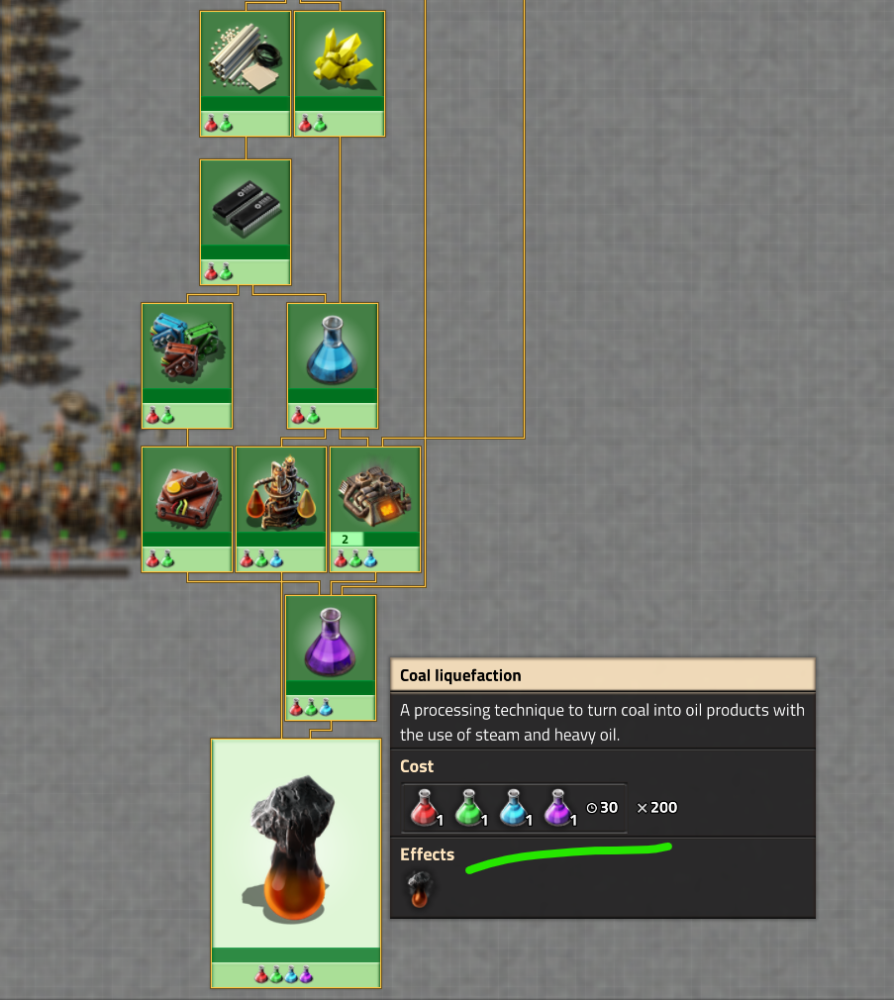

Первая паровая электростанция всегда строиться на угле, потому как ничего лучшего на момент начала игры не предвидится. Эта электростанция доживает до запуска первого спутника, а потом либо [переводится в резерв ](/PowerProduction/BackupSteamPower) либо сносится нафиг. А что, если [уголёк заменить на твёрдое топливо](/PowerProduction/EfficientFuelForSteamPower#%D1%83%D0%B3%D0%BE%D0%BB%D1%91%D0%BA-coal-%D1%81%D1%83%D0%BF%D1%80%D0%BE%D1%82%D0%B8%D0%B2-%D1%82%D0%B2%D1%91%D1%80%D0%B4%D0%BE%D0%B3%D0%BE-%D1%82%D0%BE%D0%BF%D0%BB%D0%B8%D0%B2%D0%B0-solid-fuel)?

<!-- truncate -->

Выходные превращаются вот в такой чертёж. `1` - это классическая угольная паровая электростация. `2` - переведённая угольная электростанция на твёрдое топливо при помощи технологии coal liquefaction (cжижение угля).


Простая угольная электростанция выдаёт около 58-59 мегаватт энергии (61.2 мегаватта полной мощности минус питание манипуляторов). При этом потребляет полный конвейер угля (transport belt). Переведённая на твёрдое топливо электростанция вадаёт примерно 65 мегаватт энергии и потребляет только половину конвейера угля. При этом можно накапливать постоянно `light oil` (дизельное топливо), по малости правда. Профит нагляден, чертёж прилагается.

``` blueprint
0eNrNXV1vG7kO/S9+jhcjUp99uH/koiicZJIM1rG9Y7u4xSL//Y6Trj1pROuQWLR92W6+jjnSoURSR5y/F7frY78bh81h8envxXC33ewXn/7792I/PG5W69P3Dt92/eLTYjj0z4ubxWb1fPpqf+hXz8t+8zhs+sXLzWLY3Pf/W3xyL59vFv3mMByG/g3n9YtvXzbH59t+nH7hjLB9eNg/bcd+uTs+7ybg3XY//dV2c/rICWnp8x/hZvFt8cn/EV5ebj4gEY7kryPx5ameV+v1sl/3d4dxuFvutuu+ghf4O16Y8Ka/7YfHp9vtcTw9sKMbSp8rH+LPH7Ibdv215w11K8M7gOVhu3wct8fNfQ0qvTPwfhinB3r9eawARwVwkICpApyaj+yvP3JWTgyXqxPDXJuYUud0Zdr/GdWEPLzrYFxS4V486HY7rKdvVca11PFqs+9IOcg+vjP33SDzTa4NsWPAZq8YA4+Ore9UYxtQXA4q3Ahz4Z9FwHUQcFKTDATOMMs+AlZpdnGzw7ja7Hfb8bC87deHawwrwsrfGbCygDVzp+O46cflsNn346H+xGkG1hxDIpj12KQQa2wNkq216SG9R4E24y7ldcCxtbuEMAesQSTtxn9GdLW1L1T3F8oGtr5+QA2sWOj63dzGiLLFraSxZWfh6kdDa2Rlak09p5Z52piP05Wpzzeh1KaevTq2cAxNVdCv+xhwxNd9huYqWUhFwqyZXIkFsIIvz9DY+U6/hmLATh2WgMCkj0siBMx6fmLAHudnRPjpg2lB9ZCx0UJXIUn1JkcSEiufTauzh0ZU4VfQnAeDX2HATh+bYMCExyZRyPbZHJtU8rIp0knVzCx4C6skm22+BKVQweRLSTA0megP5dMh48GJNI7FHJzUcvIpKfe1uY+dPjopyFxFp1/9MWDCV/8Clb7YwiohlYwmXxJy3BjwVRQbu6hfRTHgpI9OMOCsjk6IIOCi5icGnDqYnx8Ba/xMpuoEQQl0IgNdScinksWRSEhyk4e5D85LsKz3BBW2kt6vQKOTOjoBgbM1tCD+uL1MgYrrQm1/SQWOgkhI+HJn4j+U/GRnoayQTGaTM0lPbarzEZSPZ2+NLaqTX26cc7XJzwEOg8RhiOr4hKBzqayvmoPAeNWcoKO5bKmak5BBFkt9j4QMsjh8jYbGrpB+HcWAWR2fgMBeH59ABwdFX90DgfHqHkHHBiWZ1mcoiS6WYh8JKVUxOZKQPrquMy3QUEHKdQrPythJtMG1QGTWxyggsseDhyxNUzAHOuXjXjeFTY6re53rLMUJ2WybUxVsXE1eVSRTi8kRoNzczRQUzRBCGsuZWkIb7lQoMAVPjqvqHudIHayww/Qe+lo6iowX09lhUxYM7OJOmjyLW7GT0BK8rqLjl9XrKopc1DELiEydOmhhjyHrq34oMl72Y49pntiyxDJh5lrqgCwkQY5MLsUSWrQs2EzYqCo8DJx5g4eByEUduYDI3MGRCwuZmmNnjVy4Jn2cAiEX6vsWWwoXst02vwrYwJr8KkimmmqCDKXtjiMcushjmayhS5UDUyTkItc5kPWxC6Z7ZH2lHUT2eKmdMR2st9QDWcg3nTf5lZRwelxAi46fXvCHIutFtCiyXkbrMbWr11cEUWS8JOgxIa03SQAZS7uDpUbIUvYVTC4lJZszVYVmxYYKWS7gHgbOfNB7GIqs19SiyLio1ktZWzCran1FWnkKhVyu71vBUsuQ7Tb5lcfSrmjxKy+lstEkrvVYDh9xda04ltEsr61zIE0cqCpsXdRLbD1jU6avwqPIeBneMzZnFnGgl1LOaPIrKeWMuB4QHL+kFwSiyHqlLYqsl9r6iCHr64MoMl4f9NjZRjIpBD2WeCdLudBL6VcyuZSUbSaT4NZj1ayk8DBs5rPBw0BkveYWRcZFt17K2rJZdesrystTKESuq+5b2VLMkO22+RWWdmWTX0mpbDZpbz2Ww2dcfCuPpVl9W+XAFAqRi1UOFL0A12OnfEVfi0eR8Vq8x475ikU66KWUs5j8Sko5C67CRcdPLxdEkfU6XBQ54x0CWOZTffaLOi4K0DEMdfoL+CgyfgU/QCcn1FmqhUG61tpZPCpIN05nSgzF3hKwS7wd7mDo5JhOuEKHzVNSey9qdlbHRSgyLsMNJF2S76xxUaioRk9hFnF1TyRnKRkGluwmE3ehlI6cyc3EIfYm3kL1AXK4Glc2MFrjojoHyg15qnMgqeOiELApy/o9AUQu+J4AnSGSqctFEBJQIpNfSa2XFK0twPEj1q+sILJXx0UoctDHLmDnkKjnKYiccJ5inUNM/S1CkphlqsKHiPVPMbmUkCgS40JdcHLYdMIVoNobscHDQLO9PnYBkWEPO90luyBXsaI5hqlIQU8hEaXqvSfihEdcorXZ5AcFG1aLGj5I3Zi8yaukB/ems61QsC5HZI5hqhyIN5TrMcxMsdGMuMSh0J9tReg4krz+bAtFxs+2osPmzFKIj1I26y27VZQybUWvC3D8QqfoxijPTXUkZ3IMvI6D2j0/39qOq8cJfrX5s4b8z+4S3/LXu+1m8wa9P/2KO/3ncez7zbx96HB/+oz08vmlOg8z9caV1YKC+Ey+iuohVN/i3Eyvsd4+DvvDtN7cPfX7w3I1ffzXfrkbt1+H+4bNEgdnmo0f0Mf+r+P0b8NqEXe2i9X7qp733Ehv83gYt+svt/3T6uuwHU+/dTeMd8fh8GX62f35Tx+GcX/48qG/7MP6ONz/0GB28Ya7n6h0eL131Z2+ft6txtXh9AmL/yxedBQikUL6bgPRY66hF0GCyBEXQUboKJGiJU2MUvklmsovEatrmXp3RKm6ET3crFZ+XJOkOGIl4qhp08tzUwHspNgYiohdn6b2kVxuDmzB7aOse/akLW1SfD9xPzRa4hsO1XY7NBOXrPb7/vl2PWwel8+ru6dpNVjS1UX67VmmJxle18r+eXf4tnzqV1+/LSfHX96uxrFfTwinJt2va2D/8HB67K+TBcvn7f1xepRpfqpmkWJwSTf5SXueTt3Vwe3qA9v03ctOJVEsme+KxoraXqpuJ1xfGaXam0mYEqW6YDLlmRErkCVLnik+eO7wJVp63OwsqyhWsM1kbVf+fXN+TyF/alie6x1lGV9TxZHwOIY4I4qe9KzkTm5foWmSOyeLfViklDWH4kHJpOaR3SU9k569KBJJZl3cWRxun8Sdoth22Om4U9r+0TXHz1vsw7hTFH5DRced0vQbavpNUfgNJSV3Mm6fyB1NPBhU3OGuuctQa5fhzuEBifROkk4TlrmmRaZkKUloFpFVjBKa5s0mvol24f/dU/883K3Wy936VD+4VkD7qIScRdv77Xq4Xz4c+/XyYdw+L3f9qdDRH5+Xj6t9M+iePnac/v/H77u69Qm3/rJjpffZwSUvuBtXd39OWca/bGRWGOl+lZEFN/KyRvxkI9stTuLZtCI12m8uNtE3MZra6chNjOamG6mJ0QxKo2tiNLUusWtitPO00sRonwLmJkZzs7yc/IgYbf1XbGEQ3tNAxmjyNDR5Sm2Nf5On1ORpaPKU2t2pmjylJk9Dk6ftl6D4Jk9JEez5d4wFXtQxK6rv1sNBKCvEN8w3TcDDsD792qfFff9a+h+Pr5/wunhvXv9+ezzsjocvu3HYjtPHTb86TonzaWEfNtUfVE0z1SakQWRtFdGH9yP5Q8vuat7P7CyRUkEOu3imPblWATqjQgIOZrbUWwqG3S7ZNx2ZNbGn05G/3QTENx28LSW5YGQJw/wavRo3T2WuE9158lpP9dfecLGcJ0ByM/adpaaDMco7vOYkzZgnS10IYxQgKmluod5b7MO83QfcPomtXi0z5usr6ek85sZzV39BU7JUyUCmZksFCWRqwStcEhM0UhMqOqaGdgWkGfwGstiHMTUwbp/E1KBtpU3p2rqavq+p9R6jHIKlJocxNURLPQ1jakh4PU1kQrtm2Nzpg6ZmyDo2xQ63T2LTTHnRrFeck/Hk3tcrfqxUrU/h76l+8e+WLaLCM88FjCS9im8m5Gg/efeLn9zjtl7eF/yLbA0KW/0vtlVRtT2n1r/KVkWN9pww/ypbLXJX2VMtOXMSZJGcOsOLx2W02Zvlh/Vy7B+GTT9+u5YVph9UNXfbaSbXw1/H/mH1ttz/q3ORmsUr31wrE8MaCBnDG3Ly1GFv+wxwTi7bh+fNMkZC2XDO6H42G7IhR07QrWpuv3nnrO0QRzBb8myQJRnPs2X7CM41ZQyGWdL9GpZkb8hPQZYAr+hp+mqOhhwXZUmCc1zZvgzneTJGQVlyzmR+Mks0Wh9KOpa0tT7U9NVCcA4oYzCcY8kY0IWO+C4+qOIECMc1cSKCcz4mlHEShOObOBnCaY9Pgc4SWs/l5y1crhwfpbnPWY6P1v1D9fTo9ftVwyzXJBJJj0k6WgbkQMdrJD8XbOzF1jMB0HN/Pxyfm7WvS+JekUt7qlZnfaf0M3BgFP3MLtjgwCjE2ZchAbGzbrUAR0OR051FD6DFTnEz+GI3iK1wwUslBsRWtGM6iydQbNat1dgsOoUi7yzVQC1WvIHkYjeIHXU7DjgaCi88C0ZQixUVlaBcVp3GF5Wrx0zCAy7ZwV1bsqctwPvqUYXX9JoJygWWSBdaYIQhjTxWuVCpXgekXGBNLwdKgkjYk6bR57sltYpmuacko2VLsRCc/WIVSNQ843Tk7LkTvUMtFbrk9bVPe5NhSMeGXv0moUt+WPs0+Sjds0WwDs4Qs+Vw7IOo2//0Arxnbznc+i0sD5ajrt/C8mg5+PotLE+WY7DfwvJsORT7LSw3HWoJV2O8qRlSihKas8pKU6qm2ZJkz89ka+vt5nH5tNrc9/dLRApamcXqJzB+/CWOB96lQcYI6idl5ZO2D7C4aWUy9AFKUCc475tFce+aPFfIaby8r1XtCx1unzR+MwEaOMucdbOskaddsKFGhX4mT0OtT0rrNQdLUcSuW493m5XnL1rsw/jflqRxaPE/aI5vvZL/BbdPGr+ZJA1lEOkYFC3dxED+R/VuxE5pveJiAnc6/rd7CXFz/YrBYh/G/9i+Il5a/Ne0DKKs43+7ZdDFPnH8ipZBFHUM0siXKOr4n9S7FwWl9Zps3ev43xYpUXP9Anr6cIujbTESNeOwthiJqImR4HYAMkZG+yvGf7iWO2y2Cnx/OAniaq8RC10EwRlialssdKn4iPYRfDdZxmD4brKM4eG7yTJGgO8myxgRvpssYyT4brKMkeG7yTIG/n4LEaN08N1kGcPBd5NlDILvJssYDN9NljE8fDdZxgjw3WQZw/LqMRnNdCKRJTSNtPodA9trctHUpLwKO3SaChUrsTW6GFJia96R5JTYmvO/TomtOP/josRWnP9xVmIrfI+TElvhiRyV2Aq/5KDEVvglK/1SI5ZhpV9qxDKs9EuNWIaVfql5xRIr/VIjmSGlX2okM6T0S6fwS1L6pUY4Q0q/1AhnSOmXznKGk4WrRIE6RdeS71mW1JOkim9Rj2aWrLW8OzCThGZpFJeDhGZpFJdfNSCf3w75Tn1p18d+GtfXo8Sv/bh/o0F2U+ZKKU/xbizx5eX/RBje/A==
```

Вот правда воспользоваться таким подходом может статься не рациональным. Потребуется исследование `сoal liquefaction` (сжижение угля), которое не требуется для запуска первого спутника и которое не совсем дешевое. Но попытаться можно.



 [Статья тут](/PowerProduction/UpgradingSteamPower).
