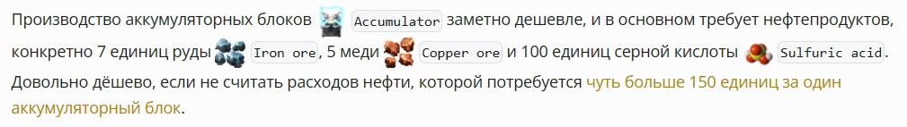

Захотел автоматизировать генерацию иконок и названий для терминов, таких как предметы, исследования и всего прочего из *Factorio*. Оказалось, что не всё так просто и пришлось изрядно помучиться или руки у меня кривые...

<!-- truncate -->

Теперь, чтобы сгенерировать такой вот текст:

> 

достаточно просто указать как `<code>` термин из *Factorio*, а *remark* плагин сделают всё автоматически. А уже имеющиеся иконки, которые я вставлял руками везде, как сами знаете кто на галерах, не изменяются.

Чтобы написать вот такой простой код, неподготовленному анонимусу пришлось лишиться много нервных клеток:

```javascript
import { Plugin } from 'unified';
import { visit } from 'unist-util-visit';
import path from 'path';

const IconNames: string[] = [
  'Accumulator',
  'Advanced circuit',
  ...
];

const plugin: Plugin<[Options]> = (options) => {
  async function transformer(tree, vfile) {

    const visited = new Set();

    function checkNode(node): boolean {
      if (visited.has(node) || node.type !== "inlineCode" || !node.value) return false;
      return IconNames.includes(node.value);
    }

    visit(tree, checkNode, (node, index, parent) => {

      if (!parent) return;
      visited.add(node);

      // workaround for compatibility
      if (index > 0 && parent.children[index - 1].type === 'emphasis' && parent.children[index - 1].children.length > 0 && parent.children[index - 1].children[0].type === 'image') return;
      if (index > 1 && parent.children[index - 1].type === 'text' && parent.children[index - 1].value === ' ' && parent.children[index - 2].type === 'emphasis' && parent.children[index - 2].children.length > 0 && parent.children[index - 2].children[0].type === 'image') return;

      let iconName = node.value;
      let rootDir = path.relative(vfile.dirname, 'factorio_icons');
      let iconUrl = `${rootDir}/${iconName.toLowerCase().replace(/ /g, "-")}.png`;

      let iconNode = {
        type: "emphasis",
        children: [
          {
            type: "image",
            alt: iconName,
            url: iconUrl
          }
        ]
      };

      let spaceNode = {
        type: "text",
        value: " "
      };

      parent.children.splice(index, 0, iconNode, spaceNode);
    });
  }
  return transformer;
}

export default plugin;

```

Было время, лет надцать назад, когда не нужно было знать ни жабаШкрипт нэ сиКвуЭл, всё делал компуктер сам. Кидаешь какой-нить вебФормс на табло от мелкософта и гемороя не ведаешь. Раньше деревья были выше и трава зеленей, а нынче всё усложнилось.
