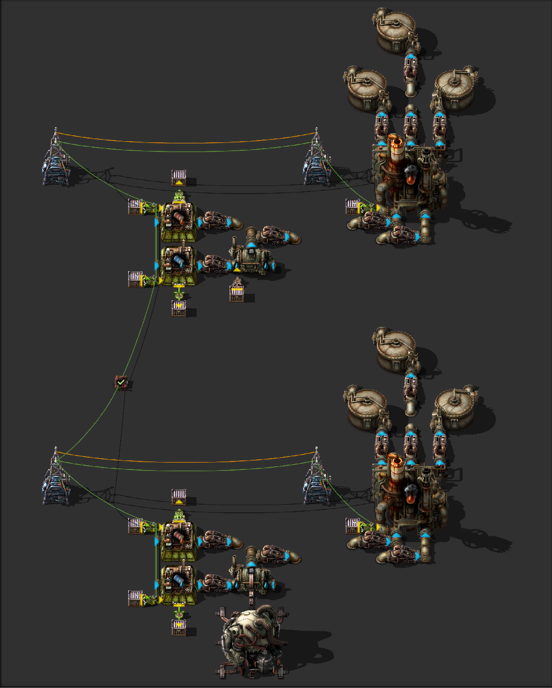
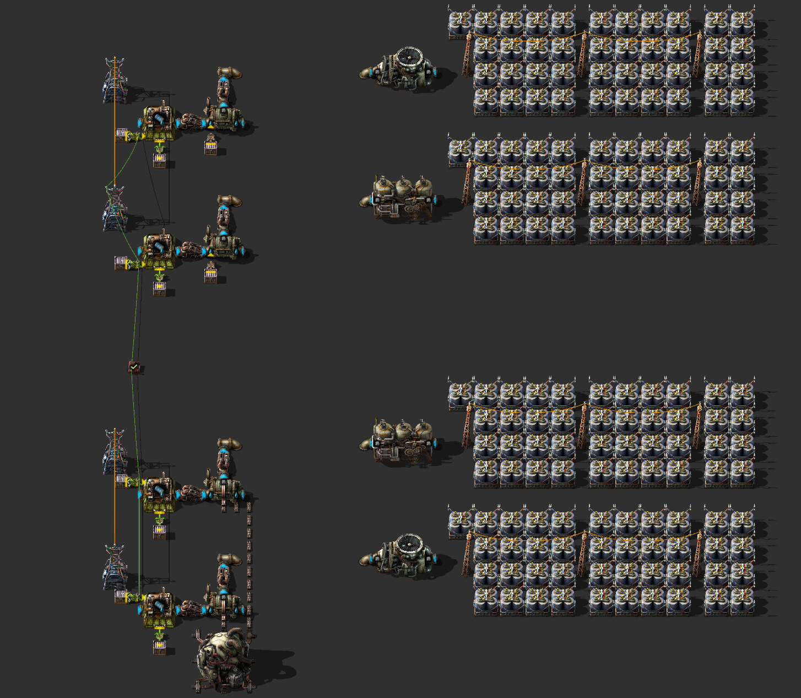

Стало интересно, есть ли какая-то зависимость от того, произведён пар `Steam` в бойлерах `Boiler` или в теплообменниках `Heat exchanger` и в чём разница между этими двумя типами пара.

<!-- truncate -->

Напомню, что есть разница между паром из бойлера при температуре 165 градусов (тёплый пар) и из теплообменника температурой аж 500 (горячий пар). Пар можно расходовать двумя способами: *сжижать уголь* и *добывать электричество*.

## Сжижение угля

Предлагается следующая схема. Задваиваем производство сжижения угля одним нефтеперерабатывающим заводом. Каждый заводик получает пар, который производится либо бойлером, либо теплообменником. Количество пара регулируем подачей одинакового количества воды расфасовывая одинаковое количество бочек. Также одинаковым количеством бочек мазута инициируем процесс сжижения угля. Посередине конструкции находиться постоянный комбинатор запускающий тестирование.



Результат тестирования удивляет, не очень. Как и ожидалось, вне зависимости от температуры пара, производится одинаковое количество разных жидкостей и даже тратиться одинаковое количество угля. То есть, **рецепт сжижения угля зависит только от количества пара, а не от его температуры**. Чертёж, чтоб поиграться:

```blueprint
0eNrVWuuuqjgYfZf+lgm9Qncy8yKTHYNYtTlYnAJ7jtnx3afgGfHyVVqcTOIfoyirq9+9C7/RqurUwWrToo9vpMvaNOjjz2/U6K0pqv5aezwo9IF0q/ZogUyx7z/Vukqs2mij7BGdFkibtfqJPvBpMXlr09a22KqkLcyPq1vJ6XOBlGl1q9WZwvDhuDTdfqWsw4YRFuhQN+6m2vQrOqAkz37jC3R075h7d+op3UGRYCh5gaIwFL1AHbr9AYIQFwgQgAVzoTdcFmitrSrPvyAAMB+Z6YNDrZOtrTuzfs7Rs00xC4zc82QAdDZpwfwCiCFueYQLQAA5CcCeA+B0dGK3atpiuPkRB2N8hqG5s4vLNXM2TNP/APcvW6uUuY5+vXbw+GrN4YI4fToeyCi93a3qzvYJg/EnRA2HUZN0FrP0jhmhELMUZEbgavLMfzQbIsrFkx4qS1kXVVLpvzq1Kc4hBi1Er1JMqSopd6ppIfek5GYhCOs6XYvyR6JNo2zrvnoOJ0IyAfNgovyCzD1ERQxRdgN3Q1QM4dDaulqu1K740rXt7yu1LTvdLt136wvYRtumXT7U/y9t285dGRkNv+i3Vw4toO86ruq5FpT2H/aHwhZtvw76A51eikfK+3iE7DOWnaJp1H5VabNN9kW5c1GY0Al3MsBKl6BU+0N7THaq+DomfWSvCmtVBUbmZOnCaepbEqr5WIbXaZk/2Q7UNNPA6JTpVHASHEEz9dOETEDIZDWXUXg0PJHGceHd8wh70oawG889nb4G+0IYfBKDT2KIV9IXT6fv34Vz8ZPUJWP9WLkkB8NBjqYg4CYm01+KX/cHTXxEThn2ipFvnk0jUpPdoE1WEBqR9uPQF7Z3Op32WRQejQhSny3ZjH6eerD4vH6evncdEnf9nBFPYaIivJU+pD/5X22C72zyO4J3dFVhOutG42cuv2rmacioSfP4mZjkntCUs2ZiImE4Fjxn5JNQMzQD4plZ2Fhg/nVl4ty40mZwI7TVy7GFPJQcBkfcRlfObh4FJiDEul/xdZFjPt37ZtmvuCmqRsXknhudb3OP+4YCRuP1FII9Zmbhp3l32IQQeLyiQnBIT2CzVBDvTrNZaEHpzfJwUQVLkJ0M9wOMwNNwWcWDgCNllb5dhAc4I/cB/nAhA9QMTiA1g5M4nSWOKr9XgASDmIEKEKfxOgvmM3QWzuJ7CvZUW85n9RTMQrKDi/i5DHtmPJ7Nmsswfeu57CEeM+HpDTx/4aCGyX+js3AZPBw+Lgl1ApHO0VmA7UDYOFpn8QWnIHN0lkAT0FCdJRCPzdFZ3j2PfMcZwcN1lsG+EIYIP8J6MV6RSeXrMosYy4dL9DZRP8tdYbYTcgtOwb3IULkFB42DWRout2DPEJjhOXLLIz+okGRkjtwSuHcaKrcE4rGIWPXZcsbjE8+RNpv39CR/72KUeYpRlgW3T/kW0kp2V1Um09cXJjJ+4hUwVJ7OGng9jynzsayYrqxUYd3c7yb3+nndHIbxXjLo/7DxcfXXkAX6UrY5OzTHLJMky5mkQorT6R8kxiK9
```

Ваш ютуб:

[**](https://youtube.com/shorts/qDtrt17gSSw?feature=shared)

## Добыча мегаджоулей

А теперь протестируем производство энергии. Тут возможны уже четыре варианта, так как мы имеем два способа производства пара и два способа производства электричества, один из парового двигателя `Steam engine`, второй из паровой турбины `Steam turbine`. Производимую энергию складируем в аккумуляторные блоки и по собранному её количеству судим о том, зависимость от температуры пара.



И тут нас ждёт сурпрайз, не очень. Оказывается, что количество произведённой энергии будет отличаться только для случая `горячий пар - паровая турбина` и произведённое количество энергии будет выше чем во всех остальных случаях. То есть, **для производства энергии из пара стоит придерживаться соответствующих строений**, `бойлер - паравой двигатель` или `теплообменник - паровая турбина`. Паровой двигатель производит 900 киловатт, вне зависимости от температуры пара. Паровую турбину можно ставить и на тёплый пар, но больше электричества чем два паровых двигателя турбина не выдаст, а именно 1.8 мегаватт, как раз один бойлер. Чертёж, чтоб поиграться:

```blueprint
0eNrVWuuuqjgYfZf+lgm9Qncy8yKTHYNYtTlYnAJ7jtnx3afgGfHyVVqcTOIfoyirq9+9C7/RqurUwWrToo9vpMvaNOjjz2/U6K0pqv5aezwo9IF0q/ZogUyx7z/Vukqs2mij7BGdFkibtfqJPvBpMXlr09a22KqkLcyPq1vJ6XOBlGl1q9WZwvDhuDTdfqWsw4YRFuhQN+6m2vQrOqAkz37jC3R075h7d+op3UGRYCh5gaIwFL1AHbr9AYIQFwgQgAVzoTdcFmitrSrPvyAAMB+Z6YNDrZOtrTuzfs7Rs00xC4zc82QAdDZpwfwCiCFueYQLQAA5CcCeA+B0dGK3atpiuPkRB2N8hqG5s4vLNXM2TNP/APcvW6uUuY5+vXbw+GrN4YI4fToeyCi93a3qzvYJg/EnRA2HUZN0FrP0jhmhELMUZEbgavLMfzQbIsrFkx4qS1kXVVLpvzq1Kc4hBi1Er1JMqSopd6ppIfek5GYhCOs6XYvyR6JNo2zrvnoOJ0IyAfNgovyCzD1ERQxRdgN3Q1QM4dDaulqu1K740rXt7yu1LTvdLt136wvYRtumXT7U/y9t285dGRkNv+i3Vw4toO86ruq5FpT2H/aHwhZtvw76A51eikfK+3iE7DOWnaJp1H5VabNN9kW5c1GY0Al3MsBKl6BU+0N7THaq+DomfWSvCmtVBUbmZOnCaepbEqr5WIbXaZk/2Q7UNNPA6JTpVHASHEEz9dOETEDIZDWXUXg0PJHGceHd8wh70oawG889nb4G+0IYfBKDT2KIV9IXT6fv34Vz8ZPUJWP9WLkkB8NBjqYg4CYm01+KX/cHTXxEThn2ipFvnk0jUpPdoE1WEBqR9uPQF7Z3Op32WRQejQhSny3ZjH6eerD4vH6evncdEnf9nBFPYaIivJU+pD/5X22C72zyO4J3dFVhOutG42cuv2rmacioSfP4mZjkntCUs2ZiImE4Fjxn5JNQMzQD4plZ2Fhg/nVl4ty40mZwI7TVy7GFPJQcBkfcRlfObh4FJiDEul/xdZFjPt37ZtmvuCmqRsXknhudb3OP+4YCRuP1FII9Zmbhp3l32IQQeLyiQnBIT2CzVBDvTrNZaEHpzfJwUQVLkJ0M9wOMwNNwWcWDgCNllb5dhAc4I/cB/nAhA9QMTiA1g5M4nSWOKr9XgASDmIEKEKfxOgvmM3QWzuJ7CvZUW85n9RTMQrKDi/i5DHtmPJ7Nmsswfeu57CEeM+HpDTx/4aCGyX+js3AZPBw+Lgl1ApHO0VmA7UDYOFpn8QWnIHN0lkAT0FCdJRCPzdFZ3j2PfMcZwcN1lsG+EIYIP8J6MV6RSeXrMosYy4dL9DZRP8tdYbYTcgtOwb3IULkFB42DWRout2DPEJjhOXLLIz+okGRkjtwSuHcaKrcE4rGIWPXZcsbjE8+RNpv39CR/72KUeYpRlgW3T/kW0kp2V1Um09cXJjJ+4hUwVJ7OGng9jynzsayYrqxUYd3c7yb3+nndHIbxXjLo/7DxcfXXkAX6UrY5OzTHLJMky5mkQorT6R8kxiK9
```

Ваш ютуб:

[**](https://youtube.com/shorts/dhULdGCg3Ms?feature=share)

## На самом деле

Ответ был как бы очевиден и подробно [описан в WiKi](https://wiki.factorio.com/Steam), *ну а хули нам инженерам*, мы же мануалов не читаем.
