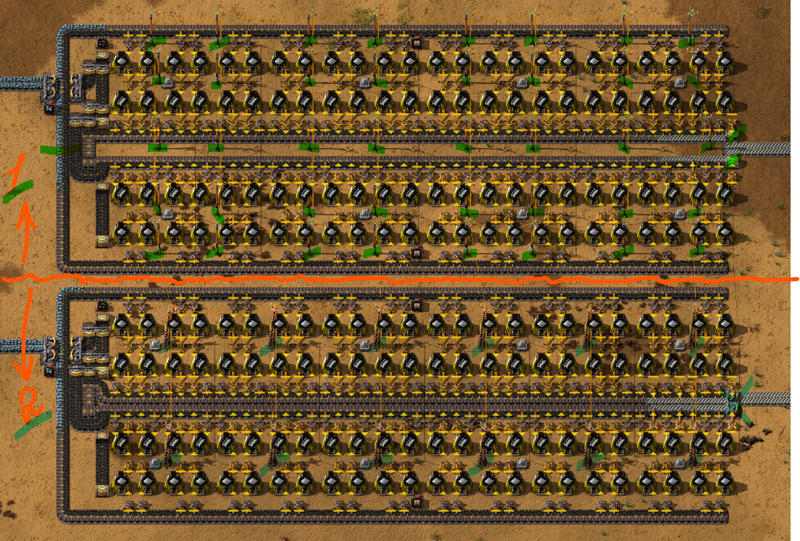

После публикации видеоролика о [плавке ресурсов в Factorio](http://www.youtube.com/watch?v=z7HcOThwafg) поступило предложение от [одного из зрителей](https://www.youtube.com/@Evgeny_Pilyavsky) о замене деревянных опор ЛЭП `Small electric pole` на средние `Medium electric pole`. Рассматриваю предложенный вариант исполнения и анализирую плюсы и минусы такого предложения.

<!-- truncate -->

Итак, в первые полчаса игры у нас возникает потребность построить кузницу, выплавляющую стальные балки `Steel plate` на каменных печах `Stone furnace`, вариант номер 1. Это наш обычный чертёж [рассмотренный в статье о плавке ресурсов](pathname:///RawResourcesProcessing). Такой же чертёж, номер 2, в котором деревянные опоры ЛЭП заменены на средние.

То есть, на первом чертеже имеется 40 деревянных опор ЛЭП, а на втором всего 12 средних опор ЛЭП. Также второй чертёж меньше на одну клетку по высоте, что плюс. Какие ещё плюсы имеются во втором варианте? Из-за того, что количество опор ЛЭП меньше, для его строительства придётся меньше кликать. Собственно, это все плюсы: меньше кликать и высота меньше.

Теперь про минусы. Естественно ресурсы, которые нужно потратить на строительство второго чертежа. Таблица разницы:

| Номер 1 | Стоимость в ресурсах | Номер 2 | Стоимость в ресурсах |
|:--|:--|:--|:--|
| 2 `Underground belt` | 17.5 `Iron ore` | 1 `Splitter` | 16 `Iron ore` 7.5 `Copper ore`|
| 3 `Belt` | 4.5 `Iron ore` |  |  |
| 40 `Small electric pole` | 20 `Wood` 20 `Copper ore` | 12 `Medium electric pole` | 144 `Iron ore` 24 `Copper ore` |
| **Итого:** | 22 `Iron ore` 20 `Copper ore` 20 `Wood` || 160 `Iron ore` 31.5 `Copper ore`|
| **Разница:** | 20 `Wood` || 138 `Iron ore` 11.5 `Copper ore`|

Если прировнять древесину к медной руде, то получается, что второй чертёж обойдётся дороже более чем на 100 единиц железной руды. По времени, которое необходимое потратить на выплавку и производство всех предметов, второй чертёж также не в плюсах (нудить с конкретными числами не буду).

Но самая главная проблема тут в том, что мы строим первую кузницу для выплавки стальных балок, другой такой кузница у нас нет, при этом не имеющиеся ещё стальные балки уже нужны для производства средних опор ЛЭП. Потребуется ручная выплавка стальных балок и туда-сюда труба шатал.

И под конец, для производства средних опор ЛЭП нужно исследование [Electric energy distribution 1](https://wiki.factorio.com/Electric_energy_distribution_1_(research)). Исследование это совсем недешевое, требует 120 красных `Automation science pack` и 120 зелёных `Logistic science pack` склянок, плюс 30 единиц времени на каждую пару склянок. Оно нам потребуется ближе к [первому выходу с базы](pathname:///HowToStartNewGame#первый-выход-с-базы), но никак не при строительстве кузницы. Бенефитов это исследование не даёт никаких, средние опоры ЛЭП до запуска первого спутника практически не нужны, всё можно сделать на более дешёвых, деревянных. Единственно, зачем нам нужно это исследование, чтобы протянуть большие опоры ЛЭП `Big electric pole` к первому месту добычи нефти. Но опять-таки, это исследование потребуется гораздо позже строительства кузницы, а пока имеющиеся ресурсы лучше пустить на другие исследования и производства.

**Итак, плохая ли это идея?** В принципе да. Но выглядит чертёж конечно красивей, многие игроки думаю оценят эту красоту. Но если играть по-нормальному, как задумали разработчики *Factorio*, в начале игры у нас марафон на запуск спутника за пять часов. Шучу, за семь с половиной. И поэтому распыляться на разные шалости не стоит. Наша задача строить быстро, из того что есть и на тот или иной момент игры и не ловить ворон ртом.
