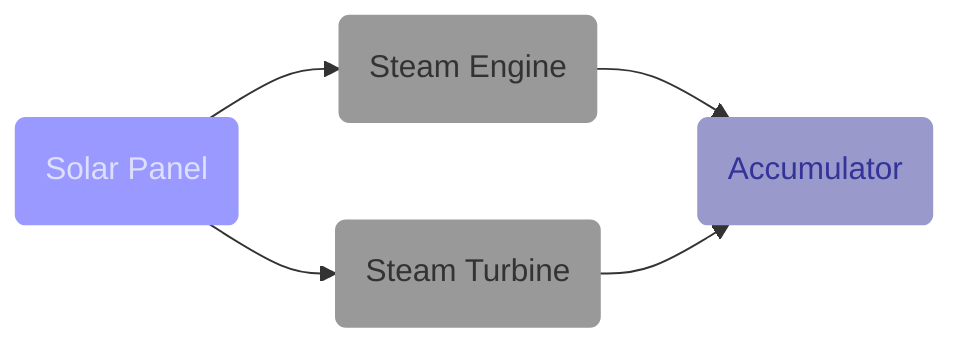

В очередной раз переработал статью посвященную переводу паровых и ядерных электростанций в резерв. И даже новый видеоролик на твойтуб выложил. Добавил подробнее описание простого решения отключения паровых электростанций, более похожее на костыли, или нет?

<!-- truncate -->

Добавил также описание того, как *Factorio* выбирает электричество из солнечных панелей, паровых агрегатов и аккумуляторных блоков. Добавил на сайт возможность создавать диаграммы, выглядит вот так:

Читайте, [статья тут](pathname:///PowerProduction/BackupSteamPower). Видеоролик:

[**](http://www.youtube.com/watch?v=Nfm9Njib4tE)
