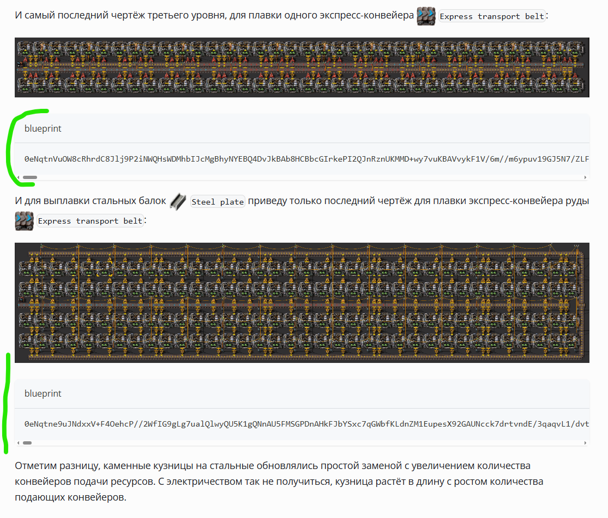

В каждой статье сайта присутствует множество чертежей и зачастую их трудно увидеть в общем потоке текста. Менять отображение из однострочного текста в многострочный не кажется интересным решением, так как текстовое представление некоторых чертежей может быть просто огромными. Как же быть?

<!-- truncate -->

Спасибо читателям, которые не стесняются выражать свои претензии и помогают улучшать визуальную составляющую сайта. Подумав и прикинув, решил добавить заголовок у всех блоков на сайте, где публикуются чертежи *Factorio*. А чтобы они не пересекались с другими блоками, пришлось делать обертку и копаться в коде *Docusaurus*.

В общем, сгенерировал обертку для компонента *Docusaurus*:

```
npm run swizzle @docusaurus/theme-classic CodeBlock -- --wrap
```

А в сгенерированном классе обёртки уже добавил свой заголовок для чертежей:

```jsx
import React from 'react';
import CodeBlock from '@theme-original/CodeBlock';
import type CodeBlockType from '@theme/CodeBlock';
import type {WrapperProps} from '@docusaurus/types';

type Props = WrapperProps<typeof CodeBlockType>;

export default function CodeBlockWrapper(props: Props): JSX.Element {
  // добавил вот это, чтобы заговок генерировался только для чертежей
  const defaultTitle = props.className?.toString() === "language-blueprint" ? "blueprint" : "";
  return (
    <>
      <CodeBlock {...props} title={defaultTitle} />
    </>
  );
}

```

И вуаля, теперь блоки чертежей более заметны, причём работает для всего сайта и не портит другие блоки:


