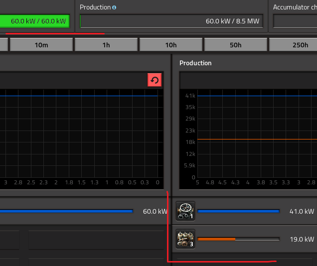
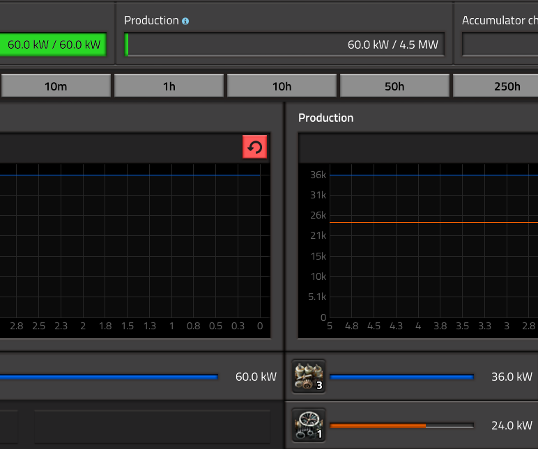

В [статье про перевод паровых электростанций в резерв](pathname:///PowerProduction/BackupSteamPower#откуда-берётся-электричество) даются пояснения насчёт приоритетов при выборе поставщика электричества. Но у парового двигателя `!Steam engine` и паровой турбины `!Steam turbine` одинаковые приоритеты, но разные выходные мощности. И как же *Factorio* рассчитывает производимое электричество?

<!-- truncate -->

Создал небольшое потребление, на 60 киловатт. Три паровых двигателя `Steam engine` полностью снабжаемые паром от бойлеров `Boiler` и одну турбину `Steam turbine` от ядерного реактора `Nuclear reactor`. И что мы получаем по электричеству?

И как это вообще появилось? Задумайтесь... и вот вам та же картина маслом, только тут поменян пар от бойлеров и от ядерного реактора.

Задумались? А оказывается всё очень просто. Рассчитывается не по количеству паровых агрегатов, а по максимальным значениям вырабатываемого электричества этими агрегатами. Эти максимальные значения зависят от температуры пара. Например, когда мы поменяли пар от бойлеров с паром от ядерного реактора, то получили, что паровая турбина стала производить максимум 1800 киловатт и соответственно поменялись расчёты на основе максимальных значений выработки электричества.

Подсказываю формулу для второго экрана:

> 60 kW = *xy* * (3 * 900 kW + 1800 kW)\
> то есть *xy* = 75\
> и тогда, энергия от паровых двигателей: 3 * 900 / *xy* = 36 kW,\
> а от паровых турбин: 1800 / *xy* = 24 kW,\
> всё сходится!!!

А для первого экрана рассчитайте сами, управитесь?

[**](https://youtube.com/shorts/Mzf2iQyWpAM?feature=share)
