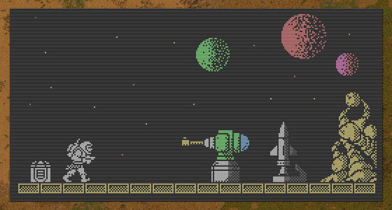

Надоел монотонный ландшафт в *Factorio*, задрали скучные обои, ностальгируете по советским домашним компьютерам? Заходи сюда...

<!-- truncate -->

А в нашем *Factorio* можно рисовать картины, и не только лампочками. Постоянный комбинатор `Constant combinator` отображает заданные на нём виртуальные сигналы, но только четыре из них. Имеется также несколько цветов для соответствующих виртуальных сигналов. То есть, можно рисовать собственные пейзажи, по четыре точки на комбинатор.

И вуаля, картина маслом:

Подробности [в статье про комбинаторы](pathname:///CircuitNetwork/Writing).

[**](https://youtube.com/shorts/OOORdFtuOec?feature=share)
