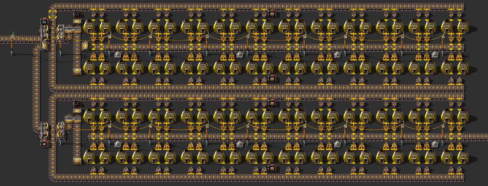
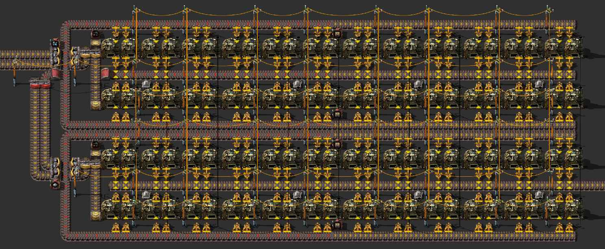

А что если на начальном этапе игры разделить плавку стальных балок `Steel plate`? Это когда мы плавим вначале руду `Iron ore`, а потом сразу железные пластины `Iron plate`.

<!-- truncate -->

Мы как бы берём проверенные временем чертежи плавки руды, но только вместо руды, подаём железные пластины. Что-то вроде такого решения для каменных печей `Stone furnace`:

И для стальных печей `Steel furnace`:

Однако, очевидно что такой вариант будет малость хуже уже имеющегося в [статье про плавку ресурсов](pathname:///RawResourcesProcessing/#чертежи-для-плавки-железной-руды-в-стальные-балки). Во-первых, такие два плавильных чертежа по размеру немного больше изначальной плавильни, а это значить что на начальном этапе игры придётся временами больше бегать и большую территорию защищать. Но более существенной проблемой является то, что на строительство двух таких линий плавки уйдёт больше ресурсов чем на одной совмещенную.

Вариант в принципе рабочий, но стоит воздержаться от его использования.
