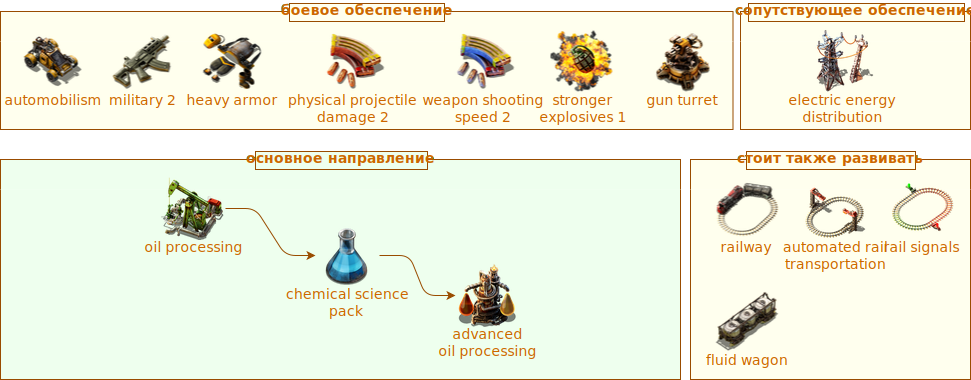

Совсем недавно я внедрил диаграммы [mermaid](https://mermaid.js.org/) на сайт. Это простой способ вставлять разные диаграммы прямо текстом, [первый пример](pathname:///PowerProduction/BackupSteamPower#откуда-берётся-электричество). Но к сожалению, `mermaid` очень простой, на столько простой что совсем никак. Увы, но в `docusaurus` ничего другого не добавили. Поигрался я с редакторами разными, бесплатными вестимо, як [Draw.io](https://www.drawio.com/) и [Excalidraw](https://plus.excalidraw.com/).

<!-- truncate -->

`Draw.io` выглядит намного перспективней чем `Excalidraw`, который вечно клянчит миллиён. И вот результат, первая диаграмма, по тематике *Factorio*:

Выглядит хорошо, буду пользоваться для сложных случаев, где `mermaid` убог.

Рисовать кстати можно прямо в `.svg` или `.png`, правда размер рисунка увеличивается. Для выгрузки на сайт нужно облегчать. [Предложил разработчикам](https://github.com/facebook/docusaurus/discussions/10291) имплементировать фичу отчистки прямо в `docusaurus`, но наверное отмахнутся. Или такое кем-то уже реализованно, будем присмотреться.
