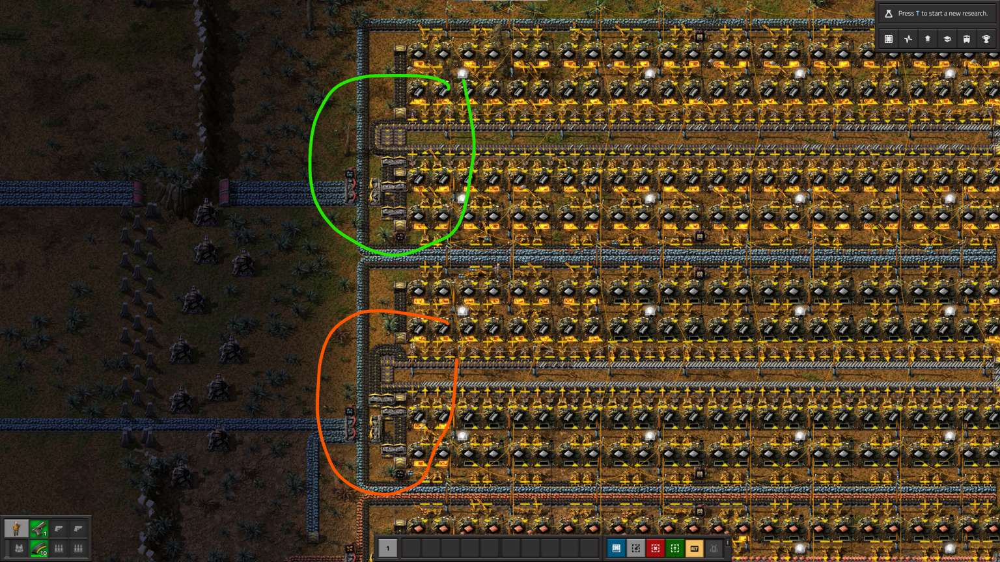

Игрался я с распределением угля при плавке стальных балок для стальных печей, и доигрался до ещё одного улучшения, помимо того, что в выпуске про плавку ресурсов уже было рассказано.

<!-- truncate -->

Снизу, выделено красным, старая подача угля, которую уже рассматривали. А сверху моё новое творение, любуйтесь в зелёном цвете.

И творение это обходиться на целый конвейер меньше. По оптимизируем ещё? Открываю челенж *"оптимизируемся вместе"*...
