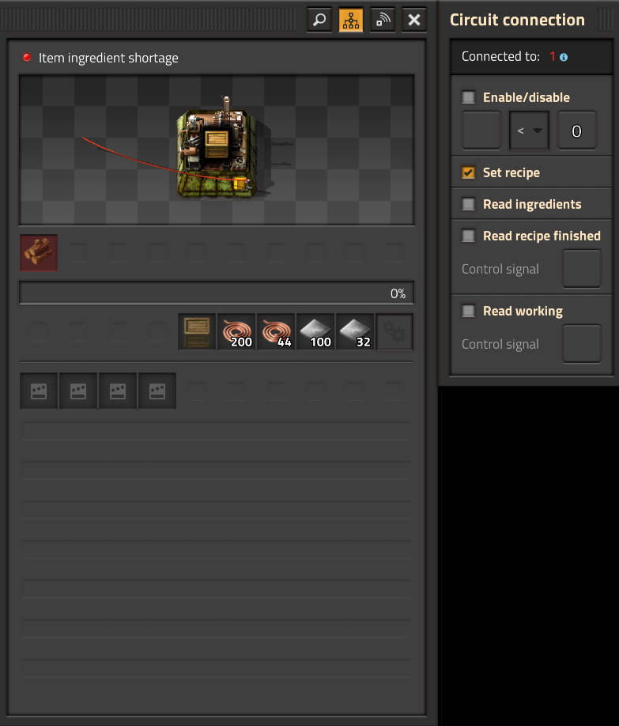

Появившаяся способность `!Assembling machine 2` сборочных автоматов подключаться к логической сети привносит в игру массу интересностей, например можно задавать рецепт и считывать используемые ингредиенты.

<!-- truncate -->

Теперь сборочные автоматы, нефтеперерабатывающие заводы, химические заводы и даже ядерные реакторы можно подключать с логической сети. Появившаяся возможность [задавать рецепты](https://www.factorio.com/blog/post/fff-394) открывает возможность сократить количество заводов производящих игровой хабар.

**

Короткий шортс с демонстрацией новой возможности:

[**](https://youtube.com/shorts/twa1U9d4Jko)

```blueprint title="Чертёж также прилагается"
0eNrNV9uO4ygQ/RceV3gUO7Zz0e6HrFqR5Us5QW2DB3BmM638+xbgS5Im2aRnV9p+aRvDqeLU4VD5IEXTQycZ12T7QVgpuCLbtw+i2J7njRnjeQtkS6QoRCekJmdKGK/gL7INz9QzMVcK2qJhfB+0eXlgHILoYlF03lECXDPNwIWyL6eM920BElHpiAQNlFqyMgAOcn8KMEmQdV4CoaQTChEEN4FNKvGKkhP+X2NSpOjrGmSm2E+ECRfTn8n3Jlo0RVN9oXRuMT3wmwE+OntAlnPKgFnWjOPXoDyA0oHSQuZ7b8qbb8mAmnxLMG0J33tcktWswY0qM08hA2ysyUT7ztLpwmQKtEay7XQJrThC1nMHAVXGNLT4ScseKJmA36ZqMSl40DW5NhmWojc6QMYoaUVlq6mDBnKlyXXVh9Wl6DqQr62PLtYrDdC8tnx5FR6VN61LHi2LkTRP5eK5/K5OrmqeaiWLr1fLEziZAnd4YNgRgk6KI6uQzbsZxFcZeEDTCbTom3dUogKJufmwkpvdVEy65A1Vn5FX9OHx9gRYTQFiGwCdRUvRZAUc8iMT0vGlMwzLOhgVKiFHzfI9SpdhCoNyjdydjg2v1YXZQF2zEmeWpwBL3zej17jZpgiIdkQkIU9DVaY3rD0e+PKdbK0xeL/Y6u08hKwnQgYdPCpcOnGxustFyWTZM50ZBWeizgQeLOdGxhHHr7iystgZ8LxoALmo80bBL+tx87x05t2kt9JZe5DDxawdyfShBY2WXoq2YDxHvn0h1vcChJGfvRl5pshSUDOJnMyXlD4ZsZEjk7q35jEefzsjAJS0ERAyhzAGC4VgzYWSi4qQ33Cl6HXXv4x99rEfzpfe9fXx+NpYW3r+pZugEXumTGnMTa+ftNU7agqj5+W0uNnOE9UeT8N0BtymPh2SLwjgT+LO51D2ZWre2i6XVqpb8jvxF3BuASo0NGvjDxWeDnvefHJf/5YH1Bt1X769fVHsph9zUr7t/J48K9gEnDIrlqyWokXDRazRl3Z+uuZ7d+orPSQtHUmbxR3PtLeFlWtmWrf5tvg1LwyT1x0rHVP93zhWEP63ljU3G2PMf6Bo6gieJ2ku2p0CXjvZPDpkhn0EzyvTW37H7WH6OMaFbIe28eJc/zEbXuS6Ades0qtGeQ+5DH4csGl9DTK8xJytAkuNgC02Uvv8J3ZSL4JeYMbXeRoff/86WkJvGvzS+OyreDv3O0VlpsLODYzX/MBNm3K9rWhI0TeXO4qPEcU+IcLHtRld2FFUBQ7Hdhgn4nNCY/McXzwnZn5Kw93OtX3mypl+0lJyRG1YiSVptIk3myRJsCNN4/P5by8aCvo=
```
