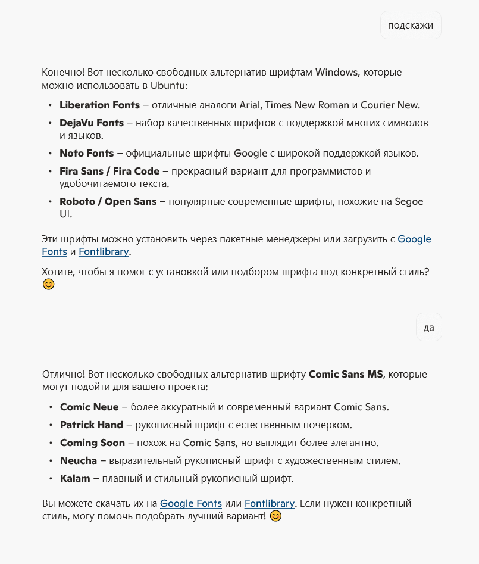
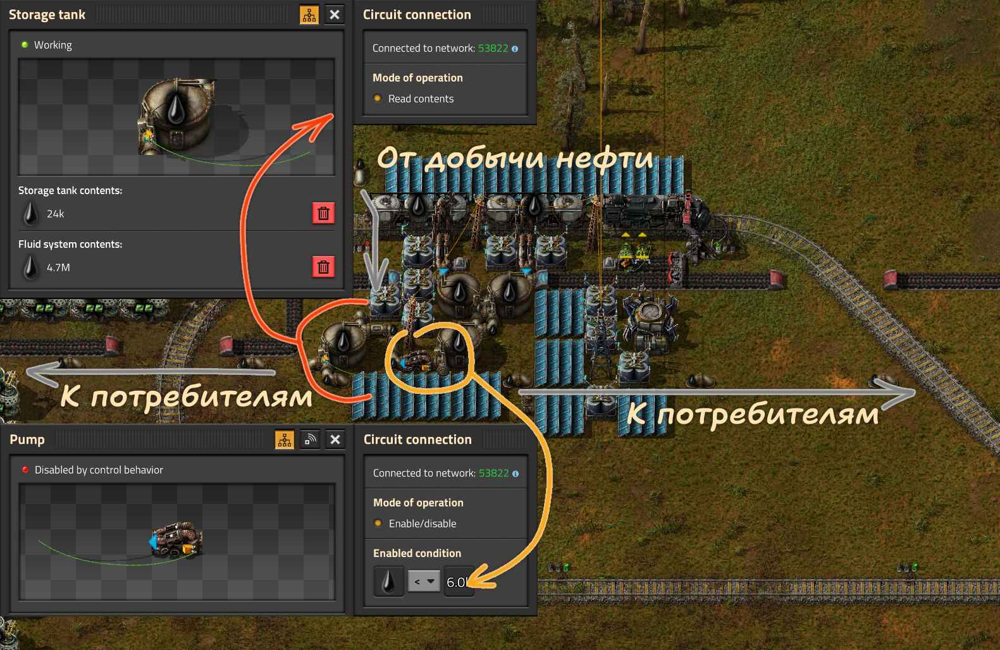

Решил разобраться с беспорядком различных шрифтов, которые за долгое время существования проекта накопилось в достаточном количестве. Если бы не обновление *Factorio* из-за которого приходиться проверять и переписывать все статьи на сайте, так бы и не добрался до этого дела. А дело полезное

<!-- truncate -->

**И вот что скумекал: нужна унификация!**

Придётся отказаться от проприетарных шрифтов [каким-то чудом забредшие ко мне на компик](https://packages.debian.org/search?keywords=ttf-mscorefonts-installer). А также уменьшить количество шрифтов, объединить похожие, найти альтернативу [Comic Sans](https://en.wikipedia.org/wiki/Comic_Sans).

Все вопросы к шмуглу, как говорилось лет 10 назад, но нынче Калифорния не в почёте, а посему вопрошаем у Редмонд. И вот что нам подсказала кремнивая дурилка:

Покопавшись на шрифтопомойках, честно говоря дурилка кремневая не очень чтобы и помогла, но удалось таки обзавестись следующими поциэнтами:

* [Ubuntu](https://fonts.google.com/specimen/Ubuntu) (куда же без него любимого)
* [Open Sans](https://fonts.google.com/specimen/Open+Sans) c [Roboto](https://fonts.google.com/specimen/Roboto) (трудятся на веб сайте)
* [Russo One](https://fonts.google.com/specimen/Russo+One) (в этом шрифте дух *Factorio*)
* [Shantell Sans](https://fonts.google.com/specimen/Shantell+Sans) (в качестве фана, на замену Comic Sans, покрасившей даже будет)
* [Caveat](https://fonts.google.com/specimen/Caveat) (особой надежды не ожидаю, так, на всякий случай)

На сайте изменения со шрифтами уже произведены, а вот надписи в изображениях на подходе. Вот первый результат отказа от Comic Sans, было:

**

Стало:

**
