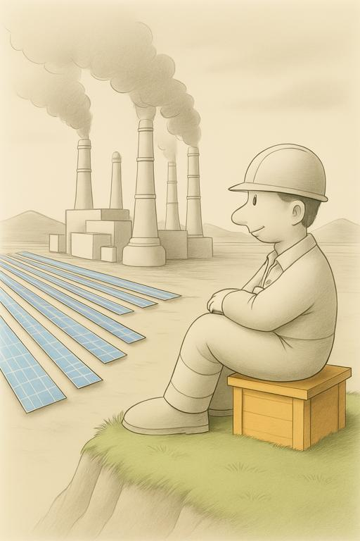
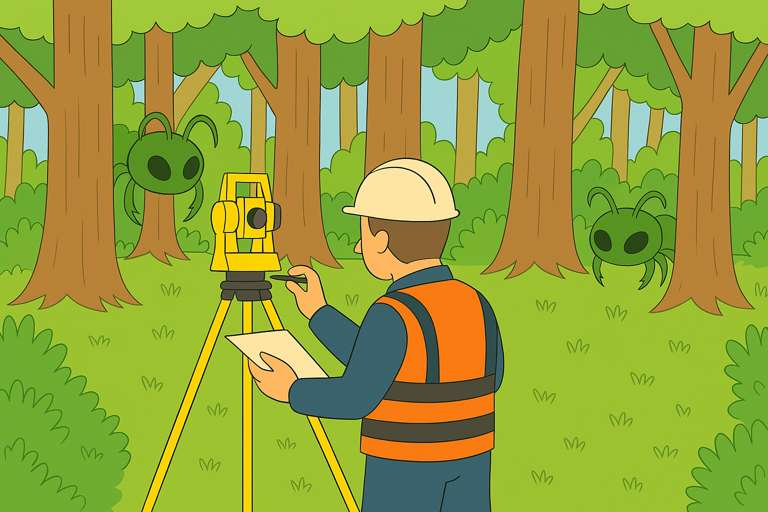

Просто решил поведать вам, как я напрягаю *мелкомягких* по полной программе да ещё и за бесплатно. А именно, заставляю ихний ай-ай трудится над художественной составляющей веб-сайта, приукрашивать картинкос и давать ценные советы по видеомонтажу.

<!-- truncate -->

Честно говоря, напрягал я и раньше ихний ай-ай, что кличется *Copilot фор линуксе*, правда работает только в браузере. Мы жеж не гордые, можем и *Edje* на юбунтэс натянуть, но не суть.

И вот раньше по напрягать его было за падло, так как генерил он откровенную чушь. И приходилось вжаривать собственную видеокарту на предмет генерации изображений для сайта и для наших радиопередач на [твойтубе](https://www.youtube.com/@AwesomeFactorio). Родненькая *RTX 2060* измучалась на все свои 12GB основательно переламывая англицкие промпты переведённые со старобелорусского, дабы нагенерить 100500 ласковых оку маляки-каляки.

И вот попробовал я ысчё разок мелкомягкую литалку, не без сюрпризов конечно, но надо сказать качество её улучшилось в разы. Полностью нагенерить сподобного контенту она пока не в состоянии, но если пнуть её хорошенько много раз, то получается вполне годный результат. Вот например карцынко, для статьи про [производство энергии](pathname:///PowerProduction/):

**

Или вот, ещё один удачный поцыэнт для статьи про [паровую энергию](pathname:///PowerProduction/SteamPower/), но правда пришлось изрядно допиливать нормальным напильником:

**

Ну и напоследок секретный эскиз подготовленный для новой статьи, которая пока держится в большом секрете. Узрите инженера с одной длиннющей рукою (али это третья рука?):

**

Вот таки дела, ай-ай вытесняют простых работяг фотожопа на мороз. Печально...
