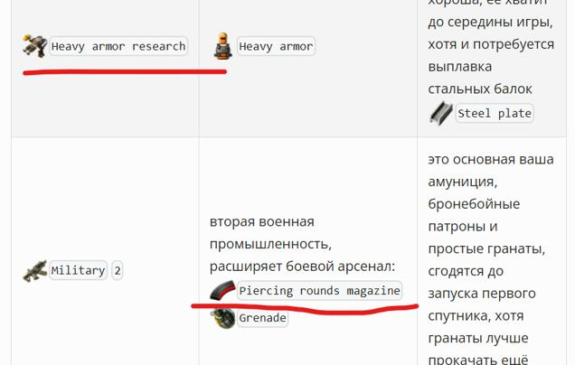

Давно присутствовала неудобность на сайте при показе значков из *Factroio* с текстовым описанием. Длинные строки разрывались и выглядели не по фэншую.

<!-- truncate -->

Это тот самый [плагин для *docusaurus*](../2024-02-29-remark-plugin/index.md), который давно себе таки сварганил для удобства. И дошли руки всё поправить, не без помощи [мелко-мягкого Ай-Яй](https://copilot.microsoft.com/) вестимо и вот как теперь показываются заначки:

**

Не было ни одного разрыва!!! На новую строку внутренний текст не переноситься, а столбцы в таблицах сами расширяются до нужного размера. И делюсь конечно исходным кодом плагина, мож кому и сгодится:


```javascript
interface Options {
  // Add any options here if needed
}

const plugin: Plugin<[Options]> = (options) => {
  async function transformer(tree: any, vfile: any) {

    const visited = new Set();

    function checkNode(node: any): boolean {
      if (visited.has(node) || node.type !== "inlineCode" || !node.value) return false;
      let search = node.value;
      if (search.startsWith('!')) search = search.substring(1);
      return IconNames.includes(search);
    }

    visit(tree, checkNode, (node, index: any, parent) => {

      if (!parent) return;
      visited.add(node);

      if (index > 0 && parent.children[index - 1].type === 'emphasis' && parent.children[index - 1].children.length > 0 && parent.children[index - 1].children[0].type === 'image') return;
      if (index > 1 && parent.children[index - 1].type === 'text' && parent.children[index - 1].value === ' ' && parent.children[index - 2].type === 'emphasis' && parent.children[index - 2].children.length > 0 && parent.children[index - 2].children[0].type === 'image') return;

      const deleteNode = node.value.startsWith('!') ? 1 : 0;
      let iconName = node.value;
      if (deleteNode == 1) iconName = iconName.substring(1);
      const rootDir = path.relative(vfile.dirname, 'factorio_icons');
      const iconUrl = `${rootDir}/${iconName.toLowerCase().replace(/ /g, "-")}.png`;

      const iconNode = {
        type: "emphasis",
        children: [
          {
            type: "image",
            alt: iconName,
            url: iconUrl
          }
        ]
      };

      const nowrapNode = {
        type: "span",
        data: { hProperties: { style: "white-space:nowrap; display: inline-block; min-width: max-content;" } },
        children: [
          iconNode,
          ...(deleteNode !== 1 ? [{ ...node }] : [])
        ]
      };

      parent.children.splice(index, 1, nowrapNode);
    });
  }
  return transformer;
}

export default plugin;
```

И скажу я вам, что *Ай-Яйи* эти разные не такие уж и глупые, умнеют. Вот ещё пример, на главную страницу сайта вывел последние commit`ы прямо с github берущиеся, и парсинг оных загнал прямо в *actions*. А помог мне это сделать всё тот же *Ай-Яй* от мелкософта. Таки дела...
