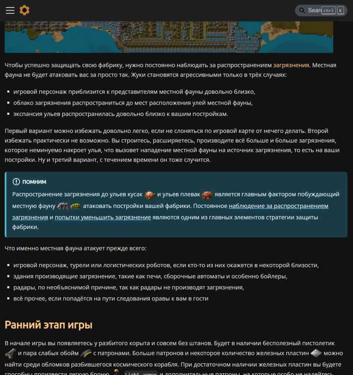

Наварганил я таки темную тему на веб-сайте. Выглядит конечно как вырви глаз, со всеми вытекающими, но хоть что-то. Попробовал, дело вкуса.

<!-- truncate -->

Включается тёмная тема просто, в самом правом верхнем углу страницы, кликайте и получайте:

**

А выглядит сей глаз как-то так:

**

Есть план улучшать и дорабатывать, авось кому войдёт каким-то боком.
