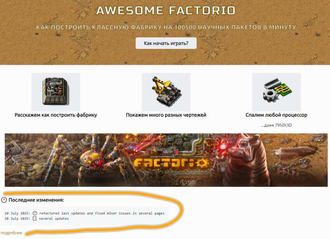
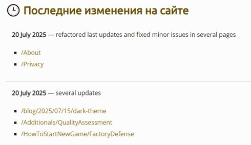

Давно задумывал сделать автоматический *Release notes* для сайта, чтобы была информация, что меняется и над чем работаю. Но и чтобы не строчить каждый раз новый файл. Идея витала в воздухе, ведь вся информация есть в git, но руки не доходили. Точнее знаний не хватало в скриптах, чтобы вот так сходу тяп-ляпнуть. Но у нас нынче эра АйЯй, которые могут всё, и даже больше.

<!-- truncate -->

Но как оказалось, не все Ай-Яйи одинаково умны, не будем показывать пальцем на мелко-мягкого, он не справился. Другие тоже пыхтели и старались, даже платные. Не будут также указывать на того, кто справился, задача тривиальная, но много деталей. Идея, в *Github actions* собрать файло с данными о последних коммитах и списком файлов (статей на сайте) которые поменялись. Выбросить служебные коммиты, например слияние из других веток репозитория. И показывать всё это автоматом як *Release notes*. Конечно нужно ещё пошаманить с форматированием, подготовкой правильных данных, компоненты написать на *TypeScript* разные для визуализации. Но это уже детали.

И вот глядите да радуйтесь, на главной странице сайта теперь есть раздел с последними изменениями, а также с кнопкой которая уводит на ещё больше деталей:

**

А вот так выглядят те самые сводки, где больше деталей:

**

Виднеется дата изменения, то есть дата коммита, сообщение из коммита (в будущем тут не забалуешь, внимательствовать потребно будя), и список изменённых статей на сайте али записей в блогах. Причём ссылки не битые, а прямо на статьи ведущие. И всё это работает автоматически при публикации сайта.
