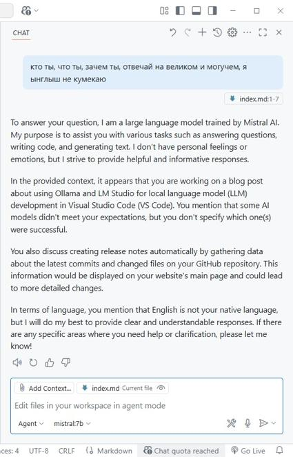
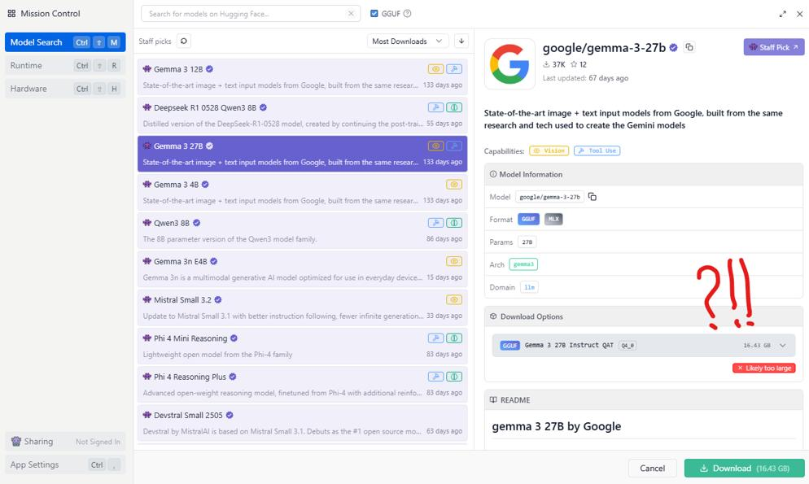

Решил разобраться с дивом новым дивным, которое локально запускается и помогает кодить али вайпить у *VS Code*. Сопилёт гитхабовский усем хорош, но ограничения жеские, за два дня истекли все лимиты. На своем компьютере протестировал два популярных инструмента, *Ollama* да *LM Studio*, но так, дабы агенты заработали фор фри.

<!-- truncate -->

[Ollama](https://ollama.com/) подходит для локального запуска больших языковых моделей (LLM) через командную строку. Она хорошо вписалась в интеграцию с *VS Code* по части чата у сопилёта, поддерживает множество моделей, но в качестве агента заработала только *Mistral:7B*, остальные модели отказались. Междумордия нет, всё только в командной строке, но есть возможность поговорить за жизнь с моделью в чате самого *VS Code*:

Правда, как и всякие там узкоспециализированные модели, не очень разговорчива.

В то же время, поигрался с [LM Studio](https://lmstudio.ai/), так как он предоставляет удобный графический интерфейс для общения с моделями, хотя их количество и качество малость порезаны по сравнению с Ollama. И интеграция в *VS Code* только через расширения, но зато имеет удобный чат и поддерживает настройку под оборудование. Однако моя конфигурация ПК оказалась недостаточно мощной для полноценного запуска хороших моделей, типа Gemma. Вот тебе и ружен с три-дэ-кэшем, пора выбрасывать:

Сравнивая *Ollama* и *LM Studio* с другими решениями, такими как *GitHub Copilot*, *Perplexity AI* и *Google Studio*, да и бесплатный мелкомягкий copilot, который на пингвине только в edge работает, выделяю несколько ключевых моментов:

- **Copilot** от GitHub интегрированный в IDE требует бабосики, на бесплатный период не надейтесь
- **Perplexity AI** не предоставляет агентов, а только чат, и тоже требует подписки для полноценного использования и в целом сравним с бесплатным copilot от мелкомягкого, хотя местами чуток получше
- **Google Studio** тоже без агентов, но даёт доступ к мощным моделям, таким как *Gemma-3-27B* и работает заметно быстрее чем локальная версия в *LM Studio*, но что там будет с подпиской и ценами, ответ не знает даже шмугл, да и картинки генерит отвратительно и на четвёртой отваливается в 404
- **Сopilot** портированный с винды... ну этот, сцуко, пока что не победим, бесплатная версия работает на моделях *GPT-4 Turbo* и *GPT-4o*, генерит каритикос в *DALL-E 3*, неплохо кстати генерит, хотя говорят что в каких-то регионах есть лимиты или вообще не доступен

Главное преимущество *Ollama* и *LM Studio* в конфиденциальности и автономности. Да, да, Марк-Шаттлворт-Космонавт с этими шнягами никак телеметрию с вас не соберёт. Все модели работают локально, без передачи данных на облака. Но облачные работают быстрее и оперируют большим количеством параметров. *Ollama* выделяется интеграцией с *VS Code* (через агента *Mistral:7B* бесплатно), а *LM Studio* графическим интерфейсом и возможностью легко переключаться между моделями и запускать их как локальный API-сервер.

Для себя я выбрал *Ollama* в качестве основного инструмента для разработки в *VS Code*, не теряя при этом *LM Studio* как удобный инструмент для работы с моделями через GUI. Но в целом будут скорее работать с облачными решениями, так как они быстрее и удобнее, а локальные модели пока что не дотягивают по качеству и скорости. Нужно раскошеливаться железки поновее, чтобы запускать их локально, а меня скырба душит. Мне вот на микрофон больше нужно, кто бы шекелей задонатил???
