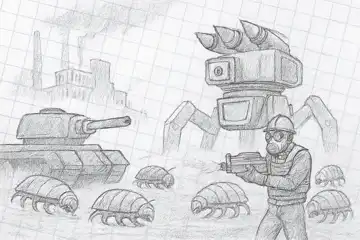

Делюсь новостью, я начал работу над новой страницей на сайте, посвящённой боевой технике в *Factorio*. Это будет насыщенное руководство по использованию танков и паукотронов в игре, с практическими советами, тактиками и личными наблюдениями.

<!-- truncate -->

**

[Статья](pathname:///HowToStartNewGame/TankAndSpidertron) будет полезна всем. Танк цэ мощная, но требующая ручного управления машина. Подходит для агрессивной зачистки ульев, особенно с правильной экипировкой. Паукотрон — вершина инженерной мысли. Автономный, может строить, атаковать и перемещаться без участия игрока. Идеален для поздней стадии игры и экспансии.