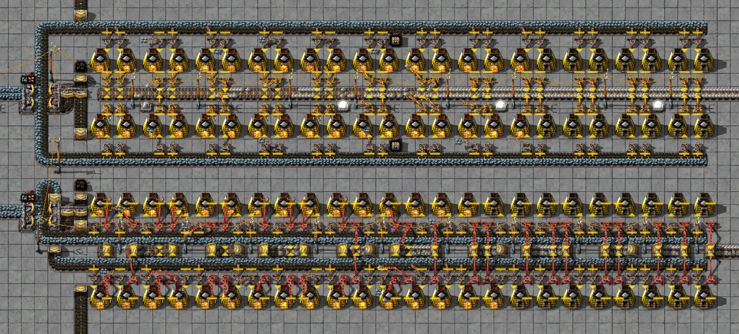
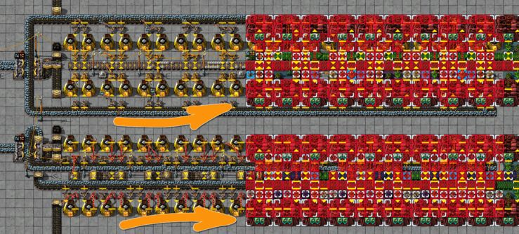

Один из наших читателей предложил свой чертёж плавки ресурсов, который меньше по размерам чем [предлагаемые в статье](pathname:///RawResourcesProcessing#чертежи-для-плавки-руд). Давайте проанализируем плюсы и минусы такого чертежа.

<!-- truncate -->

Итак, верхний вариант это наш чертёж из статьи про плавку ресурсов и который мы рассматривали [в радиопередачах](https://www.youtube.com/watch?v=z7HcOThwafg&t=573s) и в целом он довольно хорош и весьма распространён. Нижний вариант предлагается к рассмотрению и сравнению, как более хорошая альтернатива. Давайте сравним.

Итак, сразу видно, что предлагаемый на замену чертёж занимает на две клетки меньше по высоте, что безусловно является плюсом. Верхние и нижние конвейеры с первого варианта "спрятаны" внутри чертежа, что уменьшает занимаемый размер. Но теперь, чтобы выгружать переплавленные пластины приходится использовать другие, более дорогие манипуляторы `Long-handed inserter`. Также, чтобы провести линию электропередач приходиться использовать подземные конвейеры `Underground belt`, которые очень дороги, по сравнению с обычными `Transport belt`.

То есть, предлагаемый вариант компактнее, но его строительство потребует намного больше ресурсов. Судя по тому, что чертежи основаны на каменных печах `Stone furnace` и впоследствии они скорее всего будут улучшены до стальных печей `Steel furnace` мы делаем вывод, что эти чертежи предназначены для ранней стадии игры, первые несколько часов. А на ранней стадии игры, требуемые ресурсы на строительство превышают по ценности занимаемое чертежом место, так как добывать массово ништяки и плавить их в хабар мы ещё не можем. Это не значит что в начале игры можно разбрасывать игровым пространством бездумно, но всё же, не до такой степени, чтобы существенно удорожать чертёж за счёт экономии пространства.

Второй важный аспект, первый чертёж значительно проще построить вручную, особенно на раннем этапе игры, когда у игрока ещё нет доступа к робототехнике `Construction robot`, а время становится критическим ресурсом. Это потом, [после запуска первого спутника](pathname:///HowToStartNewGame/AfterSatelliteLaunch) (или полёта к взорванной планете в платном дополнении) можно расслабиться и играть в своё удовольствие, а в начале игры каждая заминка со строительством увеличивает время игры. И второй чертёж никак не способствует быстрому клацанью мышкой.

И насколько важны две клетки в чертежах плавки ресурсов на каменных или стальных печах. Ведь такие кузницы вариант временный, и после [их улучшают до электрических печей](pathname:///RawResourcesProcessing#после-запуска-первого-спутника) `Electric furnace`, чертежи с которыми требуют немного другой формации и лишняя клетка будет только плюсом. Вот пример:

## Вердикт

Предложенный чертёж занимает меньший размер, но требует намного больше ресурсов на строительство. С учётом времени его применения и тех игровых обстоятельств в которых он будет применяться, его использование не даст ощутимых преимуществ, и скорее всего затормозит игру.
