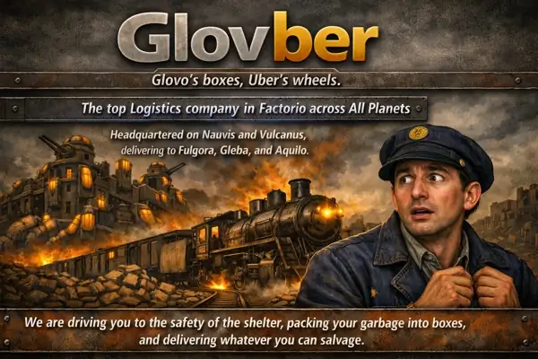

Инженеры, ликвидируйте дефицит пропускной способности раз и навсегда. Всепланетная логистика и космические платформы объединены в единую автономную сеть. Стандартизированные чертежи, выверенные тайминги и абсолютная автоматизация. Транспортная компания ***Glovber*** официально объявляет о запуске сквозных логистических коридоров между всеми планетами системы.

<!-- truncate -->

> **The top logistics company in FACTORIO across all planets**\
> Штаб-квартиры на `Nauvis` и `Vulcanus`\
> Зоны прямой доставки на `Fulgora`, `Gleba` и `Aquilo`\
> Работаем от высокотехнологичных руин до экстремально низких температур

Мы развернули инфраструктуру на всех ключевых рубежах экспансии, даже на `!Shattered planet` разрушенной планете. Больше нет необходимости настраивать ручные маршруты, наша сеть работает автономно.

> **We are driving you to the safety of the shelter, packing your garbage into boxes, and delivering whatever you can salvage.**

В условиях постоянной угрозы со стороны местной фауны и жесткого дефицита ресурсов мы берем на себя оптимизацию ваших материальных потоков. Эвакуация и безопасность, оперативная доставка инженера в защищенный периметр («safety of the shelter») при прорыве обороны или падении UPS. Утилизация и сортировка, упаковка любых объемов отходов, пустой породы и промежуточных полуфабрикатов в стандартизированные контейнеры («packing your garbage into boxes»). Снабжение и логистика, бесперебойная транспортировка любых объемов добытого сырья, артефактов и компонентов космической программы («delivering whatever you can salvage») из самых удаленных аванпостов напрямую в плавильные комплексы.

[**](https://youtube.com/shorts/zarOECMDRnM?sub_confirmation=1)

Ваша фабрика должна расти. Мы доставим всё остальное.
