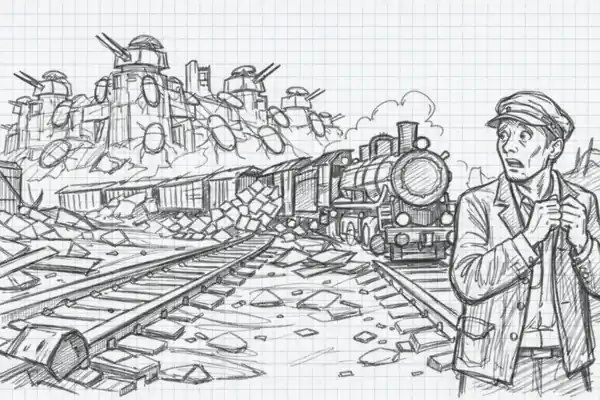

В логистике *Factorio* есть одна тема, которая стабильно вызывает и интерес, и боль. Это погрузка и разгрузка смешанных грузов в один грузовой вагон. Это кажется простой задачей, пока не сталкиваешься с реальностью: манипуляторы клинят, вагон переполняюется, поезд стоит на станции дольше, чем строится ракета, а вся фабрика начинает задыхаться от пробок.

<!-- truncate -->

Подготовлена [новая статья](pathname:///LoadingAndUnloadingTrains/Jlovber), посвящённую практическим методам погрузке и разгрузке разнородных предметов, да ещё и в одном вагоне:

* фильтрация ячеек грузового вагона, чтобы держать хаос под контролем
* проблемы смешанной загрузки из одного сундука без блокировок манипуляторов
* чертежи погрузки и разгрузки, включая контролируемую на комбинаторах
* правильную разгрузку на станции назначения
* контроль доступности железнодорожной станции

Статья получилась не только теоретической, а исчё и практической. Каждая схема проверена в реальной игре, каждая проблема разобрана с примерами, а решения компактные и надёжные. Вы конечно же хотите перевозить боеприпасы, ремонтные комплекты, топливо, стройматериалы и всё остальное одним поездом, не превращая фабрику в цирк с огнём. [Также вышла радиопередача](pathname:///LoadingAndUnloadingTrains/Jlovber#больше-подробностей) с картинками обо всём повествующая.

А с оформлением помогал нам искусственный ынтылект, в простонародье Ай-Яй, и спасибо ему. Вот рабочие материалы:

**

**

**

**

**
