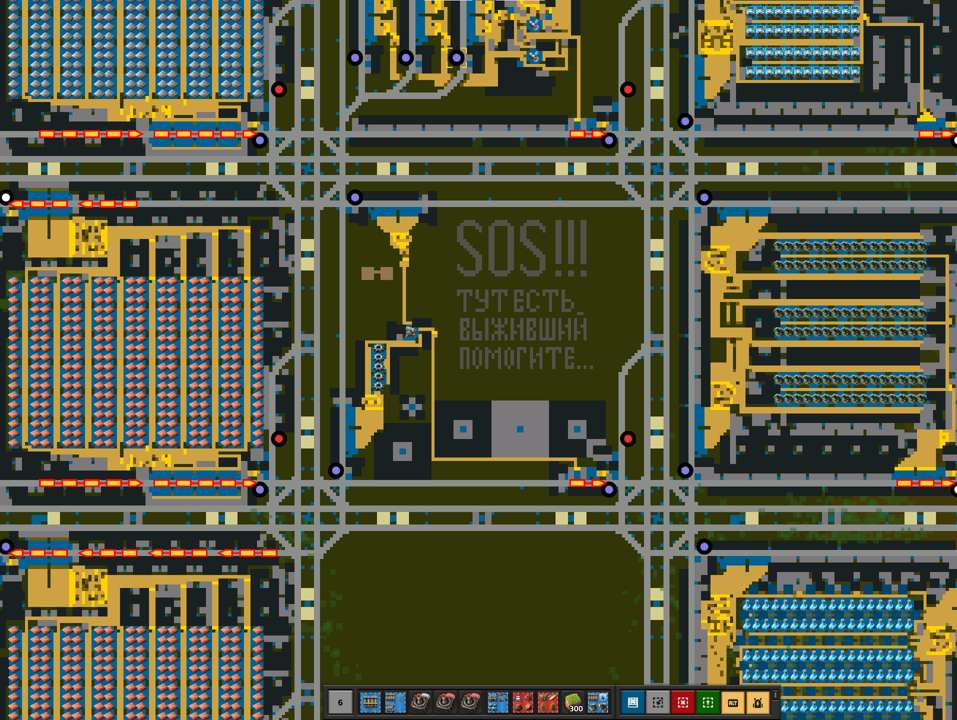
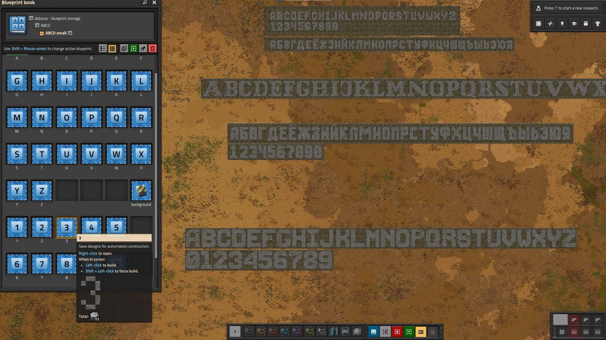
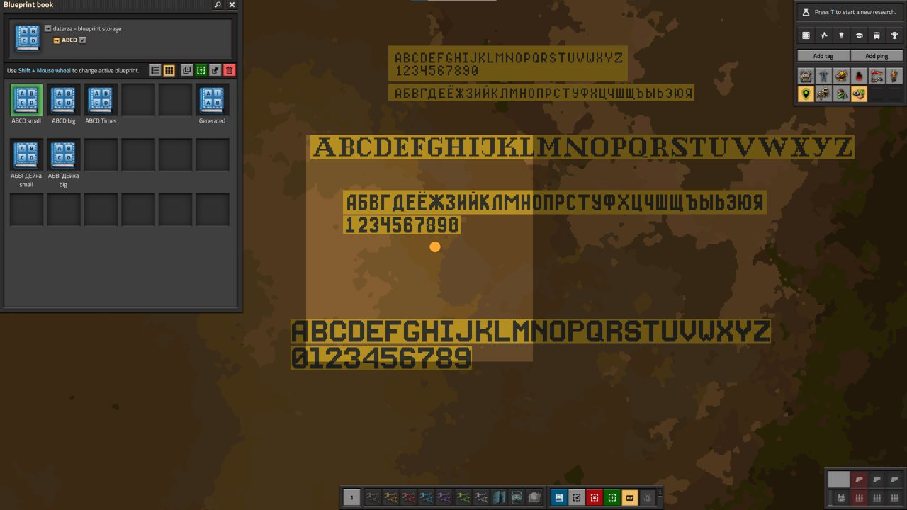
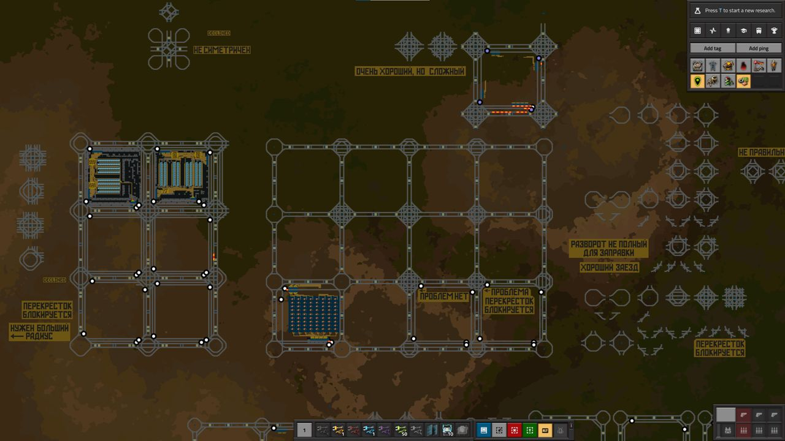

# Послания инопланетян на кукурузных полях

Есть в *Factorio* такая вещь как метки (tags) на карте. Они помогают запомнить какое-то место и потом найти его. Создать метку очень просто, нужно перейти в режим карты клавишей `M`. А на карте есть кнопка в правом верхнем углу под названием `Создать метку` или `Add tag`. Можно указывать название, цвет и даже иконки для метки. Но к сожалению видны метки только в режиме карты. Можно ещё оставлять [надписи на постоянных комбинаторах](../CircuitNetwork/Writing.md), но это ещё тот *геморой* и в режиме карты такие надписи не видны. А если хочется создать полноценные надписи, чтобы их можно было видеть даже из космоса? Чтобы даже *рептилоиды* сразу поняли, тут занято, валите нафиг...

## Как тебе такое, Илон Маск?

** На самом деле написать что-то на кукурузно-пшеничном поле в *Factorio* даже проще, чем построить [первую паровую электростанцию](../PowerProduction/SteamPower.md#чертёж-угольной-паровой-электростанции). Для этого вспомним, как на заре перфокарт, мы делали дырочки в оных таким образом, чтобы свет через них падал в виде рисунка. Сделав немного отличающиеся рисунки на разных перфокартах, можно было даже анимацию наварганить. А как тебе такое, Илон Эрролавич?

Таки да, вспомним про пиксельные восьми- или семи-битные шрифты с ваших Ириш, Ковретов, Радио-86РК, УКНЦэшэк, Векторов-06ц и [прочего старья](https://ru.wikipedia.org/wiki/Категория:Компьютеры_СССР). Берём за основу [любой понравившийся шрифтЪ](https://www.bing.com/search?q=pixel+font), который не векторный. А ещё горку каменных плит `Stone brick`, `Concrete` или `Refined concrete`. И вбиваем камешками пиксель за пикселом, букву за буквицой, и так целый алфавит с цифрами и знаками препинания. Если потом эти камешки выложить на землю друг за дружкой, то такое будет видно и в режиме карты и воочию и вообще, можно [многое чего демонического нарисовать](https://pixtor.io/).

**

## Создаём книги шрифтов

Для удобства использования создадим отдельную книгу чертежей на каждый шрифт. А в каждой книге будут отдельные чертежи для одной буквы, цифре или знаку препинания. Таким образом, мы сможем легко писать длинные тексты. Потребуются также и строительные роботы `Construction robot`, чтобы чертежи из камней возводить на местности.

А в режиме карты, это выглядит ещё красивей.

## Практическое использование

Причуда со шрифтами в *Factorio* является излишеством. Играть она ни как не помогает, разве что для фана и то сомнительно. А вот для тестирования ваших чертежей в песочнице может и пригодиться. Ощутимая помощь проявляется в виде надписей и подсказок себе любимому про те или другие варианты исполнения каких-то чертежей.

И вот вам [сохранёнка со всеми чертежами](../../website/static/saves/AwesomeFactorio%20-%20Abecedar.zip) в книге игры. Там вы найдёте несколько шрифтов различного размера, кириллические и не очень, в общем пользуйтесь.

**
