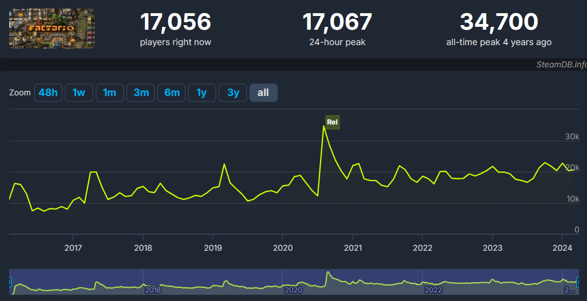

# Нерды против Гиков

:::danger
Это заготовка для будущей статьи, сейчас она не доступна для изучения, а в будущем может измениться или вообще исчезнуть.
:::

:::tip Вся статья, кратко
Нерды, Гики, Нубы, кто все эти люди?
:::

:::warning Аффтару пофиг на ваши догмы **
Статья представляет собой авторское мнение и точка. Излагаемый материал является плодом его личных фантазий и может не соответствовать вашему представлению о мироздании и морали.

Бурление в среде плосковакцинированых и антиземельных экспертов по взятию городов за три для могут стать причиной разрыва что-то ниже спины.

Осторожно, не попадайтесь на провокации.
:::

:::danger Осторожно, не для всех
Понять смысл изложенного тут способны не все, а только лишь те, кто могут смотреть в завтрашний день. Сначала постройте большую базу, а потом возвращаетесь почитать написанное.

:::

*Factorio* не та игра, которая борется за массовость и пьедестал популярности, но играют в неё достаточно много народу. Каждый естественно со своим богатым внутренним миром и индивидуальными понятиями об инженерии и сопромате. В общем, сборище тут разношёрстное:

**

Каждая личность этого сборища считает себя целостным персонажем, знающим за виртуальную симуляцию даже больше чем сами разработчики из восточной Явропы (а чешские модели самые-самые в бразэрс). И в силу определённых причин в этом сборище образуются своеобразные группы социопатов и прочих задротов, чьи идеи в виде чертежей очень важны (по их мнению).

## Народные деффутаты

Первая группа таких личностей возникла давным-давно и является одной из самых старейшей. Отличаются они от обычных игроков большим временем проведённым в игре и соответственно большим количеством виртуального опыта и как следствие большей раздражительностью и большим ЧСВ. В общем, это обычные додики, играющие довольно долго, что позволило им таки запустить хоть один спутник, пусть даже в онлайне с друзьями и от чего считающие себя гениальными инженерами и инженершами. Назовём условно таких персонажей *"НЭРДАМИ"*.

Нэрды перфекционисты, любая оплошность в чертеже, как правило чужом, угнетает их сильнее алкогольной зависимости. Они выступают за обязательное следование всем законам инженерии и строительства. Их главный лозунг исходит из рационализма, что требует меньше ресурсов, то есть труЪ. Элементарный чертёж производства `Electronic circuit`, который издревле известен как 3x2, они будут улучшать до бесконечности, попадая всякий раз впросак со своими новыми изобретениями о том, как правильней расставить манипуляторы. В мире *Factorio* у нэрдов могла бы быть идиллия, так как размах для творчества игра даёт просто огромный и применять свои представления об инженерии тут может любая кухарка.

## Если бы не одно большое но...

Строя и развивая свои чертежи, увеличивая количество производимых научных пакетов и запуская всё больше и больше ракет в космос, рано или поздно любой нэрд упрётся в максимальную производительность его [убогого i5-9400](https://forums.factorio.com/viewtopic.php?p=583417#p583417), который уже не вытянет всех расчётов и любая игра остановиться на 5 UPS.

Играть дальше в такое конечно невозможно. Поэтому предел мечтаний любого нерда, построившего чего-то там на 10key в минуту, заключается коплении штуки зелени на 7800X3D с материнкой, новой памятью DDR-5 и башенным кулером чтобы вставить всё это в свой старый дашманский корпус с kingston ssd на 240GB и интеграшкой на проце. Большего для игры в *Factorio* не требуется. Но отдав скопленное тяжким трудом американским буржуинам, нерд поймёт, что все обзоры в интернете проплачены этими самыми буржуинами и получив вместо 5UPS на старом барахле 9UPS на новом, нерд пойдёт в ваш туб, рассказывать как правильно строить кузницу на каменных печах. [Пруф](https://www.youtube.com/watch?v=z7HcOThwafg).

И вот тут из кустов появляются они...

