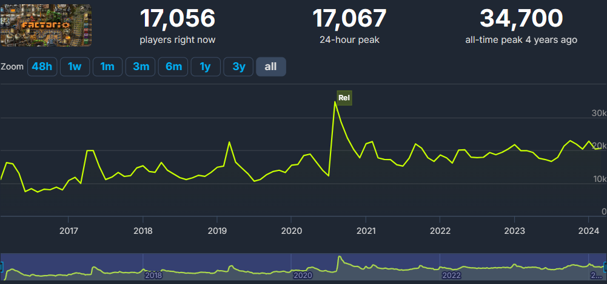

# Нерды против Гиков

:::danger
Это заготовка для будущей статьи, сейчас она не рекомендуется для изучения, а в будущем может измениться или вообще исчезнуть.
:::

:::tip Вся статья, кратко
Нерды, Гики, Нубы, кто все эти люди?
:::

:::warning Аффтару пофиг на ваши догмы **
Статья представляет собой авторское мнение и точка. Излагаемый материал является плодом его личных фантазий и может не соответствовать вашему представлению о прекрасном.

Бурление в среде плосковакцинированых и антиземельных экспертов по взятию городов за три дня и прочие специалисты по расшифровке вау-сигналов из Кольской скважины могут стать причиной разрыва чего-то ниже спины. Не ведитесь на провокации и не попадайтесь сами знаете кому.
:::

:::danger Осторожно, не для всех
Статья на столько пропитана философским смыслом, что понять его способны не все, а только лишь те, кто могут смотреть в завтрашний день. Сначала постройте большую базу, а потом возвращаетесь почитать написанное.

:::

*Factorio* не та игра, которая борется за массовость и пьедестал популярности, но играет в неё достаточно много народу. Естественно, со своим богатым внутренним миром переполненным самобытными понятиями об инженерии, сопромате и бытие определяющем сознание. В общем, сборище тут разношёрстное:

**

Каждая личность этой двадцатитысячной толпы считает себя целостным персонажем, знающим за виртуальную симуляцию даже больше чем сами разработчики из восточной Явропы (а чешские модели самые-самые в бразэрс). И в силу определённых причин в этом сборище образуются своеобразные группы социопатов и прочих задротов, чьи идеи в виде чертежей очень важны (по их мнению).

## Народные деффутаты

Первая группа таких личностей возникла давным-давно и является одной из самых старейших. Отличаются они от обычных игроков большим временем проведённым в игре и соответственно большим количеством виртуального опыта и как следствие большей раздражительностью и большим ЧСВ. В общем, это обычные додики, играющие довольно долго, что позволило им таки запустить хоть один спутник, пусть даже в онлайне с друзьями и от чего считающие себя гениальными инженерами и инженершами. Назовём условно таких персонажей *"НЕРДАМИ"*.

Нерды перфекционисты, любая оплошность в чертеже, как правило чужом, угнетает их сильнее алкогольной зависимости. Они выступают за обязательное следование всем законам инженерии и строительства, которые кроме им самим мало кому известны. Их главный лозунг исходит из рационализма, что требует меньше ресурсов, то есть труЪ. Элементарный чертёж производства `Electronic circuit`, который издревле известен как 3x2, они будут улучшать до бесконечности, попадая всякий раз на буллинг со своими новыми изобретениями о том, как правильней расставить манипуляторы. В мире *Factorio* у нердов могла бы быть идиллия, так как размах для творчества игра даёт просто огромный и применять свои представления об инженерии тут может любая кухарка.

## Если бы не одно, очень большое "но"...

Строя и развивая свои чертежи, увеличивая количество производимых научных пакетов и запуская всё больше и больше ракет в космос, рано или поздно любой нерд упрётся в максимальную производительность своего [убогого i5-9400](https://forums.factorio.com/viewtopic.php?p=583417#p583417), который уже не вытянет всех расчётов и игра остановится на симуляции со скоростью 5UPS:

Играть дальше в такое конечно невозможно. Поэтому предел мечтаний любого нерда, построившего чего-то там на 10key в минуту, заключается коплении штуки зелени на 7800X3D с материнкой, быстрой памятью и башенным кулером чтобы вставить всё это в свой старый дешманский корпус с kingston ssd на 240GB и интеграшкой на проце. Большего для игры в *Factorio* не требуется. Но отдав скопленное тяжким трудом американским буржуинам, нерд с грустью поймёт, что его обули и что все обзоры в интернете проплачены этими самыми буржуинами и получив вместо 5UPS на старом барахле 7UPS на новом, нерд пойдёт в твой туб, рассказывать как правильно строить кузницу на каменных печах ([пруф](https://www.youtube.com/watch?v=z7HcOThwafg&t=562s)) и как правильно расставлять палки с проводами ([пруф](/blog/2024/03/27/smelting-resources/)).

И вот тут из кустов появляются они...

## Озабоченные гигагерцами и тэрафлопсами

Однако, возможен иной путь развития. Заключается он не в строительстве правильных и красивых чертежей, копипастя их по 100500 раз, а в возведении чертежей, оптимизированных под особенности симуляции виртуального мира *Factorio*.

> Например, зная, что *Factorio* не очень хорошо обсчитывает манипуляторы, можно строить чертежи так, чтобы их количество было минимальными. Добиться этого можно разогнав производство модулями производительности `Productivity module 3`, огородив всё это кучей маяков `Beacon` с модулями скорости `Speed module 3`.

Адептов такого течения, назовём условно *"ГИКАМИ"*. Гик, это тот же нерд, только на максималках и ещё более ударенный [стальным инструментом](https://wiki.factorio.com/Steel_axe_(research)/ru), который `Steel axe`. Но не всякий нерд станет гиком, не путайте, это другое. Гики безбашенны, бескомпромиссны к производительности, безутешны к чужим UPS, без определенной цели в игре. Для гика существует только правила симуляции виртуального мира. Инженерная составляющая, как и разумность выбранного подхода, да и вообще развлекательная природа игры, гиков не интересует вовсе. Они тут, чтобы построить меньше манипуляторов, желательно вообще без поездов. Их никоим образом не трогает загрязнение и откуда добыть гигаватты на их изобретения.

## Два додика, со своей методикой

По существу оба типажа пограничны и живут в своём мире *Factorio*. Но нердам повезло больше. Во-первых, увидеть хоть сколько работающее своё творение они могут чаще. Многие игроки запустившие таки спутник, со временем тяготеют к перфекционизму и рационализаторству, игра как бы про это. Гики в основном играют в сильно модифицированных картах, с серыми квадратами вместо поверхности планеты и с бесконечно доступными ящиками ресурсов, разумеется без насекомых. Угадай, ху из нерд, ху из гик хере:

Во-вторых, чего не могут понять гики, сколько не переоптимизируй, всё равно выше какого-то уровня не прыгнешь. А в нормальной игре, с кусаками и поездами, никакая оптимизация не поможет. Поезда в *Factorio* это и сила и уязвимость. Хуже манипуляторов в игре симулируются поезда, от которых никак не избавиться, кроме специфичных настроек игры или с модами, то есть в выдуманном гиками мире.

С другой стороны, выдуманный гиками мир иллюзий тоже интересен. Там тоже можно хорошо проводить время и потом хвастаться в интернетах о своих достижениях. И также не хило отгребая буллинга от менее способных нердов и прочей шушеры на форумах. Коммюнити любит чмырить зазнаек, се ля ви.

В итоге понимая что мир не идеален, нерды укромненько пилят свои ситиблоки, признавая что до кучи их не построить, а только по одному-два на производимый предмет. Гики уходят в мир иллюзий и тоже что-то там пилят одним им известное. Прочий народец в основной своей массе, поиграв малость в симулятор завода, возвращается назад к пиву и танчикам. Явно выраженное тлетворное влияние балонской системы и прочих западных садомитов на традиционно-ортодоксальное образование. Сколько ещё бомб заложил Ленин?

## Кого в игре больше, нердов или гиков?

Гиков в игре единицы, всё-таки нужно обладать и знаниями и усидчивостью. Не каждый нормальный человек способен годами улучшать какой-то чертёж, да ещё и под законы неведомого мира симуляции.

Нердов и прочих задротов чуть более, с десяток другой может и наберётся. Тем, кому уже за тридцать пять и кто хоть как-то не обделён гуманитарным образованием, *Factorio* даёт возможность изрядно покумекать извилинами, заместо того, чтобы писать в телеграмах пакости про соседнюю страну, живя в точно таких же условиях.

Но больше всего в игре *"НУБОВ"*, непонятно каким образом сюда попавшие. Вот они:

Как видим [по статистике стима](https://steamcommunity.com/stats/427520/achievements), 40% игроков не смогли построить даже элементарную кузницу и освоить добычу нефти. Половина игроков не доехала до паровозов. Более 70% не освоили робототехнику. Запустить хоть как-то свой первый спутник, смогли меньше 20% всех игроков. А вы тут просите рассказать о том, [как строить большие ядерные электростанции](../PowerProduction/HugeNuclearPowerPlant.md).
