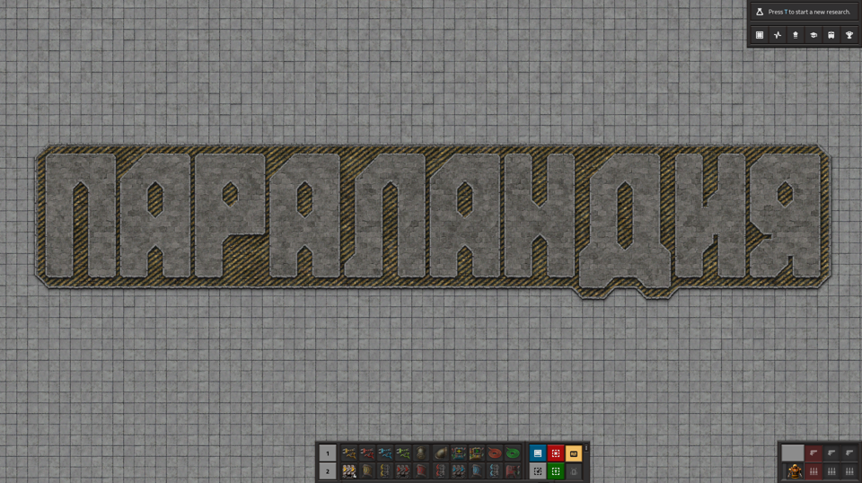

# Параландия

:::tip Вся статья, кратко
Параландия существует
:::

Некий анонимус долго играя в обычные игры *Factorio* столкнулся с трудностями самовыражения на публику. Волею случая суждено ему было открыть удивительно выдуманный мир, который назвал *Параландией*.

*Параландия* является вымышленным миром игры *Factorio*, в котором предметы появляются из ниоткуда и исчезают в никуда, а гигаватты берутся буквально из воздуха. По мнению [нердов](NerdsVsGeeks.md#народные-деффутаты), в *Параландии* играют разные извращенцы и прочие [любители](NerdsVsGeeks.md#озабоченные-гигагерцами-и-тэрафлопсами), хотя сами нерды очень даже непрочь прошмыгнуться в этот мир за поживой. Однако, играть в *Параландии* не возможно, но для тестирования множества чертежей и демонстрации разных творений очень даже приемлемо, чем многие и пользуются.

:::info На самом деле
Название было взято по образу мира поджигателя из *Team Fortress 2* и изначально называлась буквально *П**и**р**о**ландия*. Но потом кого-то торкнуло не по-детски по поводу плагиата и было решено называть это всё прекрасное *П**а**р**а**ландией*, что и закрепилось, как будто так плагиатом пахнет меньше.
:::

В реальности, *Параландия* это обычная игра песочница с квадратными серыми плитами в качестве поверхности. Попасть в неё может любой желающий из редактора сценариев *Factorio*, если выбрать *Sandbox* в качестве шаблона для нового сценария. В отличие от обычной игры *Factorio*, которая *Freeplay*, *Параландия* хороша тем, что здесь можно быстро строить и убирать всё что угодно. Здесь нет персонажа, который бегает и строит, здесь доступно строительство на всей карте сразу. Не нужно заботиться об открытии научных достижений. Можно изменять скорость симуляции *Factorio* и даже полностью останавливать её. Можно симулировать по одному кванту времени за раз и даже задавать количество квантов для симуляции. Можно получать неограниченного количество ресурсов и энергии. Можно не заботиться о загрязнении и прочее прочее прочее. В общем, можно всё что угодно и даже больше.

*Параландия* на момент публикации:

**
