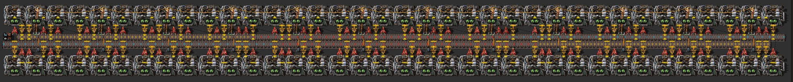

# Оценка качества чертежей

:::tip Вся статья, кратко
Не парься, ты всё равно не правильно делаешь свои чертежи
:::

Можно ли оценить два чертежа между собой и выбрать какой из них реализован лучше, а какой хуже? Или отдать всё на волю игрового случая и личных предпочтений? Кому-то не нравятся красные кофточки, кому-то нравятся розовые. Или в `Factorio` личные ощущения не работают?

## Продолжим задавать вопросы

А что вообще такое современные компьютерные игры? Что между ними общего и чем они отличаются? Что делают игроки в компьютерных играх? Слишком много вопросов даже для Ницше. Давайте поспрошаем умного Ай-Яй от индийских разработчиков:

 > Компьютерные игры являются сложной средой для решения задач, требующих творческого и стратегического мышления. От головоломок до эпичных сражений, игровая индустрия предлагает множество уникальных вызовов, сталкиваясь с которыми игроки подходят к их решению.

То есть, мелкомягкая дурилка из-за всех 11 окон прямо так и говорит, что в современных компьютерных играх игрокам приходиться принимать решения для преодоления игровых ситуаций. Даже если вы просто стреляете пикселами по пикселам, вы решаете какой пиксел более жирный сейчас, а какой подстрелим позже. В ролевых играх ваш выбор может определять сюжет и развитие персонажа. В некоторых играх можно решиться одеть кому-то на голову ведро, чтобы продвинуться дальше по игровому сюжету. В Overwatch одна и таже стратегия может быть как провальной, так и выигрышной. В польском Ведьмаке можно столкнуться с проблемой морального выбора и медведем. И все эти решения так или иначе кардинально отличаются друг от друга и не существует нормального способа оценить какое из принятых решений было лучше, а какое хуже. Многое обуславливается личными предпочтениями и ситуативностью игрового момента.

*Factorio* мало отличается от других компьютерных игр, тут тоже нужно принимать решения. Игра сложна. Не каждый зумер-снежинка справиться с предлагаемыми головоломками игры, тут полно скуфов и инженеров на пенсии. Публика тут надо сказать не очень разношёрстная. Но также игра и проста. Вы столкнётесь с сотнями разных требований решить какую-то головоломку имея какие-то ресурсы и вашим решением всегда будет какой-то чертёж или несколько чертежей удовлетворяющие исходным требованиям. И имея уже два или более чертежей, имеется возможность оценить каждый чертёж с математической точки зрения и выбрать лучший из них.

:::info Находка
В *Factorio* можно сравнивать между собой решения в виде чертежей на основе математики, а не личных пристрастий или игровой удачи.
:::

## Какие оценки качества есть в *Factorio*?

Скажем у нас есть два чертежа, которые производят одно и тоже, и давайте не будем долго бегать вокруг кота, сразу дёрнем его за хвост. В *Factorio* выделяются следующие оценки качества одинаковых чертежей, выигрывает тот, который:

* требует меньше ресурсов для своего строительства;
* занимает меньше места на игровой карте;
* требует меньше ресурсов во время своей работы;

ЗЫ: Хотите добавить своё мнение? Писчите на мыло, ссылка в подвале.

Иногда, бывает трудно сравнить два чертежа, так как их профиты с бенефитами сильно разняться. У одного чертежа может быть что-то хорошее одно, а у другого чертежа что-то хорошее другое. Тогда сравниваете возможные условия применения, для которых подходит тот или иной чертёж:

* сравнивайте также и игровую ситуацию, где можно чертежи применять.

## Пример сравнения и оценки качества

Возьмём пример, нужно переплавить один `!Express transport belt` экспресс конвейер руды используя `!Electric furnace` электрические печи. [Тута показываются](../RawResourcesProcessing/README.md#после-запуска-первого-спутника) хорошие чертежи для решения этой задачки. Вот этот чертёж нам подходит:

А также возьмём [чертеж для извращенцев](../RawResourcesProcessing/BigOreFoundry.md#плавим-руду-большими-кузницами) и сравним что у нас хорошего:

Чертёж первый, он явно занимает больше места, это минус. Вставленные модули эффективности второго уровня дают существенный бонус в виде малого загрязнения и потребления энергии. Всего 3 с половиной мегаватта электричества нужно чтобы такая кузница перемалывала экспресс конвейер руды. Местная фауна будет к вам более благосклонна, а производство электричества станет меньшей проблемой. И по ресурсам на строительство эта кузница будет несколько дешевле второго чертежа на маяках с модулями третьего уровня.

Второй чертёж, тут всё наоборот. Это обратная копия первого чертежа. Он занимает меньше места, это плюс.  Есть ещё один плюс, он потребляет меньше чем один конвейер руды, а выдаёт целый. Но он и потребляет 50 мегаватт энергии и загрязняет всё вокруг так, что даже вам будет дышаться плохо. Подумать только, полгигаватта энергии будут потреблять десять таких кузниц, а вам потребуется очень много руды, намного больше чем десять кузниц. Ну и стоимость строительства такого чертежа будет дороже.

Делаем вывод, какой чертёж лучший? Трудное сравнение, а значить придётся сравнивать применение к конкретной игровой ситуации. Если играем без фауны или без загрязнения и как-то решили вопрос с производством большого количества электричества, то можно и маяками побаловаться. Если фауна негодуэ и с ураном проблема, то берите первый, не пожалеете.

## Выводы

Принимаемые решения в *Factorio* можно оценивать и выбирать лучший чертёж на основе указанных ранее критериев оценки качества. И даже если нам бывает трудно определиться с выбором правильного чертежа, то нужно искать другие исходные данные или определяться с условиями их применения. Но никак не впадать в субъективные суждения. В *Fаctorio* правит царица всех наук, цэ математика, а не личные предпочтения.
