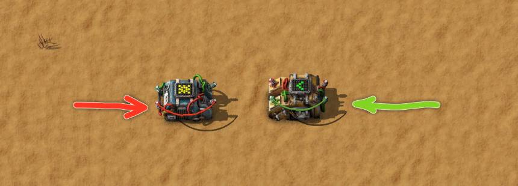
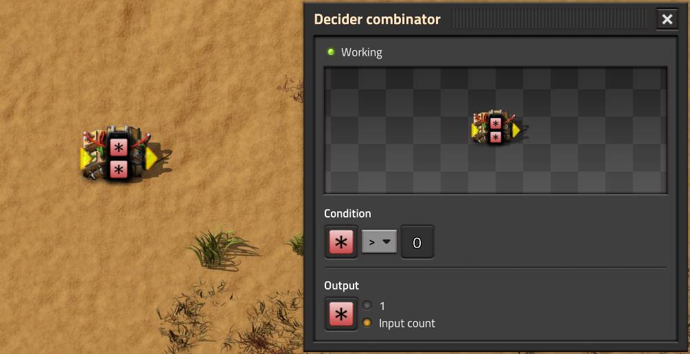
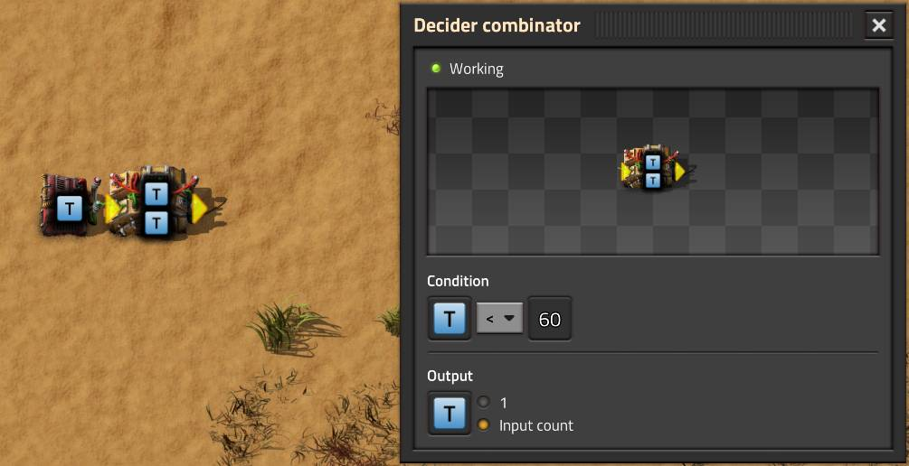
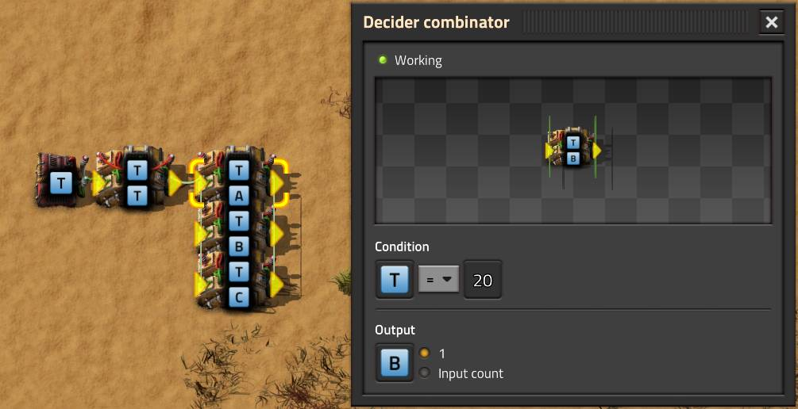

# Комбинаторы

:::tip Вся статья, кратко
Здесь собраны простые примеры логических сетей с комбинаторами и прочей лабудой.
:::

Использовать комбинаторы и чертежи с ними можно [после запуска первого спутника](../HowToStartNewGame/README.md#после-запуска-спутника) или чуток раньше. [На начальном этапе игры](../HowToStartNewGame/README.md), когда ещё приходиться махать киркой `Steel axe` для добычи древесины `Wood`, применение комбинаторов практически бесполезно по причине отсутствия потребности в автоматизации и управления чем либо, так как всё можно сделать красным `!Red wire` или зелёным `!Green wire` проводом, [пруф](SimpleExamples.md).

## Простые кирпичики

Два комбинатора в *Factorio* `!Decider combinator` `!Arithmetic combinator` по сути являются смекалистыми кирпичиками, из которых можно построить аж вавилонскую башню автоматизации и уже из неё управлять разными устройствами, а не просто включать и выключать лампочку `!Lamp` растрачивая по пять киловатт электричества в пустую. Однако, есть такая особенность у этих кирпичиков, что их можно замкнуть самих на себя сигнальным проводом, аки соединить выход со входом, аки наоборот тоже вестимо.



И вот это уже не просто кирпичик, а целая `вундершняга`, всем кирпичикам кирпичик. И профит тут, что любой сигнал можно повторить и запомнить. Причём запомнить и повторить можно множество разных сигналов.

### Вундершняга как ячейка памяти

Самой базовой фичей `вундершняги` является, так называемая, ячейка памяти. Если в качестве выходного сигнала, установить единицу, то `вундершняга` будет вечно помнить всё, что к ней когда-либо поступало на вход.


Условием на `вундершняге` можно пытаться сбрасывать хранящиеся сигналы, но не всегда возможно без второго или третьего комбинатора. Типичное применение является [перевод паровых и ядерных электростанций в резерв](../PowerProduction/BackupSteamPower.md#нудная-теория).

### Вундершняга как счётчик

Та же самая `вундершняга`, с поступившим количеством в качестве выхода, уже будет не только помнить предыдущие количества, но ещё и складывать новые.



Самостоятельного применения имеет мало, такая `вундершняга` хороша только в купе с другими комбинаторами. Опять-таки, условием `вундершняги` можно пытаться сбрасывать подсчитываемые сигналы, успехов.

### Таймер

Счётчик превращается в [таймер квантов времени *Factorio*](../Additionals/FPSandUPS.md#чё-за-ups), если постоянным комбинатором `Constant combinator` подкидывать на `вундершнягу` какой-то виртуальный сигнал в количестве `АДЫН`, можно и `100500` сразу. Также можно задать условие сбрасывания таймера, например при достижении значения `60`, что равно [одной реальной секунде, но это не точно](../Additionals//FPSandUPS.md#как-решать-вопросы-с-производительностью). А можно и не задавать никаких условий, тогда таймер будет крутиться вечно, и это тоже не точно.

:::note На самом деле **
Такой вечный таймер будет крутиться почти 10 часов, а потом всё равно сбросится, як одно из простых чисел Мерсенна, оно же `2^31-1`, оно же `Int32.MaxValue`, оно же `2 147 483 647` и прочие, прочие, прочие онные. Ну вы поняли, `.NET` хватит всем, как и 64 килобайта мозгов... Или 640, да пофиг.
:::



Таймеры можно применять повсеместно для синхронизации по времени всего и вся, но никто этим не заморачивается ибо скучно, что грустно. Типичный пример где очень полезна синхронизация манипуляторов: [большой литейный завод](../RawResourcesProcessing/BigOreFoundry.md#вундершняга-как-таймер).

### Генератор импульсов

Самая бесполезная приблуда, которую можно соорудить из `вундершняги`, которая таймер. Суть сабжа в тём, щёбы определённые значения от таймера времени *Factorio* перевести в понятные сигналы. Например, `!Signal T` который `20`, будет `!Signal B`, который `АДЫН`, и где-то потом уже реагировать просто на `!Signal B`, или какие угодно другие, `!Signal A` или `!Signal C` с какими угодно другими значениями для `!Signal T`.



На самом деле генератор импульсов не бесполезен, но без него зачастую можно и обойтись, сэкономив таким образом пару киловатт энергии, которая уходит на питание преобразующих значения таймера комбинаторов ([аффтар нэрд](../Additionals/NerdsVsGeeks.md#народные-деффутаты)). Генераторы импульсов можно использовать везде, где есть реакция по таймеру, всё тот же [большой литейный завод](../RawResourcesProcessing/BigOreFoundry.md#вундершняга-как-генератор-импульсов).

:::note
Ещё одно применение яки "сжатие условия", но это уже не совсем генератор импульсов. Например, `!Signal T`= `20`, который `!Signal B` сравнивается с `!Signal T`= `40`, который `!Signal C`. Просто сравнить `!Signal T`= `20` с `!Signal T`= `40` не получиЦа, тут вам не ассемблер. Хотя и на ассемблере ни-ни ибо вначале нужно загрузить щёта в регистры, а уже потом только сравнивать:

```asm
MOV AL,"щёта T=20"
MOV BL,"щёта T=40"
CMP AL,BL
JG "куда-то"
```
:::

## Кому всё это надо?

Один комбинатор в поле не воин. Чтобы сделать что-то полезное нужна парочка другая в связке. Можно делать белых котиков из лампочек, которые машут хвостиками. Можно даже нарисовать какого-то колобка жрущего точки и осьминогов в лабиринте. Примеров 100500 и чуток больше найдётся.

Вопрос: а сколько примеров с комбинаторами реально полезны для игры в *Factorio*?\
Ответ: *можно обойтись без комбинаторов и вовсе*.\
Вот это поворот!

Если по существу вопроса, то можно выделить всего парочку случаев, где комбинаторы хорошо помогают, но и без них всё тоже работает.

### Случай первый, ядрено-энергетический

Без комбинаторов не получиться [переводить ядерные электростанции в резерв](../PowerProduction/BackupSteamPower.md#с-теорией-всё-начинаем-творить), это когда солнечных панелей `Solar panel` и аккумуляторных блоков `Accumulator` хватает. Так же, без комбинаторов не получиЦа [управлять загрузкой урановых топливных элементов](../PowerProduction/NuclearPower.md#начнём-с-теории) `Uranium fuel cell` в реактор.

С другой стороны, да пофиг. Можно вжарить расщепление атомов по полной и *кому какое щё*? Перегрев реактора ни на что не влияет, только на расходование урановых топливных элементов в пустую. Перепроизводство электричества тоже не особо колышет тухес. Проблем с добычей урана `Uranium ore` никогда не возникает, так как в *Factorio* имеется полный дисбаланс в отношении его добычи и использования, причём в пользу игрока. Освоение двух маленьких месторождений и процесс имени Коварекса `Kovarex enrichment process` хватит для удовлетворения потребностей и в тераватах электичества и в ядерном топливе `Nuclear fuel` для *over 9000* поездов `Locomotive`. С паровыми электростанциями на бойлерах `Boiler` ещё проще, достаточно и [двух сигнальных проводов](../PowerProduction/BackupSteamPower.md#простой-костыль) `!Green wire` `!Red wire`.

### Случай второй, погрузко-разгрузка локомотивов

Тут интересней, без комбинаторов мы можем получить кривую загрузку буферных сундуков на месторождениях добычи. Те же самые траблы будут и с разгрузкой добытого в буферные сундуки. Да и при перевозке произведённых предметов между центрами производства, они же *city-blocks*, всё то же самое на станциях погрузки и разгрузки. Также хочется [управлять доступностью железнодорожных станций](../LoadingAndUnloadingTrains/README.md#погрузка-предметов), чтобы не гонять попусту поезда. Хочется автоматически снабжать форпосты защищающее от местной фауны.

С другой стороны, да ваше пофиг. Просто добавь побольше поездов, освой побольше месторождений и влипи балансеров на конвейеры, усё. Все равно, рано или поздно придётся осваивать новые месторождения и запускать новые паровозы. Про форпосты, кто вообще напрягается? Фауна и загрязнение тормозят изрядно игру. Да и бегать их истреблять это ещё тот геморрой, многие таки играют без сего удовольствия. Да и для снабжения форпостов можно обойтись и без комбинаторов, фильтрация ячеек на хабар в вагонах вам в помощь. Разгрузка хабара на форпостах тоже без проблем, хватит и сигнальных проводов.

### Другие симптомы?

Других клинических случаев, где нужны комбинаторы, не наблюдаю. Может у вас есть интересные примеры, что без оных ну ни как вообще? Тогда делитесь чертежами и не стесняйтесь. [Мыло](mailto:factorio@yrfle.com?subject=У%20меня%20есть%20чертёж%20с%20комбинаторами!), [коменты на ютубе](http://www.youtube.com/watch?v=wzzepgeYcpw), может ещё что-то?

## Больше подробностей

Детальные чертежи и пояснения стоит перенести в разделы посвященные конкретным применениям комбинаторов. Там где рассматриваются вопросы производства ядерной энергии и транспортировки ресурсов и предметов. А вот теоретический разбор можно найти в разных выпусках на YouTube канале. Ссылки привожу с установленными временными метками на описываемый тут материал:

[**](http://www.youtube.com/watch?v=wzzepgeYcpw)

[**](http://www.youtube.com/watch?v=FfmslzAyOsc&t=42s)

[**](http://www.youtube.com/watch?v=e3mbmKIWLns&t=659s)
