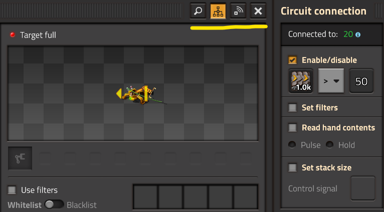

# Подключаемые устройства

:::danger
Это заготовка для будущей статьи, сейчас она не рекомендуется для изучения, а в будущем может измениться или вообще исчезнуть.
:::

:::tip Вся статья, кратко
Тут ты найдёшь всё про подключение к логической сети. И даже к сети логистической.
:::

Всё, что можно соединить сигнальными проводами, `Red wire` или `Green wire`, может быть подключено к логической сети. Такие устройства имеют кнопку ** в верхнем правом углу окна свойств. Там же отображается и номер логической сети, к которой подключено устройство. Нажав на кнопку ** устройство может быть подключено к логистической сети дронстанций `Roboport`, если оно находится в зоне покрытия. Это позволяет устанавливать дополнительные условия, а также смешивать условия логической и логистической сети.

**

А далее рассмотрим все устройства, которые могут быть подключены к логической или логистической сети и изучим на что они способны.

## Конвейеры

`Transport belt` `Fast transport belt` `Express transport belt` `Turbo transport belt`

Конвейер отсылает информацию о своем содержимом в сеть. Конвейер может быть остановлен при определенных условиях логической и логистической сети. Возможны три режима работы:

* *Pulse mode*: Сигнал о предмете подаётся только на 1 тик, когда предмет попадает на конвейер, а затем пропадает.
* *Hold mode*: сигналы предметов подаются непрерывно до тех пор, пока предметы находятся на конвейере.
* *Hold mode (All belts)*: Сигналы предметов также подаются непрерывно, но для всех предметов находящихся на соседних конвейерах. Подсчет ведётся через подземные конвейеры, но не через разделители или боковые стыки конвейеров.

## Манипуляторы

`Burner inserter` `Inserter` `Long-handed inserter` `Fast inserter`\
`Bulk inserter` `Stack inserter`

Манипулятор отправляет информацию о взятых предметах. Возможны два режима работы:

* *Pulse mode*: Сигнал, длительностью 1 тик, посылается, когда предмет взят.
* *Hold mode*: Сигнал посылается пока предмет удерживается манипулятором.

Все манипуляторы могут быть отключены по условиям логической и логистической сети. Фильтры и размер стека манипулятора также могут быть переопределены из по условиям логической и логистической сети.

## Сундуки и Резервуар

`Wooden chest` `Iron chest` `Steel chest` `Storage tank`\
`Storage chest` `Active provider chest` `Passive provider chest`\
`Requester chest` `Buffer chest`

Все сундуки и резервуар отправляют информацию о своём содержимом в логическую сеть. Логистические сундуки дополнительно отправляют информацию о своём содержимом в логистическую сеть, если находятся в зоне действия дронстанции. Запросы предметов из логистической сети для сундуков запроса и буферных сундуков могут быть установлены сигналами логической сети. Также все логистические сундуки могут отключаться как из логической сети, так и из логистической сети. Отключенные сундуки не посылают сигналов в логистическую сеть и не запрашивают предметов из неё.

<!--

### Заводы

`Assembling machine 1` `Assembling machine 2` `Assembling machine 3`\
`Oil refinery` `Chemical plant` `Centrifuge`\
`Crusher` `Foundry` `Electromagnetic plant` `Biochamber` `Cryogenic plant`

### Реакторы

`Nuclear reactor` `Heating tower`

Реактор и нагревательная башня могут выводить в сеть контура любое топливо, включая топливо, сжигаемое в данный момент, а также его текущую температуру
По умолчанию: Считывание температуры = `signal T`

### Хуйня какая-то

`Agricultural tower`

Can output any seeds and harvested plants in its inventory

Agricultural tower can be enabled on a condition

Can be enabled on a logistic network condition

## Печи и переработчик

`Stone furnace` `Steel furnace` `Electric furnace` `Recycler`

## Грузовая посадочная площадка

`Cargo landing pad`

## Ракетная шахта

`Rocket silo`

## Хаб космической платформы

`Space platform hub`

## Коллекционер астероидов

`Asteroid collector`

## Пушки

`Gun turret` `Laser turret` `Flamethrower turret` `Rocket turret` `Tesla turret` `Railgun turret`

Can send their respective ammunition to the circuit network
Laser and tesla turrets will not send any signal if this option is selected, due to not using ammo

Can enable, set priorities, and ignore priorities on a condition

Can be enabled on a logistic network condition

## Артиллерия

`Artillery turret`

Can send its ammunition to the circuit network

Can be enabled on a condition

Can be enabled on a logistic network condition

## dddd

|Ынглыш|Название|Выходные сигналы в проводную логическую сеть по сигнальным проводам|Управление в проводной логической сети по сигнальным проводам|Управление в беспроводной логистической сети через дронстанции|
|:-|:-|:-|:-|:-|
| `Storage tank` | Резервуар|Резервуар отправляет информацию о жидкостях.|||
| `Gate` | Ворота|Ворота посылают сигнал в логическую сеть.|Ворота могут быть открыты по условию.||
| `Rail signal`| Ж/д светофор|Ж/д светофор отправляет в сеть информацию о своем состоянии.|Ж/д светофор по условию может показывать красный сигнал.|
| `Rail chain signal` | Проходной ж/д светофор|То же, что и выше.||
| `Train stop` | Железнодорожная станция|Ж/д станция передает содержимое и идентификатор остановившегося поезда. Количество поездов, идущих к станции, отправляется в логическую сеть. При чтении содержимого поезда, количество жидкостей округляется вниз до ближайшего целого, исключая случай, когда жидкости < 1, тогда число округляется до 1.|Ж/д станция передает сигналы из логической сети поезду, которые используются в условиях ожидания. Помимо этого сеть может включать и выключать станцию. Максимальное число поездов, способных на движение к станции ("лимит поездов"), можно установить логической сетью.||
| `Accumulator` | Аккумуляторный блок|Отправляет значение уровня заряда в процентах.||
| `Roboport` | Дронстанция|Отправляет информацию о содержимом логистической сети и/или статистику по дронам. Сигналы статистики по дронам настраиваются.|||
| `Mining drills` | Бур|Бур отправляет информацию об ожидаемых ресурсах, либо только от этого бура, либо со всего месторождения.|Бур может быть включен по условию.||
| `Pumpjack` | Нефтяная вышка|Отправляет текущих уровень добычи.|Нефтяная вышка может быть включена по условию.||
| `Power switch` | Выключатель питания||Выключатель питания может включить электрическую сеть по условию.||
| `Programmable speaker` | Программируемый динамик||Показывает предупреждение и издает звук, основанную на логическом сигнале. Может использоваться для создания простейших мелодий.||
| `Lamp` |Фонарь||Фонарь может быть включен по условию. Если передается цветовой сигнал, то он будет светиться этим цветом.||
| `Offshore pump` |Насос||Насос может быть включен по условию.||
| `Pump` |Помпа||Помпа может быть включена по условию.||
-->