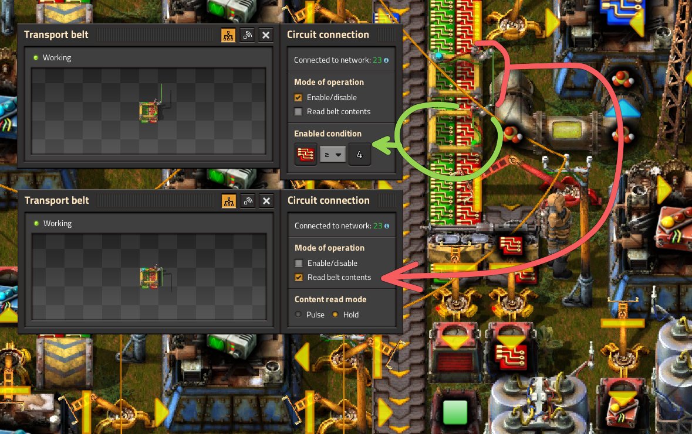

# Логическая сеть и комбинаторы

:::tip Вся статья, кратко
Логические сети в *Factorio* - это наше всё для управления и автоматизации чего там.
:::

С помощью разноцветных проводов, зелёных `Green wire` и красных `Red wire`, которые соединяют различные игровые элементы як сундуки, резервуары, конвейеры и [прочую лабуду](https://wiki.factorio.com/Circuit_network#Devices), можно контролировать поток ресурсов, управлять производственными линиями и оптимизировать эффективность работы почти всего и вся. Основой сети являются комбинаторы, хотя иногда можно и без них.

Имеется три [типа комбинаторов](https://wiki.factorio.com/Circuit_network#Combinators), которые работают на основе заданных математических операций и логических условий. Арифметический комбинатор `Arithmetic combinator` выполняет базовые арифметические операции, сложение, вычитание, умножение и деление. Сравнивающий комбинатор `Decider combinator` сравнивает два сигнала и что-то решает. Постоянный комбинатор `Constant combinator` генерирует заданные сигналы [каждый квант игрового времени](../Additionals/FPSandUPS.md#как-решать-вопросы-с-производительностью).

[Сигналом](https://wiki.factorio.com/Circuit_network#Virtual_signals) может быть всё что угодно, реальные предметы, жидкости, а также виртуальные сигналы, которые не привязаны к игровым предметами и являются числами, буквами, цветами и ещё какая-то фигня. Вся суть в том, что по раскрашенным проводам в логической сети гуляют сигналы от комбинатора к комбинатору и преобразуются в другие сигналы. А ещё, в зависимости от сигналов можно что-то включать или выключать. При этом сигналы по разным проводам не смешиваются друг с другом, если только провода не соединены вместе.

## Самый простой пример

Самое простое, что можно сделать, это написать щёта впечатляющее на заборе, точнее на постоянном комбинаторе `!Constant combinator`. Чтобы создать некое поэтическое творение используются виртуальные сигналы, которые включают буквы английского алфавита (A-Z) и цифры (0-9). Букварь из великого и могучего не предусмотрен, но можно выкрутиться, например так:

[Подробнее про письмена](./Writing.md)

## Простой пример

Реально полезный простой пример можно реализовать без комбинаторов, только с одним проводом, без разницы какого цвета. Соединим например какой-то сундук `Steel chest` и лампу `Lamp` зелёным проводом и зададим следующее условие на лампе:

Такая конструкция будет зажигать лампу, если сундук пустой и гасить её, если в сундуке чёта есть. Похоже на простую световую сигнализацию по условию.

Другим простым примером можем быть управление движением предметов на конвейере, если имеется их достаточное количество. Это позволяет накапливать предметы для производства и отбирать их с конвейера при перепроизводстве. Для этого достаточно соединить два сочления конвейера цветным проводом, зелёным например. Первое сочление (красная стрелка) ставим на считывание количества предметов. На втором сочлении задаём условие движения конвейера (зелёная стрелка).

Таким образом, мы будем производить модули производительности и складывать в сундуки микросхемы, только если их количество производится в переизбытке.

[Ещё разные примеры](./SimpleExamples.md)

## Больше подробностей

В [*WiKi* у *Factorio*](https://wiki.factorio.com/Tutorial:Combinator_tutorial) есть множество неплохих примеров, изучить которые безусловно полезно.
