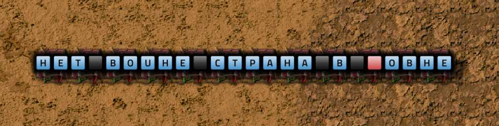
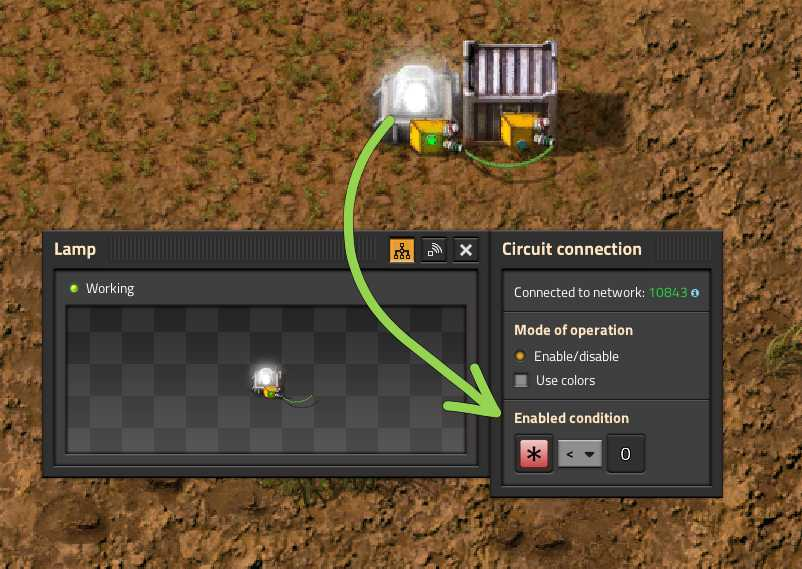
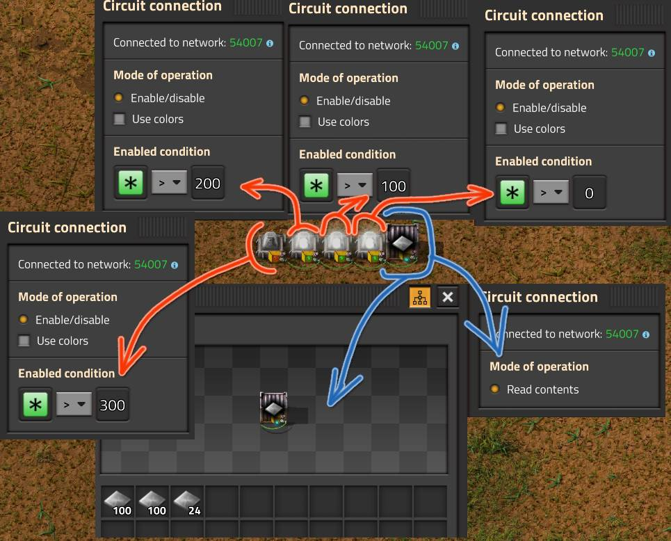

# Логическая сеть и комбинаторы

:::tip Вся статья, кратко
Логические сети в *Factorio* - это наше всё для управления и автоматизации чего там.
:::

С помощью разноцветных проводов, зелёных `Green wire` и красных `Red wire`, которые соединяют различные игровые элементы як сундуки, резервуары, конвейеры и [прочую лабуду](https://wiki.factorio.com/Circuit_network#Devices), можно контролировать поток ресурсов, управлять производственными линиями и оптимизировать эффективность работы почти всего и вся. Основой логической сети являются комбинаторы, хотя иногда можно и без них.

## Комбинаторы и сигналы по проводам

Имеется три [типа комбинаторов](https://wiki.factorio.com/Circuit_network#Combinators), которые работают на основе заданных математических операций и логических условий. Арифметический комбинатор `Arithmetic combinator` выполняет базовые арифметические операции, сложение, вычитание, умножение и деление. Сравнивающий комбинатор `Decider combinator` сравнивает два сигнала и что-то решает. Постоянный комбинатор `Constant combinator` генерирует заданные сигналы [каждый квант игрового времени](../Additionals/FPSandUPS.md#как-решать-вопросы-с-производительностью).

[Сигналом](https://wiki.factorio.com/Circuit_network#Virtual_signals) может быть всё что угодно, реальные предметы, жидкости, а также виртуальные сигналы, которые не привязаны к игровым предметами, и которые являются числами, буквами, цветами и ещё какая-то виртуальная фигня. Вся суть в том, что по раскрашенным проводам в логической сети гуляют сигналы от комбинатора к комбинатору и преобразуются в другие сигналы. А ещё, в зависимости от сигналов можно что-то включать или выключать. При этом сигналы по разным проводам не смешиваются друг с другом, если только провода не соединены вместе.

## Самый простой пример

Самое простое, что можно сделать, это написать щёта впечатляющее на заборе, точнее на постоянном комбинаторе `!Constant combinator`. Чтобы создать некое поэтическое творение, используются виртуальные сигналы, которые включают буквы английского алфавита (A-Z) и цифры (0-9). Букварь из великого и могучего не предусмотрен, но можно выкрутиться, например так:

[Подробнее про письмена](./Writing.md).

## Просто простой пример

Реально полезно простой пример можно реализовать без комбинаторов, только с одним цветным проводом, без разницы какого цвета. Соединим например некий сундук, например стальной `Steel chest`, и лампу `Lamp` зелёным проводом `Green wire` и зададим следующее условие на лампе:

Такая конструкция будет зажигать лампу, если сундук пустой и гасить её, если в сундуке чёта есть. Похоже на простую световую сигнализацию по условию. Такой же чертёж подойдёт и для цистерны `Storage tank`.

Можно вообще создать полоску из ламп и иллюминировать ими в зависимости от наполняемости сундука или цистерны. Пример:

[Ещё разные примеры](./SimpleExamples.md).

## Больше подробностей

В [*WiKi* у *Factorio*](https://wiki.factorio.com/Tutorial:Combinator_tutorial) есть множество неплохих примеров, изучить которые безусловно полезно.
