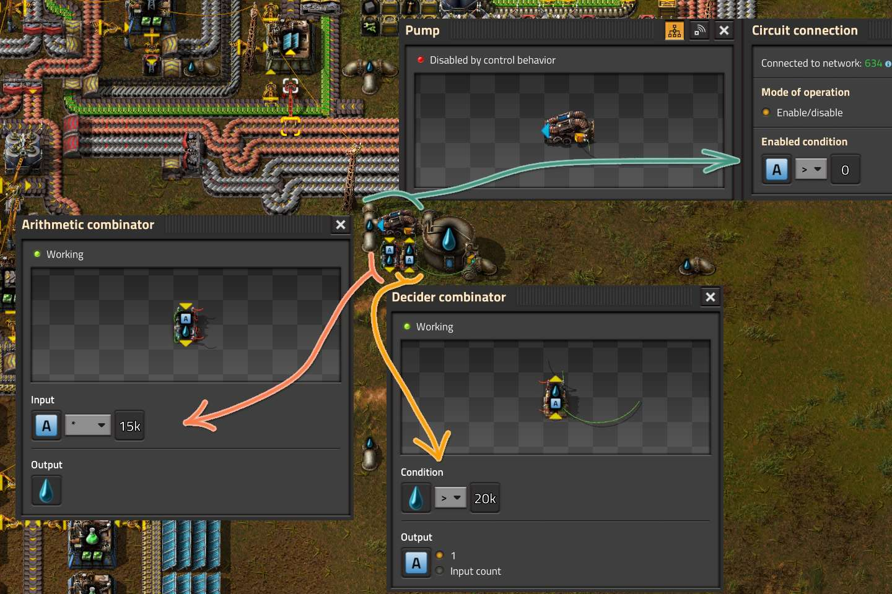

# Логическая сеть и комбинаторы

:::tip Вся статья, кратко
Логические сети в *Factorio* - это наше всё для управления и автоматизации чего там.
:::

С помощью разноцветных сигнальных проводов, зелёных `Green wire` и красных `Red wire`, которые соединяют различные игровые элементы як сундуки, резервуары, конвейеры и [прочую лабуду](https://wiki.factorio.com/Circuit_network#Devices), можно контролировать поток ресурсов, управлять производственными линиями и оптимизировать эффективность работы почти всего и вся. Основой логической сети являются комбинаторы, хотя иногда можно и без них.

## Комбинаторы и сигналы по проводам

Имеется три [типа комбинаторов](https://wiki.factorio.com/Circuit_network#Combinators), которые работают на основе заданных математических операций и логических условий. Арифметический комбинатор `Arithmetic combinator` выполняет базовые арифметические операции, сложение, вычитание, умножение и деление. Сравнивающий комбинатор `Decider combinator` сравнивает два сигнала и что-то решает. Постоянный комбинатор `Constant combinator` генерирует заданные сигналы [каждый квант игрового времени](../Additionals/FPSandUPS.md#как-решать-вопросы-с-производительностью).

[Сигналом](https://wiki.factorio.com/Circuit_network#Virtual_signals) может быть всё что угодно, реальные предметы, жидкости, а также виртуальные сигналы, которые не привязаны к игровым предметами, и которые являются числами, буквами, цветами и ещё какая-то виртуальная фигня. Вся суть в том, что по раскрашенным сигнальным проводам в логической сети гуляют сигналы от комбинатора к комбинатору и преобразуются в другие сигналы. А ещё, в зависимости от сигналов можно что-то включать или выключать. При этом сигналы по разным сигнальным проводам не смешиваются друг с другом, если только сигнальные провода не соединены вместе на каком-то комбинаторе.

## Самый простой пример

Самое простое, что можно сделать, это написать щёта впечатляющее на заборе, точнее на постоянных комбинаторах `Constant combinator`. Чтобы создать некое поэтическое творение, используются виртуальные сигналы, которые включают буквы английского алфавита (A-Z) и цифры (0-9). Букварь из великого и могучего не предусмотрен, но можно выкрутиться, например так:


[Подробнее про письмена](./Writing.md).

## Просто простой пример

Ещё один простой пример можно реализовать без комбинаторов, только с одним сигнальным проводом, без разницы какого цвета. Соединим например некий сундук, например стальной `Steel chest`, и фонарь `Lamp` зелёным сигнальным проводом `Green wire` и зададим следующее условие на фонаре:


Такая конструкция будет зажигать фонарь, если сундук пустой и гасить его, если в сундуке чёта есть. Похоже на простую световую сигнализацию по условию. Такой же чертёж подойдёт и для цистерны `Storage tank`.

Можно вообще создать полоску из фонарей и иллюминировать ими в зависимости от наполняемости сундука или цистерны. Пример:


В сундуке видим, лежат 224 железные плиты `Iron plate`. Соответственно, светят три первых фонаря, а последний не светит. Всё просто. [Ещё разные примеры без комбинаторов](./SimpleExamples.md).

## Простой пример с комбинаторами

Комбинаторами можно сделать много чего интересного, но для простой демонстрации трудно что-то придумать. Всё простое делается обычными сигнальными проводами, без комбинаторов. Попробую привести пример управления потоками жидкости, хотя такой пример и для сундуков тоже подходит.

Допустим мы хотим держать какое-то минимальное количество жидкости в цистерне `Storage tank` и расходовать её при заполнении цистерны. Для этого понадобиться всего два комбинатора и помпа `Pump`. Первый, сравнивающий комбинатор `Decider combinator`, будет открывать помпу если количество жидкости скопилось больше, скажем 20K единиц в цистерне. Второй, арифметический комбинатор `Arithmetic combinator` будет вычитать количество жидкости, которую можно слить при переполнении, пусть это будем 15K.



То есть, мы сливаем жидкость из цистерны как только её накопится больше двадцати тысяч и останавливаем слив, как только стало пять тысяч единиц. Для примера с сундуками вместо цистерны, управлять нужно поведением выгружающего манипулятора, вместо помпы.

 ```blueprint title="Чертёж для дизельного топлива (можно менять на любое другое)"
 0eNqdld2OmzAQhd9lLitYgSHZhItKfY5qhQhMyKhgW/6JGkV+99rQQrbANt0bJOPxmeGbM+YOp86iVMQNFHegWnANxfc7aGp51YV35iYRCiCDPUTAqz6stBGqajE2Ff8BLgLiDf6EInVvESA3ZAhHnWFxK7ntT6h8wKQgSfrjIm6VsLzxylJof0zwkNNLHdLDyy6CGxTxPktfdj5JQwrrMYS5aKHNZm3byxVFlmzq7SPwn26U6MoTXqorCRVO1aRqS6b0e80kdSalTbkAdCVlrH8zMxoi4m+BT+DqWXnISVj0slKVCTngK7hxn4+16CCZhkerEPkjRGqg8Ej+FBWWzL05t8Iim6qoFJlLj4bq2Oc9ER/yruA+zriT93DydTiz8sxHfxaQxqBRzpzSXZJ4VkKiJzWUAV/8UWGNtCvi585SM0t31F5MLKgDt4VXYfME3AjYc8HpRify9ZlZcSd7aMDgz8+aYquU3VRKgzU1qD52BEveO2LNA7+FnjPAdo8eB4QlQ+P/GpLtzv9j7uTNF2e5Kc9K9CVxrwHFueo0/ocxsoUxovVO5B9aJlv0aUNma6z3z1+fLJ+6x46L6y5kHm704uEHEMEVlR7v10Oavx7Z62F/TLIkd+4XkTUSgA==
 ```

## Больше подробностей

В [*WiKi* у *Factorio*](https://wiki.factorio.com/Tutorial:Combinator_tutorial) есть множество неплохих примеров, изучить которые безусловно полезно. Хотя там такой задроцкий материал, что без горячительного не разобраться. Лучше у меня читайте и подписывайтесь на мой [YouTube](https://www.youtube.com/@AwesomeFactorio?sub_confirmation=1). А вот ещё материалы:

[**](http://www.youtube.com/watch?v=wzzepgeYcpw)
