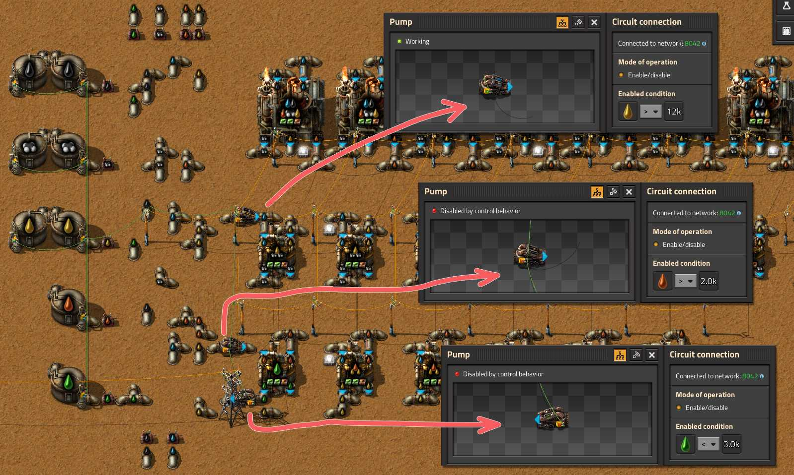

# Простые примеры

:::tip Вся статья, кратко
Здесь собраны простые примеры логических сетей, без комбинаторов и прочей лабуды, только красные `!Red wire` и зелёные `!Green wire` сигнальные провода, только чешский *hardcore*.
:::

Использовать эти чертежи можно на любом этапе игры, с самого начала и до запуска [корованов ракет](../PowerProduction/README.md#этап-второй-и-корованы-ракет).

:::info Удивительное
Готовые чертежи, содержащие сигнальные провода, можно строить без [исследования логической сети](https://wiki.factorio.com/Circuit_network_(research)) `Circuit network`. Цветные провода появятся из ни откуда, даже если вы ещё не можете их производить из-за отсутствия исследования.
:::

Создавать логические сети без комбинаторов весело и прикольно. Одним сигнальным проводом соединяем два элемента игры. Первый подсоединившийся отсылает в сеть своё состояние, режим чтения. Второй присоединившийся как-то реагирует на полученное состояние, режим действия. Профффит.

## Ограничение движения предметов по конвейеру

Самым простым примером может быть управление движением предметов на конвейере. Следует соединить два сочленения конвейера, например зелёным проводом `Green wire`, как показано на рисунке ниже. Первое сочленение (верхнее) ставим на считывание количества предметов в режиме *Hold*, то есть постоянно пока на сочленение щёта есть. На втором сочленении (нижнее) задаём условие для минимального количества предметов, которые будем накапливать на предыдущем сочленении. Движение предметов по конвейеру продолжится, если накопилось достаточное количество предметов.

На рисунке пример, как отбирать с конвейера лишние шестерни `Iron gear wheel` и трубы `Pipe`, которые не используются в производстве твёрдотопливных двигателей `Engine unit`:


```blueprint title="Чертёж с настроенными значениями"
0eNqdUltuwyAQvMt+kyh23lyliixsNslKNliwjmpFHKAH6cV6koLdpmmSfqQ/INhhZmfYM5R1h60jwyDPQJU1HuTLGTwdjKrTHfctggRibECAUU06sVPGt9bxpMSaIQggo/EVZBZ2AtAwMeHINBz6wnRNiS4C/uIQ0Fofn1mTVCPVJM+mSwE9yNV8uowSmhxWI2AhILbKztZFiUd1IuvSq4pc1REXsaYvVHtynos7Qydy3MWbSz8jYoIndD0fyRySrRQIq5TOINm0yilOYvDx9j4AviTRqLLGQpNPO0h2Hf5UHSpdHJXRqTWOkcRs9qr2V5DvwohtrI4ks7EDM9r2qfssLQeHaK7TJQ0yD7sQgrhLPP9P4vmTid/avzH3yP/vhB7Zz56xnw324/QNkyqvBltA/FI/uMg32WK9zdeb1XY2ny1C+ASpXw5K
```

ИсчЁ адЫн пример, с теми же настройками на сочленениях конвейера. Первое сочленение (красная стрелка) ставим на считывание количества предметов. На втором сочленении задаём условие движения конвейера (зелёная стрелка).


```blueprint title="Чертёж с настроенными значениями"
0eNrFk0tOwzAQhu8ya7dqQvrygougKnLiaWspsaPxpKKqfAAOwsU4CXZSoJSXBAs2scYz/v+Zz84JqqbHjoxlkCcwtbMe5N0JvNlZ1aQ9PnYIEgxjCwKsalPEpKzvHPGkwoYhCDBW4z3ILGwEoGXDBkelITiWtm8rpFjwlYaAzvl4zNnkGqUmxWI6F3AEuVxP59FCG8J6LCgExFaZXFNWuFcH4yidqg3VveEy5vSr1NaQ5/KHgZQ+KFujnpwl0kgJBqtEJk9B2ylSnIzgdkifzdCqqsFSG59WkFvVeHxLEypd7pXVqSuONCIWpv6i4mV/LG2dxsRx8LfjwD71naXPjhDtJVejY3thE0IQH1jnv2C9mv0z6+KK9dPD43e036P8DPbVffyZdjbQjs98mEpe/EECDkh+QJGvsmK5zperxXp2MytCeAY4aTJm
```

Таким образом, мы будем производить модули продуктивности `Productivity module` и складывать в сундуки разные микросхемы, только если их производится в переизбытке. А где-то сверху можно разместить производство, требующее и зелёных `Electronic circuit` и красных микросхем `Advanced circuit`, например производство синих микросхем `Processing unit`, как на рисунке. Схема позволяет удерживать движение предметов на конвейере для безостановочного производства и складировать произведённые излишки в сундуки.

## Светошумовая сигнализация

Допустим в игре происходит нечто, а мы про то не знаем и не видим. Например, конвейер был полон ресурса и вдруг опустел. А мы хотим всё знать и всё контролировать. Для световой индикации чего-то там, можно использовать обычный фонарь `Lamp`. А для "музичний супровід" поможет `Programmable speaker`, который в виде столба с патефоном.

Одним сигнальным проводом, на картинке зелёный, соединяем несколько сочленений конвейера, по которому движутся ресурсы. Полный конвейер означает 8 предметов на сочленении, если соединяем три сочленения, то предметов должно быть 24. Ежели предметов оказывается на конвейере меньше чем задумано, то значить конвейер не заполнен полностью и нужно активировать световую и музыкальную составляющую:


На изображении, фонарь светит пока конвейер полностью заполнен. А сирена начинает выть, если конвейер не заполнен, при этом фонарь гаснет. Три части конвейера соединены одним сигнальным проводом, тут воообще всё соединено одним проводом.

## Запуск производства при достаточном количестве используемых предметов

Бывает что два сборочных автомата собирают некоторые зависимые предметы, при этом хочется накапливать первый производимый предмет, а второй предмет производить, только если накопилось достаточное количество первого предмета. Типичный пример, это производство конвейеров, простых `Transport belt` и быстрых `Fast transport belt`, а также производство разных манипуляторов `Fast inserter` или `Long-handed inserter`, для производства которых сначала нужно произвести обычные манипуляторы `Inserter`.

Рассмотрим производство быстрых конвейеров `!Fast transport belt`. Сначала производим обычные конвейеры `!Transport belt` и складываем их в сундук из которого затем забираем для производства быстрых конвейеров. Соединяем сундук с манипулятором `!Inserter` сигнальным проводом, например зелёным `!Green wire`. Сундуки в логической сети способны только считывать своё содержимое и отправлять сигналы хранящихся предметов в сеть. Манипулятор, загружающий простые конвейеры в сборочный автомат для производства быстрых конвейеров, включаем по сигналу из сундука, если накопилось достаточное количество предметов, 50 простых конвейеров в нашем случае.


```blueprint title="Чертёж с настроенными значениями"
0eNqVktFqwzAMRf9Fz06Ju3Zp/dAfGSU4idYKEtvIalgp/vfZDZSODba9GGRL91xJvkE3XjAwOQFzA+q9i2DebhDp5OxY7uQaEAyQ4AQKnJ1KNPoTRaG+6s8YpQo2RpqxCuxnGpAhKSA34AcYnY4K0AkJ4SJ9D66tu0xdzjT6z6IKgo9Zx7viK2tXul5tFVzBNKttRmb3DvuSEEuGLseJEd0zlwYw63RMOb+zhV8n9c3U+mGKXESWn+n6C30gXuD38uxF2I9th2c7k+dS1BP3F5I2vw0PpXfiKO0v8xa2LgbPUnU4Ciy9RrFlbdu6RFOwbKVw4ADpP8PQZRhlS3ekefoRCmbkuHS005tmv252r/v6pd6k9Aksl8Fg
```

Схема позволяет удерживать в сундуке заданное количество предметов, прежде чем передать их для производства чего-то ещё.

## Управление производством паровой электроэнергии

Можно соединить какой-нибудь аккумуляторный блок `Accumulator` сигнальным проводом с насосами `Offshore pump` подающими воду на бойлеры `Boiler` и включать насосы только если заряд на аккумуляторном блоке опускается меньше какого-то значения, например 50%.


```bleuprint title="Чертёж первой линии бойлеров"
0eNrVlsuOozAQRf/Fa2hhXgHUm/mOURTxqBBLYFt+RB1F/HvbRAPpbjPBs5sNwuA6Vfe6bPmOmkEDF4QqVN0RaRmVqPp9R5L0tB7sN3XjgCpEFIwoQLQe7UgqqMcQaE8ooClAhHbwgSo8HQMEVBFF4MGZB7cT1WMDwkxYCHXb6lEPtWLCYDmTJoZRm9BwwiwrA3QzLziKDd6UpQQbTg1c6isxEWYa04prdfpR6JUIpc2XtdZ5RvgLTQ8ShdamkjYG20cvAOhztaRDVTwdJxPwQ0G8cNn5LC9MQMj1yJ0asrfsjwr8lm3oaIloNVEn869b4s9ESD9tM1yq2i5kFtnRyGsx21uhdz/t+Em3HScbXiQeXuD/1IutPkjXvGM9DCEMBidIG3I2gMuBPFodiGYHKJD+0jAt7FbBydGRJVuycMLhVZNZrAOSf4GEioW9YJp2Tlz6vcqOiIdRBuSAH3zg8V/gsQNevJaPX8ovfVcqzf9hpXDkPhxdnbB4XBZ7XMB4NzorPdHrcdYwMoD7LM63kK6GwImv31nyregvdqdB6fQ73VM59jIj2+1zevD0Od+Pjj3R6w5stKAgQkIlCLXhyNp7h130woseb9OdvbLuTSVqKjkTKmxgUC/axMLtVWO+lFRPd5gAXUHIh5oCp4cyPhRpmeRlPk2fiBPnbA==
```

Схема подходит для [перевода паровых электростанций в резерв](../PowerProduction/BackupSteamPower.md#простой-костыль) как дополнение к солнечным панелям. К сожалению, совершено не подходит для отключения ядерных электростанций.

## Управление производством нефти

Строительство первого нефтеперерабатывающего завода может стать головной болью. На начальном этапе игры часто случаются перебои с поставками ресурсов и довольно трудно поддерживать стабильную переработку нефти. Однако, контролируя подачу воды `Water` для переработки нефтепродуктов, таких как `Heavy oil` и `Light oil` можно останавливать и запускать производство исходя из текущих остатков. Для этого нужно соединить сигнальным проводом, зелёным например `!Green wire`, помпы `Pump` подающие воду с резервуарами `Storage tank` хранящие производимые жидкости. Резервуары, подключённые к логической сети, ведут себя как сундуки, они только отправляют в сеть количества хранящейся жидкости. На помпах же можно задавать условия включения и отключения на основании количества жидкостей в резервуарах. Вместо контроля подачи воды, можно контролировать подачу и самих жидкостей.

:::info На самом деле
Помпы и резервуары, ведут себя как манипуляторы с сундуками.
:::



```bleuprint title="Чертёж производства нефти"
0eNrNXe1uWzmyfBf9theH32SwuC9yMRgotuIIa8uGbGdvMMi775GUTWibra5q+470Z7HJxHSfYjWbPKe6+Nfi8+3z6mG73jwtPv21WF/dbx4Xn/73r8Xj+mazvN393dP3h9Xi02L9tLpbXCw2y7vdn+7Xt5fb1Zf1ZrX9vvhxsVhvrlf/t/jkfvxxsVhtntZP69VhnP0fvv+5eb77vNrO/+DXCA/rh9Xl0/3lzfb+eXM9j/xw/zj/2P1m9zvnoS5b/Ee6WHyf/5+v+R/px4+LN6N522hlHu1icb3erq4O/yQOxg7E2F6NNBKjBXW0ZIsNeu5MjD2pkRZiNKeOVm2xQc/d8LFrUyN1k204KFT3O4t2+fq03DxdXt3ffV5vlk/3W4X8af8b5p972t7f/vl59XX5bT3/0Pwvv6xvn1ZbIf2/3D6vr3/n/+3z5+36av7Fi/1gz7vlw/XLwBAUz8btPzruh9Xux1fPd5c3y0cq9sDGHj469qvt8/Xqcl55qbijLQMjRMTEgjJ9NChfV8tv32lQMhu3++i4/72c/ykVcyFj7peVD0r69c3XJxrr34v24xzo8mbm4HLzr0HAburS3b/mn9/Hvzn88XH3M273Pzfb1WrT7zTmgD+5totlFExDg2ntdSz4b6/dbz6Ek4R4/GSr5G/QyaPBX262lDXKC1ssb9u5BGT98MG2OEmxRtv+IEBoJhVN93LI0SDZti3wEJrEZqvGY6k2GpzYe1WaqU3DtupMDZMtwoA8flBzqer8DEQuVZafITARCvwMRAaVSlIoEMeWkkkKhaw9fin6BBVbhBiFqhph0iMkjiklkhSKExOhQKFIHPGLJykUiQwqE0mhqGZQ0XM8RluEEIWiWoNy0yMkalCuLIUKE6FEIaLW5MxSiMigHEkKJTWDsp7jydkihCiUvBqhXmoTsW/LnqRQikyEAoUSUWvyRFIoERmUKkshNYOSnuOp2iLEKKTu1pJeajOxW0uZpFB2TIQChTJRaxK7nc5EBiV2O53VDEp6judkixCiUFZ3a0kvtZnYrSV2O50rE6FEIaLWRHY7XYgMiux2uqgZFPUcL94WIUShou7Wol5qC7Fbi+x2uiQmQoFChag1kd1OFyKDIrudLmoGRT3HS7NFCFGoqru1oJfaSuzWArudrp6JUKBQJWpNYLfTlcigwG6nq5pBQc/xmm0RYhRSd2tBL7WV2K0FdjtdGxOhQKFG1JrAbqcbkUGe3U43NYO8nuMt2CKEKNTU3ZrXS20jdmue3U63zEQoUYioNZ7dTjcigzy7nW5qBnk9x9002UKEOOQmdb/mHRAjsWHz7I7aTYGJMUgxEgXHsXtqNxF55NhNtZvURHIFmKViixFkkrptcwmIkdi3OXZj7dzExCgxyRF1x7Fba+eIXHLs3to5NZcckO+MOMSxu2vn9C+mQIjMF1OaR4WIUKQR87aaZhFz/mFJ5NU0AjLdO1OEGIW8fv4BImR2byyFfCQilCjkiarD7q4doTlwNIO0BJqA6amW+ED+aFs3r8dH6AoCyx5VVuB18hCqgsRyJ+CpU1juBC1zMjA3yRIfxh1VUVCB+PCtWqO5U/H4RO7g5cU5ljwRTxwXWPZELXMckNqEnMAFlj+qnMBFIEJ8h/Z6ywtgmIgIJQoRcgJXaArh+eMaTSEtgRyQ4YScwDWWQqqcwAP1lZATeMdSSJUTvH5NMBwErzI+sBRKeAb5xFIoaRnkgRwn5AQ+0RTSdmgeKLOEnMAXmkKNiFCiECEn8I2lUMYzKNBb6KxlUABynJATBHoTrcoJAlBqcyIGEWeZ7tvoqONO2ITDSBVaeR2zSqFq64OcoB4fRsTQj+4gcjEqhr6/YBIoUqimByeN4m06fXG8MO6cPapML+3N/Fws5v+/3vNyef1tublaXe+4ePmwvb9aPT6uNzfzkLtO3X2LyurLl91PfptDuby7v36+XV2GfSPN/M+vn1/+lx13h5FHNPJOEH0ekSc48unMIs9o5J388zwiL2jknerwPCKvcOTnlqENjTyeWYZ2+hst8jPL0E70o0QezixDO0WRErk/swytcA31Z5ahFa6h7twyFK6h7twyFK6h55agaAl1ZxY3WkDLmcWNls/uDfBZBN7Q6tm9dzyPwNHi2b3tOo/A0doZziw3Gf1ie7UeDseLFk+H3QHxPZ4OSTR1SAZXh5/RMJ4Sr10d4qu/Ca2KIarKr/YKqOEoxWQXUTBXoWazV3o7rePRm8nr4e3oQwOBSZWydI4HEr5+IrQsNR0j9nB0bzIokKMlsrrzT0AR7XL8bnl7e3m7vHs47iogR6oqweoEjKK3+FdgFKbHv9FzXE0OAnK0TL9/YedY11EWIGuc+sq1AGxm9JIlsPPigqktX46WafOnVzNdOZkBpjs1XzLAQEfkSy70vFRTr7scLdPdn9h50QWTGWB6p5g8urLmAIylt/MDbGYUktmxc8zYMiWA14xaMjV6jvXWZCBrvN7FD7CZMV1K9H7EN1OHtxgtY8CU6P2I7sCUAKYHNV8iwEBCFnkZ6T0EY8IUAS4yvkuR3kPoxksRYHonlDy6JsYEjKU3HiNsZpT39H4kTqa+ZjFaxnUp0vuRqMvwgazR/ZUCwGbGYCnQ+5GYTM3CcrRM8zG9H9HdlgLAdFUH2bf0yqMQ+RLoPUSaTB24YrSMx5Kn9xC6yZIHmN7JIo+uib4AY+lNxgCbGVclT+9HGFslD/A6MR3H9H4kqVnjgazRvZQcwGbGTMnR+5HsTP2mcrRMZyS9H8l6ZyTAdN1CyQEMZDyUHL2HyNnUvSlHy/QV03sI3VAJIXrDlsSmD1X0szwwCGN2yc4vZZ8ExMpYjrGzW/T6AkSovvYCWMwYJtHbEMIwCXgtXvDj/URPiFZYgJdLqj8ScBgj7JEiOxvVG7r/5Ejx/MjsbFQtPYAFq9PiHFv7gFW0akd2B5C3Eqkw0TNbLY15cqxEk5Zn57ZpWeKANGlqOyPA4Ea0M2Z2SggNgQPY3IjGxkpPidqWBRBc/WTvAeYRX+y9p6ekWhrH5FjxLPGRnJKgfqAHTrFhwr6cAIfrMKmNiw0YhGhcrOTsBsLoKDggVvwsEiZ6drVcCQGIkDl/TB0DE4ZntTePlRPfPhUYHUDXQPYWmuH0Ods1NDtxwDBaXRHQj5KkUWxXz4B0YBQBvdpJfGb1BNSPIj5zMjWeofOcX62fq9v532/XV5cPMy0V2dDhV2xW65uvn++f94wPfrpIxf0x/F2F0fyIeDDXzjiaA82mBcLQ7tQCGNqlHEd7nr7g44x4GCKu3/dUoo44c+FTdx0IiDijNCiBRjyyiDuV38HXGfE0RpzS6YiIMxdyNBpxo34HRLySiOekIB4vQvAz4mWMeGMUOBLijFIh05UlOJuaBkO8UzBgiKemIF5nxPOMeBsirt8rlTKAOKMBKjTiyaaTARFnq2ZSquY8hSHOlbOOK2cojNJFRJzRDtGVk1JH0JUzspUzKpVznsIQ58pZx5UzOkbDIiHOXE4V6coZg02PAiLOVs6oVM55CkOcK2cdV079JqsAVE5KXUFXTsJ86oXSBEScrZxBqZzzFIY0V846rpyxMVoRCXFGhxHoysmoMgJdORNbOb1SOecpDGmunHVcOVNgVCAi4kTl9HTltCo6QMTZyumVyjlPYchz5WzjyqnfneWByslcnuXpypmaTauBIZ7ZyumUyjlPYchz5WzjyqnftOWAykkpQujKydy15ejKmdnK6ZTKOU9hyHPlbOPKmROhoxABJwonXTcZHQldNjNbNpWqOU9fKHPVbOOqmRuha5DQZjyu6JrJSFDoklnIkjkpYM8Fs8wFs40LpnqlVwCwJuweaaiTRcsAIk2Wynwc6XniQp0u8jQulKXgegQRabxMVhrpZhIXYFBXskY6r2A9l8gaZ6zHJbI6Qh8ggU1IXRz9ZYxQvrhMo03WR1ePoz3PXqh1jDTz2V9EmnBjnWikbXIAEGmyNPqoID2XxubHSDfia76ENHGpmM8s0sSlYr6ySDeyLAalLgp8boH4qi6iTMgI6IrIXDvWf6L1iGVEaNlmGQGOXkwmJtN7TExkh5DQiXkIE5OJNTFJbzxLyqu/Sfn13+QkR40KsuPLmEcXs082K9jipPGcjT5ifN6mGIBMfKN+O1ofo/jMxNuiWo+wehyjfvZsAI7ZpnFwSFrHXkX0PHYsyeKIfqzxuVpvr57XT3/O/+3611Bf1tvHpz81yc/tvM4//faLPuiO9ncv7eh+dX/3sNzu9UefFv+z+MHkcipOyMrIuJDUcgRhPxy9MV47Egsc5dgj8V1XGlUPxOJtTjoThBejNOqjxfjOOJHUwK5KlB7JseuJoxx9xNkDe8cLsDa5ykQkstKoK8LyT3ch6Z2FpCdl7m3rhUkY5ykVUWY5T6mICst5xq+kV0BhnNc1QwVYsXSXkuJ1njLaoBJonuq5NAFP2mxOSxhPGSVQmVieMkqg4lieEhe/vdCNYTzVdT8ZWGUC6CKXCzBWYiKSOB+yTQ+HcV7X7mRgb8Rod3KiOd9snlsY5xlnkz52jPOMz0kOLOcj5aYlzZ7uc5InnaeMz0l2LE91/U0Cdl6M/iY1lqeM/iZVmqfVFjvI02bTO2I8TRPjLibNXgJ96FICxvJMRBLnU7DpODHO6x4oCdh5MYqZRJ8VGQ+URJ8VGUeURJ8Vk1FxCnK+Mc5t0uzliRlF4injiBLp813WPeqAnRejeon0+S4bPeownmajYx3GU0b8EunzXUad7AIwh5STnThKY0aROM+IWCJ9VixG/zpsxoueUcC+jjFQifRJtESbIyCWUSXZlNIY5xnPlUCfqUphfANF/lZmFJEDzebnh/FUNVx54TkoxVidLUaMp4QS5UW0GE8JKcoLfTnG0wq+jQjA18CabFp1jPOqRcsLT0aJ87Uwo4hPWm1eiSDndYUlsK9rky1GjPPN2dwnMc4Tti0vFP4Y55m7Xzx9pmqUr6TEU9Wv5cUoIgeyze8R42nTewuAvRhzx4qnT4/MHSuePT0mRp/h2fNdAr1dXvRECCgnRqnh2PNZ0pUaTj9Dpikyo4hPmmxemg6bE7UKuQzEWGwxTthsVJs7Kcj5ZutMwTjP+K449kyVdG2E0899yXlmFIkDjAbCsee7pHuvuAmIMdlixHjqjG6tGE+ZW1oaTdMKCiwAjJupNwgjvGcsXSW+6y4qwJLHyB/YU2Lyav2JQITRFCHGdeaGFvaImBi7FPaEmBhFhKP5WQl/W5GfjRhEmn1C9sAKWZN6UYsD4vOW+DByEpe3OJabwdR9hlEzYP6vQO4TEojIclwVQCSd4uoFLgl4xmZx88UYHrU6AxRCQsiQWYZHky8yxnDChoSVlydC8nB0hzQGJRGmxxIzI+OcLE69liIuAINUk6UxSKBmsl/GGERYiLjIUiipxQd4fZC8yZsYwzbZfJRBbKOpeRHEVm2vBNZlQuDgI41tMRkig9hWU7siiK1q1w8sLMQ1MIHeNhGah0DvmygDkM76Nzcs9mC3/v35K95r/fuqDwiz/U2MzKKz/X0Ly5B0jMyia+DbeVqOo8228RrGkUI6f3Q9gr8nEe/TvBh1W73q3BXMb1O2XaWO0rmZGujEedOvwulHadIojjUXzub5iRPQtVriYMZ2Jro7KqUSLuZ/MZy9Ti5y9XV1t75a3l4+3O769o62VO3xvVjMc7d+eJHyl1fb5dW/1pub+efXT6u7/cOtvnzZPeq3+Tdf3t1fP9+uLsO+AfFhO//p5X/ZLRDDQAML+Ruujfycd363MzhlDE7Ewel6b04ATmLNgKMCzt56eWdNe5HH1p2pE8Lo4LhTgsMupp2R8RicvUvyzkV2BieNwak4OF1nwAnAaSw4/jg4B0PjneHrDM7Q+yh10h8VnNROCE5ll/mUFXD23sM7b9aLPHaZS5VYkNMpF+TKLshJWZAPNsE7G9UZnPGCXIkFOZ5yQa7sghyVBfng6Cs5nqZKLMbxlItxZRfjcHwx3iF9MN8V1hpiIQ6nXIgruxAHrwBTDh65Y//Q1IhF2J9yEW7sIuyzAkw7WNkKC3AjFmB/ygW4sQuwP74A75A+OM6O9zSNWHzdKRffxi6+LirAhJ/GsOPFtxGLrzvl4tvYxVdZe2egD/at47W3EWvvKZfexi69yso7w7wzpRQMKfOEr7zT6VDJE7nuBgWUtvdDFZwj84SvuvmUoJBrbjsKyg7jUKcxIPhq2330OgEiibj/LAv34WXGJ6sfryCvUzOjyuycxzJ0IWCeKuHuJCPAvOhMR2IcvUbNjPqyf82HIaCrLzsnIREBxpmqcxJCEbD56KAIRMKjRkYgmTxqUASyyaEFRaAQjiUyAtXkWIIi0Ex+HSACgCRz0hHwthu1QAQosWajEQiEM4KMQDQ5I6AI2DwNUAQy0XMvI1BMPfcoAtXUcY4iwHRgiwgEWwc2iECwdWCDCDBeVYFew3SvqgCss8wddYFeCYOtXxRFgOkXlREopi5KFIFq6kREEWhED6GIAONe5emVkHGvcvQaprtXOWCdZe6Zc/RKyLhaOXoN012tHLDOMq5Wjl4Jo+l2HBSAijevyM/fLK0h4OMzF8jRq6Cq/rwEFsFk6T1Anz4YlPfow0dYNS8/ezKo0tFnzxZ1N/rwBRdmy09vseDfOSS+T1pWQhaMvDNzWVz/CihCr4CyzXAfHd3ZYhcussjZZr+PRvseiWj4EIno19Xy23dWIpqtEtEAJS0lEfUvRx+Ol22UE8crNlJ4abxqeyvqMZKpe9Q+RumZGSeuPsYAraSME1d3g8RbBIZ80p24eqmpNEvqRXEvRhFxjO8QrHpu1d/Jh1+t+lMcC4p3ysuLEoefVXNJxH0HMn7Z9ubbYwwq71Cl+sFnsoNUVxJd5lJNdxSgjG2E276IeJ1sb9oxxGlNXi91HSK+1/9KSs7MeIB1Dvkg4jUQvvEy4tH2Zh9EPL1DPztEfC8qluShuWaT1zuKOONaLiNucy1HEX+PKHeI+F6pLGlOM+MolgOLeHOE/7aIeDN+ucAQp7VUKR9H/MBvSciaWzR5ZqOIJ8L9WUY8276UgIiXd8iHh4gHmd/Gne4kIdNsO3Go5b5ME3E7WhbatwtzI1y/g5yk8bxtrwx1rJcp2KKFWi5L7z8m3JNW5Hg//J60V4ffX/ekvfuatF0b2Kudd5SuMyydcIfp/ErtlcLo+fOctIcf+0hhUaGuzkt0khXmcCEmWTU1iL3G8Bch/r9UWmVq9L1h4kqg32ZXqg6dcza1D7ae6E5u/UlGjNGoGcIo6KKpge7vJ49jrvGSwcw2cRM44YU5SIkxVttBCpzwRl8QJSahn0wNhn8/eQCPOSATGd1SLix5dN1SfyYUY4y2MyFGHp9MTZMnmPDMyOBEMItNBgdOeGWOpGKMzXYkxSY8TKZG0L9/wgN/t5K4rAXmbiVxYoLtbiWQPIG5W0mO0ahDBMmTDZ93U+Ve9Mt3pRdGXdXZo/yMQDvPdeoq+gNmKh/jcfPr2EN8wCzMdYTdB8xUoElnBF096IJGoES1dPejFGkU5lt2OvLMw2RkJFzdR1YUUdsV8yljozNXzMuzZLtiPkGtM6WTcH1e3+ift8qvcN80O40daEqv41IusR/M2sdfYv8ysf/7cmZwh/0/uZczPz+CDiFopjvswRRhZGg1HiHxeHRHdD+Ji0Sy3UoPJloKxBsLMdFSNL2xQHFMTIwijtn0xgJcDpPtDm2Up5V4zSAjYLtDG0SAkZFlOlMzc1YWEWDEYznRCATTwQxFIBKHRxmBZDqYoQhk0+kCRaAQJyAZAXqH3A0aT7hD7mRjYOD+owN/WO1+fPV8d3mzfKSC79RqYPDho4O/2j5fr1hhZemEcGDg00cHblKElt6+EAvcfXTg/17O/5QLmtXf9tv2eDqL1sLc29nHLMicS7GZsqYAHV2KTX+bvBRtMemD0WirLVpw9GZSQIhYMBq/fq3AomVu9eyjBUf3NhYPRv/j8Cp1dzi+fV49bNf7t7Pf5iw8FPjqYmm+1NymMB//fvwHOJCAkA==
```

Схема позволяет сохранять заданные количества жидкостей в резервуарах и не допускать перерасходование [при переработке нефти](../OilProcessing/README.md), особенно относится к дизельному топливу `Light oil`.

## Управление потоком жидкости

Допустим вы выбрали хорошую карту с [очень близким месторождением нефти](../HowToStartNewGame/README.md#первый-выход-с-базы), чтобы не заморачиваться поездами в первые часы игры. Запустили таки первый спутник и [обзавелись магазинчиками](../HowToStartNewGame/Mall.md#магазин-три-тысячи-мелочей) вокруг [начальной базы](../PowerProduction/README.md#начальная-база-на-45-научных-пакетов-в-минуту). Построили свой [первый вокзальчик](../HowToStartNewGame/README.md#первый-вокзальчик) с разгрузкой нефти и даже урановой руды для снабжения начальной базы и магазинчиков. Благодать, вот только как объединить разгрузку нефти на вокзальчике с её добычей из близлежащего месторождения, чтобы приоритет был именно на добыче, а не на транспортировке? Потому как ежели выгружать всю нефть в ту же трубу, в которую сливается на добыче, потребление нефти будет примерно равным с месторождения и с вокзальчика. А мы ведь хотим, чтобы поезда ездили меньше и сначала тратилась бы нефть с ближайшего месторождения.

Для этого нужно создать такую систему труб `Pipe`, резервуаров `Storage tank` и помп `Pump`, чтобы нефть от разгрузки поездов и нефть от добычи пересекались в одном резервуаре. В зависимости от количества общей нефти, которую мы накопили в общем резервуаре, мы и будем включать или выключать помпу от вокзальчика. Если нефти накопилось мало, подсасываем недостачу от вокзальчика, если же накопилось достаточно, подсос отключаем. Для этого соединим сигнальным проводом `Green wire` общий резервуар с нефтью от добычи и нефтью от вокзальчика с помпой от вокзальчика:


Нужно задать минимальное значение нефти для срабатывания помпы, которое должно быть в резервуаре. Таким образом, если нефти от добычи будет не хватать, она будет пополняться от вокзальчика, а если нефти от добычи хватает, то нефть от вокзальчика будет копиться на самом вокзальчике и не расходоваться.

## Управление загрузкой топлива в локомотивы

Допустим у нас есть какой-то вид топлива, например дровишки `Wood`, от которого нужно избавляться постоянно, например сжигать его в локомотивах `Locomotive`. Но при этом, не хотим также нарушать уже существующую загрузку топлива, уголь там `Coal` или что по лучше.

Проще простого. Берём два манипулятора, один загружает не нужное топливо, другой нужное. Также берём сундук запроса `Requester chest`, запрашиваем в него не нужное топливо, скажем 400 единиц `!Wood`, соединяем сундук сигнальным проводом `Green wire` с манипулятором, загружающим обычное топливо и задаём следующие условия:


Таким образом, мы будем загружать не нужное топливо в локомотив пока оно присутствует в достаточном количестве в сундуке запроса, а как только не нужное топливо закончится, то продолжится загрузка обычного топлива. Такой финт стоит проводить только для не очень важных поездов, с небольшим расстоянием движения. Имеются также и [другие варианты уничтожения древесины](../PowerProduction/EfficientFuelForSteamPower.md) (читайте на баннере).

## Суши на конвейере

И под конец самый интересный пример использования разноцветных проводков без комбинаторов. Цэ *суши конвейер*, то есть всяко богато и разно до кучи перемешано на одной ленте конвейера, яки [франсвильский винегрет](https://en.wikipedia.org/wiki/Francevillian_biota). Хорошее применение имеет для доставки исследовательских пакетов `!Automation science pack` `!Logistic science pack` `!Military science pack` `!Chemical science pack` `!Production science pack` `!Utility science pack` `!Space science pack` в лаборатории `Lab`, на начальном этапе игры.

Суть явления: кладём кучу разноцветных склянок на обе линии конвейера в случайном порядке. И дабы такая идея работала, конвейер должен быть замкнут сам на себя, иначе может запориться. Первые три склянки `!Automation science pack` `!Logistic science pack` `!Chemical science pack` ложем на внутреннюю сторону конвейера, остальные три `!Utility science pack` `!Production science pack` `!Military science pack` на внешнюю. А белые склянки `!Space science pack` на обе линии. Картина маслом:


```blueprint title="Чертёж прилагается"
0eNrtXNlu6zgM/Rc/JxfWainA/ZJBETiJ2hrj2IGXYooi/z5WM202yybptrgG5qVBtnOoI4oSKaZv0SZv3aHKiiZavUXZtizqaPXXW1RnT0Wa+9ea14OLVlHWuH20iIp07589pnWzbKq0qA9l1Sw3Lm+i4yLKip37J1qx42IUIU83F9/gx4dF5IomazJ3MuD9yeu6aPcbV3WQn1+8YV1Eh7LuvlYWnsqTc2t/qUX0Gq2WPNa/VMeyyyq3PX1GettuwDkcXMQSCS4w4AoJLjHgBgmuEOCMIcE1BpwjwRMMuECCG6IrKgi4JYJLCDiLiY4OMp0xIjrMdk5cRzDbqasUZjt1mcLQFREdpowmRgEYekJEhyljiEEGZrslooNs5zExhoFs54yIDrOdE6OYAKGf12p9yLOm6V7sxf1A5SBUSYxeMJsVMb7A0DURHaZMQlQGhm6I0QuGbonoIN1FTIxeMHRGRAcpIzgxesFsF0R0mO2SGL1gtisiOsx2PZhE9QWyi6mNQRQJmkIMUOg+CoOm4FgKi6aQSAoZoykUloKhKRIsBUdTaCyFIG7o7M5fF9G2LJqqzNcb95y+ZGXlv7jNqm2bNevuvd0n2mNW1c16pI5QH9KtW9bbzBXdY/fkb19W8HWMJvVFjdg/2R/SKm08VfT7/e3/6FyRbnK33mW1f4xWTdW687uVS3fr57TYebOaTpI6Wj2meX3xkY83Tp/dl7sOJD7xF6ch195y5v88Vc4Vl7WNbNfpoY4Px2Of5OcY1xY7Vz1VZfcYFt0Mi/6hXXFofaXmnk6hncgOOdHwNN/qfqNqn/DXU9OnO0PpLi5EeH9BhyYCH7DNrJUJeiR2WxF+9Lg4Y9AUDEth0RTYnUvFaAoxE4+p3O7WX5QM+Iui1oO+f9PYZ13emFavs9g3UJpTq2Tfr/mhKnftO/h8d2slQroL9JJXc94kFL/ZPsMeKdHKyBkHw/hWF+ZvtpDOpNCSYQ/0SqMpkln7qw1pnRALRN8fMNvG71KvM46WQdHxxzyLdXD8MW/Wp3albwNPEhBfx5jE8qqwSEksNbYAcsUImmvN0RTYxEQLnGh8omgSRycm0qE3HIYtGGr0hsOwaZdG56cMW83T6MDFsDVJjQ5cDFswTND5KcOeLxJGr3IzXz8B9HjwKRQWRCGu2pUGC+fM1219Q1O3h7/H6o9858Xv4V1Eb3O3FL7TqY/ovN7rfZrnS5d3dlXZdnkou/1ksBD9MZbCZU/Pm7KtfP+UiR/6aNToePTXjOe82rOidlXoilZeD6IPKYEhJeNIZmTwF+WqaYO3EJMvKldBk02MdIuLWlWvW3R+ZtSCMdnnHYaNCvQ13m74KNHXuKERsJkYd0MjYUjjbmgUek7NyFJfGLtgXPTOqR6V2n6N1KB1enHwCgs0uk6Z+hqTLXYmmByeCdU3BTamb+hBkSybAmoCoBw2h3rcPDFlbwZ1YVo5hSIBUSjiFVzfED5P4WXbBI7hVhMzMypfQkxqqHyGmNVQ+eyURZL0uzaLJ61nHUKddGC+68rjvRyTTsywnshY0HtPwOOQ9OYTMIeit4aAOTS9wwXMkdD7T8Acht6AAuZANcabIbf9vwPlqlDIGA9UCtnF7wUGky+LjRKM0btN+jzmT6/ODmnM6e0l85SC3VSqu7UdFEfQ+0GgkYVJdEJ2tyveJmSBbIwxRW+hAY9H07tPwBywbO+yGgEMDIbenQM2HlifUVjjeUxvAoAazxn9Oh3MwemXw2AOgV51yeCq8+u4PwFnXNLv08HjUfQrTTCHhjmuQTtuQr8sBRtvSL9m+IkD3PbZ7bNtms+1G6w7EoQ2UG7pt69/+OmiVwhze7YQob4kJmL6rTHU6QXtZ3Y/4fRp25T7dDbteH2zLURwbmk/bvoJ3fPyKaubbp+bb8I4sKYEvZFghuFG3KUyQgfb/YZkk/TmiDlGaTsgkriTNJg6C0Vv+ABHcE3v+JijR4dDajKl7K0CZW9hpqDKEKqlN7j0OsbD6Yqxwzv/u5xF9OKq+vQBw2RieWK0jbt863j8F041nhw=
```

Как обычно, соединяем несколько сочленений конвейера сигнальным проводом. Одно сочленение выпускает исследовательские пакеты на конвейер, если на нём нет склянок нужного цвета. Остальные сочленения конвейера считывают своё содержимое. Если нужно класть много на конвейер, сокращаем количество считывающих сочленений. Если по реже, то удлиняем количество присоединённых сочленений.

## Больше подробностей

Детальный разбор смотрите на YouTube канале.

[**](http://www.youtube.com/watch?v=vixfnONzSgU)
