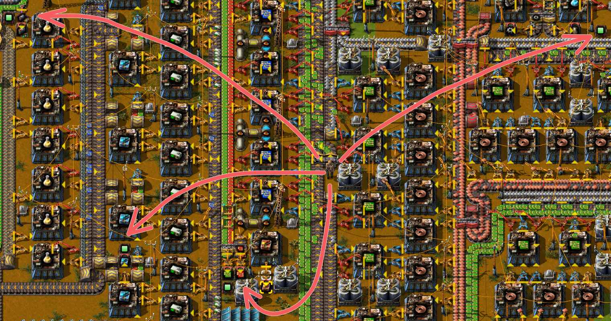

# Пишем на комбинаторах

Откровенно говоря, постоянные комбинаторы `Constant combinator` не предназначены чтобы их использовали в качестве поэтического забора. Тем не менее иногда бывает полезно разместить некую пометку или текст на всякий случай. Делается это при помощи [виртуальных сигналов на постоянном комбинаторе](https://wiki.factorio.com/Circuit_network#Virtual_signals), которые включают буквы английского алфавита и цифры, знаков препинания не предусмотрено. Плюсом является то, что постоянные комбинаторы не зависимы от линии электропередач.

## Настройка отображения для комбинаторов

Но при игровых настройках по умолчанию сигналы комбинаторов не отображаются. Для отображения сигналов нужно зайти в настройки `Settings`, затем `Interface` и установить галочку для показа настроек комбинатора в [*Alt-mode*](https://wiki.factorio.com/Shortcut_bar):

Соответственно, играть придётся тоже в *Alt-mode*, но это на самом деле единственно нормальный режим игры, хотя кому как.

## Метки для сундуков с ресурсами

Простым примером использования является постоянный комбинатор `!Constant combinator` с каким-то ярко выделяемым сигналом, например зелёный прямоугольник `Signal green`. Такой комбинатор можно легко заметить среди кучной фабрики и он может сигнализировать о сундуках с ресурсами, куда складываются предметы. Например, вот так:

Это позволит легко ориентироваться в глухой застройке ваших макаронных фабрик и позволит находить на карте сундуки для пополнения предметов в рюкзаке `Toolbelt`, особенно до появления [транспортных дронов](https://wiki.factorio.com/Logistic_robotics_(research)) `Logistic robot`. Помечать можно не только сундуки, но и всё что сочтёте важным в игре.

## Метки на разные случаи жизни

Мы уже имели счастье использовать метки на постоянных комбинаторах в чертежах для плавки ресурсов. Там мы отмечали места, где быстрый конвейер `Fast transport belt` переходит в простой конвейер `Transport belt`. Также, метками на постоянных комбинаторах можно указывать напоминания о том, какие ресурсы можно подавать на вход в чертеже.

## Поэтические тексты

Писать много на постоянных комбинаторах `!Constant combinator` муторно и утомительно. Ограничивайтесь простыми пометками и короткими текстовыми сообщениями. Длинные стихи заметны не будут. Писать можно тремя способами:

* по одной букве (1),
* по две буквы (2),
* и по четыре буквы в два ряда (3).

Обратите внимание на то, что комбинаторы с надписями отключены от логической сети, `Output` в режиме `Off`. Это нужно для [увеличения скорости симуляции](../Additionals/FPSandUPS.md) *Factorio*, чтобы пропустить расчеты незначащих комбинаторов.

Выстраивая несколько комбинаторов в ряд, можно писать целыми словами и даже предложениями. Пример:

Используйте какой-то сигнал для разделения слов и выравнивания текста, например черный квадрат `Signal black`.

## Художество и муки творчества

А знаете что ещё можно делать на постоянных комбинаторах? Рисовать картины, вот. Занятие правда утомительное, даже приочень утомительное. Нужно действовать, как и при написании текста, только вместо виртуальных сигналов букв использовать сигналы цветов, которые имеются в *Factoio*. Цветов немного, всего парочка, но можно домучатся до вот такого *pixel art*, для тех кто ностальгирует:

Рисунки из постоянных комбинаторов видны и днём и ночью, электричества не требуют, но в режиме карты не видны, к сожалению.

## Заключение

Писать на постоянных комбинаторах можно. Это позволяет размещать компактные надписи или пометки. Постоянные комбинаторы не требуют энергии и могут размещаться где угодно. Но есть и минусы. Надписи на комбинаторах не видны в режиме карты. Писать что-то длиннее пары слов довольно утомительно. Надписи ограничены буквами английского алфавита. Для создания больших надписей, вне зависимости от алфавита и которые видны в режиме карты, стоит использовать [мощённые поверхности из букв](../Additionals/Labelling.md).
