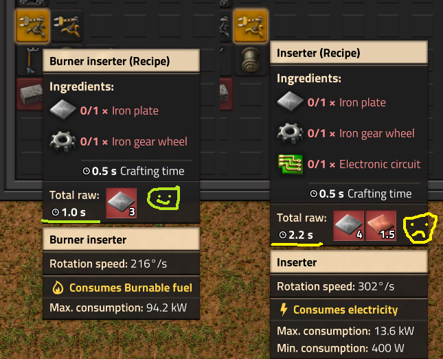

# Твердотопливные чудеса

:::danger
Это заготовка для будущей статьи
:::

## Твёрдотопливные буры

Тут будет показан дизайн организации добычи угля в самом начале игры.

## Твёрдотопливные манипуляторы

:::tip Не стоит пренебрегать твёрдотопливными манипуляторами

Твёрдотопливные манипуляторы, по сравнению с обычными, намного дешевле в производстве, быстрее производятся, и не требуют электрической энергии. Они не сжигают топливо во время простоя, хотя и потребляют больше энергии во время работы.

Применять их полезно в начале игры, для подачи топлива и ресурсов в каменные печи. Особенно полезны для подачи топлива в бойлеры. Пока у вас ещё не налажена добыча ресурсов, манипуляторы большую часть времени будут простаивать, вы их быстрее создадите, даже руками, и быстрее установите без протягивания линии электропередачи. Улучшить твёрдотопливные манипуляторы на обычные можно будет после улучшения каменных печей на стальные или даже чуть позже.

:::