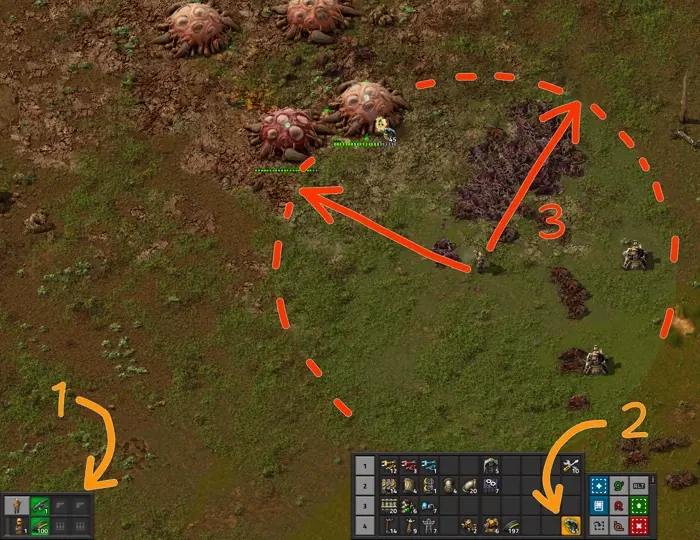
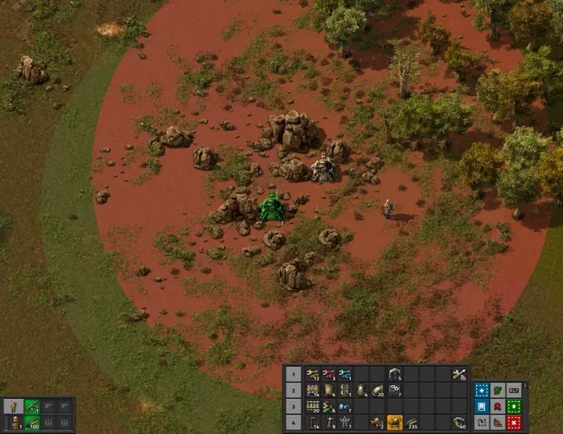
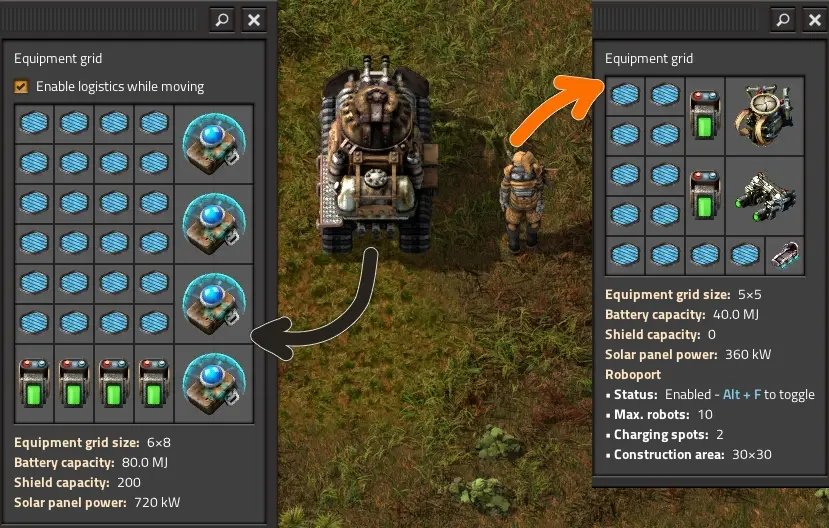
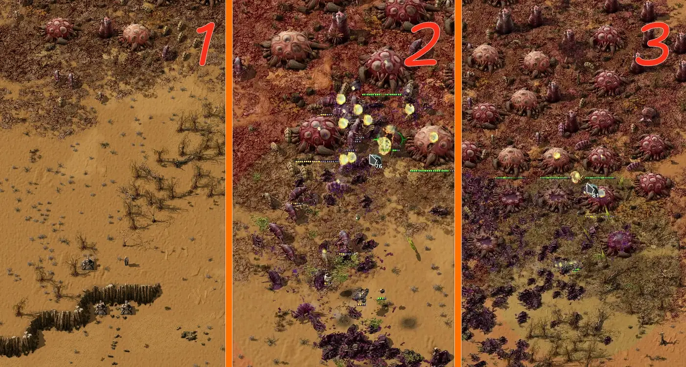
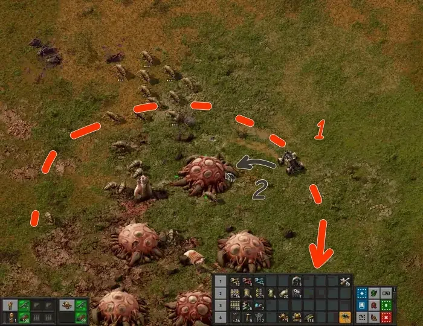
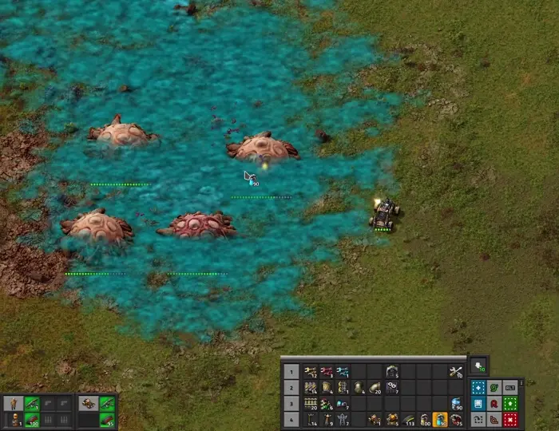
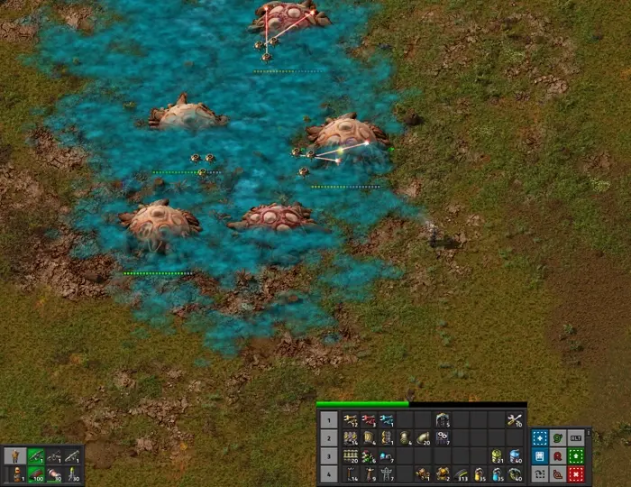

# Военные тактики и приёмы

:::tip Вся статья, кратко **
От строительства первых пулемётных турелей с обычными боекомплектами и до массированных артобстрелов всего вокруг. Эффективно защищать свою фабрику и очищать ближайшие территории от кусак дело-то нехитрое, если знать куда бежать и чем стрелять. Знание боевых тактик и умение эффективно комбинировать экипировку и амуницию является залогом победы в тысячах маленьких сражений.
:::

*Factorio* - это не простая [безделушка для старых процессоров](../Additionals/FPSandUPS#необходимое-и-достаточное-условия). Тут [автоматизация всего и вся](../CircuitNetwork/README.md), плюс постоянная [борьба с местной фауной](./FactoryDefense.md#загрязнение-и-прочие-неприятности). Кусаки `!Small biter` и плеваки `!Small spitter` вместе с загрязнением не дадут вам соскучиться. От вас потребуется не только [продуманная тактика](./README.md#ранее-планирование), но и грамотная экспансия, [контроль за распространением загрязнения](./Pollution.md#уменьшение-загрязнения) и поступательное [движение за горизонт](./FactoryDefense.md#глобальная-зачистка-после-запуска-первого-спутника). [Готовьтесь к бессонным ночам](../Additionals/NerdsVsGeeks.md), а ещё к эффективным приёмам сражаться за свою фабрику.

## Боевые игровые механики

И сразу про <abbr title="интерфейс игровго экрана, чишоль?">боевой ынтырфыс</abbr>, где всё ваше вооружение и доступные к нему боеприпасы отображаются в левом нижнем углу экрана (стрелка 1).  Гранаты и экипировку удобно разместить на [панели быстрого доступа](./Quickbar.md#панель-быстрого-доступа) (стрелка 2). Так к гранатам легко дотянуться и использовать в бою. Здесь можно размещать несколько гранат, патронов, даже автомобиль и прочую амуницию для использования в боях. Если взять в руки любую гранату, то светло-зелёным кругом вокруг игрока будет отображаться возможная дальность броска (стрелка 3).

**

Также используем пулемётные турели `Gun turret` в арьергарде, прикрывающие вам тыл. Всегда полезно иметь две или три турели чтобы можно было отбежать назад и перевести дух, если дела на передовой пойдут не очень. [Расставляйте турели нужно грамотно](./FactoryDefense.md#расстановка-пулемётных-турелей), чтобы каждая турель прикрывала другие турели. Не оставляйте одиноко стоящие турели, их быстро покусают. Ориентируйтесь на светло-зелёный круг когда устанавливаете новую турель, он показывает зону обстрела.

**

Используйте естественные преграды, чтобы затруднить прямой доступ местной фауны к вашим турелям. Подойдут камни, скалы, водные глади и даже деревья. Всё это не позволит толпе кусак быстро подойти к фортификациям.

**

Можно добавить стен `Wall` дабы усилить оборону, но упорствовать не следует. Выстраивание сильной линии обороны замедляет ваш прогресс и тратит ресурсы на начальных этапах игры. Лучше пройдитесь по местам, куда дошло загрязнение и приберитесь там дабы нивелировать угрозу нападения. Но играя с усиленной местной фауной не всегда получиться действовать напористо и какая-то фортификация потребуется. Расставляйте стены правильно, чтобы турели простреливали также и некоторое расстояние наперёд. Там будут скапливаться нападающие кусаки и грызть вашу фортецию. Пример того, как защищающая турель расположена не правильно (глядите в самый низ круга):

**

Есть ещё одна важная механика связанная с пулемётными турелями и которую обязательно стоит использовать прямо на поле боя. Возьмите патроны в курсор, наведитесь на установленную турель и зажмите клавишу `Z` на некоторое время. Таким образом вы будете быстро подавать патроны в пулемётную турель не открывая интерфейса. Можно даже заряжать амуницией несколько установленных рядом турелей.

**

Таким незатейливым способом можно заправлять не только турели, но также и сборочные автоматы, печи, бойлеры и всё прочее.

## Беги, стреляй, бросай

Имеется два основных приёма ведения боя подручными средствами. Первый заключается в *стрельбе из оружия*, а второй в *бросании гранат*. Причём использовать эти приёмы можно одновременно. На клавиатуре ⌨️ вы двигаетесь и стреляете, а мышкой 🖱️ наводитесь на цели и бросаете гранаты `!Grenade`. При этом двигаться нужно всегда и с периодической сменой направления движения. Это затрудняет попадание в вас кислотой от червей `!Worm` и плевак `!Spitter`, которые атакуют на расстоянии. При хаотичном движении ↝ избегайте ходить по тем местам, куда они уже плюнули кислоту 💥.

Для движения и маневрирования в бою задействуем клавишами `A`, `W`, `S` и `D`. Меняем выбранное оружие клавишей `C`. Нажимать можно несколько раз прокручивая из трёх вариантов. Курсором мыши наводимся на цель и стреляем пробелом, клавиша `Space`. Гранаты бросаем правой кнопкой мыши туда, куда указывает курсор на экране, в пределах дальности броска.

Гранаты падают на место не сразу, им требуется некоторое время для полёта, а посему крупные кусаки могут успеть отбежать. Учитесь стрелять и бросать гранаты одновременно, вместе эти два игровых приёма несут огромный урон всему. Особенно если научиться бросать гранаты с упреждением на толпу кусак, так как гранаты бьют по площади.

## Основная боевая тактика

Самая простая боевая тактика базируется на вышеописанных боевых приёмах, *беги, стреляй и бросай*, плюс парочка дополнительных фич. Эту тактику вы будете использовать всегда, главное чтобы были гранаты и достаточное количество амуниции. Алгоритм по зачистки кусачих ульев состоит из трёх этапов:

1. **Прикрываем тыл**. При подходе к ульям выставляем несколько турелей в безопасной близости и заправляем их амуницией. В начале игры будет достаточно 30-50 обычных патронов `Firearm magazine` на турель. Турели помогут справиться с уже родившимися кусаками, которые ринутся на вас, а также прикроют в случае экстренного отступления. Если имеются дроны защитники `Defender` или другие боевые роботы, то выпускаем их максимально возможное количество.
2. **Занимаемся червями**. Берём в руки имеющиеся гранаты `Grenade` и идём в бой на улья. Отстреливаем нападающих кусак `!Biter`, а гранаты кидаем на червей `!Worm`, так как они не дают установить дополнительные пулемётные турели `Gun turret` в помощь.
3. **Занимаемся ульями**. Когда остались только улья `!Biter spawner` `!Spitter spawner`, выставляем новые пулемётные турели по близости к ульям. Не забываем защищать установленные турели, так как они могут зациклиться на стрельбе по ульям и подвернутся атаке кусак.

В случае если ульев и червей много, действуем поэтапно. Выносим часть червей, потом оказавшихся беззащитными улья, потом повторяем. Так будем продвигаться вперёд, расставляя пулемётные турели. Освоив основную боевую тактику и боевые приёмы одновременной стрельбы и бросания гранат вы станете настоящим воином в игре *Factorio*, который способен защитить фабрику любых размеров.

## Автомобильная боевая тактика

[Первая экспансия](./FactoryDefense.md#первый-выход-с-базы-для-освоения-нефтяного-месторождения) позволяет начать [разработку месторождения нефти](../OilRefining/README.md#осваиваем-первое-нефтяное-месторождение) `Crude oil`. К этому моменту у вас появится автомобиль `Car`, на котором подъезжаем к ульям, высаживаемся поодаль и начинаем воплощать [вышеописанный алгоритм основной боевой тактики](#основная-боевая-тактика) на поле боя. Однако, автомобиль является довольно быстро движущимся средством наделённым возможностью стрелять. Сила огня из автомобиля меньше чем у пулемётной турели, а посему заправлять его следует бронебойными патронами `Piercing rounds magazine`. Также можно бросаться гранатами прямо на ходу, что даёт новую боевую тактику с применением автомобиля.

Суть заключается в том, чтобы сломя голову кружить на автомобиле вокруг ульев (1) и закидывать тамошнее гранатами по периметру (2). При этом не забывая отстреливать выбегающих под колёса кусак. Некоторых мелких можно и задавить.

Выставлять пулемётные турели в арьергарде смысла нет, так как на автомобиле можно быстро сбежать от проблем. Использовать роботов защитников тоже смысла нет, они инертны и могут улететь далеко-далеко при разворачивающемся автомобиле у которого довольно высокая скорость движения.

Тактика требует высокой ловкости, а поэтому редко используется. Также горемычна большим расходом гранат и патронов, которых долго производить. Да и малейшие преграды, вроде деревьев, скал и камней приведут к потере автомобиля и попадания в большую компанию голодных кусак. К тому же, неудачно брошенная граната наносит ущерб и самому автомобилю.

Однако, возможность кидать гранаты из автомобиля раскрывается немного позже, при наличии отравляющих гранат `Poison capsule`, которые можно кидать гораздо дальше чем обычные гранаты. Отравляющие газы не проникают в автомобиль, то есть можно травить всё вокруг и при этом самому дышать свободно, главное не выходить из таксо. Отравляющие гранаты наносят урон червям и прорежают возрождающуюся местную фауну.

В данном случае действуем также, как и при разбрасывании простых гранат. Кружим на автомобиле вокруг ульев. Отстреливаясь закидываем всё отравляющими гранатами, что помогает калечить и червей и кусак. Затем, не выходя из автомобиля убираем с карты опустевшие улья, уже осколочными гранатами и постреливая из автомобиля.

В целом, автомобиль не очень подходит для проведения боевых действий. Из него слабовато стрелять, трудно управлять и с дронами защитниками не очень совместим. Используйте автомобиль для быстрого перемещения по карте на первых этапах игры, а для борьбы с местной фауной используйте [основные боевые тактики](#основная-боевая-тактика).

## Тактика с дронами приманками

Дроны приманки `Distractor` неподвижны и слабы и может показаться что они бесполезны. Кусаки их выносят элементарно, особенно средние `!Medium biter` и крупные `!Biter`. Ещё и на планете `Gleba` тамошняя фауна практически иммунна к лазерному урону.

На самом деле патэнцывал раскрывается вместе с отравляющими гранатами `Poison capsule`. Суть такой тактики мало чем отличается от основной боевой тактики. Также устанавливаем пулемётные турели в арьергарде для прикрытия. Также можно выпустить дронов защитников `Defender`, если всё сложно. Далее, закидываем улья отравляющими гранатами `!Poison capsule`, которые работают против червей и против местной фауны. Чуток опосля или когда у червей испортится жизнь, запускаем дронов с приманками `!Distractor` прямо в улей для уничтожения всего и вся. Прелесть приманок в том, что они отвлекают внимание местной фауны и червей на себя, а значить можно подбежать к врагам по ближе.

Откровенно говоря, тактика малость сомнительна. Дроны с приманками довольно дорогие для исследования и производства. До запуска первого спутника они не нужны. А без улучшения урона энергетического оружия `Laser weapons damage` и скорости стрельбы лазером `Laser shooting speed` эти приманки и вовсе бесполезны. Можно просто отстреливать улья кусак с расстояния, закидав их отравляющими гранатами и не заходя в облако отравляющих газов, хотя на автомобиле такое сделать легче. Данная тактика с дронами приманками может и оправдывается после запуска спутника, когда кусаки становятся сильнее и простого отравления им уже будет маловато.

## Смотрите также ТвойТуб

[**](https://www.youtube.com/watch?v=4EXFkMBMmPY)

Смотрите и делитесь комментариями.
