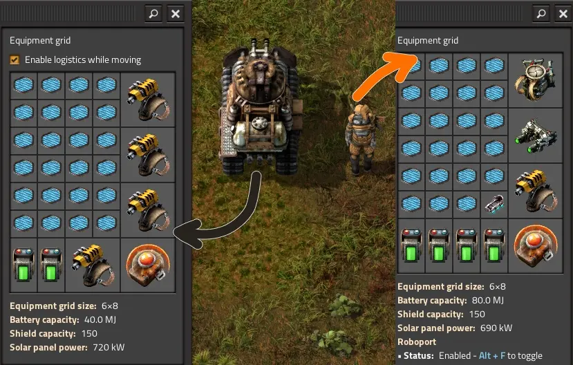
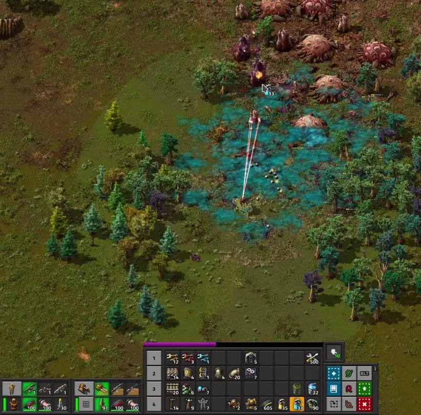
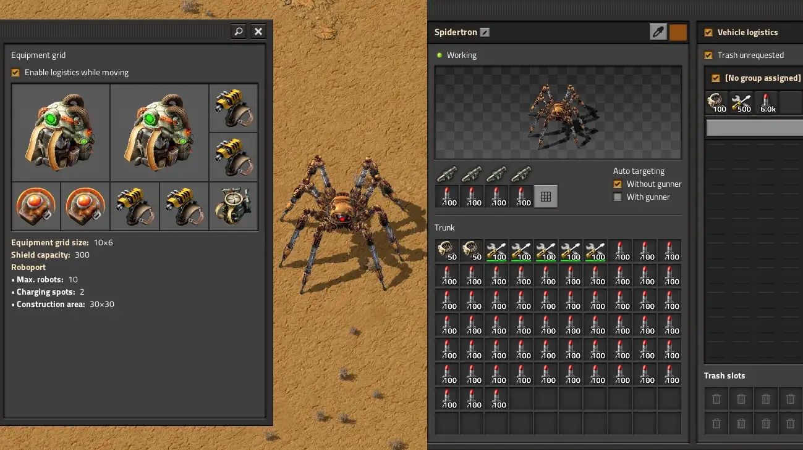
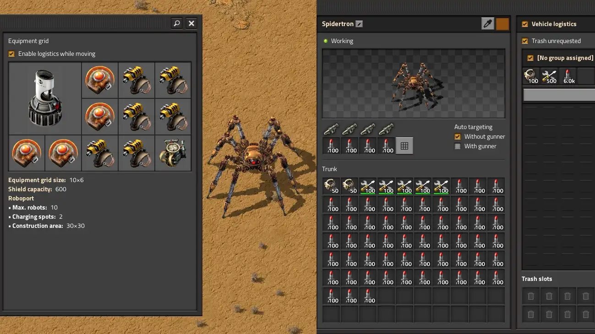
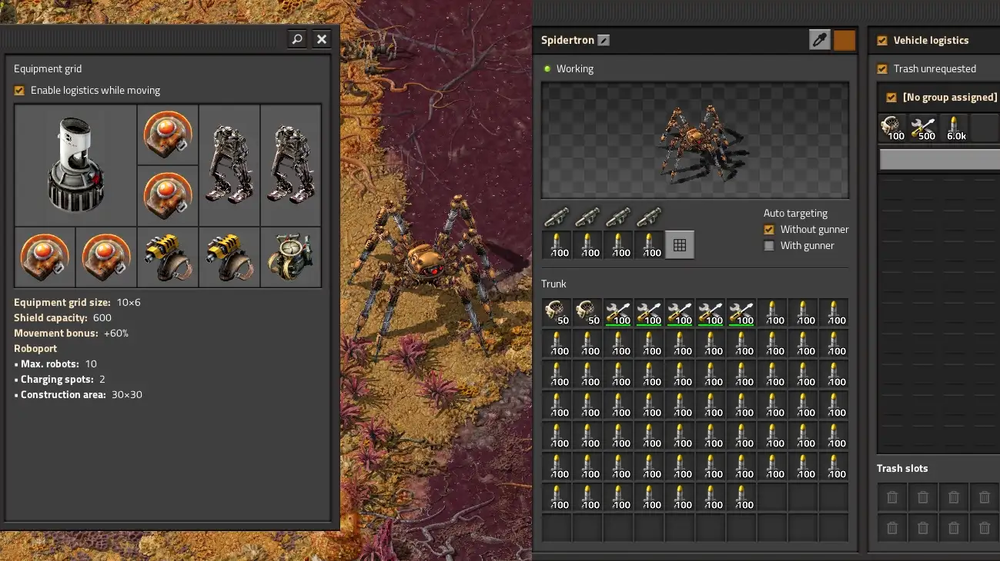
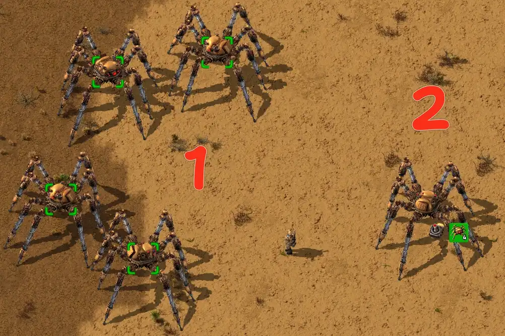
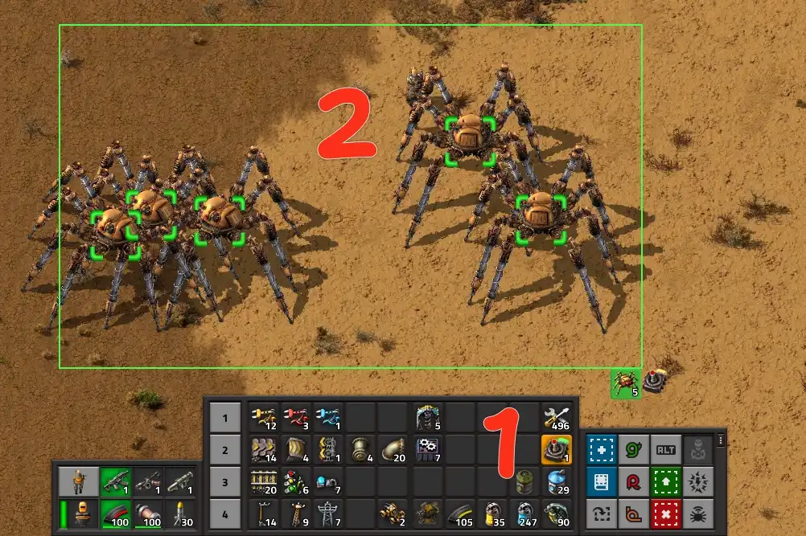

# Военные тактики и приёмы

:::danger
Это заготовка для будущей статьи, сейчас она не рекомендуется для изучения, а в будущем может измениться или вообще исчезнуть.
:::

:::tip Вся статья, кратко **
От строительства первых пулемётных турелей с обычными боекомплектами и до массированных артобстрелов всего вокруг. Эффективно защищать свою фабрику и очищать ближайшие территории от кусак дело-то нехитрое, если знать куда бежать и чем стрелять. Знание боевых тактик и умение эффективно комбинировать экипировку и амуницию является залогом победы в тысячах маленьких сражений.
:::

*Factorio* - это не простая [безделушка для старых процессоров](../Additionals/FPSandUPS#необходимое-и-достаточное-условия). Тут [автоматизация всего и вся](../CircuitNetwork/README.md), плюс постоянная [борьба с местной фауной](./FactoryDefense.md#загрязнение-и-прочие-неприятности). Кусаки `!Small biter` и плеваки `!Small spitter` вместе с загрязнением не дадут вам соскучиться. От вас потребуется не только [продуманная тактика](./README.md#ранее-планирование), но и грамотная экспансия, [контроль за распространением загрязнения](./Pollution.md#уменьшение-загрязнения) и поступательное [движение за горизонт](./FactoryDefense.md#глобальная-зачистка-после-запуска-первого-спутника). [Готовьтесь к бессонным ночам](../Additionals/NerdsVsGeeks.md), а ещё к эффективным приёмам сражаться за свою фабрику.

И сразу про <abbr title="интерфейс игровго экрана, чишоль?">боевой ынтырфыс</abbr>, где всё ваше вооружение и доступные к нему боеприпасы отображаются в левом нижнем углу экрана (стрелка 1).  Гранаты и экипировку удобно разместить на [панели быстрого доступа](./Quickbar.md#панель-быстрого-доступа) (стрелка 2). Так к гранатам легко дотянуться и использовать в бою. Здесь можно размещать несколько гранат, патронов, даже автомобиль и прочую амуницию для использования в боях. Если взять в руки любую гранату, то светло-зелёным кругом вокруг игрока будет отображаться возможная дальность броска (стрелка 3).

**

Также используем пулемётные турели `Gun turret` в арьергарде, прикрывающие вам тыл. Всегда полезно иметь две или три турели чтобы можно было отбежать назад и перевести дух, если дела на передовой пойдут не очень. [Расставляйте турели нужно грамотно](./FactoryDefense.md#расстановка-пулемётных-турелей), чтобы каждая турель прикрывала другие турели. Не оставляйте одиноко стоящие турели, их быстро покусают. Ориентируйтесь на светло-зелёный круг когда устанавливаете новую турель, он показывает зону обстрела.

**

Используйте естественные преграды, чтобы затруднить прямой доступ местной фауны к вашим турелям. Подойдут камни, скалы, водные глади и даже деревья. Всё это не позволит толпе кусак быстро подойти к фортификациям.

**

Можно добавить стен `Wall` дабы усилить оборону, но упорствовать не следует. Выстраивание сильной линии обороны замедляет ваш прогресс и тратит ресурсы на начальных этапах игры. Лучше пройдитесь по местам, куда дошло загрязнение и приберитесь там дабы нивелировать угрозу нападения. Но играя с усиленной местной фауной не всегда получиться действовать напористо и какая-то фортификация потребуется. Расставляйте стены правильно, чтобы турели простреливали также и некоторое расстояние наперёд. Там будут скапливаться нападающие кусаки и грызть вашу фортецию. Пример того, как защищающая турель расположена не правильно (глядите в самый низ круга):

**

## Беги, стреляй, бросай

Имеется два основных приёма ведения боя подручными средствами. Первый заключается в *стрельбе из оружия*, а второй в *бросании гранат*. Причём использовать эти приёмы можно одновременно. На клавиатуре ⌨️ вы двигаетесь и стреляете, а мышкой 🖱️ наводитесь на цели и бросаете гранаты `!Grenade`. При этом двигаться нужно всегда и с периодической сменой направления движения. Это затрудняет попадание в вас кислотой от червей `!Worm` и плевак `!Spitter`, которые атакуют на расстоянии. При хаотичном движении ↝ избегайте ходить по тем местам, куда они уже плюнули кислоту 💥.

Для движения и маневрирования в бою задействуем клавишами `A`, `W`, `S` и `D`. Меняем выбранное оружие клавишей `C`. Нажимать можно несколько раз прокручивая из трёх вариантов. Курсором мыши наводимся на цель и стреляем пробелом, клавиша `Space`. Гранаты бросаем правой кнопкой мыши туда, куда указывает курсор на экране, в пределах дальности броска.

Гранаты падают на место не сразу, им требуется некоторое время для полёта, а посему крупные кусаки могут успеть отбежать. Учитесь стрелять и бросать гранаты одновременно, вместе эти два игровых приёма несут огромный урон всему. Особенно если научиться бросать гранаты с упреждением на толпу кусак, так как гранаты бьют по площади.

## Основная боевая тактика

Самая простая боевая тактика базируется на вышеописанных боевых приёмах, *беги, стреляй и бросай*, плюс парочка дополнительных фич. Эту тактику вы будете использовать всегда, главное чтобы были гранаты и достаточное количество амуниции. Алгоритм по зачистки кусачих ульев состоит из трёх этапов:

1. **Прикрываем тыл**. При подходе к ульям выставляем несколько турелей в безопасной близости и заправляем их амуницией. В начале игры будет достаточно 30-50 обычных патронов `Firearm magazine` на турель. Турели помогут справиться с уже родившимися кусаками, которые ринутся на вас, а также прикроют в случае экстренного отступления. Если имеются дроны защитники `Defender` или другие боевые роботы, то выпускаем их максимально возможное количество.
2. **Занимаемся червями**. Берём в руки имеющиеся гранаты `Grenade` и идём в бой на улья. Отстреливаем нападающих кусак `!Biter`, а гранаты кидаем на червей `!Worm`, так как они не дают установить дополнительные пулемётные турели `Gun turret` в помощь.
3. **Занимаемся ульями**. Когда остались только улья `!Biter spawner` `!Spitter spawner`, выставляем пулемётные турели по близости и защищаем их от всего что шевелится. Турели сначала стреляют по ульям, а потом по кусакам, поэтому защищаем турели самостоятельно от возрождающейся местной фауны.

В случае если ульев и червей много, действуем поэтапно. Выносим часть червей, потом оказавшихся беззащитными улья, потом повторяем. Так будем продвигаться вперёд, расставляя пулемётные турели. Освоив основную боевую тактику и боевые приёмы одновременной стрельбы и бросания гранат вы станете настоящим воином в игре *Factorio*, который способен защитить фабрику любых размеров.

## Автомобильная боевая тактика

[Первая экспансия](./FactoryDefense.md#первый-выход-с-базы-для-освоения-нефтяного-месторождения) позволяет начать [разработку месторождения нефти](../OilRefining/README.md#осваиваем-первое-нефтяное-месторождение) `Crude oil`. К этому моменту у вас появится автомобиль `Car`, на котором подъезжаем к ульям, высаживаемся поодаль и начинаем воплощать [вышеописанный алгоритм основной боевой тактики](#основная-боевая-тактика) на поле боя. Однако, автомобиль является довольно быстро движущимся средством наделённым возможностью стрелять. Сила огня из автомобиля меньше чем у пулемётной турели, а посему заправлять его следует бронебойными патронами `Piercing rounds magazine`. Также можно бросаться гранатами прямо на ходу, что даёт новую боевую тактику с применением автомобиля.

Суть заключается в том, чтобы сломя голову кружить на автомобиле вокруг ульев (1) и закидывать тамошнее гранатами по периметру (2). При этом не забывая отстреливать выбегающих под колёса кусак. Некоторых мелких можно и задавить.

Выставлять пулемётные турели в арьергарде смысла нет, так как на автомобиле можно быстро сбежать от проблем. Использовать роботов защитников тоже смысла нет, они инертны и могут улететь далеко-далеко при разворачивающемся автомобиле у которого довольно высокая скорость движения.

Тактика требует высокой ловкости, а поэтому редко используется. Также горемычна большим расходом гранат и патронов, которых долго производить. Да и малейшие преграды, вроде деревьев, скал и камней приведут к потере автомобиля и попадания в большую компанию голодных кусак. К тому же, неудачно брошенная граната наносит ущерб и самому автомобилю.

Однако, возможность кидать гранаты из автомобиля раскрывается немного позже, при наличии отравляющих гранат `Poison capsule`, которые можно кидать гораздо дальше чем обычные гранаты. Отравляющие газы не проникают в автомобиль, то есть можно травить всё вокруг и при этом самому дышать свободно, главное не выходить из таксо. Отравляющие гранаты наносят урон червям и прорежают возрождающуюся местную фауну.

В данном случае действуем также, как и при разбрасывании простых гранат. Кружим на автомобиле вокруг ульев. Отстреливаясь закидываем всё отравляющими гранатами, что помогает калечить и червей и кусак. Затем, не выходя из автомобиля убираем с карты опустевшие улья, уже осколочными гранатами и постреливая из автомобиля.

## Боевая тактика с дронами приманками

Дроны приманки `Distractor` неподвижны и слабы и может показаться что они бесполезны. Кусаки их выносят элементарно, особенно средние `!Medium biter` и крупные `!Biter`. Ещё и на планете `Gleba` тамошняя фауна практически иммунна к лазерному урону.

На самом деле патэнцывал раскрывается вместе с отравляющими гранатами `Poison capsule`. Суть такой тактики мало чем отличается от основной боевой тактики. Также устанавливаем пулемётные турели в арьергарде для прикрытия. Также можно выпустить дронов защитников `Defender`, если всё сложно. Далее, закидываем улья отравляющими гранатами `!Poison capsule`, которые работают против червей и против местной фауны. Чуток опосля или когда у червей испортится жизнь, запускаем дронов приманки `!Distractor` прямо в улей для уничтожения всего и вся.

Откровенно говоря, тактика малость сомнительна. Дроны приманки довольно дорогие для исследования и производства. До запуска первого спутника они не нужны. Можно просто отстреливать улья кусак с расстояния, закидав их отравляющими гранатами и не заходя в облако отравляющих газов, хотя на автомобиле такое сделать легче. Данная тактика с дронами приманками может и оправдывается после запуска спутника, когда кусаки становятся сильнее и простого отравления им уже будет маловато.

## Танки

Танки `Tank` сильно улучшили по сравнению с прошлыми версиями игры. Теперь они хорошо стреляют и имеют сетку для оборудования, что позволяет оснастить их персональной лазерной защитой `Personal laser defense`, ремонтными дронами `Construction robot` и даже энергетическим щитом `Energy shield`. У танка нет радара, а значить дистанционно управлять им за пределами наших радаров не получится (криворукие чехи и тут забаговали игру ибо с паукотроном таких проблем нэма). Придётся таки садиться в танк и управлять его руками, что даёт какой-то плюс если имеется экипированная силовая броня `Power armor` или лучше. Вся экипировка танка и персональной брони игрока будут давать общий эффект. Например, щиты и лазерная защита, всё складывается. И нате вам экипировку для раннего танка и инженера с модульной бронёй `Modular armor`, *раш в танк* так сказать:

Тут имеются хорошие щиты, а игрок может производить ремонт повреждений не выходя на природу. Позаботьтесь чтобы в рюкзаке были ремонтные комплекты `Repair pack` в достаточном количестве (их всегда не хватает) и строительные дроны `Construction robot`. А прибор ночного видения `Night vision equipment` и батареи `Battery equipment` позволяют вести бой в любых условиях, и днём и ночью. С таким набором можно продержаться до запуска первого спутника.

И хотя танк является мощной атакующей силой, но с защитой у него имеются проблемы. Двигается он медленнее чем автомобиль и поэтому дроны защитники `!Defender` или уничтожители `!Destroyer` вполне хороши. Также, танк проламывает камни, ломает деревья, давит улья и местную фауну, но застывает на скалах. Можно кинуть взрывчатку `Cliff explosives` на скалу `Cliff` прямо из танка и проломать себе проход. И соответственно из танка можно кидать любые гранаты, особенно полезны отравляющие `Poison capsule` ибо в танке, как и в автомобиле, можно свободно дышать в отравляющем облаке.

Вооружение танка включает три предопределённых типа вооружения, для которого потребно производить амуницию. Пушка `Tank cannon` ваше основное оружие. Стреляет бронебойными `Cannon shell` поражая несколько целей в ряд или разрывными `Explosive cannon shell` нанося урон по площади. Выбор снарядов дело вкуса. И там и там придётся тренироваться, так как управляться немного не удобно. Есть ещё ихние аналоги с урановыми комплектующими `!Uranium cannon shell` `!Explosive uranium cannon shell` и повышенным уроном, но в целом всё то же самое. Сии аналоги требуют тёмно-зелёного урана `Uranium-238`, а значить можно начать производство без коварекса `Kovarex enrichment process`, что импонирует.

Пулемёт `!Submachine gun` и огнемёт `!Flamethrower` ситуативные прибамбасы, особо на них не рассчитывайте, только если экстренно ретироваться от навязчивой толпы местной фауны `!Biter` `!Spitter`. Защищать танк вам придётся в ручную, кидать отравляющие гранаты или использовать боевых дронов. Обычные гранаты тоже допустимы, но они будут наносить урон и танку, если упадут поблизости. Ещё одним вариантом защиты является персональная лазерная защита `Personal laser defense`, но придётся отказаться от щитов либо усовершенствовать их. Вот хороший пример для использования лазеров без продвинутой силовой установки, но с силовой бронёй `Power armor`:

Имеется небольшой перерасход по питанию танка, но справиться можно, придётся избегать ночных вылазок, хотя запас на пару ульев есть. Если совсем тяжело, замените у танка одну персональную лазерную защиту на две батареи `Battery equipment`. Или используйте улучшенные батареи `Battery mk2 equipment`, но всё равно, придётся заряжаться днём, чтобы атаковать по ночам.

Боевая тактика с применением танка довольно проста, особенно при наличии отравляющих гранат:

1. **Продумываем о защите танка**. Это могут быть лазерная зашита `!Personal laser defense`, гранаты `!Cluster grenade`, боевые дроны `!Defender`, на худой конец разрывные крупнокалиберные снаряды `!Explosive cannon shell`, выбирайте то что есть в наличии. Подъезжая к ульям, если есть защитники или уничтожители, выпускаем их заранее. Гранаты берём в руки и готовимся кидать их вместе со стрельбой из танка.
2. **Подъезжаем ближе и закидываем всё отравляющими гранатами**. Наша задача устроить хороший газваген всем тамошним обитателям и особенно червям. На высоких уровнях сложности гранат лучше не жалеть.
3. **Стреляем из далека по червям и по ульям**. Делаем пару выстрелов и отъезжаем назад. Справляемся с бросившейся на танк местной фауной. Потом опять подъезжаем и ещё пару подарунков. Повторяем сиё действие пока не зачистим весь улей. Если червей не осталось, то можно ехать вперёд и давить улья танком. Червей тоже можно давить гусеницами танка, то так есть вероятность отгрести кислотой. Помните, что дальность стрельбы танка примерно равна дальность плевка червя.
4. **Если кусаки негодуЭ**, кидаем пару отравляющих гранат рядом с танком и отъезжаем. При совсем беде, переключаемся на пулемёт или огнемёт и защищаемся. Можно и отступить, это не позорно.

В общем, танк еЗмЪ гуд, особенно после запуска первого спутника для перманентной экспансии. Имеется сетка для оборудования, запросы логистической сети чтобы не таскать амуницию руками `Logistic robot`. Дистанционное управление нафиг не сдалось ибо действует только в радарном покрытии `Radar`. Есть приблуда в виде мода, которая устанавливает на танк мини радар, но это вам не нужно. Танк слабоват в защите, поэтому плюсом будет если вы ему лично поможете своей бронёй и оборудованием. И опять-таки, танком нужно научиться управлять, но это не сложно.

## Паукотроны

Паукотрон `Spidertron` как песец, подкрадывается незаметно, шороху наводит по самые не хочу и уходит в туман, на дозаправку. А нынче этих пушистиков можно объединять в группы, чем вызывать приход множественных песцов одновременно, хотя и раньше ничего не мешало насылать многообразие подарунков на местную фауну. Но самое главное преимущество паукотрона в том, что ему можно дать несколько команд на движение и забыть про него. Он сам ходит по точкам пересекая препятствия, кроме больших водных басейнов, постреляет по пути движения, построит не построенное, а вы можете заниматься в это время своими делами.

Паукотроны ультимативны, то есть дойдя до них лучшего уже не будет, а значить заряжаем его по полной, кроме ядерных ракет `!Atomic bomb` конечно , хотя... Более менее сбалансированная экипировка включает персональную лазерную защиту и щиты:

**

Можно ещё усилить реактором `Portable fusion reactor` и щитами, если прикуплен платный *SA* мод:

**

 Опционально можно заменить две персональные лазерные защиты `!Personal laser defense` на один экзоскелет `!Exoskeleton`. Или ещё две на ещё один экзоскелет, чтобы паукотрон ходил быстрее. Чем дальше играть, тем менее персональная лазерная защита нужна паукотрону, так как отстреливаться он может и ракетами, а вот быстро сбегать будет куда полезнее.

 На планете `Gleba` фауна довольно резистентна к лазерному урону `!Personal laser defense research` и хорошо противостоит разрывным ракетам `!Explosive rocketry`. Поэтмоу лучше использовать простые ракеты `!Rocket`, а не разрывные. Наборчик для `Gleba` вот такой:

**

Группировать несколько паукотрончиков можно парочкой способов. Как раньше было и как теперь стало, оба варианта рабочие на данный момент.

Способ из предыдущей версии игры заключается в той особенности паукотрона, что он способен следовать за чем угодно, за персонажем, за автомобилем, за локомотивом или за другими паукотронами. Выделяем некоего паукотрона из группы (1) и кликаем правой мышкой по какому-то другому (2). Повторяем действие для всех паукотронов из группы (1), которых хотим заставить следовать за паукотроном (2).

**

Теперь если водить этим отдельно стоящим паукотроном (2), остальные (1) поплетутся в след за ним и разделят его боевую судьбу. Будут строить, если чертежи размещены и будут стрелять во всё, что по пути попадается.

А нынче уже есть способ попроще. Теперича можно всех паукотронов выделить в группу сразу и направить единой толпой куда надо. Пультом (1) выделяем область на экране (2) и пультом же теперь их можно посылать куда угодно.

**

Паукотрон и в одиночку представляет грузную силу, а в группе это силище. Порой, вместо строительства массовой фортификации по периметру больший фабрики, бывает лучше послать такую дружную компанию прогуляться по краю пятна загрязнения. Каким образом вы легко избавитесь от соседей.
