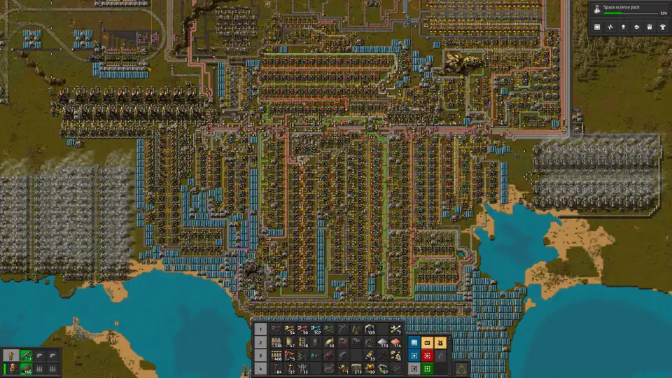
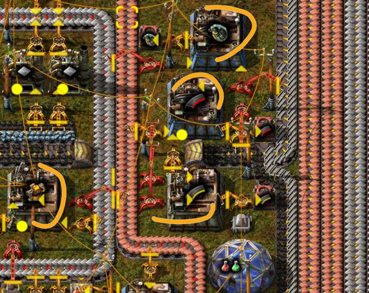
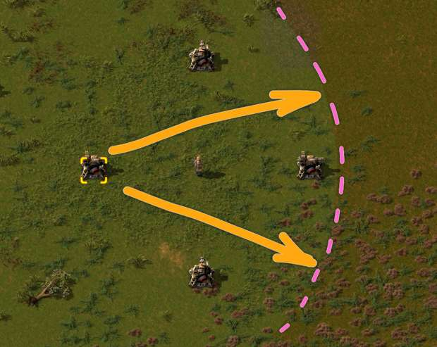
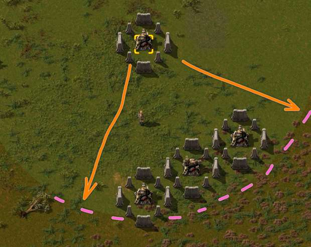
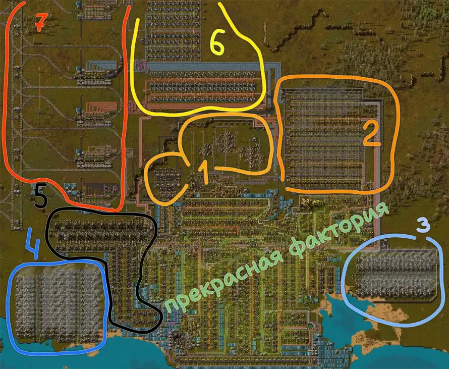

# Оборона макаронной фабрики

:::danger
Это заготовка для будущей статьи, сейчас она не рекомендуется для изучения, а в будущем может измениться или вообще исчезнуть.
:::

:::tip Вся статья, кратко **
Даже самая надёжная фортификация в *Factorio* оказываются иллюзией безопасности. Местная фауна, гонимая загрязнением, не будет долго церемониться. Жуки нападут со всех сторон. Застряв в глубокой обороне в начале игры вы проигрываете гонку со временем и не успеете запустить первый спутник в срок. [Половина даже до локомотивов не доигрывает](../Additionals/NerdsVsGeeks#кого-в-игре-больше-нердов-или-гиков)...

Оборона не должна быть тюрьмой. Обороняйтесь нападая.
:::

Даже если вы [всё распланируете заранее](./README.md#ранее-планирование), ваша первая фабрика будет напоминать [макаронное производство](https://en.wikipedia.org/wiki/Spaghetti_code) с хаотичными зависимостями и дичайшей логистикой. Это нормально, на начальном этапе игры фабрика должна быть одновременно небольшой и развиваться быстро. Вам предстоит продумать сразу как построить:

* [первую кузницу на допотопных печах](../RawResourcesProcessing/README.md#чертежи-для-плавки-руд),
* [маленький заводик снабжения](./Mall.md#магазин-шота-у-ашота),
* [электростанцию мегаватт на 120](../PowerProduction/README.md#начальная-база-на-45-научных-пакетов-в-минуту),
* [небольшой нефтеперерабатывающий заводик](../OilRefining/README.md#строим-нефтеперерабатывающий-завод),
* [производство всей науки](./README.md#краткий-план-игры).

Всё это необходимо грамотно интегрировать друг в друга, чтобы избежать перепроизводства и нехватки ресурсов. Одновременно продумывайте, как фабрика будет строиться по мере продвижения по сюжету и открытия новых технологий. *Маленькую фабрику легче защищать от непрошенных гостей и быстрее строить.* Нацеливайтесь на меньшую беготню с максимизацией результата. Время в *Factorio* является ценным ресурсом, пока вы ещё не запустили свой первый спутник. И сохраните останки вашего разбившегося космического корабля, на память, для истории:

**

Чтобы успешно защищать свою фабрику, постоянно следите за распространением [загрязнения](./Pollution.md). Местная фауна не будет атаковать вас за просто так. Жуки становятся агрессивными только в трёх случаях:

* игровой персонаж близко приблизился к представителям местной фауны,
* облако загрязнения накрыло ульи местной фауны, это основная проблема
* экспансия ульев вплотную приблизилась к вашей базе.

Первый вариант можно избежать довольно легко, если не слоняться по игровой карте от нечего делать. Второй вариант избежать практически не возможно. Вы строитесь, расширяетесь, производите всё больше и больше загрязнения, которое неминуемо накроет улья, что вызовет нападение местной фауны на источник загрязнения, то есть на ваши постройки. В начале игры нет действующих способов уменьшения загрязнения, кроме как остановки производства и ожидания пока загрязнение не распылится естественным образом. Ну и третий вариант, экспансия вражын, с течением времени он неизбежно случится, если не захаживать в гости к местной фауне.

:::info Помним
Распространение загрязнения до ульев кусак `!Biter spawner` и ульев плевак `!Spitter spawner` является главным фактором побуждающий местную фауну `!Biter` `!Spitter` атаковать ваши постройки. Постоянное [наблюдение за распространением загрязнения](./Pollution.md#наблюдение-за-распространением-загрязнения) и [попытки уменьшить загрязнение](./Pollution.md#уменьшение-загрязнения) являются одним из главных элементов стратегии защиты фабрики.
:::

Что именно местная фауна атакует прежде всего:

* игровой персонаж, турели или логистических роботов, если кто-то из них окажется в некоторой близости,
* здания производящие загрязнение, такие как печи, сборочные автоматы и особенно бойлеры,
* радары, по необъяснимой причине, так как радары не производят загрязнения,
* всё прочее, если попадётся на пути следования оравы к вам в гости

## Ранний этап игры

В начале игры вы появляетесь у разбитого корыта и совсем без штанов. Будет в наличии бесполезный пистолетик `!Pistol` и пара слабых обойм с патронами `!Firearm magazine`. Больше патронов и некоторое количество железных пластин `!Iron plate` можно найти среди обломков разбившегося космического корабля, но поживиться там особо нечем. При достаточном наличии железных пластин вы будете способны произвести легкую броню `Light armor` и дополнительные патроны, на которые особо не надейтесь. Начальным вооружением вы сможете только отстреляться от небольшого количества местной фауны убегая от них в лес или за возведённые заранее пулемётные турели заправленные достаточным количеством амуниции.

Ваша задача не разевать рта считая ворон, а действовать быстро. Медленный инженер мало чего построит, а съеденный инженер ничего не построит. Но помимо основной задачи на строительство первой фабрики, вы должны освоить следующие научные достижения, связанные с амуницией и обмундированием дабы успешно противостоять местной фауне:

| 🧪 Щыто | ⚙️ Ништяки | 🎯 Назначение |
|:--|:--|:--|
|`Military`| первая военная промышленность, открывает базовое вооружение: `Submachine gun` `Shotgun` `Shotgun shell` | пистолет-пулемёт `!Submachine gun` основно оружие в *Factroio* на все времена, дробовик `!Shotgun` на любителя, но таких у нас нет, старайтесь завершить это исследование как можно скорее и экипироваться до зубов, пистолетом `!Pistol` много не настреляешь  |
|`Gun turret`| производство турелей для защиты фабрики | пулемётные турели `!Gun turret` можно носить в рюкзаке и устанавливать в любом месте, вам часто придётся отступать к ним в случае опасности, устанавливайте турели так, чтобы они прикрывали друг друга, а лучше чтобы две турели прикрывали |
|`Wall`|весьма опциональное открытие которое позволяет возводить стены|можно обустроить фортификацию вместе с пулемётными турелями `!Gun turret` в местах частых атак местной фауны на вашу фабрику, особо в оборону не вкладывайтесь, фортификацию возводить стоит, но без отрыва от остального деяния, благо производство стен много ресурсов не тратит, достаточно развернуть небольшое производство прямо на ресурсе камней |
|`Heavy armor research`| `Heavy armor` | тяжелая броня хороша, её хватит до середины игры, хотя и потребуется выплавка стальных балок `Steel plate` |
|`Military` `2`| вторая военная промышленность, расширяет боевой арсенал:  `Piercing rounds magazine` `Grenade` | это основная ваша амуниция, бронебойные патроны и простые гранаты, сгодятся до запуска первого спутника, хотя гранаты лучше прокачать ещё разок, но позже |
|`Automobilism`| `Car` | автотранспорт не роскошь, а необходимость |

С этим всем уже можно твёрдо стоять на ногах. Понятно, что не сразу вы всё произведёте, но если затаритесь по полной, никакие жуки до середины игры вам не страшны, ну почти не страшны. А для этого заранее нужно подготовить заводик снабжения, особенно производящий патроны и гранаты, да и пулемётные турели тоже, вот например такой:

**

И ещё совет, как оптимально расставлять пулемётные турели, где каждая должна прикрывать минимум две, а лучше три. Таким образом, она сама будет прикрыта турелями:

**

Можно добавить немного фортификации, но в данном случае турели должны прикрывать и фортификацию. На рисунке видно, что не все части фортификации прикрыты задней турелью, не допускайте таких ситуаций:

**

Прикрывающие турели должны простреливать ещё и часть пространства вокруг прикрываемых турелей и стен фортификации. А лучше даже чуть больше чем часть пространства, таки дела. А чтобы совсем уж бесстрашно гулять по лесу не боясь особо встречи с неведомым, вот вам бонусные исследования, которые весьма желательны, хотя бы первые из них:

| 🧪 Щыто ысчё | ⚙️ Ништяки | 🎯 Назначение |
|:--|:--|:--|
| `Physical projectile damage` | огнестрельный урон | первые два уровня дают по 10% увеличенного урона и таких апргрэйдов хватит на долго, следующие уровни бонуса дают уже по 20%, но требуют непомерно большого количества разных склянок от научных пактов и нужны для игр на усиленных кусаках  важная особенность для пулемётных турелей в том, что этот бонус действует дважды, один раз на боеприпасы, второй раз на саму турель |
| `Weapon shooting speed` | скорость стрельбы | увеличивает скорость стрельбы, на 10% за первый уровень бонуса и на 20% за второй, особо полезен для дронов защитников, так как они имеют ограниченное время полёта, второго уровня бонуса обычно тоже хватает |
| `Stronger explosives` | усиленная взрывчатка | хорошо бы открыть первый уровень, так как даёт +25% к урону гранатами, остальные уровни хорошо действуют при игре на усиленной местной фауне, так как очень сильно усиливает кластерные гранаты `!Cluster grenade`, но это случиться только во второй половине игры |

Ну и конечно, двигаемся по исследованиям в военную науку `Military science pack`, но это совсем не обязательно, если у вас руки прямые и по гашетке умеете клацать. Но честно сказать, на *Мир Смерти* и настройках карты на злющих кусак военная наука вещь необходимая, иначе кранты:

| 🧪 Ысчё щыто? | ⚙️ Ништяки | 🎯 Назначение |
|:--|:--|:--|
|`Defender research`| `Defender` | летающие твари именуемые защитниками и которые не хило так поливают металлом всё вокруг в течении отведённого времени и при этом не тратят амуниции |
|`Follower robots`| бонус на увеличения количества следующих за вами дронов | без бонуса вы сможете выпускать до 5 дронов, а с этим бонусом выпускать можно будет до 10, второй уровень бонуса позволит выпускать уже 20 дронов, в принципе хватает и 5 защитников, чтобы вынести крупные улья, но кому как |

С таким багажом знаний, предметов и достаточной амуниции вы будете способны нагнуть местную фауну и [освоить первое месторождение нефти](../OilRefining/README.md#осваиваем-первое-нефтяное-месторождение). Этого вам должно хватить до середины игры и даже более.

## Первый выход с базы для освоения нефтяного месторождения

Пробежал первый часок игры. Вы отбились от ближайших ульев узбагоив соседей, обстроились на месте падения космического корабля, наладили производство первых склянок `!Automation science pack` `!Logistic science pack`, наступает пора расширяться, тем более для дальнейшего строительства нужен новый ресурс, коим является нефть `!Crude oil`. Экспедиция за нефтью `!Crude oil resource` является важным этапом. Неправильная подготовка может обернуться постоянными атаками жуков, убывающими ресурсами и горьким разочарованием, можно даже расплакаться 👧💦. Но прежде чем загружать хабара в автомобиль `!Car`, нужно знать, куда ехать. Вы ведь [подбирали карту эффективно](./README.md#самая-лучшая-карта) и подглядели правильное направление ещё до начала игры.

:::warning Партия ставит задачу, чем ответит комсомол?
Ваша задача не только *наладить добычу нефти* `!Pumpjack` и *построить нефтеперерабатывающий завод* `!Oil refinery` `!Chemical plant`, но и поучаствовать в *зачистке периметра от гнезд кусак* `!Biter spawner` с прицелом на растущее загрязнение.

Время первой серьезной экспансии.
:::

Предметов и амуниции лучше взять с запасом, чтоб потом не бегать по два раза. Хотя всегда так и бывает, *аще и многа горъкыя взимеши, но трижды къ погребу иноть шествовати тебѣ*. Итак, что берём с собой в поход (пистолет-пулемёт и тяжёлую броню вестимо уже надели):

| Экипировка | Назначение | Желаемое количество |
|:-:|:--|:--|
|`!Pumpjack`| нефтяные вышки | в количестве имеющихся пятен `!Crude oil resource` для освоения |
|`!Radar`| радар | часто про радар забывают и потом приходиться возвращаться, берём одну штуку обязательно |
|`!Big electric pole`| большие опоры ЛЭП | дабы протянуть линию электропередач от начальной фабрики к осваиваемому месторождению нефти, 20-30 обычно хватает, но смотря по расстоянию до месторождения нефти |
|`!Small electric pole` `!Medium electric pole`| малые или средние опоры ЛЭП | потребуются, чтобы подключить нефтяные вышки к электрической сети, не раскошеливайтесь особо на средние опоры ЛЭП, их производство расходует ценные ресурсы на данном этапе |
|`!Pipe`| трубы обычные | будем соединять нефтяные вышки между собой, хватает обычно 20-30 |
|`!Pipe to ground`| трубы подземные | этих берём побольше, будем строить нефтепровод *"Дружба"* |
|`!Gun turret`| турели пулемётные | для защиты социалистической собственности на местах добычи нефти и не только, можно устанавливать из рюкзака как стационарную точку защиты при зачистках ульев местной фауны, берите с дюжину |
|`!Firearm magazine`| магазины к ним | рассчитывайте по 30-40 обойм на одну турель, плюс ещё зачищать периметр будем |
|`!Wall`| стены | собрались эшелонированную оборону строить? в принципе идея так себе, но попробовать стоит, иногда помогает |
|`!Piercing rounds magazine`| магазины бронебойные | для личной безопасности, их всегда не хватает, ставить в пулемётные турели не стоит, им и простых хватает |
|`!Grenade`| гранаты | для раздачи подарунков, выноса ульев и скоплений кусак, чем больше тем лучше, очень эффективны против ульев |
|`!Car`| без ослика 🐴 в армии никак | основное средство передвижения и транспортировки хабара, а также пулемётная турель на колёсах, учитесь ПДД заранее, тут не просто педаль в пол, а ещё и думать надо |
|`!Coal` `!Firearm magazine`| топливо и дополнительные патроны для ослика | стоит запастисть где-то 100 единицами угля и 200 обоймами, можете даже запасного ослика взять в рюкзаке, бывает так что попадаете в передрягу и осла сожрут, а сэйвов нэма, хотя тут уже никакие ослы не помогут |
|`!Repair pack`| шуруповёрт отечественный | для починки всего и вся опосля передряг, всегда носите с собой несколько штук, так на всякий случай |
|`!Defender`| Защитник | можно бабу-ягу собой прихватить, мастхэв фича и в тяжелых ситуациях и вообще спасает, берите сколько сможете произвести, штука дорогая, но своих ресурсов стоит, особенно на *Мир Смерти* и подобных |

Также полезно взять в дорогу медных пластин `!Copper plate` и стальных балок `!Steel plate` да и патронов ещё `!Firearm magazine` и пока ездите по лесу, перерабатывайте всё это прямо в рюкзаке до бронебойных патронов `!Piercing rounds magazine` для запасу.

Погрузив весь хабар в ослика **воплощаем следующий план действий:**

* сначала едем в гости к самым буйным соседям `!Biter` `!Spitter` и умножаем вся на ноль
* потом едем к ближайщему месторождению нефти `!Crude oil resource` и протягиваем подачу электричества `!Big electric pole` от начальной базы
* по прибытии строим нефтяные вышки `!Pumpjack` `!Pipe` `!Pipe to ground` `!Small electric pole` `!Medium electric pole` и огораживаемся турелями `!Gun turret` `!Wall` или отодвигаем местную фауну за горизонт, следите чтобы каждая пулемётная турель прикрывала другие турели и сама была прикрыта минимум двумя пулемётными турелями, устанавливаем радар `!Radar` на месте добычи для присмотра за территорией
* возвращаясь назад протягиваем нефтяную трубу `!Crude oil` `!Pipe to ground` к месту строительства будущего нефтеперерабатывающего завода
* [строим нефтеперерабатывающий заводик](../OilRefining/README.md#строим-нефтеперерабатывающий-завод) `!Oil refinery` с химическими причиндалами `!Chemical plant` для производства жидкостей `!Heavy oil` `!Light oil` `!Lubricant` и твёрдого топлива `!Solid fuel`, которое очень скоро понадобится для ввода в эксплуатацию [второй паровой электростанции](../PowerProduction/SteamPower.md#чертёж-паровой-электростанции-на-твёрдом-топливе)

После постройки нефтеперерабатывающего завода начинается самая интересная часть. Новые микросхемы `Advanced circuit` и сера `Sulfur` дают возможность запустить производство голубых склянок, которые `Chemical science pack`. А также открывается светлый путь к открытию летающих дронов, которые сами строят по чертежам и сами что-то таскают в рюкзак. После робототехники `Robotics` мы осваиваем производство жёлтых научных склянок `Utility science pack` и готовимся в фиолетовым `Production science pack`. Приходит осознание, что ресурсов `!Iron ore` `!Copper ore` `!Coal` на всё не хватает катастрофически. И чтобы добыть ещё больше ресурсов, нужно опять теснить соседей. А значить снова наступает время нести демократию на кончике стального инструмента `Steel axe`. Начинается вторая экпансия.

## Вторая экспансия или игра до запуска первого спутника

Вторая экспансия не сильно отличается от первой как целями, так и задачами. Разница только в том, что теперь нам нужны все ресурсы, а не только нефть, но местная фауны становиться и больше и злее. Начальное месторождение ресурсов иссякает и уменьшается в размерах. Сильно увеличить добычу бонусами продуктивности `Mining productivity` не получиться. Исследование не дешевое, хорошо бы открыть первый уровень всего-то за 250 зелёных `!Logistic science pack` и красных `!Automation science pack` склянок и который даст +10% к добыче всего, но дальше его цена возрастает до небес, а бенефиты малы.

:::warning Вторую пятилетку за четыре года! **
Построить вокзал, проложить железные дороги к ближайшим месторождениям, освоить добычу и транспортировку ресурсов, увеличить кузницу раза в два и вышвырнуть кусак за океан.

Время второй экспансии.
:::

От лозунгов к действиям. В рамках второй экспансии планируется строительство железнодорожного вокзала рядом с вашей начальной фабрикой. Сюда будут свозиться добываемые ресурсы. Первый вокзал можно планировать на поезда состоящие из одного локомотива `!Locomotive` и двух вагонов `!Cargo wagon`, этого достаточно для [снабжения фабрики на 45 научных пакетов в минуту](../PowerProduction/README.md#начальная-база-на-45-научных-пакетов-в-минуту). Но можно заложить расширение на будущее, на 4 грузовых вагонов, особенно если планируете модернизацию начальной [фабрики на 75 научных пакетов](./README.md#краткий-план-игры). С построенного вокзала ресурсы будут транспортироваться по конвейерам `!Transport belt` в кузницу, которую стоит расширить раза в два.

Полный перевод начальной кузницы на электрические печи `!Electric furnace` возможен, но тратить много времени до запуска первого спутника не стоит, даже если переложить эту задачу на роботов `!Construction robot`. Можно расширять кузницу [достраивая плавильные линии на стальных печах](../RawResourcesProcessing/README.md#чертёж-второго-уровня-стальные-печи-на-быстрых-конвейерах) `!Steel furnace`, которые заметно дешевле, правда после запуска спутника их только выбросить (в платном моде есть правда какой-то переработчик `!Recycler`, но это вам не нужно). Возможным решением будет достраивать [необходимые плавильные линии на электрических печах](../RawResourcesProcessing/README.md#после-запуска-первого-спутника), если позволяют ресурсы. Ваша задача на данный момент как можно быстрее запустить первый спутник, улучшать и украшать будем потом. Поэтому [строить надо по готовым чертежам спланированным заранее](./README.md#ранее-планирование).

Вот что должно получиться в итоге:

Расшифруем:

0. в зелёной дымке прекрасная фабрика на 45 научных пакетов в минуту
1. первоначальное месторождение ресурсов, уже истощаемое
2. первая кузница для снабжения фабрики, которую хватило до робототехники `!Roboport` и жёлтой науки `!Utility science pack`
3. первая паровая электростанция на угле
4. вторая паровая электростанция на твёрдом топливе
5. нефтеперерабатывающий завод с производством всего, включая твёрдое топливо для элетростанции
6. дополнительная кузница построенная после окончания строительства вокзала и освоения месторождений ресурсов
7. сам вокзал

Если построите такое али лучше, половина плана выполнена. Оставшаяся половина включает в себя строительство добывающих аванпостов на все ресурсы, уголь `!Coal`, медную `!Copper ore` и железную `!Iron ore` руду, камни `!Stone`, нефть `!Crude oil`. И самое главное, что включает план, это окончательное решение кусачьего вопроса, который к этому времени перерастает в кусачье-плевущий вопрос `!Biter` `!Spitter` `!Worm`.

Научные достижения, которые обязательно помогут выполнить поставленные задачи:

| 🧪 Щыто | ⚙️ Ништяки | 🎯 Назначение |
|:--|:--|:--|
|`Military` `3`| третья военная промышленность, открывает не много сладостей: `Combat shotgun` `Poison capsule` `Slowdown capsule`  | добовик `!Combat shotgun` всё так же на любителя, а вот гранатки интересны, стоят относительно не дорого и имеют бенефиты, отравляющая граната гроза червей `!Worm`, урон от нескольких таких гранат складывается что прекрасно, 3 гранаты устраняют большого червя, вреда игроку и дружественным созданиям не наносят, сидишь в автомобиле и разбрасываешь под себя, всё что приблизится под расстрел и газенваген, замедляющая граната поможет убежать от толпы местной фауны, урона никому не наносит, но изрядно портит лапки кусакам |
|`Military` `4`| четвёртая военная промышленность, открывает самые страшные гранаты: `Cluster grenade` `Piercing shotgun shell` | кластерная граната `!Cluster grenade` уничтожает всё в большом радиусе, под ноги не бросать, поранитесь, про бронебойные патроны для дробовика мало кто ведает так как не пользуются |
|`Armor making`| `Modular armor` | модульная броня в которую можно вставить предметы, до персональной лазерной защиты `!Personal laser defense` вряд ли дойдёте, но бронишка спасает жизнь |

Дополнительные шняги, которые совсем не обязательны, за исключением *Death world*:

| 🧪 Щыто ысчё | ⚙️ Ништяки | 🎯 Назначение |
|:--|:--|:--|
|`Flamethrower research`| `Flamethrower` `Flamethrower ammo` | ручной огнемёт, чтобы не сгинуть в толпе кусак, когда закончились патроны к пистолет-пулемёту `!Submachine gun` `!Piercing rounds magazine`, стоит не дорого, производство боекомплекта `!Flamethrower ammo` тоже приемлемо |
|`Rocketry`| `Rocket launcher` `Rocket` | ручной ракетомёт, он же ракетная установка, хорошая штука, производство ракет `!Rocket` дешёвое, но можно и обойтись |
|`Personal laser defense research`| `Personal laser defense` | персональная лазерная защита хороша, но пока что не нужна |
|`Distractor research`| `Distractor` | дроны приманки, запускать следует с отравляющими гранатами `!Poison capsule` так как не подвижны, дороги в производстве, но выпускается сразу 3 штуки из одной капсулы, защитников `!Defender` на этом этапе игры достаточно |
|`Destroyer research`| `Destroyer` | дроны уничтожители, ультимативные летаки, живут в два раза дольше чем защитники `!Defender` аж 90 секунд, выпускается 5 штук из одной капсулы, очень дороги в производстве |
|`Explosive rocketry`| `Explosive rocket` | ещё более хорошая штука, но тоже можно обойтись |
|`Power armor research`| `Power armor` | силовая броня, хорошая штука, правда дорогая, можно обойтись, да и класть из оборудования особо нечего |
|`Tank research`| `Tank` | очень на любителя, к тому же производство боеприпасов расточительно до запуска первого спутника, но из него ещё интересней пускать отравляющие газы `!Poison capsule` |

## Глобальная зачистка после запуска первого спутника

TBD: паукотрона ещё нет, Инженер-Терминатор: Билд для суровой зачистки ульев в Factorio

## Сравнение вооружений

## Форпосты и автоматическое снабжение

TBD: Какую функцию выполняет форпост, радар, отстрел экспансии
