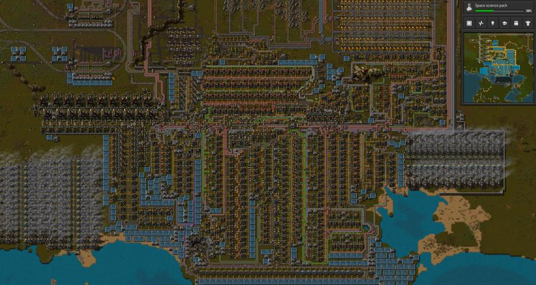

# Оборона макаронной фабрики

:::danger
Это заготовка для будущей статьи, сейчас она не рекомендуется для изучения, а в будущем может измениться или вообще исчезнуть.
:::

:::tip Вся статья, кратко **
Обороняйтесь нападая. Самая лучшая фортификация в *Factorio* пробивается на раз-два-три-четыре-и-так-далее заходов ордой местной фауны со всех направлений. Застряв в глубокой обороне, вы проиграете гонку на время отведённое на запуск первого спутника. Боритесь с источником нападений, а не с угрозой нападения.
:::

Ваша первая фабрика, даже если вы [всё спланируете заранее](./README.md#ранее-планирование), будет напоминать [макаронное производство](https://en.wikipedia.org/wiki/Spaghetti_code) с дикими зависимостями и умопомрачительной логистикой. Это нормально, на начальном этапе игры потребуется совместить малые размеры фабрики с её быстрым ростом. Вам нужно сделать [компактную первую кузницу](../RawResourcesProcessing/README.md#чертежи-для-плавки-руд), [компактный заводик снабжения](./Mall.md#магазин-шота-у-ашота), [электростанцию мегаватт на 120](../PowerProduction/README.md#начальная-база-на-45-научных-пакетов-в-минуту), [компактный нефтеперерабатывающий заводик](../OilRefining/README.md) и [компактное производство всей науки](./README.md#краткий-план-игры). И всё это ещё компактно совместить друг с другом, чтобы не было мест перепроизводства чего-либо. Да ещё и продумать как вы будете строить фабрику по ходу сюжета и открытия новых наук. *Маленькую фабрику легче защищать от непрошенных гостей и быстрее строить*, так как не нужно будет бегать лишний раз туда-сюда. И сохраните останки вашего разбившегося космического корабля, на память, для истории:

**

Чтобы успешно защищать свою фабрику, нужно постоянно наблюдать за распространением [загрязнения](./Pollution.md). Местная фауна не будет атаковать вас за просто так. Жуки становятся агрессивными только в трёх случаях:

* игровой персонаж приблизится к представителям местной фауны довольно близко,
* облако загрязнения распространиться до мест расположения улей местной фауны,
* экспансия ульев распространиться близко к вашим постройкам.

Первый вариант можно избежать довольно легко, если не слоняться по игровой карте от нечего делать. Второй избежать практически не возможно. Вы строитесь, расширяетесь, производите всё больше и больше загрязнения, которое неминуемо накроет улья, что вызовет нападение местной фауны на источник загрязнения, то есть на ваши постройки. Ну и третий вариант, с течением времени он тоже случится.

:::info Помним
Распространение загрязнения до ульев кусак `!Biter spawner` и ульев плевак `!Spitter spawner` является главным фактором побуждающий местную фауну `!Biter` `!Spitter` атаковать постройки вашей фабрики. Постоянное [наблюдение за распространением загрязнения](./Pollution.md#наблюдение-за-распространением-загрязнения) и [попытки уменьшить загрязнение](./Pollution.md#уменьшение-загрязнения) являются одним из главных элементов стратегии защиты фабрики.
:::

Что именно местная фауна атакует прежде всего:

* игровой персонаж, турели или логистические роботы, если кто-то из них окажется в некоторой близости,
* здания производящие загрязнение, такие как печи, сборочные автоматы и особенно бойлеры,
* радары, по необъяснимой причине, так как радары не производят загрязнения,
* всё прочее, если попадётся на пути следования оравы к вам в гости

## Ранний этап игры

В начале игры вы появляетесь у разбитого корыта совсем без штанов. Ваша задача не разевать рта считая ворон, а действовать быстро.

## Первый выход с базы для освоения нефтяного месторождения

TBD: автомобиль, статья есть

## Глобальная зачистка после запуска первого спутника

TBD: паукотрона ещё нет,

## Сравнение оружия

TBD: авто, танк, паукотрон, автомат, наборы для костюма

## Форпосты и автоматическое снабжение

TBD: Какую функцию выполняет форпост, радар, отстрел экспансии
