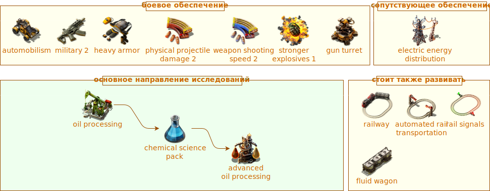

# Первый выход с начальной базы

:::danger
Это заготовка для будущей статьи, сейчас она не рекомендуется для изучения, а в будущем может измениться или вообще исчезнуть.
:::

В начале новой игры основные ресурсы будут располагаться компактно рядом с точкой старта. Нефтяные месторождения являются исключением, к ним нужно дотягиваться. Переработка нефти `Crude oil` является необходимым шагом к химическому исследовательскому пакету `Chemical science pack` и далее к робототехнике `Roboport`. После того как вы худо-бедно наладили [начальную кузницу](../RawResourcesProcessing/README.md#теория-плавления-ресурсов) и [производство паровой энергии](../PowerProduction/SteamPower.md#чертёж-угольной-паровой-электростанции), построили [первый заводик производящий всякую мелочь](../HowToStartNewGame/Mall.md#магазин-шота-у-ашота), наладили науку на первых двух склянках, `Automation science pack` и `Logistic science pack`, отбились от первых атак кусак и малость прокачались в плане вооружения `Submachine gun`, наступает пора строить автомобильчик `Car` и [двигаться в чащу леса](../HowToStartNewGame/README.md#первый-выход-с-базы) на поиски приключений. А для этого нужно закончить исследование `Automobilism`.

:::warning Без коняшки покидать базу не рационально
Автотранспорт, это не только ценный мех. Это ещё и быстрые колёса. Относительно не плохо стреляющая образина, которая даёт возможность уезжать от возможных проблем сами знаете с кем. А также перевозчик разного хабара. А ещё можно кидать гранаты прямо в водительское окно, не покидая повозку.
:::

Далее, нужно закончить исследования `Electric energy distribution 1` и `Oil processing`, произвести достаточное количество труб `Pipe` и подземных труб `Pipe to ground`, больших опор ЛЭП `Big electric pole`, нефтяных вышек `Pumpjack` и разумеется достаточного количества патронов `Piercing rounds magazine` и гранат `Grenade`, иногда и пару турелей `Gun turret` не помешает захватить. Не будет лишним провести и первые военные исследования на убойную силу `Physical projectile damage` и скорость стрельбы `Weapon shooting speed`. Предпочтение стоит отдать огнестрельному урону перед скоростью стрельбы боеприпасами. Также поможет исследование усиленной взрывчатки `Stronger explosives`, гранаты в *Factorio* хорошо отрабатывают. В дополнение не забываем про поезда, особенно если месторождение далеко, да и локомотивы `Locomotive` всё равно придётся открывать и лучше заранее накопить рельсы `Rail`.

:::info Наша цель
Получить продвинутую переработку нефти `Advanced oil processing` как можно скорее.
:::

Что берём с собой в дорогу:

* достаточное количество нефтяных вышек `!Pumpjack` и больших опор ЛЭП `!Big electric pole`
* достаточное количество труб `!Pipe`, особенно подземных `!Pipe to ground`
* побольше магазинов с бронебойными патронами `!Piercing rounds magazine` и побольше гранат `!Grenade`
* пулемётные турели `!Gun turret` и обычные магазины с патронами `!Firearm magazine` для них
* и конечно же хорошее настроение и готовность к смертельно опасным приключениям

План действий:

* умножаем на ноль `!Piercing rounds magazine` `!Grenade` `!Gun turret` всё что шевелится по близости `!Biter spawner` `!Biter` `!Spitter`
* едем на автомобиле `!Car` по направлению к месторождению нефти `!Crude oil resource` заодно протягиваем подачу электричества от начальной базы посредством больших опор ЛЭП `!Big electric pole`
* [строим нефтяные вышки](../MiningResources/Autotorio.md#нефть) `!Pumpjack` и огораживаем их турелями `!Gun turret` `!Firearm magazine`
* возвращаясь назад протягиваем нефтяную трубу `!Pipe` `!Pipe to ground` к месту строительства будущего нефтеперерабатывающего завода
* по возвращении достраиваем нефтеперерабатывающий заводик `!Oil refinery` `!Chemical plant`
* если месторождение нефти получается дальше чем 200 подземных труб от начальной базы, то заморачиваемся строительством вокзала `!Train stop` и транспортировки поездами `!Locomotive`, со всеми последствиями
