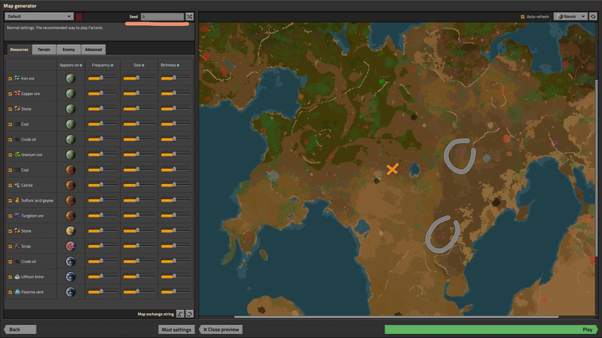

# Первая экспансия

:::danger
Это заготовка для будущей статьи, сейчас она не рекомендуется для изучения, а в будущем может измениться или вообще исчезнуть.
:::

:::tip Вся статья, кратко **
Рано или поздно вам станет тесно и придётся суваться за горизонт, туда откуда приходят толпы нежданных гостей. Лучше сунуться пораньше с целью поиска месторождения нефти и его освоения для постройки химического заводика, а также усмирения надоедливых соседей и выдача им путёвок в рай.
:::

Начав игру вы будете сильно загружены тяжелым ручным трудом. Добывать первичные ресурсы `!Iron ore` `!Copper ore` `!Coal` зачастую придётся махая только киркой `!Steel axe`. Вы будете заняты строительством заготовки для [будущей угольной электростанции](../PowerProduction/SteamPower.md#чертёж-угольной-паровой-электростанции), [строить кузницу](../RawResourcesProcessing/README.md#чертежи-для-плавки-руд), производить нужные предметы руками или [освоив небольшой заводик снабжения](./Mall.md#магазин-шота-у-ашота). Ещё и [загрязнение](./Pollution.md) будет распространяться за горизонт привлекая оттуда [нежданных и не званых гостей](./FactoryDefense.md#ранний-этап-игры), которые непрочь пощекотать вам нервы.

Ваша главная цель будет не только защититься от навязчивых персонажей, но и автоматизировать хоть как-то производство первых двух научных пакетов, которые `Automation science pack` и `Logistic science pack`. А после этого трудностей только добавится. Окажется, что для производства следующего научного пакета, `Chemical science pack`, требуется освоить переработку нового ресурса, нефти `Crude oil` и которого нет в пределах вашего места падения на неизвестную планету. Потребуется [снаряжать геологическую экспедицию в чащу леса](../OilRefining/README.md#осваиваем-первое-нефтяное-месторождение) с цель разведки месторождений нефти `!Crude oil resource`, их освоения и добычи, а также расширения ваших владений.

## Цели и задачи первой экспансии

Ваши задачи просты и понятны, но выполнить их будет не так просто, особенно с голым задом:

* найти поблизости месторождение нефти и протянуть к нему линию электропередач,
* освоить добычу нефти на найденном месторождении и возвести хоть какую-то фортификацию,
* построить нефтеперерабатывающий завод и протянуть к нему подачу добываемой нефти,
* усмирить соседей в радиусе распространившегося загрязнения и даже более.

А конечные цели вот такие:

* найдено богатенькое месторождение нефти на котором освоена добыча нефти `!Pumpjack`,
* добыча нефти защищено от неожиданных нападений местной фауны `!Biter` `!Spitter`,
* построен нефтеперерабатывающий завод производящий всё что потребуется и даже больше `!Solid fuel`,
* автоматизировано производство химического исследовательского пакета `!Plastic bar` `!Advanced circuit` `!Sulfur` `!Engine unit`.

**Главная цель на данном этапе игры это прорыв в робототехнику `!Roboport` `!Construction robot` `!Logistic robot`**, ну и строительство коммунизма на всех планетах.

## Цели и задачи в жизнь

Перед началом новой игры, [стоит подбирать такую карту](./README.md#выбор-подходящей-игровой-карты), чтобы месторождение нефти располагалось близко к расположению строящейся фабрики и содержало не менее 6 скважин добычи нефти `!Crude oil resource` и тогда не придётся заморачиваться с поездами слишком рано, чтобы доставлять нефть из невесть откуда. Хорошо, если в придачу к нефти, будет ещё каких-то дополнительных месторождений ресурсов `!Iron ore` `!Copper ore`. Вы не поверите, но нулевое зерно (Seed=0) генерирует игровую карту с хорошей стартовой позицией, попробуйте:

В начале новой игры основные ресурсы будут располагаться компактно рядом с точкой старта. Нефтяные месторождения являются исключением, к ним нужно дотягиваться. Переработка нефти `Crude oil` является необходимым шагом к химическому исследовательскому пакету `Chemical science pack` и далее к робототехнике `Roboport`. После того как вы худо-бедно наладили [начальную кузницу](../RawResourcesProcessing/README.md#теория-плавления-ресурсов) и [производство паровой энергии](../PowerProduction/SteamPower.md#чертёж-угольной-паровой-электростанции), построили [первый заводик производящий всякую мелочь](../HowToStartNewGame/Mall.md#магазин-шота-у-ашота), наладили науку на первых двух склянках, `Automation science pack` и `Logistic science pack`, отбились от первых атак кусак и малость прокачались в плане вооружения `Submachine gun`, наступает пора строить автомобильчик `Car` и двигаться в чащу леса на поиски приключений. А для этого нужно закончить исследование `Automobilism`.

:::warning Без коняшки покидать базу не рационально
Автотранспорт, это не только ценный мех. Это ещё и быстрые колёса. Относительно не плохо стреляющая образина, которая даёт возможность уезжать от возможных проблем сами знаете с кем. А также перевозчик разного хабара. А ещё можно кидать гранаты прямо в водительское окно, не покидая повозку.
:::

Далее, нужно закончить исследования `Electric energy distribution 1` и `Oil gathering`, произвести достаточное количество труб `Pipe` и подземных труб `Pipe to ground`, больших опор ЛЭП `Big electric pole`, нефтяных вышек `Pumpjack` и разумеется достаточного количества патронов `Piercing rounds magazine` и гранат `Grenade`, иногда и пару турелей `Gun turret` не помешает захватить. Не будет лишним провести и первые военные исследования на убойную силу `Physical projectile damage` и скорость стрельбы `Weapon shooting speed`. Предпочтение стоит отдать огнестрельному урону перед скоростью стрельбы боеприпасами. Также поможет исследование усиленной взрывчатки `Stronger explosives`, гранаты в *Factorio* хорошо отрабатывают. В дополнение не забываем про поезда, особенно если месторождение далеко, да и локомотивы `Locomotive` всё равно придётся открывать и лучше заранее накопить рельсы `Rail`.

:::info Наша цель
Получить продвинутую переработку нефти `Advanced oil processing` как можно скорее.
:::
