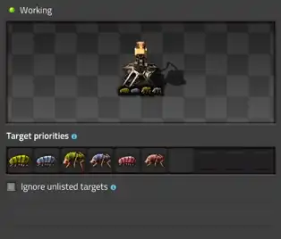
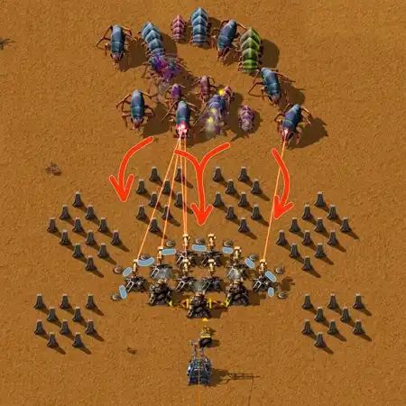
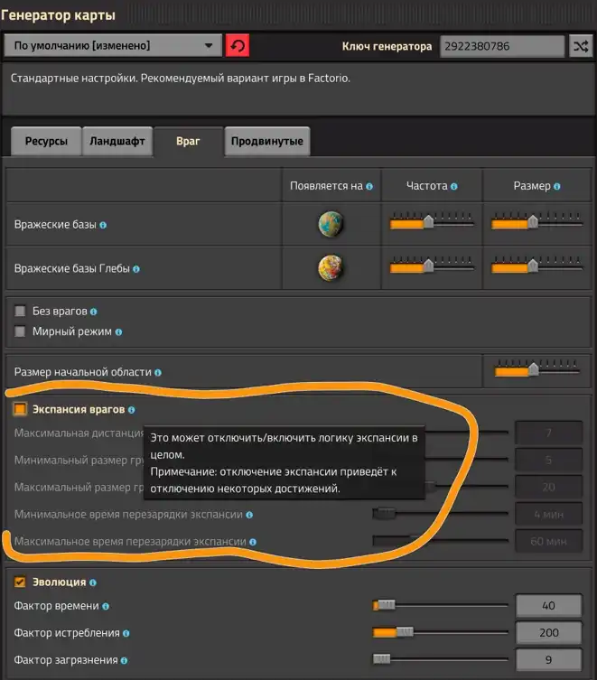
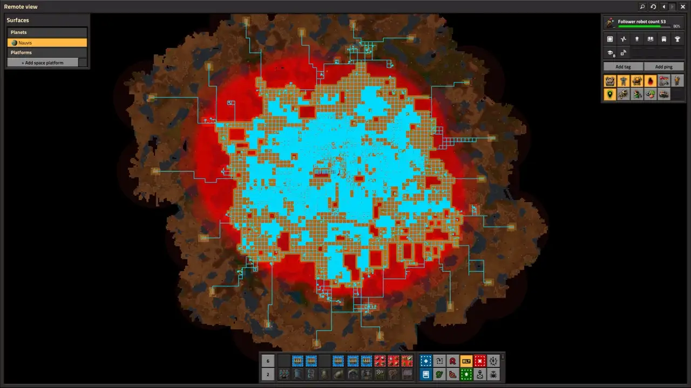
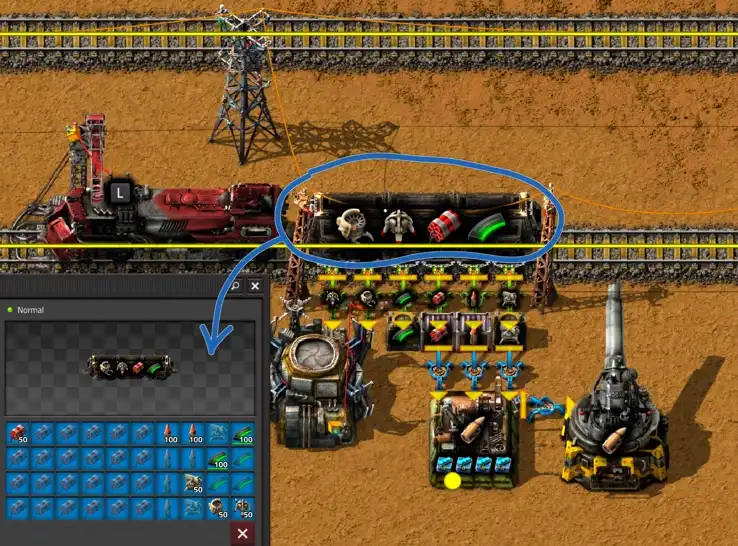
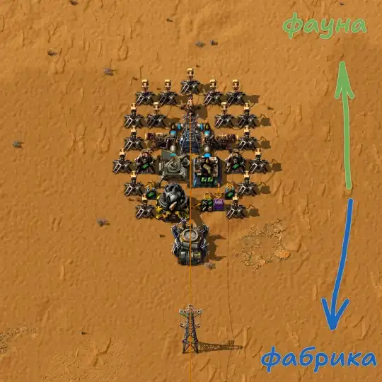
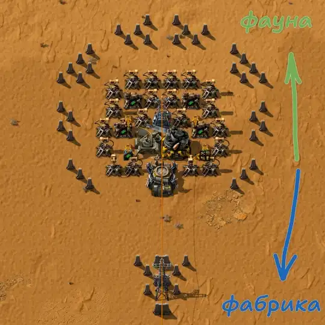
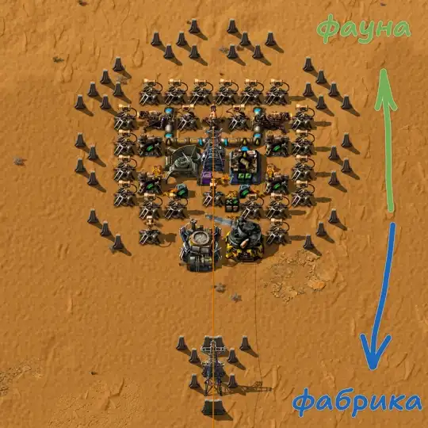
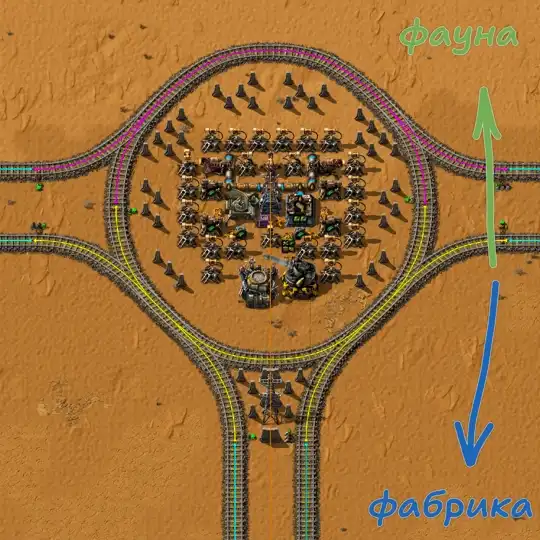

# Массовая фортификация

:::tip Вся статья, кратко **
Фортификации не просто хаотичное скопление турелей и артиллерии. Это надёжная страховка от превращения вашей фабрики в шведский стол для местной фауны. Если есть достаточно защитных укреплений по периметру производящей фабрики, тогда можно спокойно дышать и делать няшки. Иначе нервно смотрим как жуки устраивают барбекю на развалинах былого величия. *...и прости нас Юра*
:::

Игра в *Factorio* зачастую монотонна и располагает больше к медитации и ко сну. Особенно это проявляется при строительстве большой фабрики [после запуска первого спутника](AfterSatelliteLaunch.md) или, при наличии ~~бесполезного~~ платного мода, опосля экспедиции на разрушенную планету. На поздних этапах игры объём производства растет быстро, размеры базы расширяются далеко за горизонт и вместе с этим за пределы видимости [распространяется облако загрязнения](Pollution.md). В такие моменты начинает казаться, что за горизонтом ничего не происходит, однако рост пятна загрязнения неизбежно [привлекает незваных гостей](FactoryDefense.md#загрязнение-и-прочие-неприятности), которы совершают визиты на самые отдалённые участки фабрики со всеми последствиями.

В ранние годы *Factorio*, когда масштаб производственных чертежей был невелик, доминирующей стратегией обороны являлось создание сплошного периметра вокруг фабрики. Игроки окружали всё и вся многорядными заграждениями из лазерных турелей `Laser turret` и стен `Wall`, что полностью исключало контакт фауны `Biter` `Spitter` с источниками загрязнения на вашей фабрике. Несмотря на архаичность, подобные архитектурные решения встречаются и в современной практике, хотя с точки зрения инженерии данный подход является неоптимальным по нескольким причинам. *Избыточное количество турелей ведет к нерациональному распределению ресурсов.* Большая часть оборонительных единиц никогда не вступает в огневой контакт, простаивая на участках с низкой интенсивностью. Такая непроходимая стена создаёт проблемы для постоянного расширения фабрики. Также, *лазерные турели обладают постоянным энергопотреблением даже в режиме ожидания*. При масштабировании фабрики до сверхбольших размеров совокупные потери липестричества от тройного ряда лазерных турелей по всему периметру создаёт нагрузку, сопоставимую с потреблением всей фабрики. Всё это требует неоправданных трат ресурсов и генерацию энергии, которые могли бы быть направлены на ускорение производства научных склянок `!Automation science pack` `!Logistic science pack` `!Military science pack` `!Chemical science pack` `!Production science pack` `!Utility science pack` `!Space science pack` или в экспансию `Shattered planet`.

## Организация обороны

Защита вашей макаронной фабрики являет не возведение "великой китайской стены", а строительство автономных фортификаций, известных как *Military Outposts*. Основная задача таких фортеций заключается не в [зачистке игровой карты от ульев](FactoryDefense.md#глобальная-зачистка-после-запуска-первого-спутника), а в контроле за [экспансией местной фауны](Pollution.md#что-делать-если-уже-катастрофа) на пустующие территории. Главным строением любого форпоста будет артиллерийское орудие `Artillery`, которое в автоматическом режиме эффективно несёт демократию на огромные расстояния и осуществляет зачистку вновь возникающих ульев `!Biter spawner` `!Spitter spawner` `!Worm`. Для контроля экспансии достаточно размещения одного артиллерийского орудия. Имеется бесконечное исследование увеличения дальности стрельбы `Artillery range` и примерно на восьмом уровне этого исследования область автоматической стрельбы соответствует квадрату сканирования радарами, при условии их размещения в непосредственной близости.

Из этого следует, что важнейшим помощником на форпосте будет радар `Radar`, который обеспечивает непрерывный мониторинг окрестных территорий раскрывая цели для артиллерийского удара. Один радар прочёсывает зону 29x29 чанков за чуть менее чем семь с половиной часов игры, поэтому для ускорения процесса иногда целесообразно установить несколько радаров. Прелесть игровой механики в том, что радары работают согласованно, сканируя разные области закрытой карты и не дублируют задачи друг друга.

Стоит помнить, что каждый удачный залп артиллерии вызывает у потерпевших неконтролируемое желание нанести обратный визит и лично выразить протест. Без надёжной защиты, состоящей из лазерных `!Laser turret` и пулемётных `!Gun turret` турелей, а иногда и огнемётных `!Flamethrower turret` турелей, ваш форпост мгновенно превращаются в крайне бесполезный металлолом. То есть, каждый форпост проектируется как самодостаточная единица, способная выдержать массированные волны возмездия, спровоцированные артиллерийским обстрелом. Использование логистических сетей `Roboport` или поездов `!Locomotive` `!Cargo wagon` для доставки боеприпасов `!Artillery shell` `!Uranium rounds magazine` и ремонтных комплектов `!Repair pack` минимизирует ваше непосредственное участие в поддержании обороны.

Размещение таких самодостаточных фортификаций за границей области загрязнения, или даже чуть дальше, создает безопасную зону внутри которой можно развивать производство без риска вызвать интерес местной фауны. Проводить тотальную зачистку территории с помощью форпостов возможно, но потребуется соответствующая огневая мощь. Здесь вступает в силу закон соседского гостеприимства, если удар пришёлся по молодым ульям, недавно возникшим в ходе экспансии, количество делегатов с жалобами будет умеренным. Но если вы рискнёте потревожить старожилов древнего поселения, то ждите в гости внушительно разъярённую биомассу. Фортификациями следует ограничивать экспансию местной фауны на свободные или освобожденные территории, а [зачистку ульев проводить лично или удалённо](TankAndSpidertron.md#тактика-применения-для-зачистки-ульев), возглавив [группу хорошо экипированных паукотронов](TankAndSpidertron.md#группировка-паукотронов).

:::info Понимаем назначение форпостов
* Основная задача форпостов проявляется в подавлении экспансии местной фауны при помощи артиллерии.
* Форпосты выносим за пределы загрязнения обеспечивая полное перекрытие периметра артиллерийским огнём.
* Радар является обязательным компонентом для зондирования окрестностей и выявления новых ульев.
* Защита форпоста должна включать различные турели для отражения волн возмездия.
* Снабжение форпостов боеприпасами и ремонтными комплектами должно быть полностью автономным.
:::

### Турели разные бывают

Лазерные турели составляют основу автономной обороны форпоста. Несмотря на меньший разовый урон в сравнении с пулемётными турелями, они выигрывают за счёт увеличенной дальности стрельбы, позволяя ликвидировать мелкую фауну ещё на подходе. Однако эксплуатация сопряжена с постоянным пассивным энергопотреблением и критическими пиковыми нагрузками в моменты ведения огня.

Пулеметные турели обеспечивают критическую плотность огня за счет масштабирования через технологии и боеприпасы. Однако высокая зависимость от физической логистики делает их уязвимыми, поэтому наиболее эффективно их использование в качестве резервного эшелона обороны, расположенного за основной линией лазерных турелей.

Огнемётные турели весьма опциональны, но крайне эффективны против местной фауны. Несмотря на высокий урон, их эффективность раскрывается только против массовых групп. Одной установки достаточно для создания заградительного огня. Основной сложностью остаётся логистика топлива. Используйте их как дополнение к другим типам турлей для экономии энергии и боеприпасов.

Вся эта огневая мощь возводится с целью защитить артиллерийское орудие и радарные станции от местной фауны, которая прибегает сразу после уничтожения их родного улья. Мы не строим форпосты для ленивого выкашивания местных достопримечательностей. Фарпост гэта ўсё для барацьбы з экспансией местной фауны, як так.

:::info Применяем стратегию эффективно
* Лазерные турели на первой линии обороны для массового поражения и ослабления нападающих.
* Смешанная вторая линия из пулемётных и лазерных турелей для критического добивания.
* Размещение огнеметных турелей на третьей линии допустимо вместе с лазерными турелями.
:::

### Тюнинг турелей

Настройка турелей чистая религия, доказательств нет, зато за неправильное мнение могут наслать порчу во всех интернетах. В моём личном храме автоматизации догматы просты. Огнемётные турели мы настраиваем как элитного вышибалу. Они разбрасывают горящее топливо только на крупные цели, которые реально могут покусаться или поплеваться. Пулеметные турели работают по схожей схеме, но мягче, выставляем им приоритет на жирные мишени, чтобы дорогая амуниция не тратилась на мелочь ценой в киловатт для лазерного выстрела. А вот лазерным турелям мы отдаем грязную работу. Пусть выщелкивают всё подряд с приоритетом на назойливых плевак доставляющих неудобство на расстоянии.

**
**
**

:::info Удачи с настройками, она вам понадобится
* Лазерные турели чистят всё с приоритетом на дальнобойных плевак.
* Пулеметные турели экономят патроны и выцеливают опасных кусак и плевак.
* Огнеметные турели спокойно ждут крупного зверя.
:::

### Игра в минёра на огороде

Мины `Land mine` на форпостах приносят больше проблем чем пользы. Их игровая механика весьма спорная и реализована через одно чешское место теми [криворукими дэбилам что из *Wube Software*](../CircuitNetwork/Writing.md#многолетние-дэбилы-из-wube-software). Вероятней всего вы будете терять своих строительных дронов `!Construction robot`, а огромные кусаки `!Behemoth biter` будут игнорировать действия мин нивелируя хоть какой-то профит от них. Стены `!Wall` тоже сомнительны, но в меньшей степени. Их стоит располагать определённым образом, дабы направлять атакующую биомассу в узкие проходы на ваши турели. Но перебарщивать не следует, сплошные стены не дают никакой пользы. Создайте стенами несколько проходов к вашим турелями, дабы атакующие рванулись в них получив тесноту и малоподвижность. Прямо перед турелями, и только тут, можно таки поставить эти злосчастные мины, но один плевок из далека `!Behemoth spitter` уничтожит сразу несколько мин, а посему не кучкуйте мины на каждой клетке. Расставляйте и стены и мины в шахматном порядке, оставляя одну клетку пустой.

:::warning Рискуйте на здоровье
Не используйте мины, бессмысленная трата ресурсов и материалов, просто добавьте турелей...
:::

На следующем изображении показано как стены разделяют силы нападающих на изолированные группы, вынуждая их продвигаться через узкие коридоры. Это провоцирует скопление противника на ограниченном пространстве, что обозначено красными стрелками. Мины размещены непосредственно перед лазерными турелями и отмечены голубой штриховкой:

**

:::info Применяем стратегию эффективно
* Минные заграждения используются как средство замедления противника, сумевшего добежать до турлей.
* Возведение сплошных стен является избыточным, достаточно шахматного строительства.
* Вместо массового минирования и избыточного ограждения целесообразнее инвестировать в развитие.
:::

### Там на невиданных планетах

Путешествия до других планет в платном моде *Space Age* малость меняет подход к фортификациям. Так планета `Gleba` остается единственным миром с классической механикой экспансии местной фауны. На других планетах агрессивная фауна либо отсутствует, либо не распространяется за пределы своих зон. В частности, на `Vulcanus` единственную угрозу представляют разрушители `Demolisher`, однако они жестко привязаны к своим ареалам. Ликвидация разрушителя навсегда освобождает его территорию от присутствия враждебных существ, что делает концепцию долгосрочного оборонительного форпоста неактуальной.

На планете `Gleba` механика биологической угрозы во многом идентична планете `Nauvis`, однако имеют свои [визуальные отличия](Pollution.md#на-других-планетах). Местная фауна обладает выраженной резистентностью к лазерному урону, что делает стандартную стратегию лазерного форпоста малоэффективной. Вкладывайтесь в оборону на базе ракетных турелей `Rocket turret` ~~или более продвинутых систем вооружения, вроде теслы и райлгана~~. Для обеспечения безопасности периметра рекомендуется использовать стандартные ракеты `Rocket`, что позволяет избежать избыточных разрушений собственной инфраструктуры, характерного для более мощных боеприпасов с большим радиусом поражения.

## Экспансия жуков

Даже если вы очистили большую часть карты от местной фауны, механика экспансии всё равно быстро заселит её заново. Каждые четыре минуты игра выбирает свободный чанк в радиусе семи чанков от существующих ульев. Затем делегация из 5–20 особей выдвигается к цели, чтобы по прибытии поочерёдно совершить акт самопожертвования, превращаясь в новые гнёзда или червей. Этот биодесант безжалостно сносит всё на своём пути, поэтому попытка преградить им дорогу ящиком с хабаром закончится потерей хабара. Если вы не застроили территорию форпостами, игра будет регулярно подбрасывать вам новых колонистов. В итоге борьба с экспансией превращается в превентивную стерилизацию местности артиллерией форпостов или [другими доступными средствами](TankAndSpidertron.md#тактика-применения-для-патрулирования).

Впрочем, если возведение фортификаций и бесконечная игра в морской бой с ульями не входят в ваши планы, проблему можно решить радикально на этапе создания игрового мира. Отключение параметра *Enemy Expansion* в [настройках генерации](README.md#тыкаем-генератор-карт) запрещает местной фауне захватывать территории и уничтоженный улей исчезает навсегда, а очищенная зона остается стерильной:

**

В такой конфигурации игры потребность в эшелонированных форпостах существенно снижается. Помните, что даже при отключенной экспансии к вам всё равно будут наведываться делегации, потревоженные загрязнением. Поэтому проводите плановые мероприятия по фильтрации воздуха или по зачистке территорий от тех, кто этим воздухом дышит, паукотроны `Spidertron` в помощь.

## Планирование снабжения

На поздних этапах игры, когда первый спутник уже бороздит просторы космоса, или в тяжелых случаях до получения координат разрушенной планеты, наступает фаза перехода от [хаотичных рейдов по уничтожению ульев](FactoryDefense.md#вторая-экспансия-или-игра-до-запуска-первого-спутника) к планомерному возведению обороны по периметру вашей фабрики. Ключевым звеном в поддержании жизнеспособности таких удаленных аванпостов является автоматизированная логистика. Снабжение форпостов организуется посредством логистических дронов `!Logistic robot` или специализированных поездов `!Locomotive` `!Artillery wagon` `!Cargo wagon`, которые регулярно доставляют боеприпасы, артиллерийские снаряды и ремонтные комплекты. Использование строительных дронов внутри форпоста гарантирует оперативное восстановление поврежденных турелей и всего прочего без личного участия инженера.

Вот пример большой фабрики, где в центре видно красное пятно загрязнения, а по периметру вынесены точки форпостов для сдерживания экспансии. Они соединены с фабрикой железнодорожной линией и общей электрической сетью, а снабжение осуществляется поездами:



Если фабрика не большая, то удобней построить временные фортификации включенные в общую логистическую сеть. Тогда снабжение будет производиться дронами прямо с [магазинчика фабрики](Mall.md). Следите чтобы ваша фабрика и форпосты имели ярко выраженную топологию круга, дабы ваши дроны не заплутались в игровой карте без покрытия дрынстанциями.

Если фабрика небольшая, удобнее построить временные фортификации, включённые в общую логистическую сеть. В этом случае снабжение будет производиться дронами напрямую из [магазинчика фабрики](Mall.md). Следите за тем, чтобы ваша фабрика и форпосты имели ярко выраженную топологию круга или выпуклого многоугольника. Это необходимо, чтобы ваши дроны не заблудились на игровой карте и не остались без энергии в зонах, не покрытых дрынстанциями.

:::note Почему важна «топология круга»?
**
В *Factorio* алгоритм поиска пути у дронов крайне примитивен и они летят строго по прямой линии. Если ваша логистическая сеть имеет форму буквы «П» или «С», дрон попытается срезать путь через незастроенный центр. Оказавшись вне зоны покрытия дрынстанций, он не сможет подзарядиться, его скорость упадет до критического минимума, и он станет легкой мишенью для кусак или просто будет лететь до цели несколько игровых дней или вообще вернётся назад и зациклится.
:::

### Производство электричества на форпосте или подключение к общей сети

Единая энергосистема (*Global Grid*) практически всегда эффективнее за счет гибкого распределения мощностей. Создание изолированных электрических сетей целесообразно только для критической инфраструктуры, такой как добыча ресурсов, дабы избежать коллапса при перегрузке основной линии. Однако существуют методы борьбы с перебоями и в рамках единой сети. К тому же локальное производство энергии на форпостах увеличивает их размеры, что существенно снижает эффективность обороны, ибо защищать компактную территорию гораздо легче, чем растянутый блок солнечных панелей `Solar panel` и аккумуляторных блоков `Accumulator`. К тому же крайне затруднительно создать локальную генерацию энергии, способную одновременно удовлетворять колоссальный спрос во время пиков стрельбы лазерных турелей и при этом оставаться эффективной в периоды затишья. Поэтому создавать автономные источники питания для каждой фортификации избыточно и целесообразнее сосредоточиться на наращивании общей генерации для всей фабрики, подключая фортификации к единой системе посредством больших опор ЛЭП `Big electric pole`.

### Производство артиллерийских снарядов на месте или доставка с фабрики

Вам не требуется огромный боезапас артиллерийских снарядов `!Artillery shell` для сдерживания экспансии. Достаточно с дюжины таких няшек на форпосте, чтобы артиллерия в автоматическом режиме точечно ликвидировала появляющиеся ульи. В этом случае проще привозить готовые снаряды поездом снабжения или доставлять дронами.

Транспортировка артиллерийских снарядов поездом сопряжена с серьезными логистическими ограничениями. Из-за того, что снаряды не объединяются в стеки (одна единица на слот), стандартный грузовой вагон `Cargo wagon` вмещает всего 40 штук, а железнодорожное артиллерийское орудие `Artillery wagon` только 100. При этом железнодорожное артиллерийское орудие как вагон в четыре раза тяжелее обычного, что существенно замедляет разгон локомотивов `Locomotive`. Тогда как доставка сырья для локального производства прямо на форпосте позволяет изготовить более 150 снарядов из одного грузового вагона.

Ежели форпост строится как плацдарм для собственной экспансии и зачистки территории, то расход боеприпасов будет колоссальным. В таком случае локальное производство становится разумным решением. Не забудьте, что для организации производства на форпосте потребуется дополнительное пространство, что несколько увеличит габариты фортификации, хотя всего на малость. Представленный чертёжик демонстрирует, как можно доставить всё необходимое и даже более для изготовления 150 артиллерийских снарядов непосредственно на месте:

**

Синяя стрелка указывает на настройку грузового вагона с фильтрацией ячеек. Поезд доставляет на форпост взрывчатку `Explosives`, разрывные крупнокалиберные снаряды `Explosive cannon shell` и радары `Radar` в точных пропорциях, необходимых для производства артиллерийских снарядов `Artillery shell`. Также предусмотрено место для дополнительных ресурсов, таких как строительные `!Construction robot` и транспортные `!Logistic robot` дроны и амуниция `!Uranium rounds magazine` для пулеметных турелей. Снизу грузового вагона манипуляторы выгружают дронов напрямую в дрынстанцию `!Roboport`, а патроны для турелей в сундук хранения `!Storage chest`. Рядом расположены буферные сундуки для выгрузки компонентов производства артиллерийских снарядов, которые из сборочного автомата `!Assembling machine 3` загружаются непосредственно в артиллерийское орудие `!Artillery`.

:::info Применяем стратегию эффективно
* Вам редко когда понадобится производство снарядов непосредственно на форпосте.
* Для борьбы с экспансией достаточно доставить и дюжину снарядов в одном грузовом вагоне.
:::

### Доставка топлива для огнемётных турелей в бочках или в цистернах, или вообще по трубам

Отличная идея с трубопроводами через половину игровой карты для тех инженеров, которые где-то таки имеются в рядах *Factorio*. Но у нас таких нет, у нас все ребята нормальные? Вагон-цистерна `Fluid wagon` же самый прямолинейный метод, загрузил, отправил, разгрузил. Это решение для тех, кто не хочет возиться с автоматизацией бочек `!Empty light oil barrel` и предпочитает иметь огромный запас топлива форпосте. Топливо в огнемётных турелях расходуется мало, одной цистерны будет хватать на всю игру. Однако для нормальных форпостов, нацеленных на сдерживание редких групп экспансии, вариант с бочками выглядит гораздо более привлекательным. Его главное преимущество в компактности. Вам не нужен отдельный вагон с цистерной, бочки легко комплектуются в общий грузовой вагон вместе с боеприпасами и запчастями. Станция разгрузки получается короче, что критически важно при строительстве компактных фортификаций. Несмотря на необходимость ставить сборочный автомат для разлива и продумывать возврат пустой тары, это легко решается настройкой фильтров в вагоне поезда и фильтров на манипуляторах (в следующем разделе показаны реальные чертежи).

Для малых форпостов, снабжаемых исключительно дронами `!Logistic robot`, бочки остаются единственным логичным выбором. Здесь придется немного заморочиться с организацией розлива жидкостей на месте и своевременной отправкой пустой тары обратно на фабрику. Впрочем, в этом нет ничего сложного, достаточно одного сборочного автомата `!Assembling machine 2`, сундука запроса `!Requester chest` для доставки бочек с топливом `!Light oil barrel` и сундука активного снабжения `!Active provider chest` для возврата пустой `!Empty barrel` тары.

## Примеры эффективных фортификаций

Подготовительный этап завершен. Мы переходим к инженерному анализу конкретных чертежей, от компактных до больших, и везде с упором на функциональный минимализм, исключающий избыточность и упрощающий логистику. При планировании фортификаций критически важно избежать ловушки, в которую попадает большинство инженеров, проектирующих громоздкие объекты с избыточной инфраструктурой. Нам не нужны монументальные сооружения, нам необходим функциональный минимум. Главным критерием проектирования для нас всегда является [оценка качества чертежей](../Additionals/QualityAssessment.md).

### Малюсенькие фортеции

И первыми чертежами представлены фортификации, которые включаем в общую логистическую сеть и общую сеть производства электричества. Для всех последующих чертежей защищаемая фабрика располагается внизу, а местная фауна вверху. Нам будет достаточно одного артиллерийского орудия `!Artillery` и одного радара `!Radar`, одной дрынстанции `!Roboport` и одной подстанции `!Substation`, чтобы покрыть всю территорию форпоста, на то мы и творим малюсенькие чертежи, и остальное всё также по минимуму.

И первым делом расставляем огонёк, ближе к центру чертежа рядом с подстанцией `!Substation`. Расстанавливаем три огнемётные турели `!Flamethrower turret`, направленные в разные стороны, кроме стороны нашей фабрики. Со стороны фабрики рядом с огнемётными турелями и подстанцией удобно расположить радар `Radar` и сборочный автомат, который переливает топливо `!Light oil` из бочек в трубы для огнемётных турелей. По бокам удобно вставить пулемётные турели `!Gun turret`, а ниже артиллерийское `!Artillery` орудие. Дрынстанция `!Roboport` тут опциональна, она используется для парковки строительных и логистических дронов. Организуем доставку амуниции для пулемётных турелей в сундуки запроса `!Requester chest`, а всего остального в буферный сундук `!Buffer chest`, из которого питаем и артиллерийское орудие и сборочный автомат по разливу топлива. Всё компактно:

**

Следующим шагом добавляем лазерку `!Laser turret` по периметру всех объектов, в одну линию достаточно. Чтобы надежно встретить гостей `!Biter` `!Spitter`, усиливаем фронтальную зону дополнительными диодами. Поскольку основные атаки возмездия чаще всего прилетают по диагонали, именно на этих направлениях мы усиливаем огневую мощь:

**

Опционально добавляем стены, которые располагаем так дабы они создавали узкие проходы, но не усердствуем. Наш малюсенький форпост готов жечь жуков, ослеплять лазером и валить бронебойными патронами. Мощная точка, ну почти, которая борется с экспансией и защищает себя от возмездия:

**

Это довольно компактный и удачный вариант фортификации, который тянет на публикацию как отдельный чертёж (хотя не торопитесь копи/пастить ибо вся книга чертежей будет ещё со всеми фортециями):

```blueprint title="Малюсенький огненный форпост"
0eNrlWNuOozgQ/ZWVn2HEnQRp3uZ1vqAVRQacxFqDGWPSm23l37cMSaA7BYNHvdJoV4oUJbaPy6fqVJX9RnLRsUbxWpPsjfBC1i3JXt5Iy481Fea/mlaMZIQqzYVg6uLqTimmydUhvC7ZXyTzrw6y4NjVz1MDdKqgLVPPk0N08kHAtz4p+Yqtia47h7Bac83ZcJL+x2Vfd1XOFBjroLs6pJEtLJK12cpYGgQOuZAsCa/GjA8owVoUfzOgRBhKuNoWbwElcpaomT9Y/CUG3sD3UgGcK3ire8LuXn3A5uzEKqlPbs41bGhMuLvzeU7bcN3PAj+A66RiblffNuEtK0mmVceQY8SryYgWyEhWoyQLKOlq96YDSoKhbFajbBdQtg+UhjcMDY4v8W09eBRB8L2fQoQ/g1gvm3jhLP5q3QRLxPqhrX82KIytcvztnaYNKKfkihXDsDnXbyMkf1RS2+Wtpr2N83kA5yaxzSrRDDfR70RNaht/ODnrlT1kmdRDYUZpT4rlbA0BkH+RynHWKK6cH59BonfDyPox/CpW8q66Q9g6KxjTFq+BZQOCkXOLu9Tv69kk8jYY6MiToiVVS/k09fBkGIw80rZlVS54fXQrWpx4zdxgKb/2kO+NdEjFlZJq4MEhMGKSdEZY1fR+Pp60K7lwcwrxIch9xv5HRwWYBTOB1IqaESC6GroeXk5aJnY48IKzuri4lSw7YYy8PmYbx+15fYZTSnW5xdTjF7gbUkjxJ8m8wcfIiH/dXeGDMBWucWEQ27kwWiebIPl/ymZ9I7VZSE5BYllj0wCFGTOuYj861sKZ3OIE34taDvpAuK3YH7iAZX2otkNktB98+JiBebZTtDaEKtnVZQtCPdK/QalgACKhQlYNVVQbQZKv/R+duRwFcLMwvnjYpGS1z7vDod+29wV2/LFSPF2gljJPiKSJB8CedlruNVVHpiHzzEfCWF8GQ2eJH/NT+JnEv5OnBdc+Kr4PYWjjO1SmnxUWmMYVayhXbmPSoxVe5E3wJl33JH3+IpGT3rvVEgrVKxXCDm4zhQuRyG5PzBZzyt+kIUfKnpXDd6YkITfuVT3FKIdgTUEK/VWgway4Iwx00mTAtDNzGyXPvFxScTTdAcNcV46j6ekxmMgip4/F/b+S08PY8hKBV8YwsXxDSvE3pNTyxWMGZixUSuaykWrh6ShNP8+R5sURmO4XumZry9ye4LVCHqHR48WvIc4lj+27Ho4JOK6CPRop2DxZG/QJI/Is+N6GFnz3vbhDXiG9mIEXP3ZiB0yPd7uh5TfmPx59HYiaHNJrRl7OXGlgyR1eXL8OXy60+Gr3nRdKOn98YwfaCbPoDBb0dsZJsI2223gTeYEXwW35H5cDb/w=
```

Далее представляю альтернативный вариант без огонька, ежели не хотите связываться с логистикой пустых бочек и переливанием топлива. Тут усиление пулемётными турелями `!Gun turret` вместо огнемётных, что вызовет больший расход боеприпасов. Вариант на любителя, так как переливать топливо `!Light oil` в бочки `!Light oil barrel` вообще не проблема и первый чертёж выглядит лучше:

**

Ещё большего профита с усилением можно добиться если расположить огнемётные турели по другому и добавить больше пулемётных и лазерных турелей. Мы двигаем боковые огнемётные турели вверх и в стороны, объединяя их площади обстрела и освобождая больше места для прочих турелей. Может показаться, что олгневая мощь избыточна, но случаи разные бывают, некоторые [мир смерти играют](./README.md#пресеты-генерации):

**

Даю чертёж этго форпоста отдельно, так как удачная компоновка и обстрел.

```blueprint title="Малюсенький усиленный форпост"
0eNrlWduOozgQ/ZWVnyEKxtwi7SeMNO+jKDLESawFzBjo3myLf98yuZDuFBePeqXRthQpSrCPy8fnVNnmjaR5Kyoty4Zs3ojMVFmTzY83UstjyXPzX8kLQTaE60bmudBnt2m1Fg3pHCLLvfibbLzOQToc2/K5KUWb5rwW+rmxjzY+5PDdnLR6xfqwbusQUTaykeIyk/7HeVe2RSo0BOugozqkUjV0UqUZykQaQssz2YR+Z8L4gEIXo/gTKP5ilGAChS1GiSZQgsUoyQRKuBQlmmI3WooSXGMJMJTYmZIMtuCr4AbnkL3UIrs89mC1wSJKA7qby7rpdXUT/32UVJxEoZqTm8oGxjcR3VT/3KauZNO3ArmCwpUWblteB5G12JNNo1uBzCpZvE5sghtvbUtOeEVbGXJ+Gza85XaOp+iglnRE6xGtsN+JnMX5JfKnyGG2doxQmCHDPJSG8bwb/Zc6G1oNHKXy+AzC3j1G+g+zKsRetsUNwnqxhtRZyUqgpeSmuXCFL1Q0C0HnIOJZCDYHkcxCRDMQdD0LEc9BeLMQyRwEXSbY6GsKllpnFzQtUOvskqAww7RkCTBmSlMlPl59SNwxBjp4UvM915OmjEdUNJiSw1Avwq20epF7mGl2EjW+27thJiOYg0vrNq0b3vceL9oxCpIsYix8jOV9qcN2tINzeV2LIs1leXQLnp1kKVw66eTnJXFIIbVW+qJBh8AT4+UNEUXVe+x4alwlczfloJmc3FrsfrY8h7CgJQi64OYJiLy4HAjk/uE0IQ4HmUlRZme3UPs2N0F299bGNDtZvsAslT5f/Xz/BcoF7rO/yGZ98RfyxOu2HXwQprwl9A/7jEWC9amtJ1Ez+b6lJyMPhWFWFT9af60E6g9AWvxsIRdM5YRbnjGK6Jxbj91B5tCtl2p9UUb9gbV7C4zLVvPSTEGrttzXYNQj/wecCgEgFspUUXHNG2NI8mf/R2vuDSgcus3s7zFpVezS9nDoh+1nj00/XJR/6Pt5z+WfxUfHa24cUW68KLZoNDbUnEPCvZAzvth3YO8zF/udCS3W10Mt9oFfG72gZvwsKWJO1qLiUruVSclWeGz9gOehKfsXiXw4ctaNguL4yvPcDi5+hBuIHG7q6pOwxXzk7/Hg91xqrRZ8a8ogcnW1tkmB8f8tBbJFe4D7QeU5zXgUQ7U7t3y1sstszy1QIuwIQoKnc7PzF/DMphl8IggZJhwjESOKWV6VRxQVeWB5Vz4CE9qVZIofnVhkec89Ek1sedE9ApPYUszQu/uHNKpSVSk98RIh+sTcaV4Xgc36jq4Z2nInEOI7C3UEk8ns1xBHSk3gOaOvsqZqDVshbwPuCDveNmrXcH0UDZx0R5NOQG31gi/0+yQqcghKA1GVysX4HjcOUSy2SDQXiMS3EE1/5HXIK3BmHvygsRM4EHqw3V5O1ib8+2tHBxhJYUexId9kppXzx3dz9Q4J3CEvMEofSxDShCVJELM1XbO46/4FhcmI5g==
```

Но самое привлекательное свойство всех этих форпостов заключается в том, что *няшечка* легко вписывается в минимальный железнодорожный круг, а значить перекрёстки типа *RoundAbout* становятся ещё и форпостами в нашей будущей огромной фабрике. Напомню, такой круговой перекресток основа построения всяких ваших *сити-блоков*, вот пример:

**

### Всё ещё малюсенькие фортеции

Представляю дополнительные чертежи форпостов, масштабы которых выходят за рамки малюсеньких решений, но всё равно имеют место быть использованы. Например, два радара и много пушек:

**

Два радара и ещё больше пушек, особенно пулемётных:

**

Еле влезло в экран:

**

## Чертежи

Представляю полную книгу чертежей со всеми творениями, которую можно импортировать в вашу игру.

```blueprint title="Книга со всеми чертежами"
0eNrtfU1TJEmS5V8p4UyMuH2blczc5jKHll3ZlZU5lKQgAUSSIQUEE0D2Zrfkf1/3ICLcAH+u+typWQqqL9VZRT6em6mZqak+U/3nyfn14+puu759ODvfbH4/+fWf/b+5P/n1t+qP3X9bX2xun/71/frqdnnd/bvb5c3q5NeT5fZhfX292v5YPDxut6uHk5+nJ+vby9X/PfnV/Dwd+AtXj7evf9QO/uj18n61ff3D7ueX05PV7cP6Yb16YrX7w4+z28eb89W2/cWngwinJ3eb+/YvbW6739ERTO705MfJrzH87H7/CxSrRglPKH4IxalR0giKV6OUEZSgRclmBCWqUcZGN7FzlIZQ8hFlfduiPLT/bgDB/8t+htK/hNaMLtfb1cXTD+QBzHI6YKp41mOL2C6UzbbFWFyv7x92FnlYAkes89W31c3m4dvifN2x7H7vwfZf/8z93frhxU/1dnS+vnoN4p/954G/38/9zepy/XhzgGiXUrvsNtvV4vF2/xnr+9Xlya8P28fVwOiYhjXoODRxxrAWPQxjNQaQDWUAxuks4LBKPpsFeHYDGFy6Rr0bJfsEUwZhonK5+gPI55os/T4bnwYoD45yv9HeP57fPyx3f3MAJI+BFLXhNCMwtlEuT/spZ9yqd9bsR9aVteTyTGYQxlEndGo0G7TtB3O7+q/H1X2Lurj41v5zFNvssPd/4+zr+rr9a/fdj90//bL7F4Zx/Ikhc3ncLm+7WdpuHm8v7xc3y6vlP9a3q5bAfz0ur1u27c+0s3bTOrSnJxebm7vldvmwacmf/NvuXzx2nrX1P790E3zktN3cnJ0/fv26+7W7CR76/N5UtsvL5eCAxnpAhzD6bfOVBz90BsP56U7gI8LZ8vFhc/aw3F6tHta3V9hGE3Vs72eu+q1+CFTlDGbLmVq/Zz3NC7SzHvhN7ezZFkeYlhncwF4sZcZUB7e6N1kFvhncJ7eru+V6u7hbXvw+A69yNCurmDiQlbt5/7C5XS3+vry+5uByDecGFuH9txWLudtFBi+fDXkWDG/ijr1QJzcIw96oAYwjr7EAhnVjAUy1GW/ON3eb7QP2i5J/u42hC8m02+vuLy66X00u6Di8QWyuWg9pfTENEZlhfOb8rK7bz922v+Nuc73Cg5UHb3wuEeNdHDHegHuewr203Ntz/e/t4dL9kt9a/zmctsMQvpz+1v3jtIUNXzrX7mF100Efo22nrTWer67bf/e39cV2c/rL/7n9et3+/sv2v3xv6e9+V4i2+FJC9o1tfO5DY7ud712H7oZ+ePeBD9+2m78P/R3/VuE+a/c3AkfeCAa8dSu5805xsfDjV4ZXN4KBXxPRrWFGQNOafAj/fcpxcmp7aj71OPW/bmgB4+UXdv7xH3YlZy/MQT3d/lNPd1SPU/zU45TU22yaFj/+IOOU1eNUPvU49RGIu/XdavAYOqQ34nCwp8rZIAgnQeidrPCpZ8uovSz7uZe/cew+mT/pQLF+ljlEa3cj9iJW+27crir/N5ZSOnqNWcj+KX1QD8bGv6ehSewe8lmXht6HiPug/ycdKJ2o5XDzp4fpz54zbRSpo3ZwYD4qjydiQZqu99xgmq4fx+X9/erm/Hp9e7W4WV58W9+uFnbMkxvIb52e3Ky32y5s241DFxm96NzBX09WN3e7eb769rDYrK8X58vWPrpQ79NPnA0EgbvA5T5+elmF8lZfv64v1qvbix+Lm83l43VH8ufxp7uJO1vffm+/crP9sbep45/a6W6PgYvf92HMwf+yi9J+mZpobp1Tbgq9btnY+DmXjT50kj/19msj6esm+0kHKumVHdV+bD+KsiMTqozq9HADWz0vytBKHaozxv0ldWDN4i+pwzypQ4VZZfBfuy7UhMv6iTGnwj3fhwSnwhkVqIWL249rK5btj31fLe62m+/ry7FV7OvfMC60GCPq668fF1rIe3rvoH2UPd0F8jL/Wc9+F8n8dPqs+elEZuI+7UBlhVboEGBM6XNqswqjbzoM1rA2yzfEeL+BNsubKdxfabNCp8cqT9qs9h+nLaxSm/Xvq6/Lx+sHlTTL/CXNGtmpovlLmqUaJ/epx0mdM4zhU4+TV49T+tTjpPbNY/nU46R2zdPn3sfVnnkoh7fxn1z7pUvbx+ML7vCOJQ1FvZv4Tz37lR5NOf3xXSqH9aK4mD/3hFtywlMD1vu7kumovdG+zsxnV7Apj8X0SQcq6PQGh9ty+mTFLKKkY46ijjmJEFaCyCKElyBETXdXqWYUwoqa7pglCCNCFAnC6gw2fU6DtfQJ8Uk3PkufEOWTDlTQ5GT761JWydyiqFTsN9YMdoJEJ6DjIdfbbTOCHGZUIh7HShdVspaxEYs1Fznd3rC6zH43zp9Kl6lTO/T+vspg1ZUkjvvqJ90u1LUyDvtqMp90oDzleX82pW9d5UTU8MQXEvQPoOGJqjMEl5bys2Qc+/Ptv3lt4oXVm919O9rXVQRlXIQxNnaJKsvl1FrVHvivslx/aVU/sFa1Ft/IW3T+aFu0V/mZcayQ4RAqF9/4bG6BZ+Mbn9W99J4UQn1WEbAPpBLq0w5U5NwqIM73iVTAfNrxzqQE5tMOVGG3uk+qTg8qtfReyJjCp1SnB8M8iOy9Wv8mZaqDZdf8ZzVlRwnx9/GM4UcEwauWRXyrRwQhTOH+8hGB7Qq8tsPQPSLo/nHawiofEfzPTgqjrO9qmUcE1V24fj6gluw/u0u/GIdF9ofszcJ0+e7xDkoClBWhnBYq91DgWaPXQkURKmihUg8FHLE4YdgBVJow7AAqa6GMOFZFC9WIrCr94DiWKyIto7X3UI0WqNZitAYfquEyAEtr8S7KWFqTd0H+Rq3NB3/ECiBnbCI/9hBLa/XB9VhFVPio5xFiFX4eEZZt+HlE42W1du+8zEtr987JvNwE+woAy0+wCXSWhQnj5cXmK/rxCqLuQj9eTtZbqMcL7NGV7GJMu9Hu9/44WkIJBv24o0oEZsK4o+IIlt+7fBYLLajH3Rex2oJ6j4C8Jtg85BX5PbVzm4QeEOo9FWJl3h106BvVPo4XsXzDO4QOzKNX+/RO5jXBqYe8HO9eQl5+wngBVasPE+YR2JePE8Y+icFa/dijb8wTvhGcZ75M+EaAVUXFFNfx6vhwUQgg4WhChWLL/ICCnfgF9mVMoStG0I7HLqbQdP/fijGF/2xH/hejiiW4dxRL6O98Jc2LJbg+AFDivFhCdXtEUOrDNokfGPgIR/EzYwlRhEp8hKOEmbGEIEIV/txAH6iOJdQ2GmbGEpw8h+pYQm2l/u1iCRBrismHmbEEZ2Us9Z1KYRNq/1JhE1qzt4p5LBP2CDszluArXm5mLKHecOzMWEK947iZsYR6y3EzYwm1rbq5sQQjj1ecYKtuZiyhtlU7M5Zgs8yr8HftAuKX6nhCbV9mbjyhkbG0dm+D/I0TYmg5z4wnVGOf58YTqjhHnh1PaGReiY9NQF5qu08yL63d2yjyUscTKvvKc+MJ1su81HbvZF5T7D7OjCfUdj83nlDb/dx4Qm2rc+MJtX2lmfGE2r7izHhCbV9JjCfo7QvwCmbCPILzMdgJ34iw1HZfzSM4h4La7qt5BOdQmJArhLzihLFHvNKEsUdYaru3MlaZYKtgvKLa7o2MZXj7SmCPjpa3CYjleFtN4ByKE3KFECsoc1+uHC1iECfydgo5Jd624LhPsHnIq/B2inilZsIcgnMjTfBxINYUmwd3oTQhV4jE32mCjwN5Bd4vgbwi75dArAl7PcSa4OPA8Zqw1yOs3EywL7DX5wk+DupelSfkyCEvN8G+EC/P3x0hrzDBVhGvyN8dIa8pdo94TbF7xGuK3QOs0kzQ7oFzqJgJWk5wDhXLx4UgluPHHn6j52O+qPJTmZCviuB8LHHC2CNeaYK8F/GakLKCvAofP8b9nJsJBgbBDB+NRiNmGsuHfTEzx8ejMTM/wWBRUqeZovyGGcgJ+VrMLL2dft80eYJoG4JNyNrCz9RLwBWzqc/bFgWYnSDchmCOz7bCCTATUlgYLEzYgiDYhOQtHrMJWSwMlt/w2YJeCy6/YjH2LR9B6NXg8ksWY0kB1DEKEu0wnpswbPCJhp8wbBAsqNRlxw8MYba6zFQJX250g30uL4td35tusjp92e6fpx24SmFmVQoz/14UZoddI5g54rLDCg/NHF2ZFbjo7NMJXJS782E1I5W7cl8+nGRh3ou0ILBR7sVeYKPchRuBjdIFMRKM4YzPztKLWYmN48zPzlKJeYmNzoyLBKMz4yx9lM6MjTjjOjs24pRr3YkDjp8nBTtuFmGeDCxKfCy5XYR58i8v8fGcFYZZqi9xtiJphfMejvVW6GcJvYyVcJTW3H9YmqfwOpphnKXuaiQ6lttR0yxNVz9dcZaeywSJj9LDMMcPmynk6g1opoqrN6CZEq5+rGfqt4pASKvdkkZIq9uSBkir2ZLGR6nXaiQ6pMtcZqm0ggQTOdcnz9JmRQlGuTuLg1PIbaPMkmMZaXiUUiyTJD46UzbSOGslWMeBjjP1V8ftMM4UXx23wzhTeXXcDuNM2VWUCGXOP4zz5FZFgFEqrfrhmaeyOi4xiGO5JQa/y3FLDPLx3BKDfAJ33UHBTq2q6vhddp6iKkp8WHO2s5RURYBRiqj6bcPOElD1y8LNEk/1++FM4VQPFGappnp7DvMUU/1CTfPkUv3OEedppfohSvOEUkZq15XIEAfCyWSIA32YUh3VL440SxllpF5kSlVUb4tpliLKSF3JlGookyU+yiCH1J9Mq4IyUisirQSqX6x5nv6pXxplnvipt6E8U/kk4VhyjRVZ8TTW9Wmk55NS6NQv0zJL5CQPcSSXV5klbuqXe54lbOqXV5klajKS6agFTeZZi5UZaqbjEGEg0pyTnaliOjJy8xRMR6vGjALnmmFGbOwuzZUtHbfFNFez1H9dmClY6gfcz1QrBRHIUD4+xiHviGmmQMnIX0Z61ZhR4PbaNFeU1Bt3mqlI6o07zpQj9cadZmqReuOOM4VIRQQyXKwSA7HWjQbJstYd56mOeutOsuJIZ92QUWTnH53dloyDoJdgxpJ5cQxEBqvhp6mLReyBMizmS6bGMRDplaCnpsaRyXHMyHNnG2bE5ccxoUidkZgPmSDHhDLnt2FGhbuOQEaeTJFn5ABqM4pHc4R6IUuaI2TkSHOEjDyX5MRAgcpy4i+LlN4M80lUuhTzyZTiDPMpVMIU4ihTi1n6rsD52JiPJfcPSMiR+wdk5DkLQp5xIC0aln+LnCVCnMRZIvyuzI0PctKqxKKmpchIMxSjTC5aiVLU1EG1b9VTxUTLj8DLliqla6PSjeVOn97987TDVenTnUqfHhh9+qv+Q7VK/XTgL1QNI180cHn1o8+6C72o0Prqh79et/98+Lbt2sa8/jv+bRTzrnGC4kEpa2uspLZS9lhyXWBnhzOumhdQulAMRAlqFDuCotzVRG2K8pwWtSlZOVOSQKEocYyQyK+iYdKU+z2QIJyXYOIYjCUNMBpBOK+zQADjSRMEMHpLHh3iqIY5DvGnbIBmtGu1CGtMGeBzfUqlER8HSGa9NyQrvA1QrlUrPA1QrlUrvAzYLi+X28FFKuhAqpgewujzgnIxWOXyssKLAOXyssKLAAkmj8Ek9Rw9dTuMXngPMOSpjHga0b/u2fiHNdNmW11XMcW79d1qcAEIgp8qmqgcmf2sP3WzfDdDUQUzu6FYPGwWV7uO70OfkOpBkRuuV/FNEfu5UusZth9/QaEb/sPafW/D7yVL7NUsQXy8oRyKCNaof08Do98Hy8gG5uh9MAqvSCQYNwZT2JMzCU9IJJgywsarz3EzNjbesudnEt6PyJuFJH70+jM9jX1aYI0wCq9IlEaYhVckVTgCm2D+Ize6QQ9+yDv30g0gINec3DGqEPY+4NWO9MW39p9DYxRqFdObdeN+3C5vu0/YGe794mZ5tfzH+nbFNdC2vuugXXHabm7Ozh+/ft392t3Xjz/qWd+2RtaN4ZhfkzXHbBWGHwONEHTQL6iC8uOGnD+lIVe5hpFBf653lGey/7pl+2PfV4u77eb7+nJkjfRq/iI/bxoRdx6DJFl42jRqDMZ+TmOIKmNw3LJOKtBALmtmAzb+o23AoUxxYF4t3jz+Km18jaRPuUaiYd20LLy107lpqRGe2unuCgCmH75X2aqRq/lOAn3a/5Wz5ePD5uxhub1aPaxvr/AYBtVJX57/GmGfiZE6yV6DDu4z1Vu9p0Upn2B75DfaZJ6tQWJfMYMr7IWRMPvU4Fp8qy1waCFvV3fL9XZxt7z4ncPzTYVXJXsqs5g4kEj9TMDlGs4NLLv7bysWsx6/Og+0vvr2sNisrxfny3bCadAvwzn66tnp8v5+dXN+3a71duovvrUzv7BjHsPQojs9uVlvt91v73aLbt1cdMGpX09WN3e7E+XVRzz9xNnAt3TZ/f06uqwS36uvX9cX69XtxY/Fzeby8bpj+fP4093Qna1vv7efudn+2K/C45/a4WydzdYEf91b1cB/2YkZvoy/rJUibug5SWrI6MLwDp/YYwvAWDIlrOhGoMsyJSs8qdVlmQCMOvbS7AfZCe9pdalcwEYdRzRujE0mk0SATSEzlIpmA7ps0zCfbEg1AXqnkVkhCno5kmknzAtPaSWYMAZD27L0kBbrvo52/IYOTyekak+C3V9cdL+adFTisOOzuWqvJuuLaYjgJMz0QpWeCEswoxNfSPkQsudCHzl+xvPgXpGAFmqxpPIMvV0pjl1hUXgkrJyvOOONcJ9Cg59FFfY9rNlh3Wj1UFhe9m8g+KweFBPcXyo+gz8NpyXuBJ/dP05bWEnu+bf1xXZz+ktpmuaXpwm8V2k/41/aT2iqx6YFM7Wfx34FsvZzNEbly57NuPJzJF5w7OkQVMEzZXw5mBFeqjhGMBQvZTYvuBFeWcXLUryKklcY4WVUeaMQKGJGmTYKaYyZKrkSIsdMafthzPaNyvhD4ZgpD7QolYlUPqB2UaoTqVVXeqnim1Zd6b0k0+wt/mG7vL3vDthFeyA9jO2CsdEMf6W4lKEThB4Mg1YyTIK2UdHuF8ljexptn/IYEDyPED89efixCx1tHh/uHh9OxkWcgu8WmhF9c6XjVJAORkN6fYs4B+qX2ZkjFKl9Hhm6XhQaxoTklShU8+1h3kAX6iRBn17JNTWc47z5curIXsgjA+2oZRjKrIGuFJXidhINt1VVKkcC24h6RxmsIYlqTzmp8qvyvbmLUuXXSnk47lbvV6wTdIdjfvWzopRics9TS6o/gV6BZ9k4K6miTuPan0n2HevQvZVyEcfmjej1gmeF0Pt7zn4a3s9QeOo6NGznPlB3FwAS2RFN73NEE/sdBayZ96QLr1SeYMkE6dFQpZRUbFzRPN+4xMNfp5nsN377pprJOHYOVMpC1WEiVUdXHSaq9xxBHb/1cUTuH8K0MyngM2lkolVeuScfzQS1k+7z2EhkvRqtP2S8WFxd8mfNiOVEdRLjsMtLtdUlmDAGo5Z7HTZ4qbK6OND91uTF8uoCp9iMTH4M03a4UO9w0BnTqbp611u1AUS12Uc79uWZ23x1azIWbvOVVCOqzTcJmhHV5hs1Y5/stF0zTvDkE5cmGH5QU0lM0LPfIFXtrvQlECPqi7Vr4r7gY9K0xRp17kgiV0RUrYhErogkqE9UK6II2hPVilC9lsiWdUeyoEKhFlaZ4o7otSo+j3EOUxyHrAkr14Xgx96LHKKPWRB4EOetjl9mT98siD6oBV1Up69eCRJHq6obblsoqm2hWG5bKIIkRLMtJCMIQjTbgk7PXqZdL16DKw7KEqeGvFLzjkNeJalDXsmIBe91t5Fh3Wwh3uuEpuYkr4O6Br7uqjPMsa6Ar7vrIBz2soNwmNtOhIPmhZL4KLSTBNOoq+GTQa+Xq+Y9Bb3q2vxS1AsPzTQ/c795ie5HXatfc6IoH/vUhfs1R8rwaVAX7VedKU6q2K86VJzK7g3rbA6LsOvy/dTp5KZ4m8aw7iZiHZh3bsdr3SBr+tVb3RdgLL3syBlNVNL6NerwUjCZg7U6soV+GR681JWkEr4Ib/R6LPfXGz0KOsS/3uj9id7o1S0xlI/0en9naLf7uG/06qYfups4OFysm+bzONVV3OhLB0Y7SjNwrpPyvLCRc53cnJYgldsT5vUE6RWbsJ2PLRN0lUmViKj7hOh1lVrsKZrN5HUaZMs6ZF5qJiJzLOT3E0KwPp6hxCZ0Yb0bqcSOBHZDYicC25HYmcC2JLZOmemfW/HF5vZhu7k+ay/Fy+/r7vj658nFenvxuH44W90uz68P1+DT479u/8rlEfPrets6h6/e0iCH6uk3tudNdzR3KZ9nx/a/nrQr4I8rKNPd8x/vV70ri24hnthyQuCmyRNbTvAYe3zqtqvl5dm35e1lN1sPLYf7gVnc/funH239iVXnHAvtY2TG5Obuic0tkJu7Jza3QG6cntncyI1TX57w4Gx5qReNXpir5ZgnKIihI+LLFDQ/r1dN5b+Fed1qevkx5mTJ14GwSZ2yYU3lrsR5HWsq20jzetZUcxflrjWat677zCTo7xJUD3X3GG/RmSXkKexLlBrdHIFWt+2d6cdi3W7d26/LizHQ7jnuU6inPZ3/sdrlQA7/e/YwOMddK5inl8GdF2FOu0PK7BrDPP23P+6lcGJeCm+X6+tnr4PVL3IvHrffV5eLDmCxHGqhlp9c8EX7/ZqnXgSwB8Bx9MlujXs+hFvcATcpCHs9cCoAOI6+5ZUJpwOue45rhS4vLWQXOtlN/hBuPOB6GTcR4xB6vkLfF4FhQgzj6GtfeUSPM2U02Tzi0x0ANn78GbC0GnJzWA22KCgTyyxmADxMuW5T0UJefFuubxf7/WaI9sHHb/GTLtbj9dyP82izbMEmUNRT8j31KD4lFrkeTcNm4THxDgPzipEe0qzEfjZdXuXOFm5QS+p/QSDfHY8prdrjIh4nS2j1oiJaj7JqJKydspidvK9ZN2VBeMXQ+inW+7IbSjP+ppjYf5zGf4gTdnlrFKOcJuzyL4GHKecJR70pivkrE87kl8CD8/eswbTWizBZ4aaZCYe/UWzuzxpQS4wPq89EBeMpnqUJiqPUeW5Hyv3ebFQ7kgsTfFejASaczJTBYNvxt8byYJsDsBNeG+uvMMZp5q1MuMO8RBaeIYtfnw0AtuNvjmXGB0NostAiRWe0/XnfRM157x0TCKiOfcDXa92q7J8zHX+UK4+j63m9mKA6hNC6N+G0/WYpSvAfXdxiH1BRhQfy+wgPZPcHhQey+2PCA9lPDA+MdmPPrl8HDlhX0EJ5EUrvJGXLBC2SkqJveophTvfXzn5EqKKFKj2UF3vA6ucTYZkJEwplAlosJw6XcVosK/NS27+ReQVikTIhMWXBrxa1mgg7q+ZXt430WG5W2a92jWYZS7sIbBK/0TbE9jEe67PaNeD767YD9WOsnTCNjdhtVcDqnW5nxK6repNAWGGCSSCsOMEkGrHeloAVZV5qsw8yL70vnj0TLHQNb7gWJPmc4Y0NRRyd5ScCYjl+IuA36mNJ2Y5HQl2YMPSoo2icMPReLoQ1FonMbjwS6fKEKUScyoQpBGMFrp/CWlLEGYnrZ2Ubmjijn3Ak2EYsP6U3FSM27VRvvZBXmGAuiFec4GJpQpF+gltkQH1WP8EtglhlgiujCpEGfYg0eybgGPQh0myZ4FqwxOSPB9cCcZ92TKQqeP5aaICxB/WFOspYkb8XGrCgg3atuCDzyvwdE/Iq/B0T8YoT7tENKLMcDT+PDdgPouXHHmI5fuzhNxLukxuP0EYuzf1sBlQR2hgnzAcKVGmz3s8GEYHlCZOLsAoVhu59vuFJSYRv5XDkeLSKknha9IYTxO5bEpQbh3JTWDmhQBLBygl1kghWRiiXhPWRtVWY2RLJlKYMhBF6d6kHohSxfZeS1DBSVUGJWnAlP2/W0t7Swmm7ejtJZveP0xZYSq78r5bx6S//2e4W97/8x+35vgiEnGMp/z05lrHNzOZjS4xmTlMUmw+HejBSU5RxnCDw8UocL/DReXc2HflYKVcyjnPkg3oOKnGSwCcrcaLApyjH2Qg4ypRIZYh2Vj6kskQ3KxlSmaKdlQmpbNHNSoPYLE2assmJLY30aUqzLuL0K+26iNOvNOwiTr/SstMRyIt5DuUWgoAMu4eEWSmOahPxs/Ib1S4SxOSG4LjabPdImjx/0MPGQdg4PeNRrR4/K91RrZ4wK9dRrR4vJjqUqyeI7UPGgbzAyGmN/jjYaVZKo1qGcj5DiErZtG+slbiWHxLsXpMWFFIKF1jLiLNSHPaovIbzoDT6WIS+WMoEh41Z6sOn3emNwMg3rK2ieLLW6K0EpDT6EiQg5U5fojRGnrWjMithYUuWGGktu0iMWMtGLWw8a9moqY5nLRsxCqxlI0bB6DfPfUl785Y5B1sO/ISEg87K4XixVh7nZRd6K4eMWCuHjGgrD7OSCtWnhVkZBRuf1WGfnk6wMQllzpW5hGoBx1mJhGqwk5hFkDzhZA611+VXoHq3ff/kZLiiewyscaLxiqxNJTFjMN6u20iMlCWcmkZiVFjjBOddatjlAs67ZFjjRIwsu1wQI6fSztg8Vi89edaGstgwQWnVReyaoLQhxIi2asQok1OfwLGUCrsvvSw7nMej/Mp96VUJ8Ga8c4LOMtBXZ9bgUdmS7Nh5QDp5Tzp4kFEgXU7IKLKeYtJ0LEisp/gSddgyMunvweErpAeKhq805OaDGBXa6BEj2ujBkVpoowdHaqGNHjGijR4xiuTFHzJK5MUfAtGWjYBoy0bFjBratFFdhYa2bcjJsqaEur03joxTJtSAvlFrGuz+EXRSvK2uOwZIsMUOwlqhYr8uUom/O7EmC+cikzmgDHsJFDJ3kxuU3mTTSZCTNlN6zN5gTmxCCXMigutlD/VTqLYvAeUjkGyl6sypEceMzSLhMUtk0gZzYvNImFMh8z8QSZ0+PSLBEvuGXTlQGWDZlQM5OXblQE6eVGJgToGUYmBOkdRiYE6JFGNgTplUY2BOhZRjQCR1tlScO226tN9V0Dhp86VFnDvn2F0FcvKsPaEHxY62cfjMObKWCZESa5nw67Je92DGCnRqU6P9gCMHucqNKvTi1bgnVS33KmOq0HUeAoDgq7VZ034i4Fc7nfC8sg4IRUhk0uHrZIfG6735g6mUn0JRZBEojQIlllEZdgF9ZhkhoEIzclLhY6znPhjnm9S7NfQQOLk8sm4IFNWRdYzE4sjEiu9K+dY67uS6+rnt7rGrrdv987RDZqTcm8cHvZb7KXr4/1fMbQTJs273awQBtvLQF7goK2ALXJRP9JIgCVW+SIqCRFX5MC8IbJTPkLzARvkcr3kb/baoAzac8dl52m2JjePMz87Sbfu3UW0XCUZnxln6KJ0ZG3HGdXZsxCnXvit9G7l2v1mEWWrtfrfw8+rRBImPI/cLP1eq3fwRQm3/1jLtIo1b4paLnyXRNqLUu5DLxc8SaBv7NvrsRf9h8/TZ/XqZLc9ehEnqbNW5hD4ycAdKEsXYwjcWvVI8kYYVZ8myTZC+UbmfGyfJcpUbem/qeZYquzL1earsRT/WeV4xGVG5rKyHIY6Q0tEWByiSTmmepcgW5fiZW7VllhpbkuIrtdheGBtl6yRJz6/smySuUqX02oijozNlIw6PzpSN9ExBqbs24jgncjuMM2u5HLfDOLOQy3E7jDOruBy3Q8Qoqh8XLIr6bUEk/RL4lUSxiv1XUgJs1eUAjhx3tYQwkfMh4FipVXrGjTzniOoAsLGDQx6n67CPGxX6RqUM+7hRoTFXqrCN9NJEKcI20tOXpPe/zf6lgaJoffLc7T66WZrs4+0+2lmS7H5XcLMU2f0CtrME2UWCKdwtFeHkhtwIUIzTcLdUiKN+IGbCoE0OtmjI+pY5Ju6fMMmmrpRiVwd0mCXF7lc0p8Qeyjw2g185PHiJKiDW719R1Ywqa90cL7y7yVo3JwgvgQp7D0WMimFdwSgqskX71T8KK47cquMsdfZCeoynFGf3e9o8bXY/fbI0W2H4/SQmUaAtTOJha4sz5Nn9ZjFTnf18Pc8QZ5ssMlJ6NkVkpFVzGG6vqpXa4/UJ+1ErqrZ5TWA3Lyiqjux+mufJs6vtq8yTZ1c7ap4nz15IT/5qdbbmVHv2MlJWOWl7fSRp5Or86NhDyZFnkkaZHDVGJOPJjRUOPhmzwYzIoA1mlMitp8xTZhvZQKlOmtZw+41tWI84KZomapXb/UJHDy+NpV0ezXtTo2+eaYL+valW0320Q/zZgXThk6blpCHaZB5G02mmO3HbXLLztN7HW3py86Tex70uzVR6Hy/GkJEz5I02afqealXf1UoL81Tf/TGf/DzVdx8fxpwCGbLGnCIZatY8TtYqwI/RoKQQgGvCQRinkIFY1Wtp48nYJ5xQZUrWiAPmyegnZuQ4HwQzYsNA8G2qOivrpPey2rxsvxIhp8SuRMgpczlwDFTIBE1StNkwymytPPZ6Kfc+mZE08n9t+tZLE8rmb/F3sj4PZETeBjCjyNoqcr61SdwoPXEO+tLqxMvuUEjpVCqKQK+J3NOf+tvlG4c+51sGKQ+Dql87mEb/wl3ZyaPfPNHsK7O+/VpD9hgDF/aAj3QjmQ7DQKTrD58yR1IejxkVzieDjJK+36Ube9meDCfAffmufXiRJsspcF+iDoOqc8FJ/wRfmQoWbTZxmgc8r6ToARMiFfWYUeYCaphRIZc11PiTonr4lliZEO6XNWREyuoxI8dpFTEQJzHGXxaolziYT6RUj5hPot7iYD6Z0j1inMLtH7A/QMPtH/DdiiH3D0jIkvsHZOQ4C0JX2EJaNLpTF041j3EiZ4nwu5I+iDz2zlxZW8tIT8MLFdNvqJf1tqE6JtmR77XaclvC99oqoTuaLnUikDpsH9Qv6q2+7NZi7EG91dfZCqMwkaQz/AjeNomjg2AyS2e443uVsR15Sv9WD+mtacivB33qDfv14G2hJekAGMev7Zcv6LtccjjttonuCf3un6cdMPGEXvdy3jAv55fbh/X19Wr7Y/HwuN2uHp69oj8d+AtXj7evf9QO/uj18n61ff3DbvCHv163/3z4tt38fejv+DdqzxYOm7pBz2yVD6KDlYCU7/qDl4CUtXyikYCUpXyik4CU7kEMEpDS4/X9YIdZXdq8l4CUdXx8OQL5eX3aKosM8xq1BSNy4o07zGvVFpzIydPrJMxr1haCyCnSSy7Ma9cWG5FTpldvmNewLVqJk7bkYLURzCsCYKMXOVmyar+Z3bRNtAJtycEkzp225KDvOYFsjbbkYLX3pnnd2bwTOfHbeJrXn80HiZO25GB1IsR5HdqqE2Fmi7YgWoG25GAQrUBbcjCIVqAtORhEK9CWHAyyFST6REgzu7E1IqdCnwhpXj+26kSI8xqyVSdCmteRrToR4ryWbNWJEOf1ZEuiFWibsiXRCrRd2ZJsBYmsqY85ZbIUMUYq9HmX53Vmq867MqsgQH3ezasJUJ9386oC1OddnteRrbLxMq8lW2XjeV5PtsrGy7ymbJWN53ld2Sobz/Pasrnj/jSzQIB1WUQyZLltjKQtAV5EJKWNu6ONo1e3Sl1IPeJuVj0A65LIKdJz52a1ZLOuiJy0/ngSOdFxFfgQnI6rwDfcdFwFcqLjKpATHVeBnOi4CuREx1UgJ60/HkVOShsPomVqO7QFcbUoRSA2iCs4N+wdYWZdgOreAisVWPa2AZEce9uAX+fZ2wbkFNjbBuQU2dsGREpkHzCMlOnT3M1ru5bEFaztu5bEE0HbeC1lkZO2nr14thTeV/Hzeq9VvkqY13yt8lX8vO5rla8S5rVfq3wVP6//Wn8DgpwK7fWEmR3YfJQ+T92CrfKgwswebD7LrBztQwVNFzadYwdZBdof8/Oe89cOWZjZbq3yyPzMfmtBYaKF9sn8zI5rQdwW1C3XQpFZWdoF8nLTNa0P5Oe95a+doDDvNX/tu4SZvdZikD8w0X5QmNltLSaZVaF9qjCz31qUTVTdcK2RWVna1QtzW67JO4M6ASofXtoMaJIPL3XXNfnE4XOgsAqP5R2ZNLPxWh9fhiV9HO/JxJmt1yr3I8q91ypd2pDPcBgp6Qn++vZ+tX1o/+3oEZ9UT+6qlOg4OzvOLqjYBcwOlDDozf+ZUm8I+zAPUj+2vXq0Bbv41v5z3Lt54qkVnJ6eHH/i2b/d/+bH7fJ2/Xiz2HYthu4XN8ur5T/Wt506878el9ct3/Znbjfbm53++WJzc7fcLh82Lf2Tf9v9i8dOKll+fumEhkdK283N2fnj16+73/qwfVxJRQTG5zmNz3NRwpRRmLqBnDgbldPzUWajSkELZh3NqFlXGeiRdVfF4HS7gldtNpXfp1zOXrnbRD9uPoF2thRVEMYZxXFGiXa0ZtZAqB2tpKmCoMqTQlba1HSyIittbtr1uzB8Om/pwFOZV/Og9o7KvKoHtXdU5tU9qL2jPK/yQe0dKUofjGwPVZRHVxGvSlfLp0KFXt7dqWDypGOhyrKPjWt+8eViBYRGe9r4fJiwn0J9BskbOxxbw21Bq4S7BOTGgRztHxapDIMElMaBghqojANF2kcoUhkGCUgY7KwGEgZbZefV6V107kWVdx/DjeS+VCXhFd5q/Hj7klY7EIt4dCT1go3je5FWO1C5SWVe8YjaTcrz6kfUblKZV0GijkeVeTUkbDYylFYIdnSTYB1LrYKgzz9iKNqlTGZeLYkqA4lZOdY7xaw8qwzFrALr6GJWkXV0MVRiHV38gcpQh08HIKm0hOQ1lcPHSbUllF4TAuqtfOgl6lg08HUJ2Pant+vNtv0Fi+t1e5INHjrnq2+rm83Dt8X5ujtLO1KH17Svf+b+bv2w+6nurfBVexatFo+3+1+yvl9d7g+Y8WIX0gjF8RFy7Ajlyi7f1ZCo/dHYjA9JIIekj+q8NBr/rgYoss4oGiC9e5zGgZT7Tiyj+45W2tE7NmhTtVppR+/YoE1VXe4jORnKsj4S/kDH+kgYyrM5O/yBgXW3MCs6/YdZKU/YbGWoTDuBFkEV2glEUFppR+UEovoKWmlH5QRCVnSIErNytBMIWXnaCYSs6BAlZsX7k5CVLkSZngHJBZQM61vaYXa8bzlcg6YSeCgdHvPse9/NeW4rfcnd+m417s0iA6qUJQhEXhuVpkQGQfZXqUkQiLyjVToSBCIvqkpBgkCiDJJEkCKDZAmkT/VikCKCNCJIpRRBILKxOUOAIDtxosVG2WIde+2J4Z3uAs7TzvjwxlgJUnTO+PBGXelPxiLKmTxGtE/1Kx8fGlCmfXxoRoX28RGUp9PF8AO1z/UrHx9CWdrHhx/oaB8fsvK0jw9ZBdrHh1CR9vFRjRqtOKLy8SFUpn18WO+m0D4+YqUVR1Q+PqydY2gfH7KytI8PWTnax4esPJPkfz72H0D6ZUMgLyZwTtQBMH8ImgKgRF9GAFAmHGdoH4UAQWNTFxkYa4kY/IHNMExvMa9qUI660U/Gevw7Z8vHh83Zw3J7tXpY315h96fSRWh+YZn/Cx3hw6Ipi54AgVMWdFMW7fiURdqBBHwYwXDlAH6UfaoSe+g8Xzix6lhHakZnJPHRbGSxiY9mQyg+mo1GKvHRbAjFR7PhB/LRbMiKj2ZDVnw0G0Jl2uVCtQG16ojK5ULFAbXqiCoWCqEM7b3B4oeWjH+mYRhHuxwAyNO59eFy9jlwz2vwYEfmoYl7NuLdln37sN1cn52vvi2/r7ud/J8nF+vtxeP64exmc7k623w929yttst9zfrT439t/+blDvtsdbs8vz4EWQZ+oMP8ut62R8Hrati74uObrq3Psh3H65MnSu1pvFOPvThj/vXk59sdda9+NSdsm3TG5UT4mnBJqA7KKlCra9VQyU+W7c99Xy3utpvv60vVsyVItqgUkpUnG1VkC6OQrNDf4D3PkMd8/211TRqQayZZUFG9v6kcdeV4VrX8dxzwYJa3HEwzvLsz4zgYGX6xN0/Ec2/rF4dYYddRibvleru4W178zuHFpsKrMsiVYVA7WgUGfEwCLtdw7m3WzJMI+wDq32grj91CHF5s1SQtL5fb8QQSrLociNsq3Ed59dGw3zFBfTTsCdHqIwDDq49QEeEJ6iNY35q/r0Eo/r4GP5DXYxQExesxMoLi9RiQFa/HgKwSeXEowzCZvjgAoEILJ/pvfMdaWmcawqdFE1+dXsv7+9XN+fX69qo9Zi++tafswo77nq8fpXVeyUVH5teT1c3dbpRenRBPP3E2cFB0fYf2XspldVdZff26vlivbi9+LNqb0eN1x+vn8ae7wT1b335vv2yz/bGfkeOfWkbtnaY94H/dn9kD/2XXPerL4OhYqtPSUWOch8eaCcHCCfOsAsAjc/bvypoDfTwOr3cTyeMRwPCJe7QjGj5xD2efT9wjKMsn7tEHaisG9Rlk1LvWaSsG9RlkDOXYDDJqzeu0FYP6DDJmFdgMMmYVWVcCQ9G9r/AH0m1TMFThMqi7zxPv3M41kxLT2XyMhI9zhs0nD/c0d86yPhoCcmxwNzfDQF7vE8HF4AIBgmy30pONdLo8eAy7FupvFV/dXLWHeeuldL/3YXrwoGot3wWGt487KtNQwUXfuaR3ifB8ZQIEzldh7/nABH3DOjJgUXjD5WWVu18ljWPS3R9m9/OOzVKj+aF7k0DjUzfgke3Y0+/S4bry9Lt0DJXZLDX+wMJmqSErrZqvz1JDVlo1X5ZPDnWpo94YUNPXQBf+xlCe9qYtgqJLf2NWkfamISu6aCaGonUG+APpopkQKtI6A/iB0ZCOOQTiPUg3DOQmPo/aUXt+ar6nsIisuAvyNhAZhxZOVSRAIJOkfyyFQbL+sRQGKZxwNNvhToyN/s0V5JKM/s0VBrH6N1cYxOnfXGEQQiUKzS0RyTvMJOrfXGGQxOlVkaXkiU+33vkOlQp93xnewnND3neQ6WS6gDmGsrSPj8xIWyMoyWatrRGU5F1dWyOo8vEhVKR9fPiBifbxIatM+/iQVaF9fASl7TdU+fgBQRnax4dQlvbxPYJytI8PWdE9hzAruiIWhqI7luMPpCtiYSi6XD/+wMLl8bMfbubc0B4+6ApNlyRFQHZyca0c3rEgwDeOLa6FRshPLK6V/Xt2VXwT2FJbaIDi5FJbObzfJLxvEh0EBwOUaacQABUumw92IW3FoMol9KinvKFdwoCgLO0SQihHu4TwA+n2OBiKbo+DPzDSLiFklWiXELLKtEsIoQrtfKE29ZZ+pY6h6PbyGIruL58TgqIbzGNWnnRz4jBMYGvu44+Lk4rj5/hBilB7SzYdwCOZuSr7OWqq7HtbaE90UILtXcMWx0dAhi2Oj4AsWxwfATm2OD4C8mxxfAQU2OL4CIh+EYCAElcc/7V5DhbH9y5PqmL/cTYQV7juAHAD8XRXRQxlSEd2+JxRFzZqxJNPW9iocmThx/EBSciKD0hCKN5lhFB8cjgjKD5EA6H45DBQA/tAd1TEUHRHRQxl2X42OQ8DOa41Yy7DMJ57O56zyqEIgWvNiNhFrjXja3bD50mY1lFxD/+nV4z5QHZURNNDdlQEMHFaR8UPMxs67UmVptatwWi5RojaxRMd1wgRzbpnGyHCTTUGrhEiYhRp3wgySmyrILDNR7qjIjxbI91REX5eol/aQFaJTvYVg6Do9jcYim5/UxoEpU32FZmVVmaYZVb081gMpfUkkwyVWZ8Nj5XWkywiK3U5oyyy0go5+he7mJXS2kMjs1Jae+8GYlZKa++VdZhVYENApRkGUtp67+hhTkpbD7Kta2UcQbZ1rYwjyPuCVsYR5N2q0I2iwfxpRRy9a4g5KS2994rwSGn9Fyez0vaE9jIrrQ8jH6daEUeUz0CtiCPKJ7O2yEcUbT00dCwMsQoNLdDDrLTxsCiz0sbDksyKLsqIWdHxMMyKLsqIWdGFvotDUJn2QyFUof1QIBsM6hZDRWSlbjGUZVaWdh4hlKM9Pgjlad8KjlWgPT7IKtK+FWSVaI8Pssq0dwVZaf2YILLSCgYq7wqx0goGgmyiWsFAkNegVjAQ5DWorQVR+VeQldaTaWRWkfavIKtEe32QVab9K8iq0F4fYuUa2lWDUIb2ryAU78mgsXK8JwNZ8Z4MZMV7MpAV78lAVon2GTyCyvRBD6EKPYMISt2gp8hQZko5LGuaYTRLVMiwxr2PChnNH1Iho3mqkPHl9OTv6+2qo/1bp0EOp52GJHw53f+pe7X49KfQ/Sml3Z+6MmWv/rT/yac/dTO3+1P3b/c/+eWpglo3l9ePq7vt+rbjfL08X123/+5vy4vt5vSX0jTNL0+RiPv2v35vh3Q3NyHa0l4uQ/aNbXxXV+xYwLQbnx6xK892cZieV1WoX7W+qIA6nFd/oUpY9D9qB3/0WRSl/2E3+MNDKu7+7/huYnbmu149fcnLVr6qJebM8WwKqHC+EihKQE4JlCUg3f7vbJCAghIoSUBRCVQkIN3O75qeEdC/ZCVQkYCKctaOTlwAghXl9dWZICLxtg0+zmiNO4mcHL1MECeleZsicgr0ikOctAbuRU6JXryIk9LEbRQ5FXofQPWdlTZus8RJeWettxTESWnjrhE5KW3cietOeWF1TlwtyvtqvWMW1CtIidRzyqgTC735Ik7abTyLnLT7eCMhuYY+EWAVUvpEgOU+6RMB1SB19ImAOHn6RECcAn0iIE6RPhEQp0SfCIhTpk8ExKnQJwIStTT0iYCUNoY+ERAnS58IiJOjTwQo91UiiXuBUmPtnLgXKCXW9SkFVVJKJHEvUAqs6/MOcSrseRdhwow97yLK4hn2vIOcLHveQU6OPe8gEm3jEIm2cYhE2zgccdrGISfaxiEnrY0f0xkRhFKj1sadiKS18WMGIoJIcdTaeBA5KW288SInz/p0kFNgfTqIFFlPDCIl1n+CSFpfpRFHXOuriDaetL6Kkzglra9iRU6W9Q4hkmN9OojkWU8MIgXWf4JI2n1c5qTdx4toBUob9/LXKW3cG4mTUsDrvGiZ2dBnCwjVZkufLQjJ0WcLSIcpxbv12YI4BfpsQZwi7R0iTon26RAnpY0b2Qq0cRVx7godV0GcCh0fh5wsfZojTnR8HHLybAwDIgX6NEdIkT6DERIdH4dImY1hQKRCn5wB5YAaNoiBSBmlYrc+hSErbYjcyKy0sRUrs+IvnpBVoO+LkBXvskAo3meBH8g7LZAV77UgVoZ3WxArw98/YfbU0kc7hHJ0vAZCedpNQIlBdd6zkVlpC6vs+vI9sRoGSmogPw6U1UBxHKiogfJhlIZz6NqSQbv+bmNARg1kx4GsGsiPAzk1UBwH8mqgPDprVvumbtdSbAxIbdlu3LK12c7qmEKrTZvurI4pKOwodKwVKjsa+piCUIY+WyCUdhfvN7mCoPj7J4TydHoCQgX6bMkIir+CQlb6fdwcoIaBdBU8dh1ax2A0daXqm56q9ITxREWP+vaXP0i9LqPqdFbfVnW1N0yVxR2f9sMxkIfpOfrMBUCePnMBUKDPXACka5bbn7gARlPJrr78KhcGUciuvhB/nIWh2nCq+7tyYVTp6NFpd+PbalD7kG58Y9WmoitfBJ0Z2ly0C+JJFmjhHGYVaF8EQinP174UHYZSvn0pRwNLDYLKbKgfQxXW2UoGKWnplDRkxeekMSvL+m0Yio4J4A9UH06mObAaBgqq09zKjPTxgCPUMJDUdazyqvBQZxEkyiCFaxxQJdzbb3u/vSeM2Aet/hI0OmIftCrPgEGsCFJkENrlA6Yn9kKrEh6YTSCt5uA+pqeWwO/ITKI4HE4ejsR6v2hyxCXdayYwmyKCyJtLlXNXznBE+8J7aihisriirbxpZnFFW3lvyU4EkfeWrL/AlVHLy6oz0snOUtZHFv3oqa3N9/d+M+ZEixPxgBc21QRZaVP+vQsOWWlz/l72cbRJfy9vi9qsf18NGrPy9MXAIqhAXwwgVKQvBg5BJfpiAFll+mIAWdF6cwRltbn/6mJgEZShLwZuGEgbjjt4L3YYxrE+tK++8B2djrbxxL0EznQgQOAcR1WPW2fS+Az3y+rV0/5Rz9ftZub4d86Wjw+bs4fl9mr1sL69GhnBTP1CN/8X6tpGOzs+UKYhvBE088YQIGjmDdkN8ZjqfHeryThlUHN8ezGe9qjAHNMvUPAkRdqjgkaTaI8Kssq0RwVZFdqjQqy0z8K9E1lp34VXHhVkZWmPyiMoR3tUEMrTHhUqXKJ+G+5kVpH2qCArusYHhqKfh+MPLLRHBWoENKxiKvlhIMMqphAjS3gjaHycI0DQfFXqCIVrYJ4bwBTXwKnu9LZ58YvqZrmDsFEF61hYzlWL84cnE94KnNRCgCDz8g0r6wLG7g0r6wLLz1va5wCM6OwnHiU6+wlnTfvevPI5IKtI+xyQVaJ9Dsgq0z4HZFVonwOx4h+dJ1SMRv3qvN9GYQ0Z+tk5ZuXoczQNA3kyZZlUe6yyr1d/OMdhdpEOePRE33HS0AaVbKhK16n6s9pAyYaaF+izZEN24FC9/7baGTghF3LNFLmQrZQTig93H+fDK53HmI/ksSEN6qRsJfpQpuUKWnnvKS1nVc3O6vSTbr+LbARmeL+LfARmeFuPfAQGHTXaAgl96Q4MlWjHCp2l2hIJ1QkPC7LxuQdYkY3PPSBWyShP0MP5XoZhVPbeP0BOKn2qrVQiCuG2fYH+59en2sT6TXCeAx1/ADMdidABNGBGLwY/qfJClpfL7XjQAVIptBApDxc3bJja3b2CCKAZWoIDgKw4SlXsAY0SJe6A5R89AQKZ0E/GgCFXwg55b3Hm4+0tOZE+CpzXrAKyePMfdg5zUXo74zuWVpfi5C1Hq0upnBQIZWknBRZDdWzqIxsE5dnUB4YKbOojNwgqsqkPzCqxqQ/MKrMOHYYqrEOHPtA1DRuyyWYYyHCxFQRjWccDARE5CzTQTiEIiTLIc0HI4mGzuNpt4KMeSG5Uu56rlCK4a8fRfWgH61107ch/SNeO/NS1Y2iUquzK/f3q5vx6fXvVnp8X39rjc2FHRcK7tfMqatf+obOIX09WN3e7EMLVt4fFZn29OF+2BtuxfPqJswH+XZ+P/aBeVk0vVl+/ri/Wq9uLH4ubzeXjdUfs5/Gnu/E6W99+bz9ts/2xn5Ljn1pDvX9YXvx+bIgy8F/MrqXJ4PBkvaIXbyVFb+d2xM79YLVsQqADGTICHbicjWU9SrBDsfoYBENHZxAQHZ3BA03rY/Bw0/oYzIrWx2BWtD4GsuL1MZAVr4/BrGh9THYIitbHYChaH5MtgqL1MZgVrY/BrGh9DIai9TH4A2l9THbD/QVofQwCovUxCMgqhbZxHMbJwaUsTpnzXNokO00awCmFMEG0A6dUJR/K+KDBSvQJCoAyq/dAQIU+Q4eBPB08gIOtbZ5QnaHIrrTdE6ozFLJy9BkKWXn6DIWsAn2GQlaRPkMhK/o5f0bd4zz9nB9D0c/5s0etWejn/JBVoJ/zY1b0c34MRT/nxx/oucxZBjCBy5ztPk2+XoU4KXO2R//zR7edUvpi5XnOtGcCgApb6xAARX2JQnOY1mEgfZLJjQNV4ondzGBRjP9jTO3ZEmT0MINxqxejQeCFCs+97UKIdWdcXy3vu+V6u7jrIkLT8cxghTACzdZgYMNmVv0zPPc24idTz04dZnkd65sY+qxCLq+3XWo0UeCzkgAt22XyfbW4226+ry/H1lwQz8VIV/REexOdnkVA09KzH+cAi2R6Fh5gkUzPvvYwhhMVkUzPgolO/A0LfWnib1hoQST+hgVZ8TcsyIq/YUFW/A0LsuJvWJBVou8yEUHRZQMwFC3dg1CZlu7lhKDosgE5DQORZQMQjKMdZQDkaUcZANEto/FgR7a+eI7DQIlt04E5ZVa6hjgVtmwqACp09y74cYUWwCFOlu1BgjnRBdQRJ97dGrbwwrtbACiSuUsAk+i4KwDKtFcAZ63QXkFEjXTpEkcYytDnL4Sy9EmH+rE2dBNGDEW3wMiwfzHdAgOzimyvLMwqsc2yMKvMdsvCrArbLguy0jZ8qXRXiJW24UulvoKsLNtJE7NybCtNDOXZHpEYKrBNIjFUZLtm4WFPbNsszCqzbbMwq8K2zYKstLKN6saNWGllG9WdG7KybD8SzMqxNcAxK882EcGs6MLdGCqyObXSIChaJlwMgspsTg2zKuzpDFlp28D0vTUhK20bmN4YMCvLtmPDrOioC2bl2VgQZhXYAA6G4q3dIije2h2C4q0dsuKtHbHyvLUjVp63dsiKt3bIird2yIq3dsiKt3YIFae8rrOmGUZLhMbeGvc+NPbNH6Kxb55STV9OT/6+3q462r911SrDafeiMXw5/a0ryVj9qfvnaRcHqP8Uqz91c9X9afcz+//25Un13s3e9ePqbru+7VheL89X1+2/+9vyYrs5/aU0TfPLU8Dgvv2v39tB3M1GiLb4UkJub7qNz52C/pAX7EakR+wk9ReHCblfX922H96r8V9VYaqAOpxXf6EKhPQ/agd/9Fmwo/9hN/jDQ5UO+r/ju6nYGex69fQlL6vY6hZVOm5AAZXf0wFlIwEpN5/sJCDl1pODBKTceIqVgJSHbPESkPKILVECUh6wJUtAyuM19dMPm8wqkfrRhj1mlUhO5KQ07uRFTkrrTllE8vTKRV+ntO/ciJwivQkgTkoLz7IVZHo/QZyUNp5FK9BGB6qtCRUgU9p4jiInpY0XIyI5er+E5dWUSE7kFOitF3HSbuJB5MTv4oiTdhtPIqdCHwgo+6608V7ejDgpQwK+Ea1AGRHwjWgFyoCAb0QrUMYDfCNagTYckPp9HAkLIn2ao3xZok9zKHagT3OYw6NPc5gso09zhGToMxghWfrkREiOPu8QkqdPKYQU6FMKIUX6bEFIiT4REBK/jyOkQu++AEn5iqPefRGSoXdfsIKDpXdfxMnRuy/ipN3HxbnTdh+NPRJIYmibj1a7L0jSKHuP1iOOkHQ27vv0O/w6pY3HvncsCMprG4/GvnUsCKRr+472cwc5KffxmEVOyn08FpGTZ09OiKT1VaKIpLXxJI5TYk9zyCmzd3PIqbB+AeKkVUb3d3PESSuM7j0MyMmyd3PIifZVICc6bAg5BdbrgZy0cRXRxrWS6CzauFYRncVdRSuILo30dVo9dO8dIk7ZsDEMyMmyfibk5NgYBuTkWY8VcgpsDANyiqzvCzklNoYBOWXWi4acitJ/Em28aP1x0cYLHVeBSFp/XNxVitYfF09OZfHBys+EnIISSTw5laUHvRFPTm3lwcr3RYmbTPu+IK2ulUZXvi9qramVRlfOL2r4qZVG93cgzMqyISjMytGeNGSldcqDzCrQvjSEirQLDKES7blCKDoZhKGK5iFkfj5/YqkFY+jUEGRY5T/lR685vCD653/0aoyqjnzlfjvVW1WjLc2X8wF3mJ6y5kdpxmFUNT8ql1dpiJH2gKEhJsIQi/2Ahqh6NF3dALSGWOgbAZojbUq6RBnK0P43hLK02wyhtJ6lbM/W044zOryVeekqJo5ZRTZEi1kl2guHrOhwL2ZVaD8csVImp2tHHLFyvH+J9CWO9y+hzMjRTiGEUh5TKR2AhmFUx1TlWaoaYxqnfkrdhZnG+Kkfm2YzDpSV3oEbh1E/o87HERvWiakLPOU0DqR+RJ3LOJC6RnIx40DqJ9TFjQNpXbEwOmde/YC6jC8Wr7bqMm7VXlP3pT4+davO62x89y55jF2hz2S0S6nT1F6GMvRBCpWVlg7TJATl6OgKhPKsvCdGBBXo0w+yivTpB1kl5ZF1BBqGUbntVYpS1fDSUH0fqwMxfpTrkL7k4PHMHp4gfcnB45kNgNQn0vHUBkCOPrXTMJCnT20AFMimmMfD+6mL5Ltpg2lipN0GMCSJdhsAkLpmThnfaWKhHYdhoNTQjgMAIoKHtf/wYTYpVRPKOsuma1JrklO6TuMbTfK0v4NOyxRofwed4SmycjrMKtGBA8gq07d9CKXNcfXDntG7lIb2DQuCMnQOD7KytJsJWTnazYSsPO1mQlaBdjMhK33s4Qg1DKQ+kI5BFgCUac8KABWpF1KlOENDXUkVlK5HZQmve2q9H0+kiJ2iqi+Bo2NFENmai9N31aqSmkV3Vukryx292TJMk2hyV+Xjiuo+VcQmwpUuDq3lkggQOBtio7RKwwaZFAIENQRtGv2AF0PahW0M7UAPd1NtLEHTc3Zh5R6PJcgD6ck9rEqQvdjD/DvawuyLtpPjHwIHR1x5Jckgib6yDDenbrSHXx+WBEBFDeRGgQwflERteQ0flEQDbiztpENWjnbSIStPZ/cgq0D7+5CVVrHnZFaJvTok1OFX+6a9vzok1MJYKyHorw6QlVZC0F8dICuthKC/OmBWlr06YFaOvTpgVp69OqRmGCiwVwcEFMmD7nCDSM37ihNam/R3FzxBmQCBBlN0HfGyPQAN11PQZ3D9OJBhg8oIyLKpYGB1zrExXcRIvaCKMEZBN2cljsMQrhE0QpcIEGSElR5B6cG+14XtCuvgAatTSyKODh4Cop80w7n29JtmOOOeftSMWdGvKDAr+hkFZkW/o8CsEuvgYVaZdvAsgqKfNidUli3Qb5shq0A/bsasLO3gQVaOdvAgK087eJCVTu7mn3EShTc2RE7ZkOwwOzrgjIAyEdhr5FHTi94OLpMbLtLEu0wAyJzCko9jMcL9fB7/ztny8WFz9rDcXq0e1rdX+JCrpAiKX9iHAqf/Qr0LFseHyhPBvCTagrr5W3/aD9tojFzGFcHopHSOXNHKWgG1CwFHrNAuBNoJU0O7EIiVslxA7UJAVpZ2ISArR7sQkJWnXQjIKtAuBCwuF2kXAlWX0xYNqFwIyCrTLgRkRZcchawyXXMUssp00VHMyjI6wecW8REkOLYSEOh8KDgp+mjb4Yjzw0D6aFseB1JLB3IzDpQmOWAqmbet5AQa58e/gOd9kax7VJvI76iECGPv79jhKZRv2D/vmzw8xU7ysJRfo/cDx21brRrYdUAbA9J7gHYcKJKuG9pISmJUke7jbcmF91ZhpVneW4WlZnlvFVVjbXhvFbLivVXIivdWISveW4WsAu2BoeKuDV2pMKHqro328cfh4j/cM7LJtM8w3J5TrSbofYZhINNI2YC+mAYcaGOIvBYEsXSYBnyS4yo0JNULG1dpCRSVL9IL9Fnb9FD05v7bamfMxPbsmklt3ivlg6LSQvOBPjxyRTCSTq3vTKKDY8DSM5HKg+tOlgZmEcQ2tHs2/EnW0O4ZALLKAN34jm3pmuzwDLF0UXY83PwhWRAUf0hmBMUekmUYhj8k8zBQYdUnvaG/Z6m4c8yhjSbeMYc2BLHsY0kwV3rNxuGxJAKqjunl5XI7WpYKmnIl2NA0czsKUgCnKHIq8vLSF5MoYZxOZh8GIqBCnD/IhHxDnD8QxNB6FLTU35Oi2qmrWvTH4fBUeUceh8N7s1a60chLTCvdqI5DOPuRzXBkg6DoGpi5QVB0EUzMiq6CCVlppRu96wBZBbpKEWZFVynCrMgAf240kUwX/KTEyY7mR4jSuRBYtyw3w0CRjV0goElpCmyDmQ1AIF5F07v14DNk8z56t+Y/pHdrfurdOtQOqmFvwWC4o5mSwIBmEC17lUW8HHt2IyA/KUHwcbaeGLhUi3JLj5HNO8BDJ9KtbLD9ZdYvwqwKm3eArLTaHSO7DWrtjuw2qLU7stugbfZR+ZCo17C220flQ1oEFWgfErKKtA8JWSXah4SsMu1DQlaF9iERq9yQPiTilA3tNNlhIEs7TQDIsSIRBOQneV8qAaPTa2KOvpgbZhlZzS4CSuxbIASUab8HAJVJfo9uAkrDCjeAmRRDu1MAiA6FICBHehNocRe6XBLccApdLgmzosslYVZ0uSTMKtP+A2RVaP/BolarDe0/OARlaP8hICi6wGf2CMrR/gNk5Wn/AbKi01eYFZ2+wqwS7T9AVpl7UZP9MExhX9QAINNMfIedX8v83lF43DPCEzjvxhIgaMbrohWaV9kZwHjaXQFA/RJbtjP3fbW4226+ry9VmhU8VP1qe7q1a8DCW4Yhni0nRgIyaIIvxpjACxWee9sgSWwq7Dr0c7dcbxd3y4vfZ+BVK6Zyfgg0W4OBg4qJCD3Dc2+j9zH17NRLan317WGxWV8vzpftlF9PD5COaqKo0QThUW+SSsWWXywzSXzkdW1jKlyvUcf5SkW0vL9f3Zxfr2+v2gVw8a21/4UdVYrlg5L5ott+fz1Z3dztDpdXk/X0E2cD49ueMjf7HeOy+wV7KquvX9cX69XtxY/Fzeby8bpj8vP4091snq1vv7ffstn+2O83xz+1ZtNu4+1i+3W/fgb+i+km78vQeNiGvi4Ob7l11RpN6QgEY/WpenjIWUeAoDPE+omlI965L2Lpp6Wts8Z9wJHc6CfsP3PYLMlnq8CfVPfykS872l4+jXzZ0fbyaeTLjrqXj+xeOkPffCErS998IStH33whK0/ffBOCCvTNNyKoSN98IatE33whq0zffCGrQt98ESvf0DdfxErfz+d4943DQJa++wIgR1zv4Ah5fXFeDBL0xXkxSJxSnDfrpOneJ7Y4b07DNPOU4rxZ9RTD+6KvqwsHMjQTe1jk9K79kGD0pX7x4NgppX61VhboFlvAyoKfUupXaWUh6Ev94oGM+pK4GIQo2YZB6Eq2YEMNdCVbABTpSrbw2Il0JVs4TpGuZItZ0ZVsMSu6ki1mRVeyxazoSraYFS+8zQiKrgeCoeh6IBmIlH2i64FAVomuB4JZWdpfy8NAjutrllX11n3ytBsI+IVJDdL2NP/8Ijqf6KamaCTT5A4c+T0/q/Ip085vGR6hwpbEBUC5YSvZIiC6uQICspNbF+R3/NDG62VRZXx1ZD+px9nH2WcyHwcFIxm5ZmlZ12jEq5Vcvf8KCNJ1S+AxnOm6JdA5KHTdEsiq0HVLMCs+dAmh6NqspUFQdG3WYhBU4CQfpRmGiWyPdcwocc3R8SjRDcDQxxX2tfAwUGga9rUwAjLskV/MMJBlj3wE5Ngq+AjIs74DAgqs74CAIvuAGc1aYh8wI6DMnvoIqHAt0dFaC+ruPlZa/8EYLtcHPk3d2cfLjOhiGnic6DcWxSIo+o1FcQiKfmOBWWnjIVlmRb+xwKzoNxaQlbazT//KArJSd/YJMiurPMYPG4sdhtH6KElm5OnTF3DSqm6LzCnSBzngpLTyPoSAOSk1t0ePADBSWniWLdypXhHl5/YthsSCUlBQlTnBDJlqwDm8IPrnv6wGR9aKez1Fg3fMUGkixo0xH2ZomJ7yUlGacRiykJnWEBNTGM5+QOtRHqzVt8OVqCpS3Jf71RqiVtrRZ0chRW+UxhhGN1hlT6IqcIgZOfoeADgpvckiO1s+0FcKwEn7jquROSXlTWD8sPaZvptARtp4lxOdv0BnkSGrQGeRMSvtrUl2tgKdRcas6CwyZkVnkTEruqtE8QiK7ipRAoKis8iYVaHvcohV1HbeKiKraOgLGITSlm+KMhR/c4JjpY3uZpkVf3eCrJTW3qsSMSv+9gRZKa29VyhiVvwNCrHSaiaybKKJvzVBVkprz7K1a6uOZNnatVVHsmzt2qojWd5ktFVHek0i/kCltVf3GMiKd9whK6W1V647YpV5Xx2x0nYMKvKRmnl/HbJSWnuRj9TMe+yQldLai2ztmffZISvtExvZ2tV5aoWJav12eZNR56nlI5XPU2NWdH8NzIrur4FZ0bUXSkRQgR4rCBXJVKVt8jBQmlJt2ZrhhFWVrpbLL1rj3kf5xeYPKb/YPL0v/nJ68vf1dtXR/q1rIB9OuwrX4cvpb11r8v5Pu3+edsUMqj9ZU/2pm6vw5cvTG9puvq4fV3fb9W3H63p5vrpu/93flhfbzekvpWmaX55M4r79r9/bYduNf3tbKL6UdgtvbOM7UdjxpfbPAeDF+Wbze4X+v9svvv7lfzw+tDO6A15fHKbpfn112w5H//73VQet6pd14z3yF56enfc/bwd/vgqn9D/qBn8UBSr7v7f7/KdqDWf7f9WMjNvP/wdmws1u
```

## Больше подробностей

Радиопередача со многими деталями и глубоким смыслом:

[**](https://www.youtube.com/watch?v=6ErbeX1ZQ7g)

Смотрите и делитесь комментариями.
