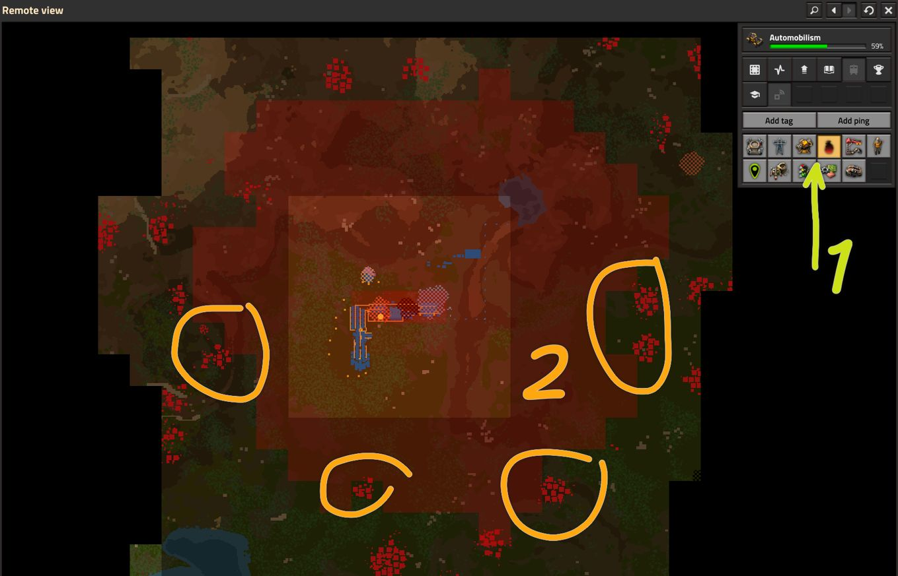
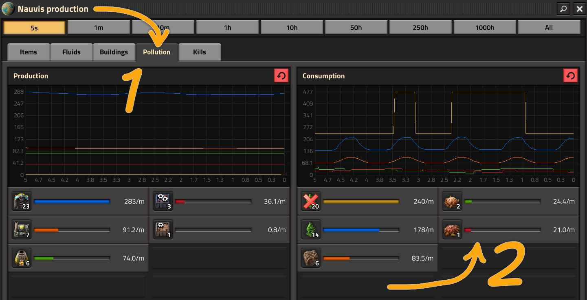
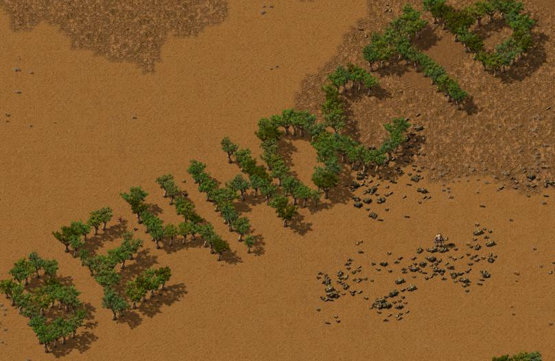
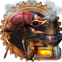
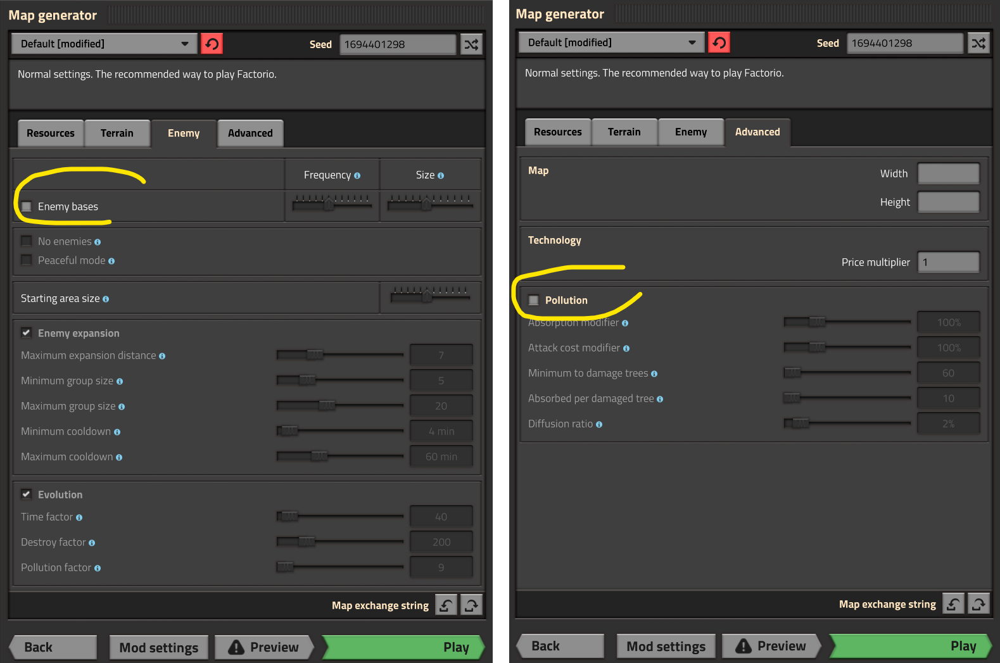

# Загрязнение

:::tip Вся статья, кратко **
Загрязнение, это вам не это и даже не то. Тут смекалка нужна. А потом ещё и местная фауна домогаться станет. Тогда проворность потребуется старкрафтовская.

Но истинный путь звездного джедака, вообще выключить загрязнение [в настройках генерации карты](./README.md#тыкаем-генератор-карт) и играть себе спокойно.
:::

Загрязнение является одной из угрюмых механик *Factorio*. Механика эта напрямую влияет на сложность игры и на агрессивность кусак `Biter` и плевак `Spitter`. Элементарное понимание загрязнения, его распространения и способов контроля помогает почувствовать себя [властелином планеты *Nauvis*](../Additionals/NerdsVsGeeks.md#кого-в-игре-больше-нердов-или-гиков), ну ещё и планеты *Gleba*, но до неё мало кто долетает. Задумывалась механика сразу на мильон алых роз, а вылилась только в провокацию местной фауны супротив вас и всё.

Особенность загрязнение, что появляется онное вокруг построек, которые потребляют для своей работы топливо или электричество. Но не все постройки генерируют загрязнение, лаборатории `!Lab` например не загрязняют даже с модулями производительности `!Productivity module 3`. Дронстанции `!Roboport` и радары `!Radar` не производят загрязнения. Ядреные реакторы `!Nuclear reactor` во время своей работы как бы тоже не пачкают всё вокруг, но производство урановых топливных элементов `!Uranium fuel cell` доставляет в плане загрязнения.

А вот печи `!Stone furnace` `!Steel furnace` `!Electric furnace` `!Foundry`, буры `!Burner mining drill` `!Electric mining drill` `!Big mining drill`, нефтяные вышки `!Pumpjack`, бойлеры `!Boiler`, сборочные автоматы `!Assembling machine 3` и химические заводы `!Oil refinery` `!Chemical plant`, всё это производит загрязнение во время работы. Причем электрические строения производят меньше загрязнения, чем их [твёрдотопливные](./BurnerDevices.md) аналоги, а значить старайтесь как можно быстрее перейти на электрические буры, избавившись от твёрдотопливных.

Имеющееся загрязнение отображается в режиме *Remote View* красными квадратами и при достаточном уровне загрязнения в квадрате (больше 15 единиц), загрязнение начинает распространяться на соседние квадраты по 2% каждую игровую секунду (на самом деле чуток больше чем игровая секунда, а именно раз в 64 тика, тогда как игровая секунда это 60 тиков). Распространение идет по принципу "перетекания", где загрязнённый квадрат теряет часть загрязнения, а соседние его получают.

Каждый квадрат карты постепенно очищается от загрязнения естественным образом. Деревья более активно поглощают загрязнение и чем больше деревьев в квадрате, тем эффективнее будет утилизироваться загрязнение. Однако деревья теряют листья, высыхают и становятся менее эффективными. Также сама почва `!Landfill` может очищать от загрязнения. Водная гладь и болотистые участки очищают загрязнение быстрее, чем сухие земли. А вот бетонирование поверхности напрочь отменяет поглощение загрязнения. Если хотите увеличить производимое загрязнение, то закатайте всю свою фабрику в бетон `!Stone brick` `!Concrete` `!Refined concrete`. Ульи местной фауны `!Biter spawner` `!Spitter spawner` тоже поглощают загрязнение, но используют его для создания толпы кусак и плевак, которая желает поживиться вашими постройками.

Если загрязнение достигло таки ульев, то готовьтесь таки к сюрпризам, ибо вскоре таки пожалуют голодные гости. Придут гости именно с той стороны, с которой улья попали под загрязнение. Стройте стены, пулемётные турели, запасайтесь патронами и молитесь. Но самая эффективная тактика это напасть первым. Ничто лучше не спасает от нежданных гостей, как [предварительное их умножение на ноль](./FirstExpansion.md).

## Наблюдение за распространением загрязнения

Наблюдать до куда дошли красные квадраты нужно всегда, чтобы не получить неприятных сюрпризов. В *Remote view* включаем отображение загрязнения и глядим докуда распространяется загрязнение и насколько близко оно к ульям. Стрелка зеленоватая с цифрой 1:



Красные квадраты сигнализируют о сильном загрязнении и том, что с этих квадратов загрязнение распространяется на соседнее квадраты. Розовые квадраты показывают куда распространяется загрязнение. Не загрязнённые квадраты отображаются без подсветки. Самые главные тут будут мерцающие квадраты, то розовым цветом, то без цвета. Это квадраты в которых есть улья попавшие под загрязнение и в которых подготавливается толпа гостей и которые скоро придут. На картинке выше такие места обведены желтой обводкой с цифрой 2.

Вторым способом получить картину маслом можно на экране производства, где есть особая закладка загрязнения. Вызвать окно можно клавишей *P* и затем выбрать соответствующую закладку. На картинке первая стрелка. Улья, до которых дошло загрязнение показываются в правой панели. На картинке вторая стрелка:



Если в правой панели нет никаких ульев, то можно расслабиться. А вот если там есть несколько (как на картинке), то расслабляться не стоит. Видно сколько ульев попали под загрязнение и какие, видно сколько загрязнения улья поглощают из чего можно прикинуть с какой скоростью подготавливается орава гостей.

Также, на этом экране можно прикинуть какие постройки производят наибольшее загрязнение. В левой части показывается что производит загрязнения и сколько, а в правой части показывается что потребляет загрязнение. Есть графики, можно срез времени менять, полезной информации для анализа игровой ситуации тут масса, пользуйтесь.

## Уменьшение загрязнения

Бороться с уже имеющимся загрязнением не просто. В платной модификации, которая вам и даром не нужна, можно высаживать деревья, но процесс заколёбывает основательно. Берём две древесины `Wood` и производим из них семечко дерева `Tree seed`, можно руками прямо в рюкзаке. Для этого правда потребуется открыть технологию выращивания деревьев `Tree seeding` добравшись до планеты *Gleba*. Семечко дерева садим, опять руками прямо в грунт, как мы обычные строения размещаем, и из него через десять минут игрового времени вырастает новое дерево `Tree`. Садить, таким образом, придётся много деревьев, чтобы бороться с загрязнением.

А ты соберёшь из кусков дерева слово "*ВЕЧНОСТЬ*"? Или забытое нынче слово "*ВЕ**Р**НОСТЬ*"?

**

Но эффективным способом является изначальная борьба за чистое производство, насколько это возможно, особенно если вы [нормальный задрот](../Additionals/NerdsVsGeeks.md#два-додика-со-своей-методикой) и не платите шекелями за бесплатное. Внимайте следующие советы.

Как можно быстрее переходите на электрические буры `Electric mining drill`, используйте электрические печи `Electric furnace` вместо каменных и стальных. Переходите с грязных бойлеров `Boiler` на чистые солнечные панели `Solar panel` и аккумуляторные блоки `Accumulator`. Бойлеры и добывающие буры самые главные источники загрязнения, есть смысл [заряжать добычу модулями эффективности](../RawResourcesProcessing/BeaconsAndModules.md#добыча-ресурсов) первого уровня `!Efficiency module`. В модификации за шекели, главным загрязнителем становится `Heating tower`. К счастью вы его будете использовать только на планетах, где нет загрязнения вообще, о чём ниже. И самое главное, не вырубайте лиственные деревья `!Tree 01` `!Tree 02` `!Tree 03` `!Tree 04` `!Tree 05`. Берите для малых опор ЛЭП `!Small electric pole` сухие деревья `!Tree 06` `!Dead tree`, они меньше поглощают загрязнения, их не жалко.

:::warning Не портите ландшафт намеренно
Не бетонируйте поверхность, бетон `!Stone brick` `!Concrete` `!Refined concrete` напрочь прекращает любое поглощения загрязнения. Не засыпайте водные бассейны `!Landfill`, если этого не надо, естественные водоёмы лучше всех поглощают загрязнение. И не играйтесь с огнём `!Flamethrower`, огонь от подожжённого дерева перекидывается на соседние деревья вызывая дополнительное загрязнение и уничтожая все деревья рядом.
:::

Особое внимание уделяйте модулям эффективности `!Efficiency module` `!Efficiency module 2` `!Efficiency module 3`. В производственных зданиях они сильно уменьшают выбросы. Но помните, минимальный выброс всегда будет 20% от изначального, даже если вы насуёте больше модулей чем надо. Есть смысл комбинировать [модули эффективности с другими модулями](../RawResourcesProcessing/BeaconsAndModules.md#модули-эффективности), если есть запас по производимому загрязнению. Особо избегайте чрезмерное использование модулей продуктивности `!Productivity module 3` без модулей эффективности, так как их использование увеличивает загрязнение.

## Что делать если уже катастрофа?

Местная фауна рьяно реагируют на загрязнение. Как только облако загрязнения достигает их ульев, они начинают формировать атакующие группы и идут искать источник загрязнения. А с увеличением загрязнения и времени игры фауна эволюционирует и появляются средние, большие и чудовищные кусаки и плеваки. Например, за каждые 4 единицы загрязнения появляется малый кусака, за 20 появляется средний, за 80 разродится большой. Плевакам нужно меньше загрязнения для появлений. И каждые минут десять или меньше, всё по рандому, к вам будут идти в гости всей накопившейся толпой.

Усильте оборону на направлениях, где загрязнение соприкасается с ульями. Установите турели `!Gun turret`, стены `!Wall`, мины `!Land mine`. Да и сами наведайтесь [к местной фауне в гости для раздачи узбагоина](https://www.youtube.com/playlist?list=PLvB0qwWjZb4KyVLdzlOrAJ_7bg51jv6Jk). Другой эффективной стратегии нет.

[На поздней стадии игры](./AfterSatelliteLaunch.md) стройте фортификационные посты по периметру с артиллерией `!Artillery` и огоньком `!Flamethrower turret` `!Laser turret` и нивелируйте всё улья `!Biter spawner` `!Spitter spawner` до которых добралось загрязнение. Паукотроны `!Spidertron` вам также в помощь, особенно хороши группы от трёх и более паучков с единым пультом дистанционного управления.

## На других планетах

На других планетах всё то же самое, кроме планеты *Vulcanus*, там нет загрязнения вообще. Ну ладно, ещё и планеты *Fulgora*, там тоже нету никакого загрязнения, а ещё и планеты *Aquilo*... Лонг стори шорт, на других планетах нет загрязнения, кроме планеты *Gleba*, на которой обычное загрязнение заменено на загрязнение некими спорами от тамошних растений. В отличие от классического загрязнения, споры генерируются сельскохозяйственной деятельностью и привлекают пентаподов `!Small wriggler`, живущих на планете *Gleba*. Такое споровое загрязнение отображается в режиме *Remote view* зелёными квадратами (вместо красных, как на планете *Nauvis*) и имеет точно такую же механику, как и обычное загрязнение. Использование модулей эффективности `Efficiency module` в сельскохозяйственных постройках также очень эффективно борется со споровым загрязнением. А строительство и снабжение биокамер `Biochamber` также снижает загрязнение. Эта постройка имеет отприцательное загрязнение, а значить чистит воздух. Здание не так чтоб прям очень полезное для борьбы с загрязнением спорами, но строить вы эти здания будете много для производства разного хабара доступного только на *Glebа*, так что как-то так. Итого, игровая механика загрязнения имеется только на планетах *Nauvis* и *Gleba* и в целом механика эта работает почти одинаково.

## Достижения

С загрязнением связаны два достижения, которыми можно похвастаться перед своими корешами, [например в Steam](https://steamcommunity.com/profiles/76561198083649993/stats/427520/achievements/). Достижения являются мусорными, то есть для их получения ничего особо делать не нужно и они выдаются на определённой стадии игры. Как только загрязнение доходит до ульев и формируется атакующая группа местной фауны вы получаете эти достижения. Первое достижение выдаётся на планете *Nauvis*, второе на *Gleba* соответственно.

|Планета|Достижение|Картинко|Как получить?|
|:---|:---|:---|:---|
|*Nauvis*|Никому не нравиться, как оно воняет|**|Просто играем с включённым загрязнением|
|*Gleba*|Это воняет, и это им не нравиться|**|Просто играем с включённым загрязнением|

## Играем без загрязнения

Отключить игровую механику связанную с загрязнением можно перед началом игры при выборе игровой карты. Это превратит местную фауну в безобидных зверьков (Peacefull mode), правда всё равно кусающихся при приближении к ним или к ихним ульям. Не плохим вариантом будет также и отключение этих зверьков, так как они становятся весьма доставущими при строительстве уже большой фабрики. Правда [играть до запуска первого спутника](./FirstExpansion.md) будет скучновато без потенциального давления из-за горизонта. Да и опосля, без производства военного научного пакета `Military science pack` игра покажется не полной, так как прокачивать военку будет незачем. Отключаем вражыну и загрязнение по отдельности, вот так:

**

:::info К сведению
Я рекомендую поиграть изначально с местной фауной и поиграть основательно, хотя бы до начала строительства большой базы и военных аванпостов с автоматизацией их снабжения амуницией, а уже после твёрдо и взвешено решить, нужен вам такой муховорот али нет.
:::

После старта игры отключить загрязнение можно уже через консоль. Пишем следующую команду и загрязнения больше не будет производиться при работе построек:

```lua
/с game.map_settings.pollution.enabled = false
```

Команда энта просто отключает появление нового загрязнения, но не убирает уже накопившееся. В довесок почистить все игровые поверхности (планеты) от имеющегося загрязнения можно так:

```lua
/c for _, surface in pairs(game.surfaces) do surface.clear_pollution() end
```

А для разных там [извращенцев](../Additionals/NerdsVsGeeks.md), можно добавить кучу загрязнения следующей командой и наслаждаться интересностями:

```lua
/c game.player.surface.pollute(game.player.position, 10000000000)
```

Цэ добавит мильёны загрязнения там, где стоит ваш персонаж и со временем всё это разбежится по всей игровой карте, даже на соседние планеты перекинется... но это не точно, точнее, совсем не точно.

## Полезные модификации

Существует несколько модификаций для игры *Factorio* связанные с загрязнением и которые развлекают не по-детски. Самое-самое что стоит попробовать конечно же *[Pollution is the Solution](https://mods.factorio.com/mod/Pollution_is_the_Solution)*. Данная модификация уничтожает улья, если они уже разродились шестьюдесятью единицами местной фауны. Вот так, загрязнение плачевно влияет на природу. Со временем местная фауна погибает

Следующий прикол называется *[No Enemy Spawners for Space Age](https://mods.factorio.com/mod/no-enemy-spawners)*, которое таки убирает все улья кусак и плевак и добавляет альтернативные рецепты для производства яиц пентаподов `Pentapod egg` и захваченный улей кусак `Captive biter spawner`. Модификация эта нужна только тем гениям, которые заплатили долярами за бесплатный мод криворуким чехам, а ванильщикам модификация сия не нужна от слова совсем.

И ысчё интересная обнова под названием *[Air Scrubbing](https://mods.factorio.com/mod/atan-air-scrubbing)*, которая добавит в игру новое строение занимающееся проветриванием воздуха и очисткой его от спор и загрязнения. Не очень просто, но надёжно, если вы только не боитесь заморочиться с производством кучи воздушных фильтров для работы нового строения. Есть похожая приблуда под названием *[TJ's Air Cleaner](https://mods.factorio.com/mod/TjAirCleaner)*. Также добавляет строения для фильтрации воздуха, но работает от липестричества и не требует производства никаких фильтров. Однако на вид строения похожи на ветряные электростанции, а не на очистители воздуха, что портит впечатление.

## Больше подробностей

Радиопередача:

[**](https://www.youtube.com/watch?v=EVJ6AyHxEgc).

Смотрите и делитесь комментариями.
