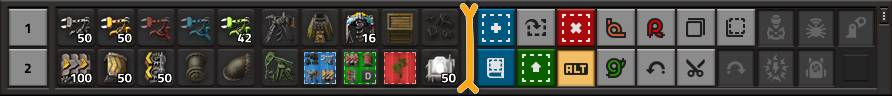
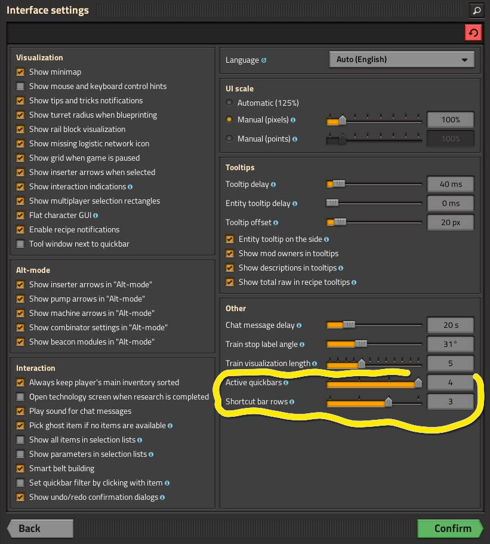
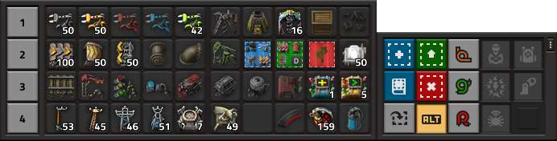
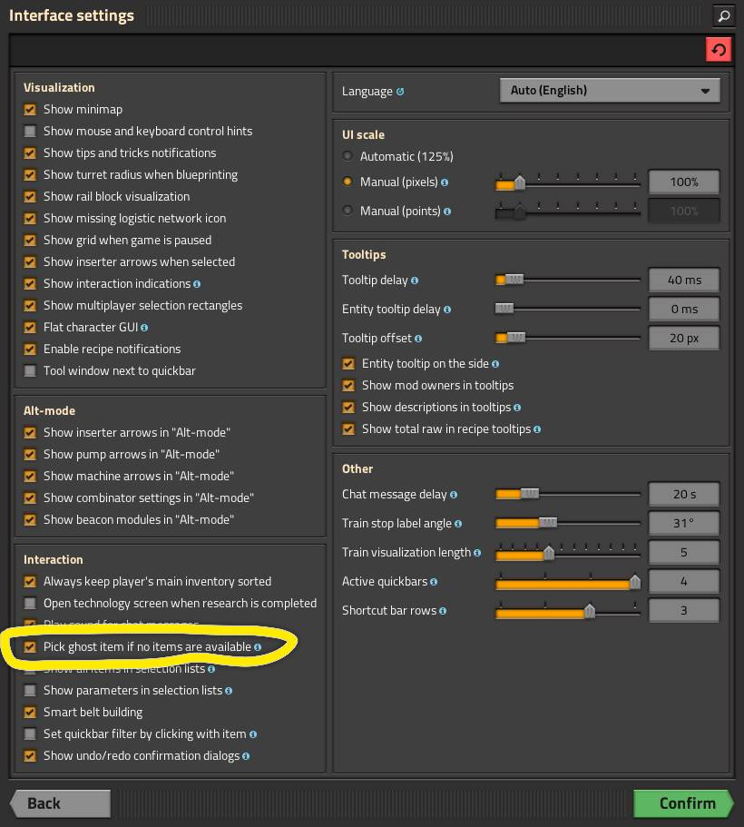
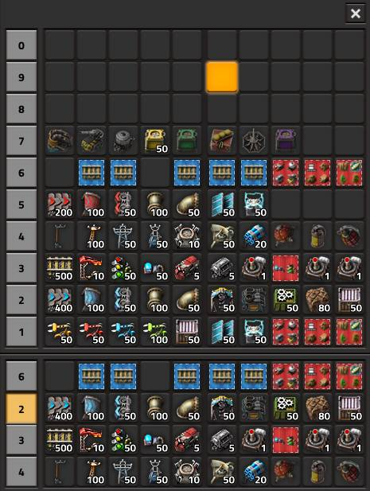
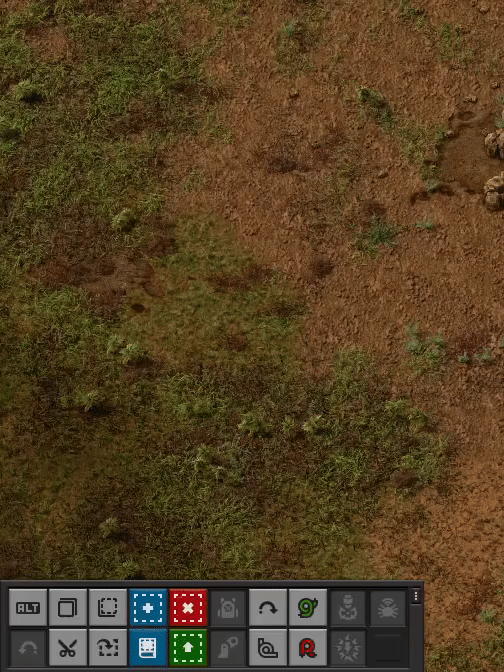

# Двое из-под торца

:::tip Вся статья, кратко **
Две игровые панели, располагающиеся в нижней части экрана и слитые вместе, являются фундаментальными инструментами для любой игры в *Factorio*. При грамотной настройке они позволяют сократить время на поиск нужных предметов и улучшить организацию рабочего пространства. Эти панели не просто хранилище для разных кнопок, это мощные интеллектуальные агрегаты различных функций и игровых механик.
:::

***Панель быстрого доступа***, она же ***Quickbar*** располагается первой и содержит слоты, в которые можно поместить любые предметы, ресурсы, чертежи или разные инструменты, такие как ремонтный комплект `Repair pack`. Всего можно настроить до 10 панелей, каждая из которых содержит по 10 слотов, что позволяет подготовить до 100 часто используемых игровых элементов.

***Панель ярлыков***, она же ***Shortcut bar*** это специальная область кнопок рядом с ***Quickbar***, которая обеспечивает быстрый доступ к основным функциям игры и функциям установленных модификаций, таких как копирование чертежей, включение персональных дронов или переключение режима дополнительной информации (*ALT mode*).

Обе панели располагаются в нижней части экрана и при настройках по умолчанию показывают два ряда значков пристыкованных друг к другу (*Quickbar* слева, *Shortcut bar* справа):

**

Такое малое количество рядов не лучшим образом способствует играть. Отличным вариантом будет четыре ряда слотов для *панели быстрого доступа* (которая слева) и три ряда кнопок для *панели ярлыков* (которая справа). Поменять количество отображаемых рядов можно в настройках интерфейса, элементы *Active quickbars* и *Shortcut bar rows* соответственно:

**

Если при такой настройке выкинуть не нужные кнопки с панели ярлыков и заполнить пустые слоты игровыми предметами, то финально можно получить следующую картину маслом:

**

Тут отметим, что *панель быстрого доступа* не отображает все свои десять панелей слотов, но их можно менять местами во время игры используя клавиатуру или мышь. *Панель ярлыков* тоже можно настраивать во время игры, скрыв не нужные кнопки.

## Панель быстрого доступа

Панель ***Quickbar*** функционирует как набор ссылок на элементы основного инвентаря (он же рюкзак) и прочих игровых элементов. В придачу к этому, можно использовать эту панель для доступа к чертежам, планам улучшений и планам сноса. Это прекрасная фича, потому что эти планы не будут занимать места в инвентаре. А самое прикольное, тут можно поместить пульт управления паукотронами, гранаты и взрывчатку, патроны и прочую амуницию. Таким образом вам не придётся открывать инвентарь всякий раз, как вам потребуется взаимодействие с игровыми предметами.

При размещении нового предмета в свободном слоте панели создаётся не физический объект, а ссылка на его фильтр, отображающий текущее количество доступных единиц из инвентаря. После размещения ссылок их можно быстро выбрать в любое время без необходимости открывать инвентарь или книгу чертежей. Нажатие на любую заполненную ячейку активизирует выбранный предмет, если он имеется в инвентаре. Также можно настроить на предоставление призрака предмета, если игрок в данный момент не имеет игрового предмета. Такое поведение отключено по умолчанию и чтобы его включить нужно выбрать соответствующую опцию в настройках интерфейса:

**

Панель быстрого доступа всегда видна в нижней части экрана. Игроку доступно 10 независимых панелей, каждая из которых содержит 10 слотов для предметов. Одновременно могут отображаться от 1 до 4 панелей в вертикальном стеке, в зависимости от настроек.

### Добавление и удаление на панель быстрого доступа

Выбранный предмет из инвентаря или чертёж из книги чертей можно добавить как ссылку на них в панель быстрого доступа перетащив их из инвентаря или книги чертежей на свободный слот. Другим вариантом можно кликнуть на свободный слот в панели быстрого доступа и в появившемся окне выбрать нужный игровой элемент.

Удалить ссылку из слота можно наведя курсор мыши на занятый слот и нажать среднюю кнопку мыши.

### Горячие клавиши

Цифровые клавиши ***1...0*** позволяют выбрать элемент на активной верхней панели. Для доступа к скрытым панелям используются сочетания клавиш ***SHIFT+1...0***, что мгновенно заменяет верхнюю видимую панель на выбранную. Таким образом можно выбрать любой элемент на любой панели. Например, мы хотим выбрать третий слот на 6 панели. Для того чтобы активировать шестую панель нажимаем ***SHIFT+6*** и чтобы теперь выбрать третий слот на этой панели нажимаем клавишу ***3***.

|Комбинация|Действие|
|---|---|
|[1...0]|Выбрать номерной слот из верхней панели|
|Shift+[1...0]|Выбрать номерную панель как самую верхнюю панель|
|>|**Управление мышью** (клик по слоту)|
|Левая кнопка|Выбор одной стопки игровых элементов, если есть в наличии|
|Правая кнопка|Выбор половины стопки игровых элементов, если есть в наличии|
|Средняя кнопка|Очистка выбранной ячейки|

Также клик левой кнопкой мыши по любому номеру панели открывает все десять панелей и можно выбрать любой слот из ста возможных:

**

## Панель ярлыков

В отличие от ***Quickbar***, другая панель с ярлыками, которая ***Shortcut bar***, предоставляет доступ к функциям игры или установленных модов, таким как:
* переключения режима дополнительной информации (*ALT mode*)
* операции *Отменить*, *Вырезать*, *Копировать* и *Вставить*
* *книги чертежей*, *план сноса* или *план обновления*
* импорта *строки чертежа* в игру
* переключения *персональных дронстанций* и *экзоскелетов*
* вызов *артиллерии* и активация *электроразрядной защиты*
* дополнительные операции установленных модификаций игры

Настраивается *панель ярлыков* по нажатию на маленькую кнопку с тремя вертикальными точками:

**

Здесь можно скрыть не нужные кнопки, поменять их местами, а также нажать скрытые кнопки. Особой полезности *панель ярлыков* не представляет, так как все кнопки связанные с игровыми функциями можно вызвать и с клавиатуры даже если эта панель полностью скрыта.

<!--
## Больше подробностей

Радиопередача:

[**](https://www.youtube.com/watch?v=XXXXXXXXXXX).

Смотрите и делитесь комментариями.
-->